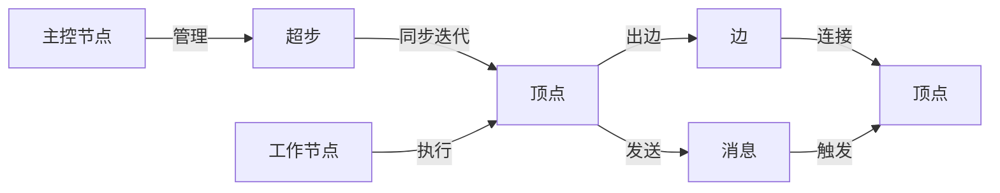

# Giraph原理与代码实例讲解

## 1.背景介绍
### 1.1 大规模图处理的重要性
在当今大数据时代,许多实际问题都可以抽象为图模型,例如社交网络分析、Web图分析、交通网络分析等。这些图往往规模庞大,动辄数十亿顶点和数万亿边,传统的单机图处理算法和工具已经无法高效处理如此规模的图数据。因此,迫切需要研究能够在分布式集群环境下高效处理大规模图数据的并行图计算框架。

### 1.2 Giraph的诞生
Giraph是由Yahoo!和Apache软件基金会联合开发的一个可扩展的分布式图处理框架,旨在解决超大规模图的计算问题。它是基于Google的Pregel模型实现的开源框架,使用Hadoop的MapReduce实现并行化,可以运行在Hadoop之上,充分利用Hadoop的资源管理和容错能力。Giraph自2012年成为Apache孵化器项目以来,得到了快速发展,目前已经成为了Apache的顶级项目,被Facebook、Yahoo、Twitter等互联网公司广泛应用。

### 1.3 Giraph的优势
与其他图处理框架相比,Giraph具有如下优势:

1. 良好的可扩展性:得益于Pregel的设计思想和Hadoop的分布式计算能力,Giraph可以轻松处理数十亿顶点和数万亿边的超大规模图。
2. 灵活的图算法支持:Giraph提供了灵活的消息传递和同步机制,可以方便地实现各种经典图算法,如最短路径、PageRank等。
3. 容错性:利用Hadoop的容错机制,Giraph可以自动处理机器故障,避免因单点故障导致的计算失败。
4. 丰富的生态系统:Giraph可以与Hadoop生态系统无缝集成,包括HDFS、HBase、ZooKeeper等,便于图数据的存储和管理。

## 2.核心概念与联系
### 2.1 顶点(Vertex)
顶点是构成图的基本单元,代表图中的一个对象。在Giraph中,每个顶点用一个唯一的长整型ID标识,并拥有对应的属性值(Value)。此外,每个顶点维护一个与之相连的边(Edge)列表,记录其出边。顶点是图计算的核心,图算法就是通过定义顶点的计算逻辑,利用顶点间的消息传递完成计算。

### 2.2 边(Edge)
边代表顶点之间的连接关系。在Giraph中,边可以是有向的,也可以是无向的(用两条反向边表示)。每条边由源顶点(Source Vertex)、目标顶点(Target Vertex)和边的属性值(Edge Value)组成。边的方向表示数据的流向,权重可以表示连接的强度等。

### 2.3 消息(Message)
消息是顶点之间传递数据的载体。在计算过程中,顶点可以给其他顶点发送消息,发送的消息会在下一个超步(Superstep)被目标顶点接收并触发计算。消息机制是Giraph实现图算法的关键,顶点可以根据接收到的消息更新自己的状态或属性。

### 2.4 超步(Superstep)
超步是Giraph的核心概念,是一次全局同步迭代。在每个超步中,所有的顶点并行执行计算,即接收上一轮发来的消息,根据消息更新自身状态,并给其他顶点发送消息。当一个超步内所有顶点都完成计算且没有新消息产生时,该超步结束,进入下一个超步,直到没有活跃顶点。可以将若干个超步看作一轮迭代,由同步屏障(Synchronization Barrier)分隔。

### 2.5 主控节点(Master)和工作节点(Worker)
Giraph采用主从架构,由一个主控节点(Master)和多个工作节点(Worker)组成。主控节点负责管理全局同步、检查点等,而图的顶点分布在各个工作节点上进行并行计算。Giraph利用ZooKeeper进行节点间的协调与同步。

下图展示了Giraph的核心概念之间的关系:



## 3.核心算法原理与具体操作步骤
### 3.1 Pregel模型
Giraph是基于Google的Pregel模型实现的,因此先介绍一下Pregel的基本原理。Pregel是一个批量同步并行(Bulk Synchronous Parallel, BSP)计算模型,通过迭代的方式来处理图。在每次迭代(即一个超步)中,每个顶点都会接收来自上一轮的消息,进行计算,更新状态,给其他顶点发送消息,然后进入下一轮。当没有顶点再产生消息时,计算结束。

Pregel计算模型有三个核心要素:

1. 初始化:为图的每个顶点分配一个初始状态。
2. 超步函数:定义每个顶点上的计算逻辑。
3. 消息传递:顶点之间传递消息,驱动计算。

具体的计算流程如下:

1. 将图划分为若干个分区,分布到不同的计算节点。
2. 为每个顶点设置初始状态。 
3. 开始第一个超步,每个顶点执行超步函数,包括接收消息、更新状态、发送消息等。
4. 同步屏障:等待所有顶点完成计算,并交换消息。
5. 进入下一个超步,重复步骤3和4,直到没有顶点再发送消息。
6. 输出计算结果。

可以看出,Pregel采用"以顶点为中心"的计算模式,通过消息传递驱动顶点状态的更新从而完成图算法,非常适合描述图的计算过程。

### 3.2 Giraph实现原理
Giraph实现了Pregel模型,并做了一些优化,如支持主动消息(Eager Message)、组合器(Combiner)等。下面讲解Giraph的工作流程。

#### 3.2.1 输入和分区
首先需要将图数据以一定格式(如JSON)输入到HDFS等分布式文件系统中。Giraph会根据配置将图划分为若干个分区,尽量做到负载均衡和最小化跨节点边。分区方法可以选择哈希、范围或自定义。

#### 3.2.2 加载图
Giraph利用InputFormat和VertexInputFormat等接口,从输入文件中加载顶点和边数据。可以自定义InputFormat来支持不同的输入格式。加载后的顶点分布到不同的Worker上,边则以邻接表的形式存储在顶点中。

#### 3.2.3 初始化
在超步0,为每个顶点调用用户定义的初始化函数,设置初始状态。该函数在Vertex.initialize()中实现。

#### 3.2.4 超步计算
从超步1开始,每个超步执行如下步骤:

1. 消息处理:每个顶点接收上一轮发来的消息,触发compute()函数,可以更新顶点状态。
2. 消息发送:在compute()中,顶点可以给其他顶点发送消息。消息会在下一轮超步时被目标顶点接收。
3. 投票停止:如果顶点已经达到稳定状态,可以调用voteToHalt()函数,通知Giraph自己已经无需再计算。
4. 同步:Giraph自动执行一次同步,交换所有消息,并统计活跃顶点数。
5. 检查是否终止:如果没有活跃顶点且没有新消息产生,则计算终止,否则进入下一个超步。

#### 3.2.5 输出
当计算结束后,Giraph将调用OutputFormat将顶点的最终状态输出到HDFS等文件系统中。同样可以自定义OutputFormat以支持不同输出需求。

### 3.3 常见优化技术
Giraph在实现中采用了一些优化技术,主要有:

1. 组合器(Combiner):对发往同一顶点的消息进行本地聚合,减少网络传输量。
2. 主动消息(Eager Message):允许在同一超步内发送消息,减少迭代次数。
3. 顶点剪枝(Vertex Pruning):对不再更新的顶点进行剪枝,减少无效计算。
4. 图分区优化:根据图的特点选择合适的分区方法,减少跨节点边。
5. 内存优化:对图数据进行字节级编码,减少内存占用。

## 4.数学模型和公式详细讲解举例说明
图可以表示为$G=(V,E)$,其中$V$是顶点集合,$E$是边集合。设图有$n$个顶点,则$V=\{v_1,v_2,...,v_n\}$。

### 4.1 单源最短路径
以单源最短路径为例,介绍Giraph中的计算过程。设$dist(v)$表示起点$s$到顶点$v$的最短距离,$d(v,w)$表示边$(v,w)$的权重,则单源最短路可以表示为:

$$
dist(v)=
\begin{cases}
0 & v=s \\
\min\limits_{(u,v)\in E}(dist(u)+d(u,v)) & v\neq s
\end{cases}
$$

即起点到自身距离为0,到其他顶点的距离为所有能到达该顶点的路径中最短的那个。

在Giraph中,可以这样实现:

1. 初始化:将起点$s$的距离设为0,其他顶点设为$\infty$。
2. 第$i$轮超步:每个顶点$v$接收所有邻居$u$发来的距离$dist(u)$,更新自己的距离$dist(v)=\min(dist(v), dist(u)+d(u,v))$,如有更新,则给所有邻居发送新的$dist(v)$。
3. 如果某轮超步没有顶点更新距离,则算法结束,每个顶点的$dist$值即为最短距离。

### 4.2 PageRank
PageRank是一种计算网页重要性的经典算法,其数学模型为:

$$
PR(v)=\frac{1-d}{N}+d\sum_{(u,v)\in E}\frac{PR(u)}{L(u)}
$$

其中$PR(v)$表示网页$v$的PageRank值,$N$是所有网页数,$d$是阻尼系数(一般取0.85),$(u,v)$表示存在一条从网页$u$到$v$的链接,$L(u)$是网页$u$的出链数。

在Giraph中,PageRank的计算过程为:

1. 初始化:将每个网页的PR值设为$1/N$。
2. 第$i$轮超步:每个网页$v$接收所有入链网页$u$发来的$PR(u)/L(u)$,根据公式计算新的$PR(v)$,将其发送给所有出链网页。
3. 重复第2步,直到PR值收敛或达到最大迭代次数。

可以看出,Giraph将复杂的图算法分解为顶点中的局部计算,通过迭代收敛得到全局结果,非常符合大规模图计算的特点。

## 5.项目实践:代码实例和详细解释说明
下面以单源最短路径为例,给出Giraph的代码实现。完整代码可参见:https://github.com/apache/giraph/blob/release-1.3/giraph-examples/src/main/java/org/apache/giraph/examples/SimpleShortestPathsComputation.java

```java
public class SimpleShortestPathsComputation extends BasicComputation<
    LongWritable, DoubleWritable, FloatWritable, DoubleWritable> {
  
  @Override
  public void compute(
      Vertex<LongWritable, DoubleWritable, FloatWritable> vertex,
      Iterable<DoubleWritable> messages) throws IOException {
    if (getSuperstep() == 0) {
      // 初始化:将源点距离设为0,其他顶点设为无穷大
      vertex.setValue(new DoubleWritable(vertex.getId().get() == sourceId ?
          0d : Double.MAX_VALUE));
    }
    double minDist = isSource(vertex) ? 0d : Double.MAX_VALUE;
    for (DoubleWritable message : messages) {
      minDist = Math.min(minDist, message.get());
    }
    if (minDist < vertex.getValue().get()) {
      // 更新距离
      vertex.setValue(new DoubleWritable(minDist));
      for (Edge<LongWritable