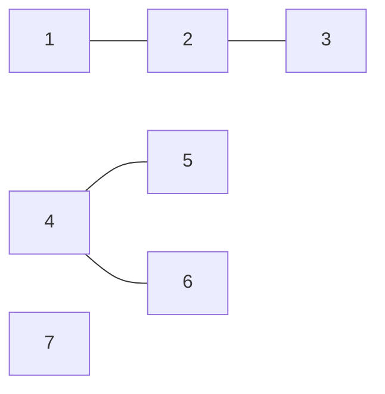

# Graph Connected Components算法原理与代码实例讲解

## 1.背景介绍
在图论和计算机科学中,连通分量(Connected Components)是一个非常重要和基础的概念。连通分量算法在很多现实场景中有着广泛的应用,如社交网络分析、图像分割、网络可达性分析等。本文将深入探讨图的连通分量算法的原理,并给出详细的代码实例讲解。

### 1.1 图的基本概念
在正式介绍连通分量算法之前,我们先来回顾一下图的一些基本概念。
#### 1.1.1 图的定义
图(Graph)是一种由顶点(Vertex)和边(Edge)组成的数据结构。顶点表示实体对象,边表示顶点之间的关系。根据边是否有方向,可以将图分为无向图和有向图。
#### 1.1.2 图的表示方法
常见的图的表示方法有邻接矩阵(Adjacency Matrix)和邻接表(Adjacency List)两种。
- 邻接矩阵:用一个二维数组表示图,若顶点i和j之间有边,则matrix[i][j]=1,否则为0。
- 邻接表:每个顶点维护一个链表,存储与之相连的顶点。

### 1.2 连通分量的定义
在无向图G中,如果两个顶点v和u之间存在一条路径,则称v和u是连通的。如果G的任意两个顶点都是连通的,则称G是连通图。无向图的极大连通子图称为连通分量。

## 2.核心概念与联系
连通分量算法的核心是找出无向图中的所有连通分量。与之相关的几个核心概念如下:

### 2.1 连通性
如果两个顶点之间存在一条路径,则它们是连通的。连通性具有以下性质:
- 自反性:任意顶点v与自身连通。
- 对称性:如果v与u连通,则u与v也连通。
- 传递性:如果v与u连通,u与w连通,则v与w也连通。

### 2.2 连通分量
无向图G的连通分量是G的极大连通子图。G的连通分量之间没有任何边相连。求连通分量实际上就是把图划分成若干个不相交的子图。

### 2.3 图的遍历
要找出图的连通分量,需要遍历图的所有顶点和边。常用的图遍历算法有:
- 深度优先搜索(DFS)
- 广度优先搜索(BFS)

DFS和BFS对应两种不同的连通分量算法。

## 3.核心算法原理与具体操作步骤
### 3.1 基于DFS的连通分量算法
#### 3.1.1 算法原理
基于DFS的连通分量算法的基本思想是:
1. 从图中任意一个未被访问过的顶点v开始,执行DFS。
2. DFS会遍历v所在的连通分量的所有顶点,标记它们已访问。
3. 重复步骤1,直到图中所有顶点都被访问过。

每次执行DFS,会得到一个连通分量。DFS的次数就是连通分量的个数。

#### 3.1.2 算法步骤
1. 初始化visited数组,标记所有顶点未被访问。
2. 遍历图中每个顶点v:
   - 如果v未被访问,执行DFS(v),得到一个连通分量,连通分量编号加1。
3. 输出连通分量的个数,以及每个顶点所属的连通分量编号。

DFS(v)的执行步骤:
1. 标记v已被访问,将v加入当前连通分量。 
2. 遍历v的所有邻接点u:
   - 如果u未被访问,递归执行DFS(u)。

#### 3.1.3 算法复杂度
- 时间复杂度:O(V+E),其中V是顶点数,E是边数。
- 空间复杂度:O(V),visited数组和递归调用栈的开销。

### 3.2 基于BFS的连通分量算法
#### 3.2.1 算法原理
基于BFS的连通分量算法与基于DFS的算法原理类似,区别在于使用BFS来遍历连通分量。
1. 从图中任意一个未被访问过的顶点v开始,执行BFS。
2. BFS会遍历v所在的连通分量的所有顶点,标记它们已访问。 
3. 重复步骤1,直到图中所有顶点都被访问过。

#### 3.2.2 算法步骤
1. 初始化visited数组,标记所有顶点未被访问。
2. 遍历图中每个顶点v:
   - 如果v未被访问,执行BFS(v),得到一个连通分量,连通分量编号加1。
3. 输出连通分量的个数,以及每个顶点所属的连通分量编号。

BFS(v)的执行步骤:
1. 初始化一个队列queue,将v入队,标记v已访问。
2. 当queue不为空时:
   - 取出队首顶点u,将u加入当前连通分量。
   - 遍历u的所有邻接点w:
     - 如果w未被访问,标记w已访问,将w入队。

#### 3.2.3 算法复杂度
- 时间复杂度:O(V+E),其中V是顶点数,E是边数。
- 空间复杂度:O(V),visited数组和队列的开销。

## 4.数学模型和公式详细讲解举例说明
### 4.1 图的数学表示
图G可以表示为二元组G=(V,E),其中:
- V是顶点集合,V={v1,v2,...,vn}。
- E是边集合,E={e1,e2,...,em},每条边ei都有两个顶点与之关联。

对于无向图,边(u,v)和(v,u)是等价的。

### 4.2 连通性的数学定义
设u,v是图G=(V,E)中的两个顶点。如果存在一个顶点序列(x0,x1,...,xk),其中x0=u,xk=v,对于任意0≤i<k,边(xi,xi+1)属于E,则称u和v是连通的,记为u~v。

### 4.3 连通分量的数学定义
设C是图G=(V,E)的一个子图,如果:
1. C的任意两个顶点都连通。
2. 不存在一个顶点v属于V-C,使得v与C中某个顶点连通。

则称C是G的一个连通分量。

### 4.4 示例说明
考虑如下无向图G:



- 顶点集合V={1,2,3,4,5,6,7}
- 边集合E={(1,2),(2,3),(4,5),(4,6)}

不难看出,G有3个连通分量:
- C1={1,2,3}
- C2={4,5,6}
- C3={7}

## 5.项目实践:代码实例和详细解释说明
下面给出基于DFS和BFS的连通分量算法的C++代码实现。
### 5.1 基于DFS的实现
```cpp
class Solution {
public:
    vector<vector<int>> adj; // 邻接表
    vector<bool> visited; // 标记顶点是否被访问
    vector<int> component; // 记录每个顶点所属的连通分量编号
    int cnt; // 连通分量的个数

    void DFS(int v) {
        visited[v] = true;
        component[v] = cnt;
        for (int u : adj[v]) {
            if (!visited[u]) {
                DFS(u);
            }
        }
    }

    int countComponents(int n, vector<vector<int>>& edges) {
        adj.resize(n);
        visited.resize(n, false);
        component.resize(n);
        cnt = 0;

        // 建图
        for (auto& e : edges) {
            adj[e[0]].push_back(e[1]);
            adj[e[1]].push_back(e[0]);
        }

        // 求连通分量
        for (int v = 0; v < n; v++) {
            if (!visited[v]) {
                cnt++;
                DFS(v);
            }
        }

        return cnt;
    }
};
```

代码解释:
- `adj`是邻接表,用于存储图的结构。`adj[i]`存储顶点i的所有邻接点。
- `visited`数组标记每个顶点是否被访问过。
- `component`数组记录每个顶点所属的连通分量编号。
- `cnt`记录连通分量的个数。
- `DFS(v)`函数对顶点v执行深度优先搜索,将v所在的连通分量中的所有顶点标记为已访问,并赋予相同的连通分量编号。
- 主函数`countComponents`首先建图,然后遍历所有顶点,对未访问过的顶点执行DFS,最后返回连通分量的个数。

### 5.2 基于BFS的实现
```cpp
class Solution {
public:
    vector<vector<int>> adj; // 邻接表
    vector<bool> visited; // 标记顶点是否被访问
    vector<int> component; // 记录每个顶点所属的连通分量编号
    int cnt; // 连通分量的个数

    void BFS(int v) {
        queue<int> q;
        q.push(v);
        visited[v] = true;
        component[v] = cnt;

        while (!q.empty()) {
            int u = q.front();
            q.pop();
            for (int w : adj[u]) {
                if (!visited[w]) {
                    q.push(w);
                    visited[w] = true;
                    component[w] = cnt;
                }
            }
        }
    }

    int countComponents(int n, vector<vector<int>>& edges) {
        adj.resize(n);
        visited.resize(n, false);
        component.resize(n);
        cnt = 0;

        // 建图
        for (auto& e : edges) {
            adj[e[0]].push_back(e[1]);
            adj[e[1]].push_back(e[0]);
        }

        // 求连通分量
        for (int v = 0; v < n; v++) {
            if (!visited[v]) {
                cnt++;
                BFS(v);
            }
        }

        return cnt;
    }
};
```

代码解释:
- 与基于DFS的实现相比,只是将`DFS`函数替换为`BFS`函数。
- `BFS(v)`函数对顶点v执行广度优先搜索,使用队列`q`来存储待访问的顶点。
- 其他部分的代码逻辑与基于DFS的实现相同。

## 6.实际应用场景
连通分量算法在实际中有很多应用,下面列举几个典型的应用场景。

### 6.1 社交网络分析
在社交网络中,可以将用户看作顶点,用户之间的关系(如好友关系)看作边,构成一个无向图。连通分量可以用来发现社交网络中的朋友圈、社区等紧密相连的子群体。

### 6.2 图像分割
图像分割就是将图像划分成若干个互不重叠的区域,使得每个区域内的像素点具有一致的特征。可以将图像看作一个图,像素点看作顶点,相似的像素点之间存在边。连通分量算法可以用来实现图像分割,得到图像的不同区域。

### 6.3 网络可达性分析
在通信网络中,可以将网络节点看作顶点,节点之间的链路看作边。连通分量算法可以用来分析网络的可达性,发现网络中的不同连通子网。

## 7.工具和资源推荐
- C++图论库Boost Graph Library(BGL):https://www.boost.org/doc/libs/1_75_0/libs/graph/doc/index.html
- 图论可视化工具Graphviz:http://www.graphviz.org/
- 在线绘制Mermaid流程图的工具:https://mermaid-js.github.io/mermaid-live-editor/
- 图论在线评测平台:
  - LeetCode:https://leetcode.com/tag/graph/
  - Codeforces:https://codeforces.com/problemset?tags=graphs

## 8.总结:未来发展趋势与挑战
连通分量算法作为图论的基础算法之一,在未来仍然有很大的发展空间和应用前景。一些值得关注的发展趋势和挑战有:
- 超大规模图上的连通分量计算:如何设计高效、可扩展的分布式算法。
- 动态图上的连通分量维护:图的结构会动态变化,如何快速更新连通分量。
- 连通分量与其他图算法的结合:如最小生成树、最短路径等。
- 连通分量在新兴领域的应用:如复杂网络分析、知识图谱等。

## 9.附录:常见问题与解答
### Q1:连通分