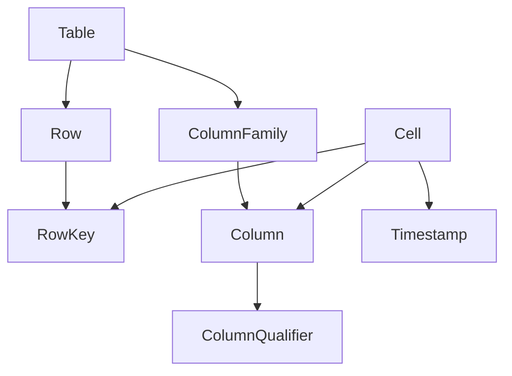

# HBase分布式列式数据库原理与代码实例讲解

## 1.背景介绍

### 1.1 大数据时代的存储挑战

随着互联网、物联网、社交网络等技术的快速发展,数据呈现出爆炸式增长的趋势。传统的关系型数据库在面对海量数据时,在存储容量、查询性能等方面遇到了瓶颈。为了应对大数据时代的存储挑战,分布式数据库应运而生。

### 1.2 HBase的诞生

HBase是一个开源的、分布式的、面向列的数据库,它构建在Hadoop文件系统之上,为大数据提供随机、实时的读写访问。HBase源于Google的BigTable论文,结合Hadoop生态系统,成为了业界广泛使用的非关系型数据库之一。

### 1.3 HBase的应用场景

HBase适用于大规模数据的实时查询、统计分析等场景,典型应用包括:

- 交互式网站:存储用户行为日志、评论等数据
- 时序数据:传感器数据、金融交易数据等
- 消息系统:存储消息、通知等
- 内容管理:网页爬虫、文档存储等

## 2.核心概念与联系

### 2.1 表(Table)

HBase采用表(Table)的逻辑结构来组织数据。一个表由多行(Row)组成。

### 2.2 行(Row)

HBase通过行键(RowKey)来索引每一行数据。行键可以是任意字符串,按照字典序存储。

### 2.3 列族(Column Family)

HBase表在水平方向有一个或多个列族。列族需要在创建表时预先定义,每个列族可以包含任意数量的列。列族内部的数据以列(Column)的形式存储。

### 2.4 列(Column)

列由列族名和列限定符(Column Qualifier)组成,格式为"列族:列限定符"。列限定符可以动态增加,无需预先定义。

### 2.5 单元格(Cell)

单元格是HBase数据存储的最小单位,由{rowkey, column, version}唯一确定。单元格中存储的是字节数组。

### 2.6 时间戳(Timestamp)

每个单元格都保存着同一份数据的多个版本,这些版本按照时间倒序排列,最新的数据排在最前面。时间戳默认是写入数据时的系统时间。

### 2.7 概念联系

下面是HBase核心概念的Mermaid图:



## 3.核心算法原理与具体操作步骤

### 3.1 LSM树

HBase采用Log-Structured Merge Tree(LSM树)的存储引擎。LSM树由内存表(MemStore)和HFile组成。写操作先写入MemStore,当MemStore达到阈值后,会刷写到磁盘,生成一个新的HFile。读操作会先查MemStore,再查HFile。

### 3.2 写流程

1. 客户端发起Put请求
2. 数据写入HLog(Write Ahead Log)
3. 数据写入MemStore
4. 当MemStore达到阈值,触发flush操作
5. 将MemStore中的数据写入新的HFile
6. 删除旧的HFile,新的HFile对外提供服务

### 3.3 读流程 

1. 客户端发起Get请求
2. 扫描MemStore,若命中则直接返回
3. 扫描HFile,将多个HFile的查询结果合并
4. 将结果返回给客户端

### 3.4 HFile结构

HFile是HBase在磁盘上的存储格式,由以下几部分组成:

- Data Block:存储实际的数据,默认大小为64KB
- Meta Block:存储一些元数据,如布隆过滤器等  
- FileInfo:HFile的元信息
- Data Index:Data Block的索引
- Meta Index:Meta Block的索引
- Trailer:指向其他数据结构的固定长度的指针

### 3.5 Region

HBase表会被横向切分成多个Region,每个Region负责表的一个连续区间。Region是HBase分布式存储和负载均衡的基本单元。

### 3.6 Compaction

HBase会不定期地对一些小的、分散的HFile进行合并,生成更大的HFile。这个过程叫做Compaction。Compaction分为两种:

- Minor Compaction:将多个小的HFile合并成一个大的HFile
- Major Compaction:将一个Store下的所有HFile合并成一个HFile,同时清理过期和删除的数据

## 4.数学模型和公式详细讲解举例说明

### 4.1 布隆过滤器(Bloom Filter)

HBase使用布隆过滤器来快速判断一个Key是否不存在。布隆过滤器是一种概率数据结构,它可以用很小的空间来表示一个大的Key集合,并且能够快速地判断一个Key是否属于这个集合。

布隆过滤器的原理如下:

1. 初始化一个长度为$m$的位数组,每一位都置为0
2. 选择$k$个不同的哈希函数
3. 对于集合中的每个Key,用$k$个哈希函数分别计算哈希值,将位数组对应位置置为1
4. 查询时,用同样的$k$个哈希函数计算Key的哈希值,如果所有位置都为1,则Key可能存在;如果有任意一个位置为0,则Key一定不存在

假设布隆过滤器的误判率为$\epsilon$,即将一个不存在的Key判断为存在的概率。那么位数组的长度$m$和哈希函数的个数$k$应满足:

$$
\begin{aligned}
& m = -\frac{n\ln\epsilon}{(\ln2)^2} \\
& k = \frac{m}{n}\ln2
\end{aligned}
$$

其中$n$为Key的个数。

例如,如果$n=1000000, \epsilon=0.01$,则:

$$
\begin{aligned}
& m = -\frac{1000000\ln0.01}{(\ln2)^2} \approx 9585058 \\  
& k = \frac{9585058}{1000000}\ln2 \approx 6.64
\end{aligned}
$$

### 4.2 读写放大问题

LSM树存在读写放大(Read/Write Amplification)的问题。

写放大是指,对于每一次写操作,实际写入的数据量要大于这次操作的数据量。这是因为LSM树会产生多个层级的文件,同一份数据可能会被写多次。写放大会导致更多的I/O和空间占用。

假设一个LSM树有$n$个层级,每次Compaction的文件选择率为$\alpha$,则平均写放大倍数为:

$$
\text{Write Amplification} = \sum_{i=1}^n\alpha^{i-1} = \frac{1-\alpha^n}{1-\alpha}
$$

读放大是指,对于每一次读操作,实际读取的数据量要大于这次操作的数据量。这是因为LSM树的数据分散在不同的文件中,需要进行多次I/O。读放大会导致更高的读延迟。

假设一个LSM树有$n$个层级,每个层级的平均文件数为$m$,则平均读放大倍数为:

$$
\text{Read Amplification} = n \times m
$$

## 5.项目实践:代码实例和详细解释说明

下面是一些HBase的基本操作示例:

### 5.1 创建表

```java
// 创建表描述符
TableName tableName = TableName.valueOf("test_table");
TableDescriptorBuilder tableDescBuilder = TableDescriptorBuilder.newBuilder(tableName);

// 添加列族
ColumnFamilyDescriptor cfDesc = ColumnFamilyDescriptorBuilder
        .newBuilder(Bytes.toBytes("cf"))
        .build();
        
tableDescBuilder.setColumnFamily(cfDesc);

// 创建表
admin.createTable(tableDescBuilder.build());
```

这段代码创建了一个名为"test_table"的表,并添加了一个名为"cf"的列族。

### 5.2 写入数据

```java
// 创建表对象
TableName tableName = TableName.valueOf("test_table");
Table table = connection.getTable(tableName);

// 创建Put对象
byte[] rowKey = Bytes.toBytes("row1");
Put put = new Put(rowKey);

// 添加列
byte[] cfName = Bytes.toBytes("cf");
byte[] qualifierName = Bytes.toBytes("col1");    
byte[] value = Bytes.toBytes("value1");
put.addColumn(cfName, qualifierName, value);

// 执行Put操作
table.put(put);
```

这段代码向"test_table"表写入了一行数据,行键为"row1",列为"cf:col1",值为"value1"。

### 5.3 读取数据

```java
// 创建表对象
TableName tableName = TableName.valueOf("test_table");
Table table = connection.getTable(tableName);

// 创建Get对象
byte[] rowKey = Bytes.toBytes("row1");
Get get = new Get(rowKey);

// 执行Get操作
Result result = table.get(get);

// 获取单元格值
byte[] cfName = Bytes.toBytes("cf");
byte[] qualifierName = Bytes.toBytes("col1");
byte[] value = result.getValue(cfName, qualifierName);

System.out.println("Value: " + Bytes.toString(value));
```

这段代码从"test_table"表读取了一行数据,行键为"row1",列为"cf:col1",并打印出单元格的值。

### 5.4 扫描数据

```java
// 创建表对象
TableName tableName = TableName.valueOf("test_table");
Table table = connection.getTable(tableName);

// 创建Scan对象
Scan scan = new Scan();

// 设置扫描范围
byte[] startRow = Bytes.toBytes("row1");
byte[] stopRow = Bytes.toBytes("row3");
scan.withStartRow(startRow);
scan.withStopRow(stopRow);

// 执行扫描操作
ResultScanner scanner = table.getScanner(scan);

// 迭代扫描结果
for (Result result : scanner) {
    byte[] row = result.getRow();
    byte[] cfName = Bytes.toBytes("cf");    
    byte[] qualifierName = Bytes.toBytes("col1");
    byte[] value = result.getValue(cfName, qualifierName);
    
    System.out.println("Row: " + Bytes.toString(row) + ", Value: " + Bytes.toString(value));
}
```

这段代码扫描了"test_table"表的一个范围,起始行键为"row1",结束行键为"row3"(不包含),并打印出每行的行键和"cf:col1"的值。

## 6.实际应用场景

HBase在很多领域都有广泛应用,下面是一些典型的应用场景:

### 6.1 交互式网站

交互式网站需要存储大量的用户数据,如用户资料、行为日志、评论等。这些数据具有数据量大、写入频繁、读取随机等特点。HBase可以很好地满足这些需求。

例如,一个社交网站可以将用户的个人信息存储在一张表中,将用户的关注关系存储在另一张表中,将用户的发帖存储在第三张表中。这样可以方便地进行用户查询、好友推荐、信息流展示等操作。

### 6.2 时序数据

时序数据是指按照时间顺序产生的数据,如传感器数据、日志数据、金融交易数据等。这些数据一般量级很大,且多为追加写入,很少更新。HBase通过行键的设计,可以很好地支持时序数据的存储和查询。

例如,对于一个物联网系统,可以将传感器ID作为行键的前缀,将时间戳作为行键的后缀,这样就可以高效地按照传感器ID和时间范围进行查询。对于一个金融交易系统,可以将交易ID作为行键,将交易的各个属性作为列,这样就可以快速地查询某个交易的详情。

### 6.3 消息系统

消息系统需要存储大量的消息数据,包括消息内容、元数据等。消息的写入量很大,但是一般只需要随机读取某些消息。HBase可以将消息ID作为行键,将消息内容和元数据作为列,这样就可以快速地写入和查询消息。

例如,对于一个即时通讯系统,可以将用户ID和时间戳作为行键,将消息内容作为一个列,将消息的属性(如发送者、接收者、消息类型等)作为其他列。这样就可以方便地查询某个用户在某个时间段内的消息记录。

### 6.4 内容管理 

很多内容管理系统需要存储非结构化或半结构化的数据,如网页、文档、图片、视频等。这些数据一般数据量很大,且格式多样。HBase可以将内容的ID作为行键,将内容的不同属性作为列,将内容本身作为一个特殊的列。这样就