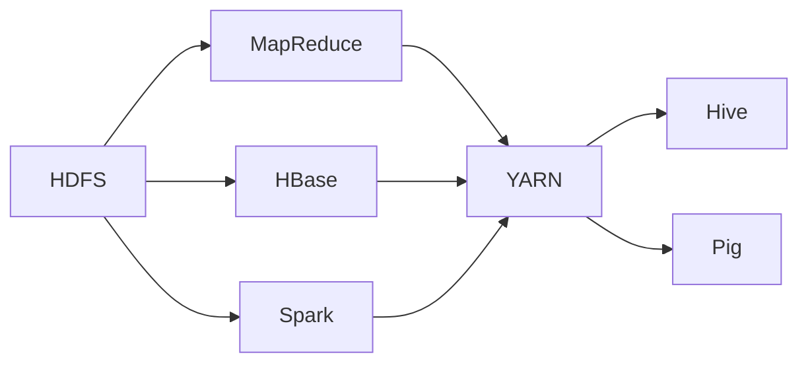

# Hadoop 原理与代码实例讲解

## 1. 背景介绍
### 1.1 大数据时代的挑战
随着互联网、物联网、社交网络等技术的快速发展,数据呈现爆炸式增长。传统的数据处理和存储方式已经无法满足海量数据的处理需求。大数据时代对数据的存储、计算和分析提出了新的挑战。

### 1.2 Hadoop的诞生
Hadoop起源于Apache Nutch,最初由Doug Cutting和Mike Cafarella开发。Hadoop作为一个开源的分布式计算平台,为海量数据的存储和处理提供了可靠、高效、可扩展的解决方案。

### 1.3 Hadoop生态系统概览
围绕Hadoop,形成了一个庞大的生态系统,包括HDFS、MapReduce、YARN、Hive、Pig、HBase、Spark等组件。这些组件协同工作,构建了一个完整的大数据处理平台。

## 2. 核心概念与联系
### 2.1 HDFS(Hadoop Distributed File System)
HDFS是Hadoop的分布式文件系统,提供了高吞吐量的数据访问。HDFS采用主/从架构,由NameNode和DataNode组成。NameNode负责管理文件系统的命名空间和元数据,DataNode负责存储实际的数据块。

### 2.2 MapReduce
MapReduce是Hadoop的分布式计算框架,用于处理大规模数据集。MapReduce将计算过程分为Map阶段和Reduce阶段。Map阶段对数据进行并行处理,生成中间结果;Reduce阶段对Map阶段的输出进行汇总和聚合。

### 2.3 YARN(Yet Another Resource Negotiator)  
YARN是Hadoop的资源管理和任务调度系统。YARN将资源管理和任务调度功能从MapReduce中分离出来,提供了更灵活、可扩展的资源管理机制。YARN由ResourceManager、NodeManager和ApplicationMaster组成。

### 2.4 Hadoop生态系统组件关系


## 3. 核心算法原理具体操作步骤
### 3.1 MapReduce编程模型
MapReduce编程模型由Map函数和Reduce函数组成。
1. Map阶段:并行处理输入数据,将数据转换为<key, value>对。
2. Shuffle阶段:将Map输出按照key进行分区,并将相同key的数据发送到同一个Reduce任务。
3. Reduce阶段:对接收到的<key, value>对进行聚合计算,生成最终结果。

### 3.2 WordCount示例
以经典的WordCount为例,说明MapReduce的具体操作步骤:
1. 输入数据:大量的文本文件。
2. Map阶段:对每个文件进行并行处理,将每个单词转换为<word, 1>对。
3. Shuffle阶段:将相同单词的<word, 1>对发送到同一个Reduce任务。
4. Reduce阶段:对每个单词的计数进行累加,得到每个单词的总频次<word, count>。
5. 输出结果:将<word, count>写入输出文件。

## 4. 数学模型和公式详细讲解举例说明
### 4.1 MapReduce数学模型
设输入数据集为$D=\{d_1,d_2,...,d_n\}$,Map函数为$m$,Reduce函数为$r$。

Map阶段:
$$m(d_i) \rightarrow \{<k_{i1},v_{i1}>,<k_{i2},v_{i2}>,...\}$$

Shuffle阶段:
$$\{<k_{i},\{v_{i1},v_{i2},...\}\}$$

Reduce阶段:
$$r(<k_i,\{v_{i1},v_{i2},...\}>) \rightarrow <k_i,v_i>$$

### 4.2 PageRank算法
PageRank是一种用于计算网页重要性的算法,可以使用MapReduce实现。

设网页集合为$P=\{p_1,p_2,...,p_n\}$,初始PageRank值为$PR^{(0)}=\{\frac{1}{n},\frac{1}{n},...,\frac{1}{n}\}$。

迭代计算公式:
$$PR(p_i)^{(t+1)} = \frac{1-d}{n} + d \sum_{p_j \in M(p_i)} \frac{PR(p_j)^{(t)}}{L(p_j)}$$

其中,$d$为阻尼因子,$M(p_i)$为指向$p_i$的网页集合,$L(p_j)$为$p_j$的出链数。

## 5. 项目实践:代码实例和详细解释说明
### 5.1 HDFS Java API
使用HDFS Java API可以对HDFS进行文件操作。
```java
// 创建HDFS配置
Configuration conf = new Configuration();
// 创建HDFS文件系统对象
FileSystem fs = FileSystem.get(conf);
// 创建文件
Path path = new Path("/user/data/input.txt");
FSDataOutputStream outputStream = fs.create(path);
// 写入数据
outputStream.writeBytes("Hello, Hadoop!");
// 关闭流
outputStream.close();
```

### 5.2 MapReduce WordCount示例
使用MapReduce实现WordCount功能。
```java
public class WordCount {
    public static class TokenizerMapper extends Mapper<Object, Text, Text, IntWritable> {
        private final static IntWritable one = new IntWritable(1);
        private Text word = new Text();
        
        public void map(Object key, Text value, Context context) throws IOException, InterruptedException {
            StringTokenizer itr = new StringTokenizer(value.toString());
            while (itr.hasMoreTokens()) {
                word.set(itr.nextToken());
                context.write(word, one);
            }
        }
    }
    
    public static class IntSumReducer extends Reducer<Text,IntWritable,Text,IntWritable> {
        private IntWritable result = new IntWritable();
        
        public void reduce(Text key, Iterable<IntWritable> values, Context context) throws IOException, InterruptedException {
            int sum = 0;
            for (IntWritable val : values) {
                sum += val.get();
            }
            result.set(sum);
            context.write(key, result);
        }
    }
    
    public static void main(String[] args) throws Exception {
        Configuration conf = new Configuration();
        Job job = Job.getInstance(conf, "word count");
        job.setJarByClass(WordCount.class);
        job.setMapperClass(TokenizerMapper.class);
        job.setCombinerClass(IntSumReducer.class);
        job.setReducerClass(IntSumReducer.class);
        job.setOutputKeyClass(Text.class);
        job.setOutputValueClass(IntWritable.class);
        FileInputFormat.addInputPath(job, new Path(args[0]));
        FileOutputFormat.setOutputPath(job, new Path(args[1]));
        System.exit(job.waitForCompletion(true) ? 0 : 1);
    }
}
```

## 6. 实际应用场景
### 6.1 日志分析
Hadoop可以用于分析海量的日志数据,如Web服务器日志、应用程序日志等。通过对日志进行分析,可以了解用户行为、系统性能、异常情况等。

### 6.2 推荐系统
Hadoop可以用于构建大规模的推荐系统。通过分析用户的历史行为数据,如浏览记录、购买记录等,可以为用户提供个性化的推荐服务。

### 6.3 社交网络分析
Hadoop可以用于分析社交网络数据,如用户关系、用户互动等。通过分析社交网络数据,可以发现用户社区、影响力等有价值的信息。

## 7. 工具和资源推荐
### 7.1 Hadoop发行版
- Apache Hadoop:Hadoop的官方发行版。
- Cloudera CDH:Cloudera公司的Hadoop发行版,提供了完整的大数据平台。
- Hortonworks HDP:Hortonworks公司的Hadoop发行版,提供了企业级的Hadoop解决方案。

### 7.2 开发工具
- Eclipse:Java开发的常用IDE,支持Hadoop插件。
- IntelliJ IDEA:另一款Java开发的IDE,同样支持Hadoop开发。
- Hue:Hadoop生态系统的Web界面,提供了交互式的数据查询和可视化功能。

### 7.3 学习资源
- Hadoop官方文档:提供了Hadoop各个组件的详细文档和API参考。
- Hadoop权威指南:Hadoop领域的经典书籍,全面介绍了Hadoop的原理和应用。
- Coursera大数据课程:在线学习平台Coursera提供了多门关于大数据和Hadoop的课程。

## 8. 总结:未来发展趋势与挑战
### 8.1 Hadoop的未来发展趋势
- 实时处理:Hadoop生态系统正在向实时处理方向发展,如Spark Streaming、Flink等技术的出现。
- 云计算集成:Hadoop与云计算平台的集成将变得更加紧密,如AWS EMR、Google Cloud Dataproc等。
- 机器学习和人工智能:Hadoop将成为机器学习和人工智能的重要数据处理平台。

### 8.2 Hadoop面临的挑战
- 数据安全和隐私:如何在Hadoop平台上保障数据的安全和用户隐私是一个重要挑战。
- 人才缺口:大数据和Hadoop领域的人才需求旺盛,但合格的人才供给相对不足。
- 技术更新速度快:Hadoop生态系统的技术更新速度非常快,如何跟上技术发展步伐是一个挑战。

## 9. 附录:常见问题与解答
### 9.1 Hadoop适合处理什么样的数据?
Hadoop适合处理大规模的结构化、半结构化和非结构化数据,如日志、文本、图像、视频等。

### 9.2 Hadoop的可扩展性如何?
Hadoop具有良好的可扩展性,可以通过增加节点来线性扩展存储和计算能力。Hadoop集群可以轻松扩展到数千个节点。

### 9.3 Hadoop如何保证数据的可靠性?
Hadoop通过数据复制机制保证数据的可靠性。HDFS默认将每个数据块复制3份,分布在不同的节点上。即使部分节点失效,数据也不会丢失。

### 9.4 Hadoop与传统数据库有何区别?
Hadoop是一个分布式计算平台,适合处理大规模的批量数据;而传统数据库适合处理结构化数据和实时查询。Hadoop通常用于离线数据处理和分析,而传统数据库用于在线事务处理(OLTP)。

### 9.5 学习Hadoop需要哪些基础知识?
学习Hadoop需要具备以下基础知识:
- Java编程:Hadoop的核心组件都是用Java开发的,因此需要掌握Java编程。
- Linux基础:Hadoop通常运行在Linux环境上,需要掌握Linux的基本操作和命令。
- 分布式系统原理:Hadoop是一个分布式系统,需要了解分布式系统的基本原理和特点。
- 数据结构与算法:掌握常用的数据结构与算法,有助于理解Hadoop的工作原理和优化方法。

作者:禅与计算机程序设计艺术 / Zen and the Art of Computer Programming