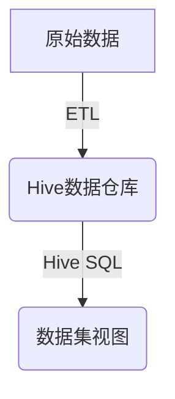
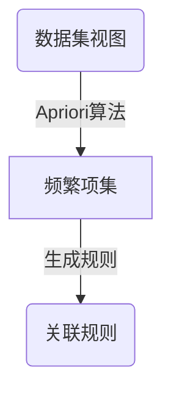
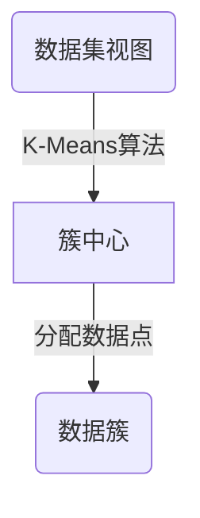
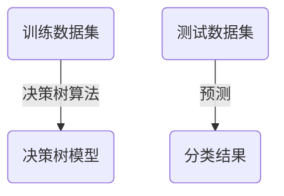
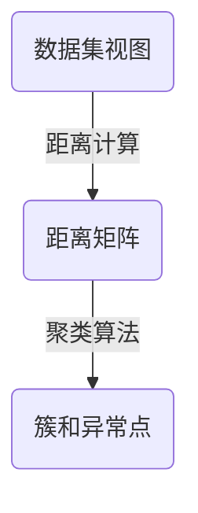
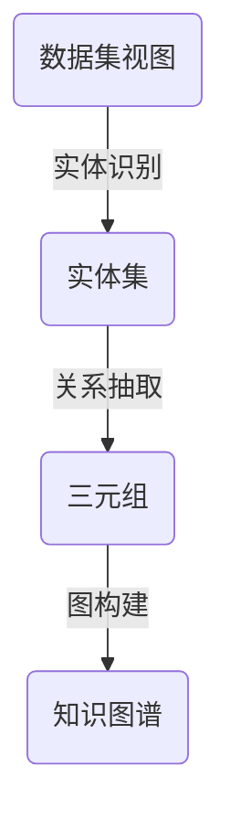

# Hive数据仓库中的数据挖掘与知识图谱

## 1.背景介绍

### 1.1 大数据时代的到来

随着互联网、物联网和移动互联网的快速发展,海量的结构化和非结构化数据被不断产生。这些数据蕴含着巨大的商业价值,如何有效地存储、管理和分析这些大数据,成为企业和组织面临的重大挑战。传统的数据库管理系统已经无法满足大数据时代的需求,迫切需要新的技术和解决方案。

### 1.2 Hive数据仓库简介

Apache Hive是一个建立在Hadoop之上的数据仓库基础架构,它提供了一种类SQL的查询语言(HiveQL)来分析存储在Hadoop分布式文件系统(HDFS)中的大规模数据集。Hive支持大规模数据的摄取(ETL)、查询和分析,并且可以与其他大数据生态系统工具(如Spark、Kafka等)无缝集成。

### 1.3 数据挖掘与知识图谱的重要性

在大数据时代,如何从海量数据中发现有价值的知识和见解,成为企业和组织面临的关键挑战。数据挖掘技术可以帮助发现数据中隐藏的模式和规律,而知识图谱则提供了一种有效的方式来表示和管理这些发现的知识。将数据挖掘与知识图谱相结合,可以极大地提高企业的数据分析和决策能力。

## 2.核心概念与联系

### 2.1 数据挖掘

数据挖掘(Data Mining)是从大量的数据中通过自动或半自动的方式提取隐含在其中的、人们事先不知道且具有潜在价值的信息和知识的过程。常见的数据挖掘任务包括:

- **关联规则挖掘**:发现数据集中存在的频繁模式、相关性和关联规则。
- **聚类分析**:根据数据对象之间的相似性将其划分为多个簇或类别。
- **分类与预测**:基于已知的数据样本,构建模型对新的数据对象进行分类或预测。
- **异常检测**:识别数据集中与众不同的异常对象或模式。

### 2.2 知识图谱

知识图谱(Knowledge Graph)是一种结构化的知识表示形式,它将实体(Entity)、概念(Concept)、事件(Event)等知识元素以及它们之间的关系(Relation)用图的形式进行表示和存储。知识图谱可以用于:

- **知识管理和推理**:存储和组织结构化知识,支持知识推理和查询。
- **语义搜索**:基于语义理解进行更精准的信息检索。
- **问答系统**:利用知识图谱中的结构化知识回答自然语言问题。
- **推荐系统**:根据实体之间的关系进行个性化推荐。

### 2.3 数据挖掘与知识图谱的关系

数据挖掘和知识图谱是相辅相成的关系:

- **数据挖掘为知识图谱提供知识来源**:通过对大数据进行挖掘,可以发现隐藏的模式、规律和知识,并将这些知识融入知识图谱中。
- **知识图谱为数据挖掘提供背景知识**:知识图谱中的结构化知识可以作为数据挖掘的先验知识,提高挖掘的准确性和效率。
- **知识图谱可视化数据挖掘结果**:将数据挖掘发现的知识以图的形式表示和可视化,有助于人们理解和利用这些知识。

在Hive数据仓库中,我们可以将数据挖掘和知识图谱技术相结合,从海量数据中发现有价值的知识,并将这些知识以结构化的形式存储和管理,为企业的数据分析和决策提供强有力的支持。

## 3.核心算法原理具体操作步骤

在Hive数据仓库中进行数据挖掘和构建知识图谱,主要包括以下几个核心步骤:

### 3.1 数据准备



1. **数据采集**:从各种数据源(如日志文件、传感器、网络流量等)采集原始数据,并存储到Hadoop分布式文件系统(HDFS)中。
2. **数据清洗**:对原始数据进行预处理,包括去重、填补缺失值、数据格式转换等,以提高数据质量。
3. **数据加载**:使用Hive的外部表或内部表将清洗后的数据加载到Hive数据仓库中。
4. **数据集视图**:通过HiveQL创建所需的数据集视图,为后续的数据挖掘和知识图谱构建做准备。

### 3.2 关联规则挖掘



1. **发现频繁项集**:使用Apriori算法或FP-Growth算法从数据集中发现频繁项集(Frequent Itemsets),即出现频率高于指定阈值的项集。
2. **生成关联规则**:根据频繁项集,生成满足最小置信度阈值的关联规则(Association Rules)。

示例:在一个电商网站的订单数据中,可以发现诸如"购买了面包和牛奶的顾客也会购买鸡蛋"这样的关联规则,有助于商品推荐和营销策略制定。

### 3.3 聚类分析



1. **初始化簇中心**:根据数据特征空间,随机初始化K个簇中心(Cluster Centroids)。
2. **分配数据点**:将每个数据点分配到与其最近的簇中心相关联的簇。
3. **更新簇中心**:重新计算每个簇的中心点,作为新的簇中心。
4. **迭代收敛**:重复步骤2和3,直到簇中心不再发生变化或达到最大迭代次数。

示例:在一个用户行为数据集中,可以通过聚类分析发现具有相似特征的用户群体,为个性化推荐和营销策略提供依据。

### 3.4 分类与预测



1. **特征工程**:从原始数据中提取有意义的特征,作为模型的输入。
2. **训练模型**:使用决策树、逻辑回归、支持向量机等算法,基于带有标签的训练数据集构建分类或回归模型。
3. **模型评估**:在保留的测试数据集上评估模型的性能,如准确率、召回率、F1分数等指标。
4. **模型调优**:根据评估结果,调整模型参数或特征工程,以提高模型性能。
5. **模型部署**:将训练好的模型部署到实际的预测系统中,对新的数据进行分类或预测。

示例:在一个贷款申请数据集中,可以构建分类模型预测申请人的违约风险,为贷款审批决策提供支持。

### 3.5 异常检测



1. **距离计算**:计算数据对象之间的距离或相似性,构建距离矩阵。
2. **聚类与标记**:使用基于距离的聚类算法(如DBSCAN)将数据对象划分为多个簇,同时标记出异常点(Outliers)。
3. **异常分析**:分析异常点的特征和模式,了解它们的异常原因和影响。

示例:在一个网络流量数据集中,可以检测出异常的流量模式,有助于发现网络攻击或异常行为。

### 3.6 知识图谱构建



1. **实体识别**:从原始数据中识别出实体(Entity),如人物、地点、组织机构等,构建实体集合。
2. **关系抽取**:使用基于规则或机器学习的方法,从数据中抽取实体之间的关系(Relation),表示为三元组(头实体、关系、尾实体)的形式。
3. **图构建**:将识别出的实体和关系组织成知识图谱,可以采用RDF、OWL等标准格式或图数据库存储。
4. **知识融合**:将数据挖掘发现的知识(如关联规则、聚类结果等)融入知识图谱中,丰富图谱的内容。
5. **知识推理**:基于知识图谱中的结构化知识,进行逻辑推理、规则推理等,发现隐含的新知识。

示例:在一个新闻数据集中,可以构建涵盖人物、事件、地点等实体及其关系的知识图谱,为新闻检索、事件追踪等应用提供支持。

## 4.数学模型和公式详细讲解举例说明

在数据挖掘和知识图谱构建过程中,涉及到多种数学模型和公式,下面将对其中一些核心模型和公式进行详细讲解。

### 4.1 Apriori算法

Apriori算法是一种经典的关联规则挖掘算法,用于发现数据集中的频繁项集。它基于这样一个事实:如果一个项集是频繁的,那么它的所有子集也必须是频繁的。算法的核心思想是反复扫描数据集,生成候选项集,并计算它们的支持度,最终找出所有频繁项集。

设 $I = \{i_1, i_2, \dots, i_m\}$ 为项集,一个事务 $T$ 是项集 $I$ 的子集,即 $T \subseteq I$。给定一个包含 $N$ 个事务的数据集 $\mathcal{D}$,项集 $X$ 的支持度(Support)定义为:

$$\text{Support}(X) = \frac{|\{T \in \mathcal{D} | X \subseteq T\}|}{N}$$

其中 $|\{T \in \mathcal{D} | X \subseteq T\}|$ 表示包含项集 $X$ 的事务数量。如果项集 $X$ 的支持度不小于给定的最小支持度阈值 $\text{min\_sup}$,则称 $X$ 为频繁项集。

对于一条关联规则 $X \Rightarrow Y$,其置信度(Confidence)定义为:

$$\text{Confidence}(X \Rightarrow Y) = \frac{\text{Support}(X \cup Y)}{\text{Support}(X)}$$

置信度表示在包含 $X$ 的事务中,同时也包含 $Y$ 的比例。如果一条规则的置信度不小于给定的最小置信度阈值 $\text{min\_conf}$,则认为该规则是有效的。

Apriori算法的伪代码如下:

```
Apriori(数据集 D, min_sup, min_conf)
    L1 = {频繁1项集}
    for (k = 2; Lk-1 != ∅; k++) {
        Ck = apriori_gen(Lk-1)  // 生成候选k项集
        for each 事务 t ∈ D {  // 扫描数据集
            Ct = 子集(Ck, t)  // 从候选项集中提取t的子集
            for each 候选项集 c ∈ Ct
                c.count++
        }
        Lk = {c ∈ Ck | c.count >= min_sup}  // 找出频繁k项集
    }
    L = ⋃k Lk
    规则集 = {X → Y | X ⊆ L, Y ⊆ L, 且 support(X ∪ Y) >= min_sup, confidence(X → Y) >= min_conf}
    return 规则集
```

Apriori算法通过多次扫描数据集,逐步生成频繁项集,并从中导出满足支持度和置信度阈值的关联规则。它广泛应用于购物篮分析、网页