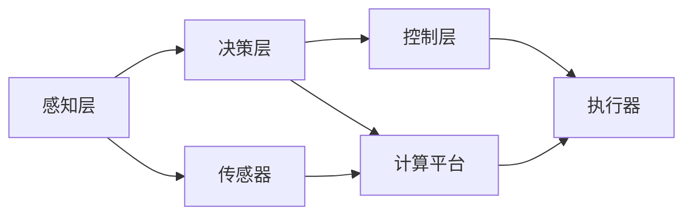

# IT战略规划：企业级无人驾驶技术的应用与挑战

## 1. 背景介绍
### 1.1 无人驾驶技术的发展历程
#### 1.1.1 早期研究阶段
#### 1.1.2 技术突破阶段  
#### 1.1.3 商业化应用阶段

### 1.2 无人驾驶技术的市场前景
#### 1.2.1 全球市场规模预测
#### 1.2.2 主要应用领域分析
#### 1.2.3 市场竞争格局

### 1.3 企业级无人驾驶技术面临的机遇与挑战
#### 1.3.1 政策支持与监管
#### 1.3.2 技术成熟度与可靠性
#### 1.3.3 成本与商业模式

## 2. 核心概念与联系
### 2.1 无人驾驶技术的核心概念
#### 2.1.1 感知技术
#### 2.1.2 决策规划技术
#### 2.1.3 控制执行技术

### 2.2 无人驾驶技术的系统架构
#### 2.2.1 感知层
#### 2.2.2 决策层
#### 2.2.3 控制层

### 2.3 无人驾驶技术的关键组件
#### 2.3.1 传感器
#### 2.3.2 计算平台
#### 2.3.3 算法模型



## 3. 核心算法原理具体操作步骤
### 3.1 环境感知算法
#### 3.1.1 激光雷达感知
#### 3.1.2 视觉感知
#### 3.1.3 多传感器融合

### 3.2 路径规划算法
#### 3.2.1 全局路径规划
#### 3.2.2 局部路径规划 
#### 3.2.3 动态避障算法

### 3.3 运动控制算法
#### 3.3.1 横向控制算法
#### 3.3.2 纵向控制算法
#### 3.3.3 车辆动力学模型

## 4. 数学模型和公式详细讲解举例说明
### 4.1 贝叶斯滤波模型
#### 4.1.1 模型假设
#### 4.1.2 预测更新过程
#### 4.1.3 测量更新过程

贝叶斯滤波是一种常用的状态估计方法，其核心思想是通过先验概率和似然概率计算后验概率。假设$x_t$表示t时刻的状态，$z_t$表示t时刻的观测，贝叶斯滤波分为两个阶段：

预测阶段：
$$p(x_t|z_{1:t-1}) = \int p(x_t|x_{t-1}) p(x_{t-1}|z_{1:t-1}) dx_{t-1}$$

更新阶段：
$$p(x_t|z_{1:t}) = \frac{p(z_t|x_t) p(x_t|z_{1:t-1})}{p(z_t|z_{1:t-1})}$$

其中，$p(x_t|x_{t-1})$为状态转移概率，$p(z_t|x_t)$为观测概率。通过递归计算，可以得到每个时刻的状态估计。

### 4.2 运动学模型
#### 4.2.1 阿克曼转向模型
#### 4.2.2 自行车运动模型 
#### 4.2.3 模型参数辨识

### 4.3 优化模型
#### 4.3.1 二次规划模型
#### 4.3.2 模型预测控制
#### 4.3.3 强化学习模型

## 5. 项目实践：代码实例和详细解释说明
### 5.1 ROS机器人操作系统
#### 5.1.1 ROS系统架构
#### 5.1.2 ROS节点通信机制
#### 5.1.3 ROS功能包开发

### 5.2 自动驾驶仿真平台
#### 5.2.1 CARLA仿真平台
#### 5.2.2 Gazebo仿真平台
#### 5.2.3 自动驾驶算法仿真测试

```python
# ROS节点示例代码
import rospy
from sensor_msgs.msg import LaserScan
from geometry_msgs.msg import Twist

def laser_callback(msg):
    # 处理激光雷达数据
    ranges = msg.ranges
    # ...

def main():
    rospy.init_node('my_node', anonymous=True)
    rospy.Subscriber('/scan', LaserScan, laser_callback)
    cmd_vel_pub = rospy.Publisher('/cmd_vel', Twist, queue_size=10)
    rospy.spin()

if __name__ == '__main__':
    main()
```

以上代码展示了一个简单的ROS节点，订阅激光雷达数据话题`/scan`，并发布速度控制话题`/cmd_vel`。通过回调函数处理激光雷达数据，实现避障、导航等功能。

### 5.3 自动驾驶系统集成
#### 5.3.1 感知模块集成
#### 5.3.2 决策规划模块集成
#### 5.3.3 控制执行模块集成

## 6. 实际应用场景
### 6.1 智能物流运输
#### 6.1.1 无人配送车辆
#### 6.1.2 智能仓储搬运
#### 6.1.3 自动装卸系统

### 6.2 智慧城市交通
#### 6.2.1 自动驾驶公交车
#### 6.2.2 智能交通信号灯
#### 6.2.3 自动泊车系统

### 6.3 特种行业应用
#### 6.3.1 矿山无人驾驶
#### 6.3.2 农业自动耕作
#### 6.3.3 应急救援无人车

## 7. 工具和资源推荐
### 7.1 开源自动驾驶平台
#### 7.1.1 Apollo自动驾驶平台
#### 7.1.2 Autoware自动驾驶套件
#### 7.1.3 Openpilot开源驾驶辅助系统

### 7.2 自动驾驶数据集
#### 7.2.1 KITTI数据集
#### 7.2.2 Udacity自动驾驶数据集
#### 7.2.3 BDD100K驾驶行为数据集

### 7.3 自动驾驶开发工具
#### 7.3.1 MATLAB/Simulink
#### 7.3.2 Python机器学习库
#### 7.3.3 C++机器人开发库

## 8. 总结：未来发展趋势与挑战
### 8.1 无人驾驶技术的发展趋势
#### 8.1.1 车路协同与智慧交通
#### 8.1.2 5G通信与边缘计算
#### 8.1.3 人工智能与自主学习

### 8.2 无人驾驶技术面临的挑战
#### 8.2.1 安全性与鲁棒性
#### 8.2.2 伦理与法律问题
#### 8.2.3 社会接受度与就业影响

### 8.3 企业级无人驾驶技术的发展建议
#### 8.3.1 加强技术研发投入
#### 8.3.2 完善测试评估体系
#### 8.3.3 探索创新商业模式

## 9. 附录：常见问题与解答
### 9.1 无人驾驶汽车安全吗？
无人驾驶汽车经过严格的安全测试和验证，配备了多重冗余的感知、决策和执行系统，可以大幅降低事故风险。但仍需要在复杂环境下进行长期测试，并完善相关法律法规。

### 9.2 无人驾驶技术会取代驾驶员的工作吗？
无人驾驶技术在部分领域可以替代人工驾驶，提高效率和安全性。但在相当长的时间内，无人驾驶与人工驾驶将并存。驾驶员的角色可能会发生变化，更多地承担监督和应急处理的任务。

### 9.3 企业应该如何布局无人驾驶技术？
企业应该根据自身业务特点和发展战略，选择合适的切入点布局无人驾驶技术。可以通过自主研发、合作开发、战略投资等多种方式参与，并密切关注技术发展和政策变化，及时调整策略。

作者：禅与计算机程序设计艺术 / Zen and the Art of Computer Programming