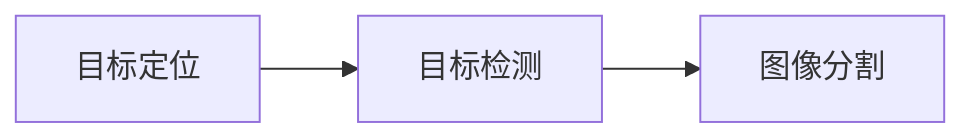

# Image Segmentation 原理与代码实战案例讲解

## 1. 背景介绍
### 1.1 图像分割的定义与意义
图像分割(Image Segmentation)是计算机视觉和图像处理领域的一个基础性问题,其目标是将图像划分为若干个具有独特性质和语义的区域,从而实现对图像内容的理解和分析。图像分割在医学影像分析、自动驾驶、遥感图像解译等诸多领域有着广泛的应用。

### 1.2 图像分割的发展历程
早期的图像分割方法主要基于阈值分割、区域生长等简单的图像处理技术。随着机器学习的发展,特别是深度学习的兴起,以卷积神经网络(CNN)为代表的深度学习方法逐渐成为图像分割的主流。近年来,全卷积网络(FCN)、U-Net等端到端的语义分割网络不断涌现,极大地推动了图像分割技术的进步。

### 1.3 图像分割的主要挑战
尽管图像分割取得了长足的进展,但其仍然面临着诸多挑战:

1. 图像的多样性:现实世界的图像千差万别,存在光照、视角、尺度等诸多变化,给图像分割带来了巨大挑战。

2. 目标的复杂性:待分割的目标可能存在形变、遮挡、粘连等复杂情况,增加了分割的难度。 

3. 标注数据的稀缺性:深度学习方法通常需要大量的标注数据进行训练,而图像分割的标注成本很高,优质的标注数据十分稀缺。

4. 实时性的要求:在自动驾驶等实时性要求较高的场景中,图像分割算法需要在满足精度的同时兼顾速度。

## 2. 核心概念与联系
### 2.1 语义分割与实例分割
按照分割粒度,图像分割可以分为语义分割(semantic segmentation)和实例分割(instance segmentation)两大类:

- 语义分割:将图像中的每个像素划分到预定义的类别中,但不区分同一类别的不同个体。
- 实例分割:在语义分割的基础上进一步区分每个类别中的不同个体,是更细粒度的分割。

### 2.2 前景分割与交互式分割
按照分割方式,图像分割可以分为前景分割(foreground segmentation)和交互式分割(interactive segmentation):

- 前景分割:只关注前景目标的分割,将图像划分为前景和背景两类。代表算法有Mask R-CNN等。
- 交互式分割:在人机交互的辅助下进行分割,通过人为给定目标的标记(如边界点、涂鸦等)来指导分割过程。代表算法有Graph Cut、Random Walker等。

### 2.3 二值分割与多标签分割  
按照类别数量,图像分割可以分为二值分割(binary segmentation)和多标签分割(multi-label segmentation):

- 二值分割:将图像划分为前景和背景两类,输出单通道的二值Mask。
- 多标签分割:将图像划分为多个语义类别,输出与类别数相等的多通道Mask,每个通道对应一个类别。

### 2.4 分割与检测、定位的关系
图像分割与目标检测(object detection)、目标定位(object localization)密切相关:

- 目标检测:预测图像中目标的类别和位置(通常用矩形框表示),但不关注目标的具体轮廓。
- 目标定位:预测图像中单个目标的位置。
- 图像分割:在检测和定位的基础上,进一步预测目标的精确轮廓。

图像分割可以看作是对检测和定位的细粒度扩展,三者的关系如下图所示:

## 3. 核心算法原理具体操作步骤
本节介绍几种经典的图像分割算法:阈值分割、区域生长、Watershed算法、图割(Graph Cut)算法和FCN语义分割。

### 3.1 阈值分割
阈值分割是最简单的图像分割方法,直接根据像素灰度值与阈值的关系将图像二值化,从而实现分割。其基本步骤如下:

1. 选择合适的阈值T
2. 遍历图像的每个像素,将灰度值大于T的像素置为255(白色),否则置为0(黑色)
3. 输出二值化的分割结果

阈值的选择可以通过直方图分析或迭代优化等方法自动确定,如大津阈值法(Otsu)。

### 3.2 区域生长
区域生长是一种基于区域的分割方法,通过不断将满足一定条件的邻域像素合并到种子区域中,直到无法再生长为止。其基本步骤如下:

1. 选择一个或多个种子像素作为初始区域
2. 检查种子像素的邻域,将满足条件(如灰度相似性)的像素合并到当前区域
3. 将新加入的像素作为新的种子,重复步骤2直到无法再生长
4. 输出生长结果,未被标记的像素视为背景

区域生长对种子点的选择比较敏感,因此可以通过人机交互的方式手动选择种子点。

### 3.3 Watershed算法
Watershed算法是一种基于拓扑理论的经典分割算法,其核心思想是把图像看作是一个地形表面,灰度值对应地形的高度,然后模拟水淹过程对图像进行分割。其基本步骤如下:

1. 计算图像的梯度幅值,将梯度值视为地形的高度
2. 寻找局部极小值点,将其标记为不同的区域
3. 从各个极小值点开始向上淹水,水位不断上升
4. 当两个区域的水开始汇合时,在汇合处建立分水岭,作为区域的分割边界
5. 继续淹水直到所有像素都被淹没,输出分割结果

Watershed算法容易产生过分割,通常需要与其他预处理方法(如开闭运算、距离变换等)结合使用。

### 3.4 图割(Graph Cut)算法
图割算法是一种基于能量最小化的交互式分割方法,通过构建图模型并求解最大流/最小割问题实现图像分割。其基本步骤如下:

1. 构建图模型G=(V,E),其中节点V为像素,边E连接相邻像素并连接像素与源点S和汇点T
2. 根据人为交互(如画笔标记)指定某些像素属于前景(与S相连)或背景(与T相连) 
3. 定义能量函数,包括区域项(像素属于前景/背景的概率)和边界项(相邻像素标签一致性)
4. 通过最大流算法求解图的最小割,将图分为S和T两部分,分别对应分割结果的前景和背景
5. 输出分割Mask,S部分为前景,T部分为背景

图割算法可以较好地结合低级的图像信息和高级的人类交互,被广泛应用于抠图、图像编辑等场景。

### 3.5 FCN语义分割
全卷积网络(FCN)是深度学习时代的经典端到端语义分割算法,通过卷积神经网络直接对图像进行逐像素分类,输出与输入尺寸相同的分割结果。FCN的基本网络结构如下:

FCN的核心思想是将传统CNN中的全连接层转化为卷积层,使得网络可以接受任意尺寸的输入,同时通过反卷积等上采样操作恢复空间分辨率,最后通过逐像素的Softmax分类得到分割结果。

FCN的训练过程通常包括以下步骤:

1. 以ImageNet预训练的分类网络(如VGG、ResNet)为骨干,去掉全连接层
2. 在骨干网络后添加卷积上采样层,恢复空间分辨率
3. 在末尾添加逐像素分类层,对每个像素预测类别
4. 使用带有类别标签的分割数据集(如PASCAL VOC)进行端到端的有监督训练
5. 使用交叉熵损失函数,对分割结果和GT的逐像素误差进行优化
6. 训练完成后,使用测试集评估分割性能(如mIoU、像素准确率等)

FCN开创了端到端语义分割的先河,此后涌现出了许多改进和变种,如U-Net、DeepLab等,极大地推动了图像分割技术的发展。

## 4. 数学模型和公式详细讲解举例说明
本节对图割算法和FCN中涉及的关键数学模型和公式进行详细讲解。

### 4.1 图割算法的数学模型
图割算法的核心是马尔可夫随机场(MRF)能量模型,其目标是求解能量函数最小时的像素标签配置。设$y_i \in \{0,1\}$为像素$i$的二值标签($0$表示背景,$1$表示前景),能量函数$E(y)$定义为:

$$
E(y) = \sum_{i \in V} D_i(y_i) + \sum_{(i,j) \in E} V_{i,j}(y_i, y_j)
$$

其中,$D_i(y_i)$是像素$i$属于前景/背景的似然度,称为数据项(data term);$V_{i,j}(y_i, y_j)$是相邻像素$i$和$j$标签一致性的度量,称为平滑项(smooth term)。数据项和平滑项分别定义为:

$$
D_i(y_i) = \begin{cases} 
-\log Pr(x_i | y_i = 0), & y_i = 0 \\
-\log Pr(x_i | y_i = 1), & y_i = 1
\end{cases}
$$

$$
V_{i,j}(y_i, y_j) = \begin{cases}
0, & y_i = y_j \\
\lambda \cdot \exp(-\frac{(x_i - x_j)^2}{2\sigma^2}), & y_i \neq y_j
\end{cases}
$$

其中,$Pr(x_i|y_i)$是像素$i$在给定标签$y_i$下的似然概率,$\lambda$和$\sigma$是超参数。

图割算法将最小化$E(y)$转化为求解图的最大流/最小割问题。设图$G=(V,E)$,其中$V$为像素节点和源汇节点$\{s,t\}$,$E$为连接边,边的权重$w_{i,j}$定义为:

$$
w_{i,j} = \begin{cases}
\lambda \cdot \exp(-\frac{(x_i - x_j)^2}{2\sigma^2}), & (i,j) \in \mathcal{N} \\
-\log Pr(x_i | y_i = 0), & i \in V, j = t \\
-\log Pr(x_i | y_i = 1), & i \in V, j = s
\end{cases}
$$

其中,$\mathcal{N}$为相邻像素对的集合。根据最大流最小割定理,图$G$的最小割对应着能量函数$E(y)$的全局最小值,将$s$和$t$分开的割边对应着前景和背景的分割边界。

### 4.2 FCN的数学模型
FCN的核心是端到端的逐像素多分类模型。设$x \in \mathbb{R}^{H \times W \times 3}$为输入图像,$y \in \{1,2,\dots,K\}^{H \times W}$为GT标签($K$为类别数),FCN定义为:

$$
\hat{y} = f(x; \theta)
$$

其中,$\theta$为网络参数,$\hat{y} \in \mathbb{R}^{H \times W \times K}$为逐像素分类的输出,其中$\hat{y}_{i,j,k}$表示像素$(i,j)$属于第$k$类的概率。

FCN的训练目标是最小化预测标签$\hat{y}$和GT标签$y$的交叉熵损失:

$$
\mathcal{L}(\hat{y}, y) = -\sum_{i=1}^H \sum_{j=1}^W \sum_{k=1}^K y_{i,j,k} \log \hat{y}_{i,j,k}
$$

其中,$y_{i,j,k} \in \{0,1\}$为像素$(i,j)$的one-