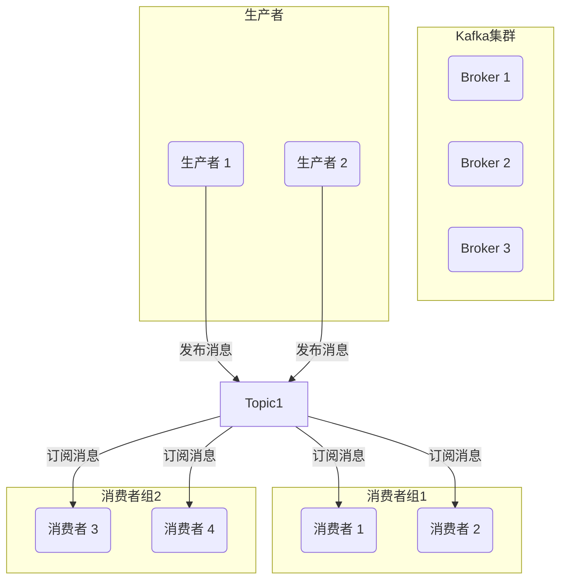
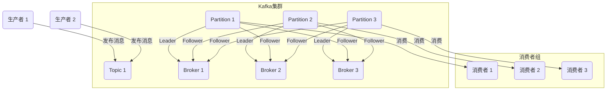

# Kafka与微服务的整合与实践

## 1.背景介绍

### 1.1 微服务架构的兴起

随着互联网技术的快速发展,传统的单体应用架构越来越难以满足现代化应用的需求。单体应用存在着代码耦合严重、扩展性差、技术债务累积等诸多问题,这促使微服务架构应运而生。

微服务架构将整个应用拆分为一组小型、自治的服务,每个服务都可独立部署、扩展和维护。这种架构模式具有良好的模块化、高内聚低耦合的特点,能够提高开发效率、简化系统复杂性、实现技术栈多样化,从而更好地适应敏捷开发和持续交付等现代软件工程实践。

### 1.2 微服务架构中的数据集成挑战

虽然微服务架构带来了诸多好处,但同时也引入了新的挑战,尤其是在数据集成方面。由于微服务之间通常通过轻量级通信机制(如HTTP/REST或消息队列)进行通信,因此需要一种高效、可靠的方式在不同服务之间传递和共享数据。

传统的集中式消息队列虽然可以满足基本的消息传递需求,但往往存在单点故障、吞吐量有限、可扩展性差等问题。而Apache Kafka作为一种分布式、分区的、可复制的提交日志服务,凭借其高吞吐量、低延迟、高可靠性等优秀特性,逐渐成为微服务架构中数据集成的首选方案。

## 2.核心概念与联系  

### 2.1 Kafka核心概念

为了更好地理解Kafka在微服务架构中的作用,我们需要先了解Kafka的几个核心概念:

1. **Topic(主题)**: Kafka将消息流分为不同的类别,每个类别称为一个Topic。生产者向Topic发布消息,消费者从Topic订阅并消费消息。

2. **Partition(分区)**: 为了实现扩展性,一个Topic可以分为多个Partition,每个Partition在存储层面是一个有序的、不可变的消息序列。

3. **Broker(代理)**: Kafka集群由一个或多个Broker组成,每个Broker存储部分Topic的Partition。

4. **Producer(生产者)**: 发布消息到Kafka Topic的客户端。

5. **Consumer(消费者)**: 从Kafka Topic订阅并消费消息的客户端。

6. **Consumer Group(消费者组)**: 每个Consumer属于一个特定的Consumer Group,一个Consumer Group中的所有Consumer实例都会收到Topic中的所有消息,但每条消息只会被组内的一个Consumer实例消费。



### 2.2 Kafka在微服务架构中的作用

在微服务架构中,Kafka主要扮演以下几个角色:

1. **事件驱动架构的基础设施**: Kafka提供了一个可靠的事件流平台,使得各个微服务可以通过发布和订阅事件进行异步通信,实现松耦合和高伸缩性。

2. **数据管道**: Kafka可以作为一个高性能的数据管道,将来自不同来源的数据(如日志、指标、用户活动等)实时传输到多个目的地进行存储、处理或分析。

3. **数据集成层**: Kafka可以作为微服务架构中的数据集成层,实现不同微服务之间的数据共享和集成。

4. **应用程序状态的外部化**: 将应用程序状态存储在Kafka中,可以实现应用程序的无状态化,从而提高可扩展性和容错性。

5. **流处理平台**: 结合Kafka Streams等流处理工具,Kafka可以构建实时流处理管道,对数据进行转换、过滤、聚合等操作。

## 3.核心算法原理具体操作步骤

### 3.1 Kafka的工作原理

Kafka的核心工作原理可以概括为以下几个步骤:

1. **生产者发布消息**:生产者将消息发送到Kafka集群中的一个或多个Topic。每条消息都会被追加到Topic的一个或多个Partition中。

2. **Broker存储消息**:Kafka集群中的每个Broker都会为其负责的Topic Partition维护一个持久化的、有序的、不可变的消息序列。

3. **消费者订阅消息**:消费者从属于一个Consumer Group,并订阅一个或多个Topic。每个Consumer Group中的Consumer实例会被分配到不同的Partition。

4. **消费者消费消息**:每个Consumer实例从分配给它的Partition中拉取消息,并对消息进行处理。Consumer可以在消费完消息后提交offset,以便下次继续从上次的位置开始消费。

5. **消息复制与故障恢复**:为了实现高可用性,Kafka会在集群中复制Topic的Partition。当某个Broker宕机时,其他Broker上的副本可以接管故障Broker上的Partition,从而实现无缝故障恢复。



### 3.2 Kafka的核心算法

Kafka的核心算法主要包括以下几个方面:

1. **分区分配算法**:Kafka使用一致性哈希算法来将Topic Partition分配给Consumer Group中的Consumer实例,以实现负载均衡和故障转移。

2. **复制与故障恢复算法**:Kafka采用主备复制模型,每个Partition都有一个Leader副本和多个Follower副本。当Leader副本发生故障时,Kafka会通过Zookeeper协调选举一个新的Leader副本,并将Follower副本提升为Leader副本,从而实现无缝故障恢复。

3. **消息压缩算法**:为了提高传输效率和存储空间利用率,Kafka支持多种消息压缩算法,如Snappy、LZ4、GZIP等。

4. **批量发送算法**:Kafka采用批量发送的方式来提高吞吐量。生产者会先将消息缓存在内存中,然后周期性地将批量消息发送到Broker。

5. **零拷贝算法**:为了减少内存拷贝开销,Kafka采用了零拷贝(Zero-Copy)技术,直接将文件映射到内存,然后通过Socket直接将内存数据发送出去。

## 4.数学模型和公式详细讲解举例说明

在Kafka中,有一些重要的数学模型和公式,对于理解和优化Kafka的性能至关重要。

### 4.1 分区分配算法

Kafka使用一致性哈希算法来将Topic Partition分配给Consumer Group中的Consumer实例。该算法的核心思想是将Consumer实例和Partition都映射到一个环形空间,然后根据它们在环上的位置进行分配。

假设有n个Consumer实例和m个Partition,我们可以使用以下步骤来进行分配:

1. 计算环的大小,通常取一个足够大的质数,如2^32。
2. 对每个Consumer实例和Partition计算哈希值,并将其映射到环上。
3. 按顺时针方向遍历环,将每个Partition分配给第一个遇到的Consumer实例。
4. 如果所有Consumer实例都已分配了Partition,则重新从头开始分配剩余的Partition。

该算法的优点是可以实现负载均衡,并且在Consumer实例加入或离开时,只需要重新分配部分Partition,而不会影响整个集群的分配。

### 4.2 复制与故障恢复

Kafka采用主备复制模型,每个Partition都有一个Leader副本和多个Follower副本。当Leader副本发生故障时,需要选举一个新的Leader副本。

假设一个Topic有N个Partition,每个Partition有R个副本,则该Topic的总副本数为:

$$
总副本数 = N \times R
$$

当Leader副本发生故障时,Kafka需要从剩余的R-1个Follower副本中选举一个新的Leader副本。为了确保数据一致性,Kafka采用了"大多数原则"(Majority Quorum),即只有当大多数副本(超过R/2个副本)都同意时,才能进行Leader选举和数据写入。

令Q表示大多数副本的数量,则:

$$
Q = \left\lceil \frac{R}{2} \right\rceil + 1
$$

只有当至少有Q个副本存活时,Kafka才能正常工作。因此,为了提高可用性,通常会设置R=3,这样即使有一个副本发生故障,Kafka仍然可以继续工作。

### 4.3 批量发送算法

为了提高吞吐量,Kafka采用批量发送的方式,即生产者会先将消息缓存在内存中,然后周期性地将批量消息发送到Broker。

假设生产者每次发送的批量消息大小为B字节,发送间隔为T毫秒,则生产者的发送吞吐量可以估计为:

$$
吞吐量 = \frac{B}{T} \times 1000 \text{ bytes/s}
$$

例如,如果B=1MB,T=10ms,则吞吐量约为100MB/s。

需要注意的是,过大的批量大小会增加延迟,而过小的批量大小会降低吞吐量。因此,需要根据具体场景进行权衡和调优。

## 5.项目实践:代码实例和详细解释说明

为了更好地理解Kafka在微服务架构中的应用,我们将通过一个实际的项目实践来演示如何使用Kafka进行微服务之间的数据集成。

### 5.1 项目概述

我们将构建一个简单的电子商务系统,包括以下几个微服务:

- **订单服务(Order Service)**: 负责处理订单相关的操作,如创建订单、更新订单状态等。
- **库存服务(Inventory Service)**: 负责管理商品库存,在创建订单时需要检查库存是否足够。
- **支付服务(Payment Service)**: 负责处理订单支付,在创建订单时需要进行支付校验。
- **发货服务(Shipping Service)**: 在订单支付成功后,负责安排订单发货。

这些微服务之间需要通过Kafka进行数据集成和事件驱动,以实现高效、可靠的通信。

### 5.2 Kafka配置

首先,我们需要启动一个Kafka集群,可以使用Docker Compose快速搭建:

```yaml
version: '3'
services:
  zookeeper:
    image: confluentinc/cp-zookeeper:6.2.0
    hostname: zookeeper
    ports:
      - "2181:2181"
    environment:
      ZOOKEEPER_CLIENT_PORT: 2181
      ZOOKEEPER_TICK_TIME: 2000

  kafka:
    image: confluentinc/cp-kafka:6.2.0
    hostname: kafka
    ports:
      - "9092:9092"
    depends_on:
      - zookeeper
    environment:
      KAFKA_BROKER_ID: 1
      KAFKA_ZOOKEEPER_CONNECT: zookeeper:2181
      KAFKA_ADVERTISED_LISTENERS: PLAINTEXT://kafka:9092
      KAFKA_OFFSETS_TOPIC_REPLICATION_FACTOR: 1
```

在本例中,我们