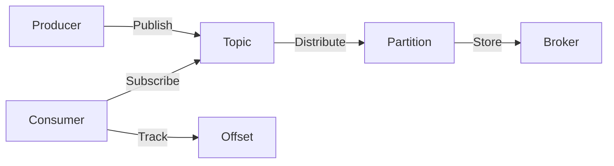

# Kafka原理与代码实例讲解

## 1. 背景介绍
Apache Kafka是一个分布式流处理平台，由LinkedIn开发并于2011年开源，现为Apache软件基金会的一部分。Kafka设计用于高吞吐量、可扩展性和容错性，它广泛应用于日志收集、流数据处理、事件源等场景。Kafka的核心是基于发布-订阅模式的消息队列，但它的设计超越了传统消息系统的功能范畴。

## 2. 核心概念与联系
Kafka的体系结构包括几个关键概念：Producer（生产者）、Consumer（消费者）、Broker（代理）、Topic（主题）、Partition（分区）和 Offset（偏移量）。

- **Producer** 负责发布消息到Kafka的Topic。
- **Consumer** 从Topic订阅消息。
- **Broker** 是Kafka集群中的服务器，负责存储数据和处理客户端请求。
- **Topic** 是消息的分类，Producer发布消息到特定的Topic，Consumer从Topic读取消息。
- **Partition** 是Topic的物理分割，它允许Topic的并行处理。
- **Offset** 是Partition中每条消息的唯一标识，Consumer通过Offset追踪已经读取的消息。



## 3. 核心算法原理具体操作步骤
Kafka的消息传递保证基于“至少一次”或“精确一次”的语义。Kafka的核心算法包括：

- **消息分发**：Producer将消息发送到指定的Partition，通常基于key的哈希值。
- **消息存储**：Broker将接收到的消息存储在磁盘上，并保持消息的顺序。
- **消息读取**：Consumer读取消息时，会指定Offset，Broker返回对应的消息。

## 4. 数学模型和公式详细讲解举例说明
Kafka的负载均衡模型可以用简单的数学公式表示。假设有 $ P $ 个Partition和 $ C $ 个Consumer，每个Consumer平均分配到的Partition数量为 $ \frac{P}{C} $。如果 $ P $ 和 $ C $ 都是Consumer Group中的固定值，则每个Consumer的负载是均衡的。

## 5. 项目实践：代码实例和详细解释说明
以下是一个简单的Kafka Producer和Consumer的代码示例。

### Kafka Producer示例
```java
public class SimpleProducer {
    public static void main(String[] args) {
        Properties props = new Properties();
        props.put("bootstrap.servers", "localhost:9092");
        props.put("key.serializer", "org.apache.kafka.common.serialization.StringSerializer");
        props.put("value.serializer", "org.apache.kafka.common.serialization.StringSerializer");

        Producer<String, String> producer = new KafkaProducer<>(props);
        for(int i = 0; i < 100; i++) {
            producer.send(new ProducerRecord<String, String>("my-topic", Integer.toString(i), "message-" + i));
        }

        producer.close();
    }
}
```

### Kafka Consumer示例
```java
public class SimpleConsumer {
    public static void main(String[] args) {
        Properties props = new Properties();
        props.put("bootstrap.servers", "localhost:9092");
        props.put("group.id", "test");
        props.put("key.deserializer", "org.apache.kafka.common.serialization.StringDeserializer");
        props.put("value.deserializer", "org.apache.kafka.common.serialization.StringDeserializer");

        Consumer<String, String> consumer = new KafkaConsumer<>(props);
        consumer.subscribe(Arrays.asList("my-topic"));
        while (true) {
            ConsumerRecords<String, String> records = consumer.poll(Duration.ofMillis(100));
            for (ConsumerRecord<String, String> record : records) {
                System.out.printf("offset = %d, key = %s, value = %s%n", record.offset(), record.key(), record.value());
            }
        }
    }
}
```

## 6. 实际应用场景
Kafka被广泛应用于日志聚合、消息系统、流处理和事件源等场景。例如，它可以用于收集服务日志数据，然后通过Consumer进行实时监控和分析。

## 7. 工具和资源推荐
- **Apache Kafka官方文档**：提供详细的Kafka使用指南和API文档。
- **Confluent Platform**：提供Kafka的商业支持和额外的工具集。
- **Kafka Manager**：一个Web界面工具，用于管理Kafka集群。

## 8. 总结：未来发展趋势与挑战
Kafka正朝着更加强大的流处理平台发展，未来的挑战包括提高系统的稳定性、扩展性和易用性。随着数据量的增长，如何有效地管理和处理大规模数据流将是Kafka需要解决的问题。

## 9. 附录：常见问题与解答
- **Q：Kafka如何保证消息的顺序？**
  - **A：** Kafka通过将消息存储在Partition中来保证顺序。每个Partition内的消息都是有序的。

- **Q：Kafka如何处理消息丢失？**
  - **A：** Kafka提供了多种配置选项来保证消息的持久性，例如副本机制。

- **Q：如何提高Kafka的吞吐量？**
  - **A：** 可以通过增加Partition数量、优化Producer和Consumer的配置来提高吞吐量。

作者：禅与计算机程序设计艺术 / Zen and the Art of Computer Programming