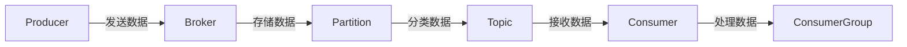

## 1.背景介绍

Apache Kafka是一种分布式流处理平台，由LinkedIn公司开发并于2011年开源，现在是Apache的顶级项目。Kafka设计用于处理实时数据流，并具有高吞吐量、可扩展性和持久性等特性。它被广泛应用于实时分析、日志收集、ETL等场景。

## 2.核心概念与联系

Kafka的核心概念主要包括Producer、Broker、Topic、Partition、Consumer和Consumer Group等。

- **Producer**：生产者，负责将数据发送到Kafka。
- **Broker**：Kafka集群中的服务器，负责存储和处理数据。
- **Topic**：Kafka中数据的分类单位，Producer和Consumer通过Topic来发送和接收数据。
- **Partition**：Topic的物理分区，每个Topic可以有多个Partition，Partition内部按照消息的发送顺序存储数据。
- **Consumer**：消费者，从Kafka中读取数据并进行处理。
- **Consumer Group**：消费者组，由一个或多个Consumer组成，共享同一个Topic的Partition。



## 3.核心算法原理具体操作步骤

Kafka的数据流程主要包括生产者发送数据、Broker存储数据和消费者消费数据三个步骤。

1. **生产者发送数据**：生产者将数据发送到指定的Topic，数据会根据Partition策略（如RoundRobin或Hash）分配到Topic的某个Partition。
2. **Broker存储数据**：Broker接收到数据后，会将数据写入到对应Partition的日志文件中，每条数据都有一个唯一的offset，用于标识在Partition中的位置。
3. **消费者消费数据**：消费者从指定的Topic中读取数据，消费者可以指定offset来读取数据，消费完数据后，消费者会更新自己的offset。

## 4.数学模型和公式详细讲解举例说明

在Kafka中，我们可以使用一些数学模型来描述和优化Kafka的性能。例如，我们可以通过Little's Law来估计Kafka的吞吐量和延迟。

- **吞吐量**：吞吐量（Throughput）是单位时间内Kafka处理的数据量，可以通过公式 $Throughput = \frac{1}{ServiceTime}$ 计算。
- **延迟**：延迟（Latency）是数据从发送到被处理的时间，可以通过公式 $Latency = NumberOfRequestsInSystem * ServiceTime$ 计算。

## 5.项目实践：代码实例和详细解释说明

下面是一个简单的Kafka生产者和消费者的Java代码示例：

```java
// 生产者
public class ProducerDemo {
    public static void main(String[] args) {
        Properties props = new Properties();
        props.put("bootstrap.servers", "localhost:9092");
        props.put("key.serializer", "org.apache.kafka.common.serialization.StringSerializer");
        props.put("value.serializer", "org.apache.kafka.common.serialization.StringSerializer");

        Producer<String, String> producer = new KafkaProducer<>(props);
        for (int i = 0; i < 100; i++) {
            producer.send(new ProducerRecord<String, String>("my-topic", Integer.toString(i), Integer.toString(i)));
        }

        producer.close();
    }
}

// 消费者
public class ConsumerDemo {
    public static void main(String[] args) {
        Properties props = new Properties();
        props.put("bootstrap.servers", "localhost:9092");
        props.put("group.id", "test");
        props.put("key.deserializer", "org.apache.kafka.common.serialization.StringDeserializer");
        props.put("value.deserializer", "org.apache.kafka.common.serialization.StringDeserializer");

        KafkaConsumer<String, String> consumer = new KafkaConsumer<>(props);
        consumer.subscribe(Arrays.asList("my-topic"));

        while (true) {
            ConsumerRecords<String, String> records = consumer.poll(Duration.ofMillis(100));
            for (ConsumerRecord<String, String> record : records) {
                System.out.printf("offset = %d, key = %s, value = %s%n", record.offset(), record.key(), record.value());
            }
        }
    }
}
```

## 6.实际应用场景

Kafka在许多大数据处理场景中都有广泛的应用，例如：

- **日志收集**：Kafka可以作为日志收集系统，收集各种服务的日志数据，然后统一处理和分析。
- **消息队列**：Kafka可以作为分布式系统中的消息队列，用于解耦和缓冲不同服务间的数据流。
- **实时分析**：Kafka可以作为实时分析系统的数据源，提供实时的数据流。

## 7.工具和资源推荐

- **Kafka官方文档**：Kafka的官方文档详细介绍了Kafka的使用和配置，是学习Kafka的重要资源。
- **Kafka Manager**：Kafka Manager是一个开源的Kafka集群管理工具，可以用于监控和管理Kafka集群。
- **Confluent**：Confluent是Kafka的商业版本，提供了一些额外的功能和服务。

## 8.总结：未来发展趋势与挑战

Kafka作为一个成熟的分布式流处理平台，其在大数据处理领域的重要性日益凸显。未来，Kafka将会继续优化其性能和可用性，同时也会面临如何处理更大规模数据、如何提供更强的实时性等挑战。

## 9.附录：常见问题与解答

- **Q：Kafka如何保证数据的一致性？**
- A：Kafka通过副本机制来保证数据的一致性，每个Partition都有多个副本，其中一个作为Leader，其他的作为Follower。所有的读写操作都通过Leader进行，Follower负责从Leader同步数据。

- **Q：Kafka如何处理大量数据？**
- A：Kafka通过Partition来实现数据的分片存储，每个Partition可以存储一部分数据，通过多个Partition可以处理大量数据。

作者：禅与计算机程序设计艺术 / Zen and the Art of Computer Programming