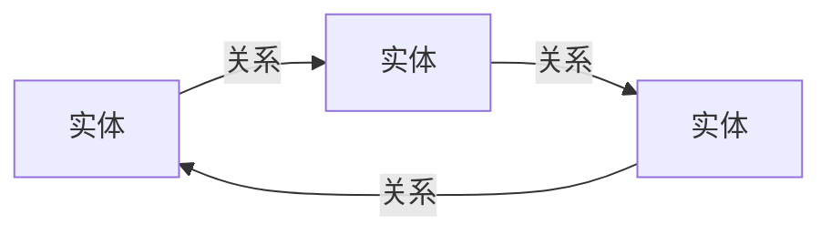

# Knowledge Graphs原理与代码实例讲解

## 1. 背景介绍
在信息爆炸的时代，如何从海量数据中提取有价值的信息，构建知识体系，已成为科技发展的关键。知识图谱（Knowledge Graphs），作为连接数据点并赋予其深层次语义关系的技术，正逐渐成为人工智能、大数据分析等领域的核心技术之一。它不仅能够帮助机器更好地理解人类语言，还能在推荐系统、智能搜索、语义分析等多个应用场景中发挥重要作用。

## 2. 核心概念与联系
知识图谱的核心在于图（Graph）的概念，它由节点（Entities）和边（Relationships）组成。节点通常代表实体，如人、地点、事件等，而边则表示实体之间的各种关系。在知识图谱中，我们还会涉及到一些关键的概念，如本体（Ontology）、三元组（Triple）、推理（Reasoning）等。



## 3. 核心算法原理具体操作步骤
构建知识图谱的核心算法包括实体识别、关系抽取、实体链接、知识融合等。这些算法的操作步骤通常包括数据预处理、特征工程、模型训练、结果评估等环节。

## 4. 数学模型和公式详细讲解举例说明
知识图谱的构建涉及到多种数学模型，如图模型、概率模型等。例如，PageRank算法可以用来评估实体的重要性：

$$
PR(p_i) = \frac{1-d}{N} + d \sum_{p_j \in M(p_i)} \frac{PR(p_j)}{L(p_j)}
$$

其中，$PR(p_i)$ 是页面 $p_i$ 的PageRank值，$d$ 是阻尼系数，$N$ 是页面总数，$M(p_i)$ 是链接到页面 $p_i$ 的页面集合，$L(p_j)$ 是页面 $p_j$ 的链接数。

## 5. 项目实践：代码实例和详细解释说明
以Python语言为例，我们可以使用`networkx`库来构建和操作图结构，实现知识图谱的基本操作。以下是一个简单的代码实例：

```python
import networkx as nx

# 创建一个空的有向图
G = nx.DiGraph()

# 添加节点和边
G.add_node("Alice")
G.add_node("Bob")
G.add_edge("Alice", "Bob", relation="knows")

# 展示图信息
print(nx.info(G))
```

## 6. 实际应用场景
知识图谱在多个领域都有广泛的应用，如在搜索引擎中通过语义理解提升搜索质量，在医疗领域辅助疾病诊断，在金融领域进行风险评估和决策支持等。

## 7. 工具和资源推荐
构建知识图谱的工具和资源丰富多样，包括开源工具（如Apache Jena、Neo4j）、数据集（如Freebase、Wikidata）以及相关的学术论文和社区资源。

## 8. 总结：未来发展趋势与挑战
知识图谱的发展前景广阔，但也面临着诸如数据质量、知识表示的复杂性、跨领域知识融合等挑战。未来的研究将更加注重知识图谱的动态更新、多模态融合以及隐私保护等问题。

## 9. 附录：常见问题与解答
在知识图谱的构建和应用过程中，常见的问题包括数据不一致性、实体消歧、关系预测的准确性等。本节将提供这些问题的常见解决策略和建议。

作者：禅与计算机程序设计艺术 / Zen and the Art of Computer Programming