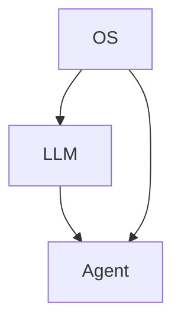

# LLM Agent OS

## 1. 背景介绍

随着人工智能技术的飞速发展,特别是近年来大语言模型(Large Language Model, LLM)的突破性进展,AI系统正在朝着更加智能化、个性化、通用化的方向演进。LLM强大的自然语言理解与生成能力为打造智能化的AI助手Agent开辟了广阔的前景。然而,当前的LLM还主要停留在单一模型层面,缺乏系统化的顶层设计,难以充分发挥其在复杂应用场景中的潜力。因此,构建一个成熟完备的LLM Agent操作系统架构势在必行。本文将重点探讨LLM Agent OS的关键技术、架构设计与实现路径,为未来通用人工智能系统的研发提供思路。

## 2. 核心概念与联系

要理解LLM Agent OS,首先需要厘清其核心概念:

- **LLM(Large Language Model)**: 指基于海量文本数据训练的大规模语言模型,如GPT、BERT等,具备强大的自然语言理解与生成能力。
- **Agent**: 一种智能化的AI助手,能够根据用户需求自主完成任务,具有感知、推理、规划、执行等认知能力。
- **OS(Operating System)**: 即操作系统,是管理和控制计算机硬件与软件资源的程序,同时也是用户和计算机硬件之间的接口。

LLM是实现智能Agent的核心,但单纯的语言模型还不足以胜任复杂的现实世界任务。因此需要在LLM之上,构建一套系统化的OS,赋予Agent更全面的认知与交互能力。LLM、Agent、OS三者的关系如下图所示:



可以看出,LLM和OS是构建Agent的两大支柱。LLM负责语言理解与生成,OS负责任务管理与推理决策,两者相辅相成,共同赋能Agent。

## 3. 核心算法原理具体操作步骤

LLM Agent OS的核心算法主要包括:

1. **语言模型(Language Model)**:
   - 基于Transformer等架构,在大规模语料上进行无监督预训练
   - 使用自回归、Masked Language Model等方式学习语言规律
   - 不断扩大模型参数量和训练数据规模,提升语言理解与生成能力

2. **强化学习(Reinforcement Learning)**:
   - 将Agent视为一个策略网络,通过与环境的交互来学习最优策略
   - 状态空间为当前对话历史,动作空间为可生成的语言响应
   - 采用策略梯度、Q-Learning等算法,根据Reward来更新策略网络参数
   
3. **因果推理(Causal Reasoning)**:
   - 构建因果图,表示不同事件、变量之间的因果依赖关系
   - 使用do-calculus等方法,基于因果图进行因果效应估计、反事实推断
   - 帮助Agent理解行为的因果后果,做出合理决策

4. **逻辑推理(Logical Reasoning)**:
   - 将知识表示为谓词逻辑,如First-Order Logic
   - 使用归结、反驳等推理机制,基于已有知识推导出新的结论
   - 赋予Agent类人的逻辑推理能力,提升其问题解决能力

下面以强化学习为例,详细说明其具体操作步骤:

1. 定义状态空间S、动作空间A和奖励函数R
2. 随机初始化一个策略网络π(a|s),用于根据状态s选择动作a
3. 重复以下步骤,直到策略网络收敛:
   - 根据当前策略与环境交互,收集一批轨迹数据(st,at,rt,st+1)
   - 使用蒙特卡洛或时序差分等方法,估计每个状态-动作对的价值函数Qπ(s,a)
   - 根据价值函数计算每个动作的优势函数Aπ(s,a)
   - 使用策略梯度公式更新策略网络参数θ:
     $\nabla_\theta J(\theta) = \mathbb{E}_\pi[\nabla_\theta \log \pi_\theta(a|s) \cdot A^\pi(s,a)]$

通过不断迭代优化,策略网络最终会收敛到最优策略,使得Agent能够根据当前状态选择最佳动作。

## 4. 数学模型和公式详细讲解举例说明

在LLM Agent OS中,数学模型和公式是其核心算法的理论基础。下面以语言模型和强化学习为例进行详细讲解。

### 4.1 语言模型

给定一个单词序列 $\mathbf{x} = (x_1, x_2, \ldots, x_T)$,语言模型的目标是估计其概率分布 $p(\mathbf{x})$。根据概率论的链式法则,可以将联合概率分解为一系列条件概率的乘积:

$$p(\mathbf{x}) = \prod_{t=1}^T p(x_t | x_1, \ldots, x_{t-1})$$

其中 $p(x_t | x_1, \ldots, x_{t-1})$ 表示在给定前 $t-1$ 个单词的条件下,第 $t$ 个单词出现的概率。语言模型的任务就是学习这个条件概率分布。

以GPT模型为例,其使用Transformer的Decoder结构来建模这个条件概率分布。具体来说,将单词序列 $\mathbf{x}$ 通过Embedding层映射为实值向量序列 $\mathbf{h}^0 = (h_1^0, h_2^0, \ldots, h_T^0)$,然后通过 $N$ 层的Transformer Block进行编码:

$$\mathbf{h}^n = \text{TransformerBlock}(\mathbf{h}^{n-1}), \quad n = 1, 2, \ldots, N$$

其中每个Transformer Block包含Multi-Head Self-Attention和Feed Forward Network两个子层。最后,将第 $N$ 层的隐状态 $\mathbf{h}^N$ 通过线性层和Softmax层映射为下一个单词的概率分布:

$$p(x_t | x_1, \ldots, x_{t-1}) = \text{Softmax}(\text{Linear}(h_t^N))$$

模型的训练目标是最大化真实单词序列的对数似然概率:

$$\mathcal{L}(\theta) = \sum_{t=1}^T \log p(x_t | x_1, \ldots, x_{t-1}; \theta)$$

其中 $\theta$ 为模型参数。通过不断迭代优化,最终得到一个高质量的语言模型。

### 4.2 强化学习

在强化学习中,Agent通过与环境的交互来学习最优策略 $\pi^*$,使得期望累积奖励最大化:

$$\pi^* = \arg\max_\pi \mathbb{E}_\pi \left[ \sum_{t=0}^\infty \gamma^t r_t \right]$$

其中 $\gamma \in [0,1]$ 为折扣因子,$r_t$ 为第 $t$ 步获得的奖励。

以策略梯度算法为例,其核心思想是通过梯度上升来更新策略网络参数 $\theta$,使得优势函数 $A^\pi(s,a)$ 加权的对数似然概率最大化:

$$J(\theta) = \mathbb{E}_\pi \left[ \log \pi_\theta(a|s) \cdot A^\pi(s,a) \right]$$

$$\nabla_\theta J(\theta) = \mathbb{E}_\pi \left[ \nabla_\theta \log \pi_\theta(a|s) \cdot A^\pi(s,a) \right]$$

直观地理解,优势函数 $A^\pi(s,a)$ 衡量了在状态 $s$ 下选择动作 $a$ 相对于平均水平的优劣程度。如果 $A^\pi(s,a)>0$,说明动作 $a$ 比平均水平更好,应该增加其概率;反之则应减少其概率。

在实际应用中,优势函数 $A^\pi(s,a)$ 可以用Q值函数 $Q^\pi(s,a)$ 减去基准值函数 $V^\pi(s)$ 来估计:

$$A^\pi(s,a) = Q^\pi(s,a) - V^\pi(s)$$

其中Q值函数表示在状态 $s$ 下选择动作 $a$ 并按照策略 $\pi$ 继续行动的期望累积奖励:

$$Q^\pi(s,a) = \mathbb{E}_\pi \left[ \sum_{k=0}^\infty \gamma^k r_{t+k} | s_t=s, a_t=a \right]$$

而基准值函数表示状态 $s$ 的期望累积奖励:

$$V^\pi(s) = \mathbb{E}_\pi \left[ \sum_{k=0}^\infty \gamma^k r_{t+k} | s_t=s \right]$$

将 $A^\pi(s,a)$ 的估计值代入策略梯度公式,即可得到策略网络参数的更新方向。重复以上过程,最终得到一个接近最优的策略。

## 5. 项目实践：代码实例和详细解释说明

下面以PyTorch为例,给出LLM Agent OS中部分核心算法的简要实现。

### 5.1 语言模型

首先定义GPT模型的基本组件,包括Embedding层、位置编码、Transformer Block等:

```python
class Embedding(nn.Module):
    def __init__(self, vocab_size, embed_size):
        super().__init__()
        self.embed = nn.Embedding(vocab_size, embed_size)

    def forward(self, x):
        return self.embed(x)

class PositionalEncoding(nn.Module):
    def __init__(self, embed_size, max_len=5000):
        super().__init__()
        pe = torch.zeros(max_len, embed_size)
        position = torch.arange(0, max_len, dtype=torch.float).unsqueeze(1)
        div_term = torch.exp(torch.arange(0, embed_size, 2).float() * (-math.log(10000.0) / embed_size))
        pe[:, 0::2] = torch.sin(position * div_term)
        pe[:, 1::2] = torch.cos(position * div_term)
        self.register_buffer('pe', pe)

    def forward(self, x):
        return x + self.pe[:x.size(0), :]

class TransformerBlock(nn.Module):
    def __init__(self, embed_size, num_heads, hidden_size, dropout=0.1):
        super().__init__()
        self.attn = nn.MultiheadAttention(embed_size, num_heads, dropout=dropout)
        self.ln1 = nn.LayerNorm(embed_size)
        self.mlp = nn.Sequential(
            nn.Linear(embed_size, hidden_size),
            nn.GELU(),
            nn.Linear(hidden_size, embed_size),
            nn.Dropout(dropout)
        )
        self.ln2 = nn.LayerNorm(embed_size)

    def forward(self, x):
        attn_output = self.attn(x, x, x)[0]
        x = self.ln1(x + attn_output)
        mlp_output = self.mlp(x)
        x = self.ln2(x + mlp_output)
        return x
```

然后定义完整的GPT模型,并实现前向传播过程:

```python
class GPT(nn.Module):
    def __init__(self, vocab_size, embed_size, num_heads, hidden_size, num_layers, max_len=5000, dropout=0.1):
        super().__init__()
        self.embed = Embedding(vocab_size, embed_size)
        self.pos_enc = PositionalEncoding(embed_size, max_len)
        self.layers = nn.ModuleList([
            TransformerBlock(embed_size, num_heads, hidden_size, dropout) 
            for _ in range(num_layers)
        ])
        self.ln = nn.LayerNorm(embed_size)
        self.head = nn.Linear(embed_size, vocab_size)

    def forward(self, x):
        x = self.embed(x)
        x = self.pos_enc(x)
        for layer in self.layers:
            x = layer(x)
        x = self.ln(x)
        x = self.head(x)
        return x
```

最后,定义训练函数,使用Adam优化器和交叉熵损失函数来训练模型:

```python
def train(model, data, optimizer, criterion, num_epochs, batch_size):
    model.train()
    for epoch in range(num_epochs):
        total_loss = 0
        for i in range(0, len(data), batch_size):
            batch = data[i:i+batch_size]
            inputs = batch[:, :-1]
            targets = batch[:, 1:]
            outputs = model(inputs)
            loss = criterion(outputs.view(-1, outputs.size(-1)), targets.view(-1))
            
            optimizer.zero_grad()
            loss.backward()
            optimizer.step()

            total_loss += loss.item()
        
        avg_loss = total_loss / (len(data) // batch_size)
        print(f"Epoch {epoch+1}, Loss: {avg_loss:.4f}")

model = GPT(vocab_size, embed_size, num_heads, hidden_size, num_layers)
optimizer = optim.Adam(model.parameters(), lr=1e