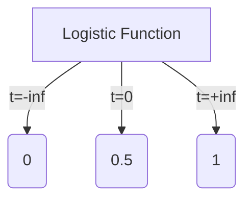
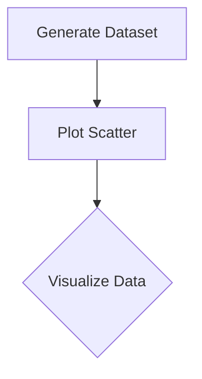

# Logistic Regression 原理与代码实战案例讲解

## 1.背景介绍

### 1.1 什么是Logistic Regression?

Logistic Regression(逻辑回归)是一种广泛使用的机器学习算法,主要用于解决二分类问题。它基于概率估计模型,通过对自变量的线性组合作为输入,经过逻辑函数(Logistic Function)的映射,输出一个0到1之间的数值,这个数值可以理解为样本属于正例的概率。

### 1.2 为什么需要Logistic Regression?

在现实世界中,我们经常会遇到需要进行二分类的场景,比如:

- 垃圾邮件分类
- 信用卡欺诈检测 
- 疾病诊断
- 客户流失预测

线性回归虽然也可以用于分类问题,但它存在一些缺陷:输出值可能超出[0,1]范围、对异常值敏感等。Logistic Regression很好地解决了这些问题,因此在二分类任务中得到了广泛应用。

## 2.核心概念与联系

### 2.1 Logistic函数

Logistic函数(Sigmoid函数)是Logistic Regression的核心,它将任何值压缩映射到(0,1)区间。函数形式如下:

$$
\sigma(t) = \frac{1}{1+e^{-t}}
$$

其中$e$为自然对数的底数。Logistic函数曲线是一条"S"形曲线,如下图所示:



### 2.2 Logistic Regression模型

Logistic Regression的模型可以表示为:

$$
P(Y=1|X) = \sigma(w_0 + w_1x_1 + w_2x_2 + \cdots + w_nx_n) = \frac{1}{1+e^{-(w_0 + w_1x_1 + w_2x_2 + \cdots + w_nx_n)}}
$$

其中:
- $X = (x_1, x_2, \cdots, x_n)$为样本特征向量
- $Y \in \{0, 1\}$为样本的二分类标签
- $w_i$为模型参数,需要通过训练数据来估计得到

我们可以将上式简写为:

$$
P(Y=1|X) = \sigma(w^TX)
$$

其中$w^T$为模型参数的转置向量。

### 2.3 模型训练目标

对于给定的训练数据集$\{(x_1,y_1), (x_2,y_2), \cdots, (x_m,y_m)\}$,我们希望找到一个最优参数向量$w$,使得模型在训练数据上的似然函数最大化,即:

$$
\max_w \prod_{i=1}^m P(y_i|x_i;w)
$$

通过对数似然函数的最大化等价于最小化下面的损失函数(代价函数):

$$
J(w) = -\frac{1}{m}\sum_{i=1}^m[y_i\log \sigma(w^Tx_i) + (1-y_i)\log(1-\sigma(w^Tx_i))]
$$

我们可以使用梯度下降等优化算法来求解上述最优化问题,得到模型参数$w$。

## 3.核心算法原理具体操作步骤

### 3.1 梯度下降算法

梯度下降是一种常用的优化算法,用于求解无约束优化问题。对于Logistic Regression的代价函数$J(w)$,我们可以使用梯度下降算法来求解最优参数$w$。具体步骤如下:

1. 初始化模型参数向量$w$
2. 计算代价函数$J(w)$对每个参数$w_j$的偏导数:
   
   $$
   \frac{\partial J(w)}{\partial w_j} = \frac{1}{m}\sum_{i=1}^m((\sigma(w^Tx_i) - y_i)x_{ij})
   $$

3. 更新每个参数$w_j$:
   
   $$
   w_j := w_j - \alpha\frac{\partial J(w)}{\partial w_j}
   $$

   其中$\alpha$为学习率。

4. 重复步骤2和3,直至收敛。

### 3.2 批量梯度下降(BGD)

在每一次迭代中,批量梯度下降(BGD)使用全部训练数据来计算梯度和更新参数。这种方式虽然可以保证收敛到全局最优解,但当训练数据集很大时,计算代价会非常高。

### 3.3 随机梯度下降(SGD)

与BGD不同,随机梯度下降(SGD)在每次迭代中只使用一个训练样本来计算梯度和更新参数。这种方式可以加快收敛速度,但可能无法收敛到全局最优解,很容易陷入局部最优解。

### 3.4 小批量梯度下降(Mini-Batch GD)

小批量梯度下降(Mini-Batch GD)是BGD和SGD的一种折中,它在每次迭代中使用训练数据的一个小批量(mini-batch)来计算梯度和更新参数。这种方式可以在BGD和SGD之间权衡,兼顾计算效率和收敛性能。

### 3.5 算法伪代码

以下是使用小批量梯度下降训练Logistic Regression模型的伪代码:

```
初始化参数向量w
repeat:
    从训练数据中随机选取一个小批量
    计算小批量数据的梯度: 
        grad = 1/m * sum[(sigmoid(w^T * x_i) - y_i) * x_i]
    使用梯度更新参数:
        w = w - alpha * grad
until 达到停止条件
return w
```

## 4.数学模型和公式详细讲解举例说明

### 4.1 Logistic函数的推导

我们先来推导一下Logistic函数的由来。假设一个事件发生的概率为$p$,那么它不发生的概率就是$1-p$。我们可以定义"odds"为发生概率与不发生概率的比值:

$$
\text{odds} = \frac{p}{1-p}
$$

对odds取对数,得到"log odds"或"logit":

$$
\text{logit}(p) = \log\left(\frac{p}{1-p}\right)
$$

我们可以假设logit(p)是某个线性模型:

$$
\text{logit}(p) = w_0 + w_1x_1 + w_2x_2 + \cdots + w_nx_n
$$

将上式两边使用指数函数,可得:

$$
\frac{p}{1-p} = e^{w_0 + w_1x_1 + w_2x_2 + \cdots + w_nx_n}
$$

解出$p$:

$$
p = \frac{e^{w_0 + w_1x_1 + w_2x_2 + \cdots + w_nx_n}}{1 + e^{w_0 + w_1x_1 + w_2x_2 + \cdots + w_nx_n}}
$$

上式就是Logistic函数的表达式。

### 4.2 代价函数的推导

我们已经知道Logistic Regression模型的似然函数为:

$$
L(w) = \prod_{i=1}^m P(y_i|x_i;w)
$$

对数似然函数为:

$$
\begin{aligned}
l(w) &= \log L(w) \\
     &= \sum_{i=1}^m \log P(y_i|x_i;w) \\
     &= \sum_{i=1}^m [y_i\log \sigma(w^Tx_i) + (1-y_i)\log(1-\sigma(w^Tx_i))]
\end{aligned}
$$

我们需要最大化对数似然函数$l(w)$,等价于最小化$-l(w)$,所以代价函数$J(w)$为:

$$
J(w) = -\frac{1}{m}l(w) = -\frac{1}{m}\sum_{i=1}^m[y_i\log \sigma(w^Tx_i) + (1-y_i)\log(1-\sigma(w^Tx_i))]
$$

### 4.3 梯度推导

为了使用梯度下降算法求解$w$,我们需要计算代价函数$J(w)$对每个参数$w_j$的偏导数。根据多元函数的偏导数计算法则,我们有:

$$
\begin{aligned}
\frac{\partial J(w)}{\partial w_j} &= -\frac{1}{m}\sum_{i=1}^m\left[y_i\frac{1}{\sigma(w^Tx_i)}\sigma'(w^Tx_i)x_{ij} + (1-y_i)\frac{1}{1-\sigma(w^Tx_i)}(-\sigma'(w^Tx_i))x_{ij}\right] \\
                                 &= -\frac{1}{m}\sum_{i=1}^m\left[\left(y_i\frac{1}{\sigma(w^Tx_i)} - \frac{1-y_i}{1-\sigma(w^Tx_i)}\right)\sigma'(w^Tx_i)x_{ij}\right] \\
                                 &= -\frac{1}{m}\sum_{i=1}^m\left[\left(y_i - \sigma(w^Tx_i)\right)x_{ij}\right]
\end{aligned}
$$

其中$\sigma'(t)$为Logistic函数的导数:

$$
\sigma'(t) = \sigma(t)(1-\sigma(t))
$$

将上式代入梯度下降更新公式,我们就可以不断迭代优化参数$w$了。

### 4.4 正则化

为了防止过拟合,我们可以在代价函数中加入正则化项:

$$
J(w) = -\frac{1}{m}\sum_{i=1}^m[y_i\log \sigma(w^Tx_i) + (1-y_i)\log(1-\sigma(w^Tx_i))] + \frac{\lambda}{2m}\sum_{j=1}^n w_j^2
$$

其中$\lambda$为正则化参数,控制着正则化的强度。上式中的正则化项就是著名的L2正则化(Ridge Regression)。我们也可以使用L1正则化(Lasso Regression):

$$
J(w) = -\frac{1}{m}\sum_{i=1}^m[y_i\log \sigma(w^Tx_i) + (1-y_i)\log(1-\sigma(w^Tx_i))] + \frac{\lambda}{m}\sum_{j=1}^n |w_j|
$$

在实际应用中,我们可以根据具体问题选择合适的正则化方式。

## 5.项目实践：代码实例和详细解释说明

接下来我们用Python实现一个Logistic Regression分类器,并在一个二分类数据集上进行测试。我们将使用Scikit-learn库提供的make_blobs函数生成一个简单的人工数据集。

### 5.1 生成数据集

```python
from sklearn.datasets import make_blobs
import matplotlib.pyplot as plt

# 生成人工数据集
X, y = make_blobs(n_samples=1000, centers=2, n_features=2, random_state=3)

# 绘制数据集
plt.scatter(X[:,0], X[:,1], c=y)
plt.show()
```

上述代码将生成一个包含1000个样本、2个类别的二维数据集,并绘制出样本的散点图,如下所示:



### 5.2 划分数据集

```python
from sklearn.model_selection import train_test_split

# 划分训练集和测试集
X_train, X_test, y_train, y_test = train_test_split(X, y, test_size=0.2, random_state=3)
```

我们使用Scikit-learn的train_test_split函数,将原始数据集划分为训练集和测试集,测试集占20%。

### 5.3 实现Logistic Regression分类器

```python
import numpy as np

class LogisticRegression:
    def __init__(self, lr=0.01, num_iter=100000, fit_intercept=True, verbose=False):
        self.lr = lr
        self.num_iter = num_iter
        self.fit_intercept = fit_intercept
        self.verbose = verbose
    
    def __add_intercept(self, X):
        intercept = np.ones((X.shape[0], 1))
        return np.concatenate((intercept, X), axis=1)
    
    def __sigmoid(self, z):
        return 1 / (1 + np.exp(-z))

    def __loss(self, h, y):
        return (-y * np.log(h) - (1 - y) * np.log(1 - h)).mean()
        
    def fit(self, X, y):
        if self.fit_intercept:
            X = self.__add_intercept(X)
        
        # 初始化权重
        self.theta = np.zeros(X.shape[1])
        
        for i in range(self.num_iter):
            z = np.dot(X, self.theta)
            h = self.__sigmoid(z)
            gradient = np.dot(X.T, (h - y)) / y.size
            self.theta -=