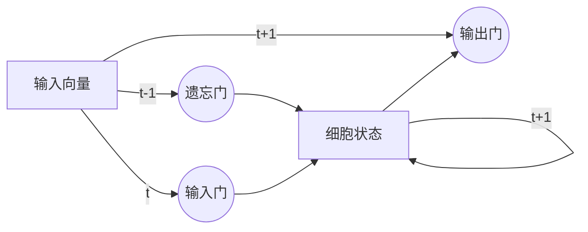

# Long Short-Term Memory (LSTM)原理与代码实例讲解

## 1. 背景介绍

在深度学习的领域中，循环神经网络（Recurrent Neural Networks, RNNs）是处理序列数据的强大工具。然而，传统的RNN在处理长序列时会遇到梯度消失或梯度爆炸的问题，这限制了它们在长期依赖问题上的性能。为了克服这些问题，长短期记忆网络（Long Short-Term Memory, LSTM）被提出。LSTM通过引入门控机制，有效地保持了长期的依赖关系，同时避免了梯度相关的问题。

## 2. 核心概念与联系

LSTM的核心在于其内部的状态单元和三个主要的门控结构：遗忘门（Forget Gate）、输入门（Input Gate）和输出门（Output Gate）。这些门控结构决定了信息如何在单元间流动，哪些信息被保留，哪些被遗忘。



## 3. 核心算法原理具体操作步骤

LSTM的操作可以分为以下几个步骤：

1. **遗忘门**：决定哪些信息将从细胞状态中被丢弃。
2. **输入门**：决定哪些新的信息将被存储在细胞状态中。
3. **细胞状态更新**：根据遗忘门和输入门的输出更新细胞状态。
4. **输出门**：决定下一个隐藏状态的值，这个隐藏状态包含关于前面步骤的信息，也会用于预测。

## 4. 数学模型和公式详细讲解举例说明

LSTM的数学模型可以通过以下公式来描述：

$$
\begin{align*}
f_t &= \sigma(W_f \cdot [h_{t-1}, x_t] + b_f) \\
i_t &= \sigma(W_i \cdot [h_{t-1}, x_t] + b_i) \\
\tilde{C}_t &= \tanh(W_C \cdot [h_{t-1}, x_t] + b_C) \\
C_t &= f_t * C_{t-1} + i_t * \tilde{C}_t \\
o_t &= \sigma(W_o \cdot [h_{t-1}, x_t] + b_o) \\
h_t &= o_t * \tanh(C_t)
\end{align*}
$$

其中，$f_t, i_t, o_t$ 分别代表遗忘门、输入门和输出门的激活向量，$\tilde{C}_t$ 是候选细胞状态，$C_t$ 是当前时刻的细胞状态，$h_t$ 是当前时刻的隐藏状态，$W$ 和 $b$ 是权重矩阵和偏置向量，$\sigma$ 是sigmoid函数，$\tanh$ 是双曲正切函数。

## 5. 项目实践：代码实例和详细解释说明

在Python中使用TensorFlow或PyTorch等深度学习框架可以方便地实现LSTM。以下是一个简单的LSTM网络实现示例：

```python
import torch
import torch.nn as nn

class SimpleLSTM(nn.Module):
    def __init__(self, input_size, hidden_size):
        super(SimpleLSTM, self).__init__()
        self.lstm = nn.LSTM(input_size, hidden_size)

    def forward(self, input_seq):
        lstm_out, (h_n, c_n) = self.lstm(input_seq)
        return lstm_out, h_n, c_n

# 示例使用
input_size = 10
hidden_size = 20
seq_len = 5
batch_size = 1

model = SimpleLSTM(input_size, hidden_size)
input_seq = torch.randn(seq_len, batch_size, input_size)
output, hidden, cell = model(input_seq)

print("Output shape:", output.shape)
print("Hidden state shape:", hidden.shape)
print("Cell state shape:", cell.shape)
```

在这个例子中，我们定义了一个`SimpleLSTM`类，它包含一个LSTM层。我们通过`forward`方法定义了数据如何通过网络流动。然后我们创建了一个模型实例，生成了一个随机输入序列，并通过模型运行它，最后打印出输出、隐藏状态和细胞状态的形状。

## 6. 实际应用场景

LSTM在许多序列数据处理任务中都有广泛的应用，包括但不限于：

- 自然语言处理（NLP）：如机器翻译、情感分析、文本生成。
- 语音识别：将语音信号转换为文字。
- 时间序列预测：如股票价格预测、天气预测。
- 生物信息学：如蛋白质结构预测。

## 7. 工具和资源推荐

- **TensorFlow**：一个广泛使用的深度学习框架，支持LSTM等多种RNN结构。
- **PyTorch**：一个动态深度学习框架，易于实现和调试LSTM模型。
- **Keras**：一个高层次的神经网络API，运行在TensorFlow之上，简化了LSTM的实现。

## 8. 总结：未来发展趋势与挑战

LSTM已经成为处理序列数据的重要工具，但它仍然面临着一些挑战，如计算效率和模型复杂性。未来的研究可能会集中在优化LSTM的结构，以及探索更高效的变体，如门控循环单元（GRU）。此外，结合注意力机制（Attention Mechanism）的LSTM模型在处理长序列时表现出更好的性能，这可能是未来发展的一个方向。

## 9. 附录：常见问题与解答

- **Q: LSTM和传统RNN有什么区别？**
- A: LSTM通过引入门控机制解决了传统RNN在处理长序列时的梯度消失和梯度爆炸问题。

- **Q: LSTM在哪些领域应用最为广泛？**
- A: LSTM在自然语言处理、语音识别和时间序列预测等领域有广泛应用。

- **Q: 如何选择LSTM的隐藏层大小？**
- A: 隐藏层大小通常根据具体任务和数据集的复杂性来确定，可能需要通过实验来调整。

作者：禅与计算机程序设计艺术 / Zen and the Art of Computer Programming