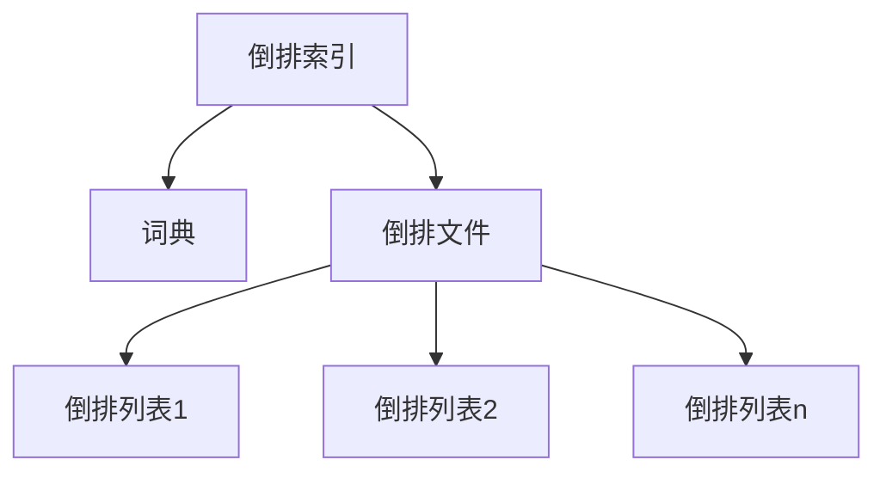
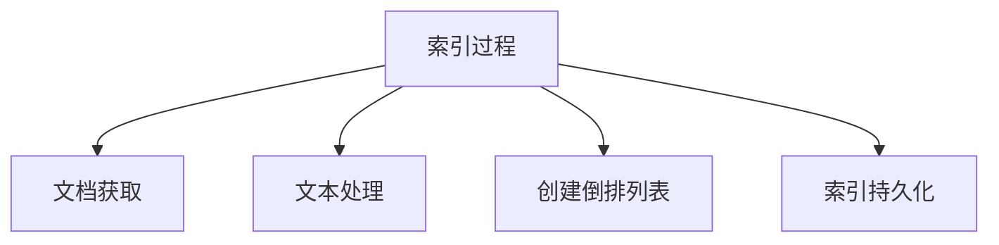
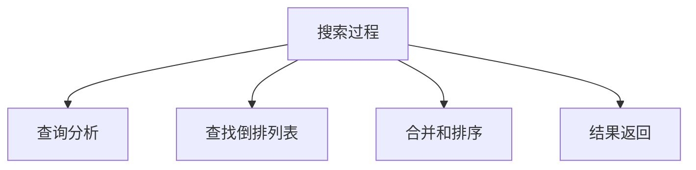

# Lucene原理与代码实例讲解

## 1.背景介绍

在当今信息时代,海量的非结构化数据如文本、图像、视频等快速增长,如何高效地存储、检索和管理这些数据成为了一个巨大的挑战。传统的数据库系统在处理非结构化数据时存在诸多局限性,例如查询效率低下、可扩展性差等。为了解决这些问题,全文搜索引擎应运而生。

Lucene是一个由Apache软件基金会开发和提供的开源全文搜索引擎库,使用Java语言编写。它不只是一个全文搜索引擎,更是一个成熟的、可扩展的信息检索库。Lucene提供了强大的索引和搜索功能,可以对大量的非结构化数据进行高效、准确的全文检索。

## 2.核心概念与联系

### 2.1 倒排索引(Inverted Index)

Lucene的核心是基于倒排索引的全文搜索功能。倒排索引是实现全文搜索的关键数据结构,它将文档集合中的每个词与包含该词的文档相关联,从而使搜索可以快速确定哪些文档与查询相关。

倒排索引由两个核心组件组成:词典(Lexicon)和倒排文件(Inverted File)。

- 词典存储了文档集合中所有不重复的词条,并为每个词条分配一个唯一的编号。
- 倒排文件由一系列的倒排列表(Inverted List)组成,每个倒排列表对应词典中的一个词条,记录了哪些文档包含该词条。



### 2.2 索引过程

Lucene通过以下步骤构建倒排索引:

1. **文档获取**: Lucene从数据源获取原始文档。
2. **文本处理**: 对文档进行分词、过滤、标准化等文本处理操作,得到文档中的词条列表。
3. **创建倒排列表**: 遍历词条列表,为每个词条创建倒排列表,记录包含该词条的所有文档。
4. **索引持久化**: 将内存中的倒排索引数据结构持久化存储到磁盘。



### 2.3 搜索过程

搜索过程是索引过程的反向操作:

1. **查询分析**: 对用户输入的查询进行分词和标准化处理。
2. **查找倒排列表**: 根据分词结果在词典中查找相应的倒排列表。
3. **合并和排序**: 合并检索到的倒排列表,根据相关性算分规则为每个文档计算相关性分数,并按分数降序排列。
4. **结果返回**: 返回排序后的搜索结果。



## 3.核心算法原理具体操作步骤

### 3.1 索引构建

Lucene使用`IndexWriter`类构建倒排索引,主要步骤如下:

1. 创建`IndexWriter`实例,指定索引目录。
2. 获取文档,可以是本地文件、网页、数据库记录等。
3. 对文档进行分词、过滤、标准化等文本处理,得到词条列表。
4. 创建`Document`对象,将文档元数据和词条列表封装其中。
5. 调用`IndexWriter.addDocument()`方法将文档添加到索引中。
6. 调用`IndexWriter.commit()`方法将内存中的索引数据刷新到磁盘。
7. 关闭`IndexWriter`实例。

```java
// 创建IndexWriter实例
Directory directory = FSDirectory.open(Paths.get("/path/to/index"));
IndexWriterConfig config = new IndexWriterConfig(analyzer);
IndexWriter writer = new IndexWriter(directory, config);

// 添加文档
Document doc = new Document();
doc.add(new TextField("content", "This is the document content", Field.Store.YES));
writer.addDocument(doc);

// 提交索引
writer.commit();

// 关闭IndexWriter
writer.close();
```

### 3.2 搜索查询

Lucene使用`IndexSearcher`类执行搜索查询,主要步骤如下:

1. 创建`IndexSearcher`实例,指定索引目录。
2. 创建`QueryParser`实例,指定查询语法解析器。
3. 调用`QueryParser.parse()`方法解析用户查询,得到`Query`对象。
4. 调用`IndexSearcher.search()`方法执行查询,传入`Query`对象。
5. 从`TopDocs`对象中获取查询结果的文档ID列表。
6. 根据文档ID获取完整的文档内容。

```java
// 创建IndexSearcher实例
Directory directory = FSDirectory.open(Paths.get("/path/to/index"));
IndexReader reader = DirectoryReader.open(directory);
IndexSearcher searcher = new IndexSearcher(reader);

// 创建QueryParser实例
QueryParser parser = new QueryParser("content", analyzer);

// 解析查询
Query query = parser.parse("document content");

// 执行查询
TopDocs results = searcher.search(query, 10);

// 获取查询结果
ScoreDoc[] hits = results.scoreDocs;
for (ScoreDoc hit : hits) {
    Document doc = searcher.doc(hit.doc);
    System.out.println(doc.get("content"));
}

// 关闭资源
reader.close();
directory.close();
```

## 4.数学模型和公式详细讲解举例说明

### 4.1 布尔模型

布尔模型是最早应用于全文检索系统的模型之一。在这种模型中,文档被认为要么与查询相关,要么与查询不相关,没有中间状态。查询被表示为一个布尔表达式,由词条、布尔运算符(AND、OR、NOT)和括号组成。

例如,查询"apple AND (orange OR banana)"将返回同时包含"apple"和"orange"或"banana"的文档。

布尔模型的优点是查询语法简单直观,缺点是无法对结果进行排序,也无法区分文档与查询的相关程度。

### 4.2 向量空间模型

向量空间模型(Vector Space Model, VSM)是一种流行的信息检索模型,它将文档和查询都表示为向量,通过计算两个向量之间的相似度来确定文档与查询的相关程度。

假设我们有一个文档集合$D=\{d_1, d_2, ..., d_n\}$,其中每个文档$d_i$都是一个向量$\vec{d_i} = (w_{i1}, w_{i2}, ..., w_{it})$,其中$t$是词典的大小,$w_{ij}$表示第$j$个词条在第$i$个文档中的权重。同理,查询$q$也可以表示为一个向量$\vec{q} = (q_1, q_2, ..., q_t)$。

文档向量和查询向量的相似度可以使用余弦相似度来计算:

$$sim(\vec{d_i}, \vec{q}) = \frac{\vec{d_i} \cdot \vec{q}}{|\vec{d_i}||\vec{q}|} = \frac{\sum_{j=1}^{t}w_{ij}q_j}{\sqrt{\sum_{j=1}^{t}w_{ij}^2}\sqrt{\sum_{j=1}^{t}q_j^2}}$$

余弦相似度的取值范围是$[0, 1]$,值越大表示文档与查询越相关。

在VSM中,词条权重$w_{ij}$通常使用TF-IDF(Term Frequency-Inverse Document Frequency)公式计算:

$$w_{ij} = tf_{ij} \times idf_j = \frac{n_{ij}}{\sum_{k}n_{ik}} \times \log\frac{N}{n_j}$$

其中:

- $tf_{ij}$是第$j$个词条在第$i$个文档中出现的频率
- $idf_j$是第$j$个词条的逆文档频率,用于衡量词条的重要性
- $n_{ij}$是第$j$个词条在第$i$个文档中出现的次数
- $N$是文档总数
- $n_j$是包含第$j$个词条的文档数

### 4.3 BM25模型

BM25(Okapi BM25)是一种基于概率模型的相似度计算公式,它综合考虑了词频(Term Frequency)、逆文档频率(Inverse Document Frequency)和文档长度等因素,被广泛应用于商业和开源搜索引擎中。

BM25公式如下:

$$score(D, Q) = \sum_{q \in Q} IDF(q) \cdot \frac{tf(q, D) \cdot (k_1 + 1)}{tf(q, D) + k_1 \cdot (1 - b + b \cdot \frac{|D|}{avgdl})}$$

其中:

- $D$是文档
- $Q$是查询
- $q$是查询中的词条
- $tf(q, D)$是词条$q$在文档$D$中出现的频率
- $IDF(q)$是词条$q$的逆文档频率
- $|D|$是文档$D$的长度(词条数)
- $avgdl$是文档集合的平均文档长度
- $k_1$和$b$是调节因子,通常取$k_1 \in [1.2, 2.0]$, $b = 0.75$

BM25模型综合考虑了词频、逆文档频率和文档长度等多个因素,能够更好地评估文档与查询的相关性。

## 5.项目实践:代码实例和详细解释说明

下面是一个使用Lucene进行全文搜索的完整示例,包括索引构建和搜索查询两个部分。

### 5.1 索引构建

```java
import org.apache.lucene.analysis.standard.StandardAnalyzer;
import org.apache.lucene.document.Document;
import org.apache.lucene.document.Field;
import org.apache.lucene.document.TextField;
import org.apache.lucene.index.IndexWriter;
import org.apache.lucene.index.IndexWriterConfig;
import org.apache.lucene.store.Directory;
import org.apache.lucene.store.FSDirectory;

import java.io.IOException;
import java.nio.file.Paths;

public class IndexBuilder {
    public static void main(String[] args) throws IOException {
        // 指定索引目录
        Directory directory = FSDirectory.open(Paths.get("index"));

        // 创建IndexWriter实例
        IndexWriterConfig config = new IndexWriterConfig(new StandardAnalyzer());
        IndexWriter writer = new IndexWriter(directory, config);

        // 添加文档
        Document doc1 = new Document();
        doc1.add(new TextField("content", "This is the first document", Field.Store.YES));
        writer.addDocument(doc1);

        Document doc2 = new Document();
        doc2.add(new TextField("content", "This is the second document", Field.Store.YES));
        writer.addDocument(doc2);

        // 提交索引
        writer.commit();

        // 关闭IndexWriter
        writer.close();
        directory.close();
    }
}
```

这个示例创建了两个文档,并将它们索引到Lucene中。主要步骤如下:

1. 指定索引目录`index`。
2. 创建`IndexWriterConfig`实例,指定分词器为`StandardAnalyzer`。
3. 创建`IndexWriter`实例。
4. 创建两个`Document`对象,每个文档包含一个`TextField`字段`content`。
5. 调用`IndexWriter.addDocument()`方法将文档添加到索引中。
6. 调用`IndexWriter.commit()`方法将内存中的索引数据刷新到磁盘。
7. 关闭`IndexWriter`和`Directory`实例。

### 5.2 搜索查询

```java
import org.apache.lucene.analysis.standard.StandardAnalyzer;
import org.apache.lucene.document.Document;
import org.apache.lucene.index.DirectoryReader;
import org.apache.lucene.index.IndexReader;
import org.apache.lucene.queryparser.classic.QueryParser;
import org.apache.lucene.search.IndexSearcher;
import org.apache.lucene.search.Query;
import org.apache.lucene.search.ScoreDoc;
import org.apache.lucene.search.TopDocs;
import org.apache.lucene.store.Directory;
import org.apache.lucene.store.FSDirectory;

import java.io.IOException;
import java.nio.file.Paths;

public class SearchExample {
    public static void main(String[] args) throws IOException {
        // 指定索引目录
        Directory directory = FSDirectory.open(Paths.get("index"));

        // 创建IndexReader实例
        IndexReader reader = DirectoryReader.open(directory);

        // 创建IndexSearcher实例
        IndexSearcher searcher = new IndexSearcher(reader);

        // 创建QueryParser实例
        QueryParser parser = new QueryParser("content", new StandardAnalyzer());

        // 解析查询
        Query query = parser.parse("first");