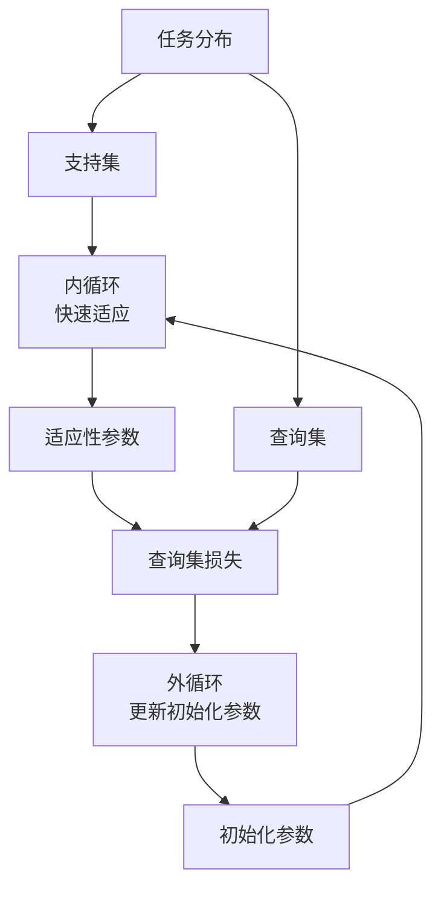

# MAML原理与代码实例讲解

## 1.背景介绍

在当今快速发展的人工智能时代，机器学习已经成为各行各业不可或缺的技术。传统的机器学习算法需要大量的数据和计算资源来训练模型,这对于一些数据稀缺或计算资源有限的领域来说是一个巨大的挑战。为了解决这个问题,元学习(Meta-Learning)应运而生。

元学习的目标是训练一个能够快速适应新任务的模型,即使只有少量数据可用。这种方法的灵感来自于人类学习的方式:我们可以利用以前学习过的知识来快速掌握新的技能。Meta学习算法模仿了这种"学习如何学习"的过程,使得模型能够从少量数据中快速获取新知识。

在元学习算法中,MAML(Model-Agnostic Meta-Learning)是一种广为人知的方法。它由Chelsea Finn等人在2017年提出,并在多个任务上取得了优异的表现。MAML的核心思想是在元训练阶段学习一个好的初始化参数,使得在元测试阶段,模型只需要少量数据和少量梯度更新就可以快速适应新任务。

## 2.核心概念与联系

### 2.1 任务(Task)

在MAML中,任务是指一个特定的数据分布和相应的目标函数。例如,在图像分类任务中,每个数据分布对应一个特定的类别,目标函数是将图像正确分类。在元训练阶段,模型会接触到一系列不同的任务,以学习一个好的初始化参数。在元测试阶段,模型需要快速适应一个全新的任务。

### 2.2 内循环(Inner Loop)和外循环(Outer Loop)

MAML将学习过程分为两个循环:内循环和外循环。

内循环用于模拟快速适应新任务的过程。在内循环中,模型使用支持集(Support Set)中的少量数据进行少量步骤的梯度更新,以获得针对该任务的适应性参数。

外循环则是元学习的核心。在外循环中,模型会在一系列任务上进行训练,目标是找到一个好的初始化参数,使得在内循环中只需要少量步骤就可以适应新任务。具体来说,外循环会根据适应性参数在查询集(Query Set)上的表现,对初始化参数进行优化。

这种内外循环的结构使MAML能够在元训练阶段学习到一个好的初始化参数,从而在元测试阶段快速适应新任务。



### 2.3 元学习与传统机器学习的区别

传统机器学习算法通常是在固定的任务上进行训练和测试,而元学习算法则是在一系列不同的任务上进行训练,目标是学习一个能够快速适应新任务的初始化参数。

此外,传统算法通常需要大量数据进行训练,而元学习算法能够利用少量数据快速适应新任务。这使得元学习在数据稀缺的情况下表现出色。

## 3.核心算法原理具体操作步骤

MAML算法的核心思想是通过优化初始化参数,使得在元测试阶段,模型只需要少量数据和少量梯度更新就可以快速适应新任务。具体操作步骤如下:

1. **初始化参数**

给定一个模型 $f_{\theta}$ 和初始化参数 $\theta$。

2. **采样任务批次**

从任务分布 $p(\mathcal{T})$ 中采样一个任务批次 $\mathcal{T}_i$,每个任务 $\mathcal{T}_i$ 包含支持集 $\mathcal{D}_i^{tr}$ 和查询集 $\mathcal{D}_i^{val}$。

3. **内循环:快速适应**

对于每个任务 $\mathcal{T}_i$,使用支持集 $\mathcal{D}_i^{tr}$ 进行 $k$ 步梯度更新,获得适应性参数 $\theta_i'$:

$$\theta_i' = \theta - \alpha \nabla_{\theta} \sum_{(x,y) \in \mathcal{D}_i^{tr}} \mathcal{L}_{\mathcal{T}_i}(f_{\theta}(x), y)$$

其中 $\alpha$ 是学习率, $\mathcal{L}_{\mathcal{T}_i}$ 是任务 $\mathcal{T}_i$ 的损失函数。

4. **外循环:更新初始化参数**

使用适应性参数 $\theta_i'$ 在查询集 $\mathcal{D}_i^{val}$ 上计算损失,并对初始化参数 $\theta$ 进行优化:

$$\theta \leftarrow \theta - \beta \nabla_{\theta} \sum_{\mathcal{T}_i \sim p(\mathcal{T})} \sum_{(x,y) \in \mathcal{D}_i^{val}} \mathcal{L}_{\mathcal{T}_i}(f_{\theta_i'}(x), y)$$

其中 $\beta$ 是外循环的学习率。

5. **重复步骤2-4**,直到收敛。

通过这种方式,MAML算法在元训练阶段学习到一个好的初始化参数 $\theta$,使得在元测试阶段,模型只需要少量数据和少量梯度更新就可以快速适应新任务。

## 4.数学模型和公式详细讲解举例说明

在MAML算法中,关键的数学模型是内循环和外循环的梯度更新公式。让我们通过一个简单的例子来详细解释这两个公式。

假设我们有一个二分类问题,使用线性模型 $f_{\theta}(x) = \theta^T x$,其中 $\theta$ 是模型参数。我们使用交叉熵损失函数:

$$\mathcal{L}(f_{\theta}(x), y) = -y \log(f_{\theta}(x)) - (1 - y) \log(1 - f_{\theta}(x))$$

现在,我们有一个支持集 $\mathcal{D}^{tr} = \{(x_1, y_1), (x_2, y_2)\}$ 和一个查询集 $\mathcal{D}^{val} = \{(x_3, y_3)\}$。

**内循环:快速适应**

在内循环中,我们使用支持集 $\mathcal{D}^{tr}$ 进行一步梯度更新,获得适应性参数 $\theta'$:

$$\begin{aligned}
\theta' &= \theta - \alpha \nabla_{\theta} \sum_{(x,y) \in \mathcal{D}^{tr}} \mathcal{L}(f_{\theta}(x), y) \\
       &= \theta - \alpha \left[ \nabla_{\theta} \mathcal{L}(f_{\theta}(x_1), y_1) + \nabla_{\theta} \mathcal{L}(f_{\theta}(x_2), y_2) \right] \\
       &= \theta - \alpha \left[ -(y_1 - f_{\theta}(x_1))x_1 - (y_2 - f_{\theta}(x_2))x_2 \right]
\end{aligned}$$

其中 $\alpha$ 是内循环的学习率。

**外循环:更新初始化参数**

在外循环中,我们使用适应性参数 $\theta'$ 在查询集 $\mathcal{D}^{val}$ 上计算损失,并对初始化参数 $\theta$ 进行优化:

$$\begin{aligned}
\theta &\leftarrow \theta - \beta \nabla_{\theta} \sum_{(x,y) \in \mathcal{D}^{val}} \mathcal{L}(f_{\theta'}(x), y) \\
       &= \theta - \beta \nabla_{\theta} \mathcal{L}(f_{\theta'}(x_3), y_3) \\
       &= \theta - \beta (y_3 - f_{\theta'}(x_3))x_3 \frac{\partial \theta'}{\partial \theta}
\end{aligned}$$

其中 $\beta$ 是外循环的学习率,而 $\frac{\partial \theta'}{\partial \theta}$ 是关键的项,它描述了适应性参数 $\theta'$ 对初始化参数 $\theta$ 的梯度。根据链式法则,我们可以计算出:

$$\frac{\partial \theta'}{\partial \theta} = I - \alpha \sum_{(x,y) \in \mathcal{D}^{tr}} \frac{\partial^2 \mathcal{L}(f_{\theta}(x), y)}{\partial \theta \partial \theta^T}$$

将这个项代入外循环的梯度更新公式,我们就可以更新初始化参数 $\theta$。

通过这个例子,我们可以看到MAML算法的核心思想是利用支持集和查询集,通过内外循环的梯度更新,学习一个好的初始化参数。这种方法使得模型能够在元测试阶段快速适应新任务。

## 5.项目实践:代码实例和详细解释说明

为了更好地理解MAML算法,让我们通过一个实际的代码示例来实现它。在这个示例中,我们将使用PyTorch库,并在一个简单的回归问题上训练MAML模型。

### 5.1 导入所需库

```python
import torch
import torch.nn as nn
import torch.optim as optim
import numpy as np
```

### 5.2 定义任务生成器

我们首先定义一个任务生成器,用于生成回归任务。每个任务都是一个线性函数,具有不同的斜率和偏移量。

```python
def task_generator(batch_size, num_samples, num_dims, std=1.0):
    # 生成任务参数
    slopes = np.random.randn(batch_size, num_dims)
    intercepts = np.random.randn(batch_size)
    
    # 生成输入数据和标签
    inputs = np.random.randn(batch_size, num_samples, num_dims) * std
    labels = np.einsum('bj,bk->bjk', slopes, inputs) + intercepts.reshape(-1, 1, 1)
    
    return inputs, labels
```

### 5.3 定义模型

接下来,我们定义一个简单的线性模型,用于拟合回归任务。

```python
class LinearModel(nn.Module):
    def __init__(self, num_dims):
        super(LinearModel, self).__init__()
        self.linear = nn.Linear(num_dims, 1)
    
    def forward(self, x):
        return self.linear(x)
```

### 5.4 定义MAML算法

现在,我们实现MAML算法的核心部分。

```python
def maml(model, optimizer, inputs, labels, inner_lr, meta_lr, num_inner_steps):
    # 计算元批次损失
    meta_loss = 0.0
    
    # 遍历元批次中的每个任务
    for task_inputs, task_labels in zip(inputs, labels):
        # 获取任务支持集和查询集
        support_inputs, support_labels = task_inputs[:num_support], task_labels[:num_support]
        query_inputs, query_labels = task_inputs[num_support:], task_labels[num_support:]
        
        # 内循环:快速适应
        fast_weights = model.parameters()
        for inner_step in range(num_inner_steps):
            logits = model(support_inputs)
            loss = nn.MSELoss()(logits, support_labels)
            grads = torch.autograd.grad(loss, fast_weights, create_graph=True)
            fast_weights = list(map(lambda w, g: w - inner_lr * g, fast_weights, grads))
        
        # 外循环:更新初始化参数
        logits = model(query_inputs, params=fast_weights)
        loss = nn.MSELoss()(logits, query_labels)
        meta_loss += loss
        
        grads = torch.autograd.grad(loss, model.parameters())
        optimizer.zero_grad()
        for p, g in zip(model.parameters(), grads):
            p.grad = g
        optimizer.step()
    
    return meta_loss / len(inputs)
```

这个函数实现了MAML算法的核心逻辑。它首先遍历元批次中的每个任务,对于每个任务:

1. 将数据分为支持集和查询集。
2. 在内循环中,使用支持集进行快速适应,获得适应性参数。
3. 在外循环中,使用适应性参数在查询集上计算损失,并对初始化参数进行优化。

最后,函数返回元批次的平均损失。

### 5.5 训练MAML模型

现在,我们可以开始训练MAML模型了。

```python
# 超参数设置
num_tasks = 32
num_support = 5
num_query = 10
num_dims = 10
num_inner_steps = 5
inner_lr = 0.01
meta_lr = 0.001
num