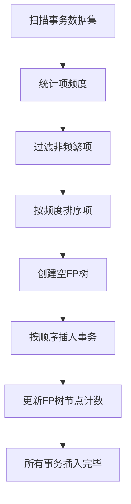
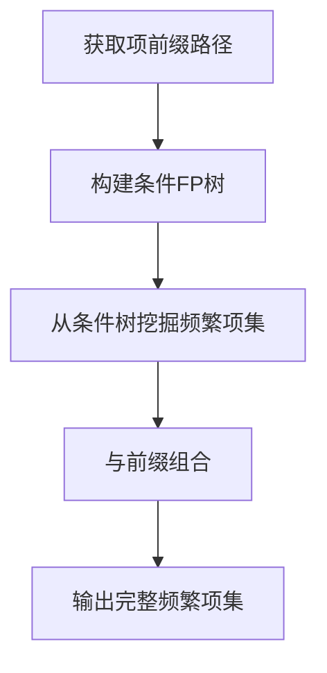
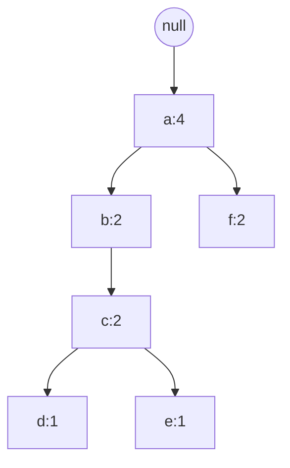

# Mahout频繁项挖掘原理与代码实例讲解

## 1.背景介绍

频繁项挖掘是数据挖掘领域的一个重要任务,旨在从大量事务数据中发现经常出现的项集模式。这些频繁项集可用于发现有趣的关联规则、进行数据聚类分析、构建分类模型等。频繁项挖掘广泛应用于商业智能、网页挖掘、基因分析等多个领域。

Apache Mahout是一个可扩展的机器学习库,为数据科学家提供了多种可扩展的算法。其中,Mahout的fpgrowth算法实现了FP-Growth高效频繁项集挖掘算法。

## 2.核心概念与联系

### 2.1 频繁项集

频繁项集(Frequent Itemset)是指在事务数据集中经常出现的项集。设事务数据集D包含n个事务,一个项集X在D中的支持度为包含X的事务数占总事务数的比例。如果X的支持度不小于给定的最小支持度阈值min_sup,则称X为频繁项集。

### 2.2 关联规则

关联规则挖掘旨在发现事务数据集中感兴趣的相关性。一条关联规则表示为X→Y,其中X和Y是不相交的项集,称为规则的前件和后件。规则的支持度等于X∪Y的支持度,反映了规则在数据集中出现的频率。规则的置信度等于支持度(X∪Y)/支持度(X),反映了当X发生时,Y同时发生的概率。

### 2.3 FP-Growth算法

FP-Growth是一种高效的频繁项集挖掘算法,包含两个主要步骤:

1. 构建FP树(Frequent Pattern Tree),高度压缩原始事务数据集。
2. 从FP树中递归挖掘频繁项集。

相比其他算法,FP-Growth无需产生大量候选集,可高效地发现频繁项集。

## 3.核心算法原理具体操作步骤

FP-Growth算法的核心思想是将原始事务数据集压缩到一棵FP树,从而大大减少了挖掘过程中所需扫描的数据量。算法分为两个主要步骤:

### 3.1 构建FP树

1) 扫描事务数据集,统计各项的频度,过滤掉非频繁项。
2) 按频度排序项,构建空的FP树。
3) 从第一个事务开始,按项的排序顺序插入FP树。每个事务形成一条路径,路径上节点的计数值累加。
4) 重复步骤3,直到所有事务插入完毕。



### 3.2 从FP树挖掘频繁项集

1) 从FP树中获取每个项的前缀路径。
2) 构建每个项的条件FP树。
3) 从条件FP树中递归挖掘以该项为后缀的频繁项集。
4) 将频繁项集与前缀路径组合,得到完整频繁项集。



## 4.数学模型和公式详细讲解举例说明

### 4.1 支持度与置信度

支持度和置信度是关联规则挖掘中的两个重要指标。

给定事务数据集D,包含n个事务。设X和Y为不相交的项集,规则X→Y的支持度和置信度定义为:

$$\begin{aligned}
支持度(X \Rightarrow Y) &= \frac{支持数(X \cup Y)}{n} \\
置信度(X \Rightarrow Y) &= \frac{支持度(X \cup Y)}{支持度(X)}
\end{aligned}$$

其中,支持数(X)表示包含项集X的事务数量。

**例子**:

假设一个事务数据集D包含10个事务,其中3个事务包含{面包,牛奶},2个事务包含{面包,鸡蛋},3个事务包含{面包,牛奶,鸡蛋}。

那么:

- 支持度({面包} → {牛奶}) = 3/10 = 0.3
- 支持度({面包,牛奶} → {鸡蛋}) = 3/10 = 0.3  
- 置信度({面包} → {牛奶}) = 3/(3+2) = 0.6
- 置信度({面包,牛奶} → {鸡蛋}) = 3/6 = 0.5

### 4.2 FP树节点计数

在构建FP树时,每个节点的计数值代表了在数据集中包含该节点对应项集的事务数量。

设一个条件模式基为$\beta$,对应的频繁项为$\alpha$,则$\alpha$的计数值计算公式为:

$$计数(\alpha) = \sum_{T \in D,\beta \subseteq T}计数(T,\alpha)$$

其中$计数(T,\alpha)$表示在事务T中出现项$\alpha$的个数。

**例子**:

假设一个FP树如下所示,最小支持度为2:



可以看出,{a}的支持度为4,是频繁的。{a,b}的支持度为2,也是频繁的。而{a,b,c}的支持度只有2,{a,b,c,d}和{a,b,c,e}的支持度均为1,因此不是频繁的。

## 5.项目实践:代码实例和详细解释说明

以下是使用Mahout实现FP-Growth算法的Java代码示例:

```java
// 加载事务数据集
String[] transactions = ...
ParallelizedParameters parallelizedParameters = new ParallelizedParameters(...)
List<Pair<String,Pair<Long,Long>>> frequentPatterns = fpm.parallelPFPGrowth(transactions, minSupport, parallelizedParameters);

// 输出频繁项集
for (Pair<String,Pair<Long,Long>> frequentPattern : frequentPatterns) {
    String pattern = frequentPattern.getFirst();
    Long support = frequentPattern.getSecond().getFirst();
    System.out.println("Pattern: " + pattern + ", Support: " + support);
}
```

代码解释:

1. 首先加载事务数据集,可以是文本文件或其他格式。
2. 创建`ParallelizedParameters`对象,设置算法参数,如最小支持度、最大周期数等。
3. 调用`fpm.parallelPFPGrowth()`方法执行并行FP-Growth算法,传入事务数据集、最小支持度和参数对象。
4. 算法返回一个`List<Pair<String,Pair<Long,Long>>>`对象,每个元素包含一个频繁模式、其支持度和其他统计信息。
5. 遍历输出每个频繁模式及其支持度。

此外,Mahout还提供了生成关联规则的功能,可以基于挖掘出的频繁项集进一步生成关联规则:

```java
List<AssociationRule> assocRules = AssociationRuleGeneration.genRules(frequentPatterns, minConfidence);
```

其中`minConfidence`是设定的最小置信度阈值。

## 6.实际应用场景

频繁项集挖掘和关联规则挖掘在许多领域都有广泛应用,例如:

- **市场篮分析**: 发现顾客的购买模式,为商品组合定价、促销策略和商品摆放提供依据。
- **网页使用模式分析**: 挖掘用户访问网页的模式,优化网站结构和广告投放策略。
- **基因分析**: 发现基因表达模式,研究基因之间的关联关系。
- **入侵检测**: 检测网络流量中的异常模式,识别潜在的网络攻击行为。
- **天文数据分析**: 从大规模天文观测数据中发现有趣的天体运动模式。

## 7.工具和资源推荐

- Apache Mahout: 一个可扩展的机器学习库,提供了FP-Growth等多种算法的实现。
- SPMF: 一个开源的数据挖掘库,包含FP-Growth等多种频繁模式挖掘算法。
- Weka: 一个著名的机器学习工具,内置了Apriori等关联规则挖掘算法。
- R语言: 提供了arules等数据挖掘包,可用于关联规则挖掘。
- UCI机器学习数据库: 提供了多个可用于测试的标准数据集。

## 8.总结:未来发展趋势与挑战

频繁项集挖掘算法在过去几十年中取得了长足进步,但仍面临一些挑战和发展方向:

- **高维数据处理**: 随着数据维度不断增加,传统算法在处理高维数据时效率低下,需要设计新的高维频繁模式挖掘算法。
- **数据流挖掘**: 对于动态变化的数据流,需要开发增量式算法来高效更新频繁模式。
- **并行计算**: 利用分布式计算框架(如Spark)对大规模数据集进行并行频繁模式挖掘。
- **模式压缩**: 研究如何有效压缩和表示大量频繁模式,提高模式管理效率。
- **交互式挖掘**: 设计人机交互界面,让用户能够方便地指定约束,探索感兴趣的模式。

总的来说,频繁项集挖掘将继续在大数据和人工智能等领域发挥重要作用。

## 9.附录:常见问题与解答

1. **什么是频繁项集?**
    
    频繁项集是指在事务数据集中经常出现的项集,其支持度不小于给定的最小支持度阈值。

2. **为什么需要挖掘频繁项集?**

    频繁项集是发现有趣关联规则的基础,可用于商业智能决策、网页使用模式分析、基因分析等多个领域。

3. **FP-Growth算法的优势是什么?**

    FP-Growth无需产生大量候选集,可高效地从FP树中递归挖掘频繁项集,避免了其他算法可能产生的巨大搜索空间。

4. **如何设置最小支持度阈值?**

    最小支持度阈值的设置需要根据具体应用场景和数据集的特点,通常需要一些实验来确定一个合适的值。过高的阈值可能会遗漏有趣的模式,过低的阈值则会产生大量无用的频繁模式。

5. **FP-Growth算法如何处理增量数据?**

    对于动态变化的数据流,FP-Growth需要配合增量式算法,定期重新构建FP树并更新频繁模式。Mahout目前还没有提供增量式FP-Growth的实现。

作者: 禅与计算机程序设计艺术 / Zen and the Art of Computer Programming