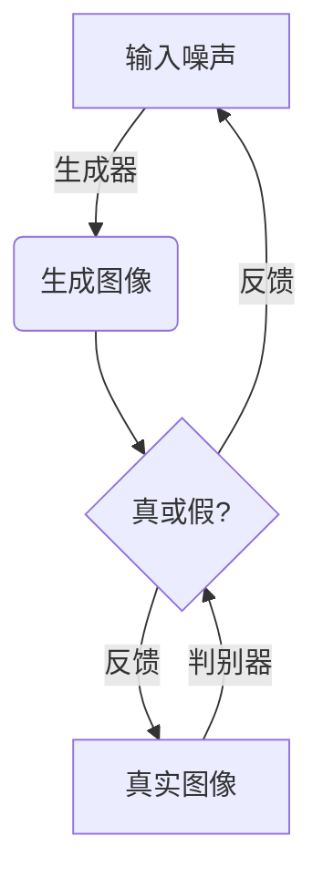
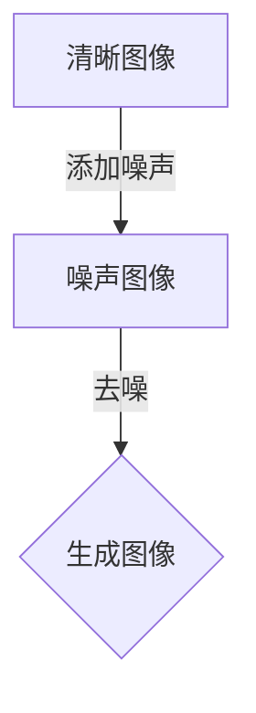
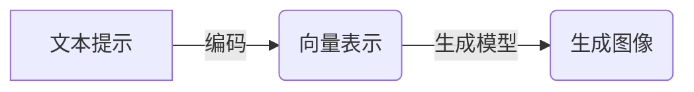

# Midjourney原理与代码实例讲解

## 1. 背景介绍

### 1.1 人工智能与图像生成

人工智能(AI)在近年来取得了长足的进步,尤其是在计算机视觉和自然语言处理领域。其中,图像生成任务一直是人工智能领域的一大挑战,旨在根据文本描述或其他输入自动生成高质量的图像。传统的基于规则或模板的方法很难捕捉图像的丰富细节和复杂语义,因此近年来基于深度学习的方法逐渐占据主导地位。

### 1.2 Midjourney的崛起

Midjourney是一款基于人工智能的图像生成工具,由一家独立的研究实验室开发。它利用最先进的深度学习模型,可以根据用户输入的文本描述生成逼真的图像。自2022年6月对公众开放以来,Midjourney因其出色的图像质量和创新的文本到图像的生成能力而备受关注。

Midjourney不仅在技术上取得了突破,而且为艺术家、设计师和创作者提供了一种全新的创作方式。用户只需输入一个简单的文本提示,就可以获得多种风格的图像选择,从而激发创意并加快创作过程。

## 2. 核心概念与联系

### 2.1 生成式对抗网络(GAN)

Midjourney的核心技术是基于生成式对抗网络(Generative Adversarial Networks, GAN)。GAN是一种由两个神经网络组成的架构,包括一个生成器(Generator)和一个判别器(Discriminator)。

生成器的目标是生成逼真的图像,而判别器则旨在区分生成的图像和真实图像。两个网络相互对抗,生成器不断尝试欺骗判别器,而判别器则努力区分真伪。通过这种对抗训练过程,生成器逐步提高生成图像的质量,最终达到以假乱真的效果。



### 2.2 扩散模型(Diffusion Models)

除了GAN,Midjourney还采用了扩散模型(Diffusion Models)的技术。扩散模型是一种新兴的生成模型,通过学习数据的潜在分布来生成新的样本。

扩散过程将清晰的图像逐步添加噪声,直到完全变为噪声图像。而生成过程则是一个逆向的去噪过程,从纯噪声图像开始,逐步移除噪声,最终生成清晰的图像。这种方法可以产生高质量和多样化的图像,并且训练过程相对稳定。



### 2.3 文本到图像生成

Midjourney的关键创新之一是将文本描述与图像生成相结合。用户输入的文本提示被编码为一个向量表示,然后被输入到生成模型中,指导图像生成的过程。

这种文本到图像的生成过程需要模型理解文本描述的语义,并将其映射到视觉特征。通过大规模的训练数据和强大的深度学习模型,Midjourney能够捕捉文本和图像之间的复杂关联,实现高质量的图像生成。



## 3. 核心算法原理具体操作步骤

### 3.1 预训练模型

Midjourney的图像生成过程基于预先训练好的大型深度学习模型。这些模型通过在海量的图像-文本数据对上进行训练,学习了图像和文本之间的映射关系。

常用的预训练模型包括:

1. **CLIP (Contrastive Language-Image Pre-training)**: 一种视觉语义模型,能够学习图像和文本之间的对应关系。
2. **VIT (Vision Transformer)**: 基于Transformer架构的视觉模型,擅长捕捉图像的长程依赖关系。
3. **VQGAN (Vector Quantized Generative Adversarial Networks)**: 一种改进的GAN模型,用于高质量图像生成。

这些预训练模型为Midjourney提供了强大的图像理解和生成能力,是后续微调和推理的基础。

### 3.2 文本编码

当用户输入文本提示时,Midjourney首先需要将其编码为向量表示。这个过程通常使用预训练的语言模型,如BERT或GPT,将文本映射到一个固定长度的向量空间中。

例如,对于提示"一只可爱的小狗在草地上玩耍",模型会生成一个向量,其中每个维度对应于文本中的某个语义概念,如"可爱"、"小狗"、"草地"等。这个向量编码捕捉了文本的语义信息,并将被用于指导图像生成过程。

### 3.3 条件图像生成

有了文本向量表示和预训练模型,Midjourney就可以进行条件图像生成了。这个过程通常采用迭代的方式,每一步都根据当前的图像和文本向量进行优化,逐步生成更符合文本描述的图像。

具体步骤如下:

1. 从噪声或随机初始图像开始。
2. 使用编码器网络提取当前图像的特征向量。
3. 将图像特征向量和文本向量输入到生成器网络中。
4. 生成器网络输出一个新的图像。
5. 计算新图像与文本向量的相似度,作为损失函数的一部分。
6. 根据损失函数的梯度,更新生成器网络的参数。
7. 重复步骤2-6,直到生成的图像与文本描述足够匹配。

这个过程中,生成器网络逐步学习如何根据文本向量生成符合描述的图像,而判别器网络则评估生成图像的质量和真实性。通过反复迭代,模型可以生成高质量、semantically一致的图像。

### 3.4 超分辨率与细节增强

由于生成过程中的计算限制,Midjourney通常先生成较低分辨率的图像,然后使用超分辨率(Super-Resolution)技术对图像进行上采样,提高分辨率和细节。

常用的超分辨率方法包括:

1. **ESRGAN (Enhanced Super-Resolution Generative Adversarial Networks)**: 基于GAN的超分辨率模型,可以生成清晰、细节丰富的高分辨率图像。
2. **Real-ESRGAN**: ESRGAN的改进版本,针对真实世界图像进行了优化。

除了超分辨率,Midjourney还采用了其他技术来增强图像细节,如纹理合成、风格迁移等。这些技术有助于生成更加逼真、富有细节的高质量图像。

## 4. 数学模型和公式详细讲解举例说明

### 4.1 生成式对抗网络(GAN)

生成式对抗网络(GAN)是Midjourney中使用的核心技术之一。GAN由两个网络组成:生成器(Generator)和判别器(Discriminator)。它们通过对抗式训练相互竞争,最终达到生成逼真图像的目标。

生成器 $G$ 的目标是从一个潜在空间 $z$ 中采样一个潜在向量 $z$,并将其映射到数据空间 $x$,生成一个逼真的样本 $G(z)$。判别器 $D$ 则旨在区分真实数据 $x$ 和生成数据 $G(z)$。

GAN的目标函数可以表示为:

$$\min_{G} \max_{D} V(D, G) = \mathbb{E}_{x \sim p_{\text{data}}(x)}[\log D(x)] + \mathbb{E}_{z \sim p_z(z)}[\log (1 - D(G(z)))]$$

其中, $p_{\text{data}}(x)$ 是真实数据的分布, $p_z(z)$ 是潜在空间的分布,通常为高斯分布或均匀分布。

在训练过程中,生成器 $G$ 努力生成能够欺骗判别器 $D$ 的样本,而判别器 $D$ 则努力区分真实样本和生成样本。通过这种对抗式训练,生成器逐步提高生成样本的质量,最终达到以假乱真的效果。

### 4.2 扩散模型(Diffusion Models)

扩散模型是另一种用于图像生成的技术,Midjourney也采用了这种方法。扩散模型的基本思想是通过学习数据的潜在分布来生成新的样本。

扩散过程可以表示为一个马尔可夫链,将清晰的图像 $x_0$ 逐步添加噪声,直到变为纯噪声图像 $x_T$。这个过程可以用如下公式描述:

$$q\left(x_{1: T} \mid x_{0}\right)=\prod_{t=1}^{T} q\left(x_{t} \mid x_{t-1}\right)$$

其中, $q\left(x_{t} \mid x_{t-1}\right)$ 是从 $x_{t-1}$ 到 $x_t$ 的转移概率,通常为高斯噪声。

生成过程则是一个逆向的去噪过程,从纯噪声图像 $x_T$ 开始,逐步移除噪声,最终生成清晰的图像 $x_0$。这个过程可以用如下公式描述:

$$p_{\theta}\left(x_{0: T}\right)=p\left(x_{T}\right) \prod_{t=1}^{T} p_{\theta}\left(x_{t-1} \mid x_{t}\right)$$

其中, $p_{\theta}\left(x_{t-1} \mid x_{t}\right)$ 是一个由神经网络参数化的条件概率模型,用于预测 $x_{t-1}$ 给定 $x_t$。

通过最大化 $p_{\theta}\left(x_{0: T}\right)$ 的对数似然,模型可以学习到数据的潜在分布,从而生成新的样本。

### 4.3 CLIP模型

CLIP (Contrastive Language-Image Pre-training) 是一种视觉语义模型,能够学习图像和文本之间的对应关系。它在Midjourney中扮演着重要的角色,用于将文本描述映射到图像特征空间。

CLIP模型由两个子网络组成:一个图像编码器和一个文本编码器。图像编码器将图像映射到一个向量空间中,而文本编码器则将文本映射到同一个向量空间。

在训练过程中,CLIP模型最小化图像向量和文本向量之间的对比损失函数:

$$\mathcal{L}_{i, j}=-\log \frac{e^{\operatorname{sim}(i, j) / \tau}}{\sum_{i^{\prime}} e^{\operatorname{sim}\left(i^{\prime}, j\right) / \tau}}$$

其中, $\operatorname{sim}(i, j)$ 是图像向量 $i$ 和文本向量 $j$ 之间的相似度得分, $\tau$ 是一个温度超参数。

通过最小化这个损失函数,CLIP模型可以学习到图像和文本之间的语义对应关系,从而实现跨模态的表示。在Midjourney中,CLIP模型被用于将文本描述编码为向量表示,指导图像生成过程。

## 5. 项目实践:代码实例和详细解释说明

在本节中,我们将提供一个基于 PyTorch 的简化代码示例,展示如何使用生成式对抗网络(GAN)和 CLIP 模型进行文本到图像的生成。请注意,这只是一个简化的示例,实际的 Midjourney 系统要复杂得多。

### 5.1 导入所需库

```python
import torch
import torch.nn as nn
import torchvision.transforms as transforms
from PIL import Image
from clip import clip
```

### 5.2 定义生成器和判别器网络

```python
class Generator(nn.Module):
    def __init__(self, latent_dim, channels):
        super(Generator, self).__init__()
        # 定义生成器网络结构

    def forward(self, noise, text_embedding):
        # 生成图像

class Discriminator(nn.Module):
    def __init__(self, channels):
        super(Discriminator, self).__init__()
        # 定义判别器网络结构

    def forward(self, image, text_embedding):
        # 判别真伪
```

### 5.3 定义 CLIP 模型

```python
clip_model, preprocess = clip.load("