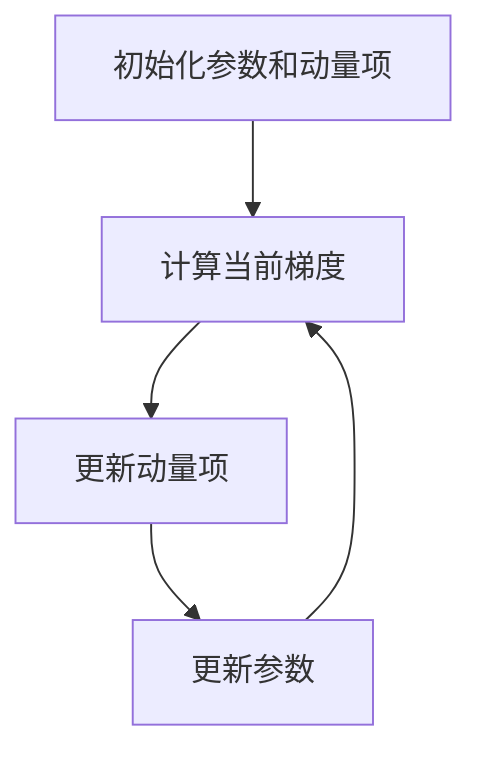

# Momentum优化器的超参数调优方法

## 1.背景介绍

在深度学习领域，优化器是训练神经网络的关键组件之一。优化器的选择和调优直接影响模型的收敛速度和最终性能。Momentum优化器是一种常用的优化算法，它通过引入动量的概念来加速梯度下降过程，特别是在处理高维数据和复杂模型时表现尤为出色。然而，Momentum优化器的性能高度依赖于其超参数的设置。本文将深入探讨Momentum优化器的超参数调优方法，帮助读者更好地理解和应用这一优化器。

## 2.核心概念与联系

### 2.1 Momentum优化器简介

Momentum优化器是一种基于梯度下降的优化算法，它通过引入动量项来加速收敛过程。动量项的引入可以帮助优化器在梯度方向一致时加速前进，在梯度方向变化时减缓震荡。

### 2.2 超参数的定义

Momentum优化器的主要超参数包括学习率（learning rate）和动量因子（momentum factor）。学习率决定了每次更新的步长，而动量因子则控制了动量项的权重。

### 2.3 超参数之间的关系

学习率和动量因子之间存在一定的相互作用。较高的学习率可能需要较低的动量因子来避免震荡，而较低的学习率则可能需要较高的动量因子来加速收敛。

## 3.核心算法原理具体操作步骤

### 3.1 基本算法步骤

Momentum优化器的基本算法步骤如下：

1. 初始化参数 $\theta$ 和动量项 $v$。
2. 计算当前梯度 $g_t$。
3. 更新动量项：$v_{t+1} = \beta v_t + (1 - \beta) g_t$。
4. 更新参数：$\theta_{t+1} = \theta_t - \alpha v_{t+1}$。

其中，$\alpha$ 是学习率，$\beta$ 是动量因子。

### 3.2 具体操作步骤

1. **初始化**：选择合适的初始参数和动量项。
2. **计算梯度**：使用反向传播算法计算当前梯度。
3. **更新动量项**：根据当前梯度和动量因子更新动量项。
4. **更新参数**：根据动量项和学习率更新参数。

### 3.3 Mermaid流程图



## 4.数学模型和公式详细讲解举例说明

### 4.1 数学模型

Momentum优化器的数学模型可以表示为以下公式：

$$
v_{t+1} = \beta v_t + (1 - \beta) g_t
$$

$$
\theta_{t+1} = \theta_t - \alpha v_{t+1}
$$

### 4.2 公式详细讲解

- $v_{t+1}$：更新后的动量项。
- $\beta$：动量因子，通常取值在0到1之间。
- $g_t$：当前梯度。
- $\theta_{t+1}$：更新后的参数。
- $\alpha$：学习率。

### 4.3 举例说明

假设初始参数 $\theta_0 = 0.5$，动量项 $v_0 = 0$，学习率 $\alpha = 0.1$，动量因子 $\beta = 0.9$，当前梯度 $g_t = 0.2$。

1. 更新动量项：$v_{t+1} = 0.9 \times 0 + (1 - 0.9) \times 0.2 = 0.02$。
2. 更新参数：$\theta_{t+1} = 0.5 - 0.1 \times 0.02 = 0.498$。

## 5.项目实践：代码实例和详细解释说明

### 5.1 代码实例

以下是使用Python和TensorFlow实现Momentum优化器的代码示例：

```python
import tensorflow as tf

# 定义模型
model = tf.keras.Sequential([
    tf.keras.layers.Dense(64, activation='relu'),
    tf.keras.layers.Dense(10, activation='softmax')
])

# 定义损失函数和优化器
loss_fn = tf.keras.losses.SparseCategoricalCrossentropy()
optimizer = tf.keras.optimizers.SGD(learning_rate=0.01, momentum=0.9)

# 编译模型
model.compile(optimizer=optimizer, loss=loss_fn, metrics=['accuracy'])

# 训练模型
model.fit(train_data, train_labels, epochs=10, batch_size=32)
```

### 5.2 详细解释

1. **定义模型**：使用Keras定义一个简单的神经网络模型。
2. **定义损失函数和优化器**：选择交叉熵损失函数和带动量的SGD优化器。
3. **编译模型**：将损失函数和优化器编译到模型中。
4. **训练模型**：使用训练数据训练模型。

## 6.实际应用场景

### 6.1 图像分类

Momentum优化器在图像分类任务中表现出色，特别是在处理大规模数据集和复杂模型时。通过调优学习率和动量因子，可以显著提高模型的收敛速度和准确性。

### 6.2 自然语言处理

在自然语言处理任务中，Momentum优化器同样具有广泛应用。它可以加速训练过程，减少训练时间，同时提高模型的性能。

### 6.3 强化学习

Momentum优化器在强化学习中也有应用，特别是在策略梯度方法中。通过调优超参数，可以提高策略的收敛速度和稳定性。

## 7.工具和资源推荐

### 7.1 工具

- **TensorFlow**：一个开源的深度学习框架，支持多种优化器，包括Momentum优化器。
- **PyTorch**：另一个流行的深度学习框架，同样支持Momentum优化器。
- **Keras**：一个高级神经网络API，能够与TensorFlow和Theano集成，支持多种优化器。

### 7.2 资源

- **《深度学习》**：由Ian Goodfellow等人编写的经典教材，详细介绍了各种优化算法。
- **TensorFlow官方文档**：提供了丰富的示例和详细的API说明。
- **PyTorch官方文档**：同样提供了丰富的示例和详细的API说明。

## 8.总结：未来发展趋势与挑战

Momentum优化器作为一种经典的优化算法，已经在多个领域得到了广泛应用。然而，随着深度学习的不断发展，新的优化算法和调优方法也在不断涌现。未来，如何更好地结合Momentum优化器与其他优化算法，以及如何自动化超参数调优，将是研究的热点和挑战。

## 9.附录：常见问题与解答

### 9.1 如何选择合适的学习率和动量因子？

选择合适的学习率和动量因子需要结合具体任务和数据集进行实验。通常，可以从较小的学习率和较高的动量因子开始，逐步调整以找到最佳组合。

### 9.2 为什么我的模型在使用Momentum优化器时出现震荡？

模型出现震荡可能是由于学习率过高或动量因子过大。可以尝试降低学习率或动量因子，观察模型的收敛情况。

### 9.3 Momentum优化器适用于所有类型的神经网络吗？

Momentum优化器适用于大多数类型的神经网络，但在某些情况下，其他优化器（如Adam或RMSprop）可能表现更好。可以根据具体任务和数据集选择合适的优化器。

---

作者：禅与计算机程序设计艺术 / Zen and the Art of Computer Programming