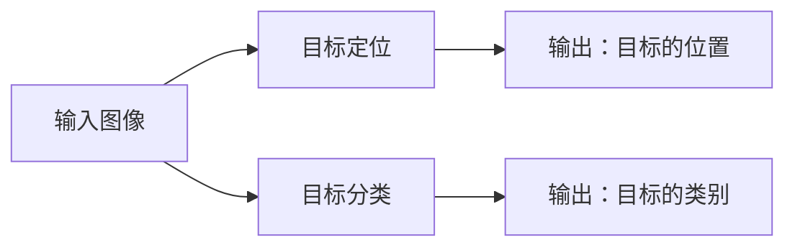
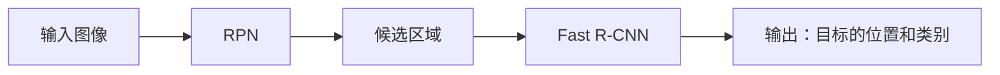

## 1.背景介绍

物体检测(Object Detection)，作为计算机视觉领域的一个重要研究方向，一直以来都受到了广大研究者和工业界的广泛关注。物体检测的目标是在图像中找到感兴趣的目标，并对其进行定位和分类。这在许多实际应用中都有着广泛的应用，如无人驾驶、视频监控、医疗影像分析等。

## 2.核心概念与联系

物体检测涉及到的核心概念有两个：目标定位和目标分类。目标定位是指在图像中确定目标的具体位置，通常通过一个矩形框（Bounding Box）来表示。目标分类则是对目标进行类别的判断，例如是人、车、狗等。



## 3.核心算法原理具体操作步骤

物体检测的主流算法主要有两大类：一类是基于滑动窗口的方法，如DPM、Overfeat等；另一类是基于区域提议的方法，如R-CNN系列、Fast R-CNN、Faster R-CNN等。

以Faster R-CNN为例，其主要包含两个模块：RPN（Region Proposal Network）和Fast R-CNN。RPN负责生成高质量的候选区域，Fast R-CNN则对这些候选区域进行分类和回归。



## 4.数学模型和公式详细讲解举例说明

在Fast R-CNN中，对于每一个候选区域，都会计算其与真实目标的IoU（Intersection over Union）值，以此来评估候选区域的质量。IoU的计算公式如下：

$$ IoU = \frac{Area \ of \ Overlap}{Area \ of \ Union} $$

其中，$Area \ of \ Overlap$表示候选区域与真实目标的交集面积，$Area \ of \ Union$表示候选区域与真实目标的并集面积。

## 5.项目实践：代码实例和详细解释说明

这里我们将使用Python和PyTorch实现一个简单的Faster R-CNN模型。首先，我们需要安装必要的库：

```python
pip install torch torchvision
```

然后，我们可以开始实现模型：

```python
import torch
import torchvision

# 创建模型
model = torchvision.models.detection.fasterrcnn_resnet50_fpn(pretrained=True)

# 将模型设置为评估模式
model.eval()
```

## 6.实际应用场景

物体检测在许多实际应用中都有着广泛的应用，如：

- 无人驾驶：通过物体检测技术，可以实时检测出路面上的行人、车辆等，为无人驾驶提供重要的环境信息。
- 视频监控：通过物体检测技术，可以实时监测视频中的异常行为，如非法入侵、盗窃行为等。

## 7.工具和资源推荐

- [PyTorch](https://pytorch.org/)：一个开源的深度学习框架，提供了丰富的模型库和工具，方便进行深度学习研究和应用开发。
- [TensorFlow Object Detection API](https://github.com/tensorflow/models/tree/master/research/object_detection)：一个开源的物体检测工具库，提供了许多预训练的物体检测模型。

## 8.总结：未来发展趋势与挑战

物体检测作为计算机视觉的一个重要研究方向，其未来的发展趋势主要有两个方向：一是向着更高的精度发展，即提高模型的检测准确性；二是向着更快的速度发展，即减少模型的计算复杂度和推理时间。

然而，物体检测也面临着许多挑战，如如何处理小目标、密集目标的检测，如何处理目标的遮挡和变形等。

## 9.附录：常见问题与解答

Q: Faster R-CNN和Fast R-CNN有什么区别？
A: Faster R-CNN引入了RPN网络，使得候选区域的生成和分类回归两个过程都在一个网络中完成，大大提高了检测速度。

Q: 如何评估物体检测的性能？
A: 常用的评估指标有精度（Precision）、召回率（Recall）、AP（Average Precision）等。

作者：禅与计算机程序设计艺术 / Zen and the Art of Computer Programming