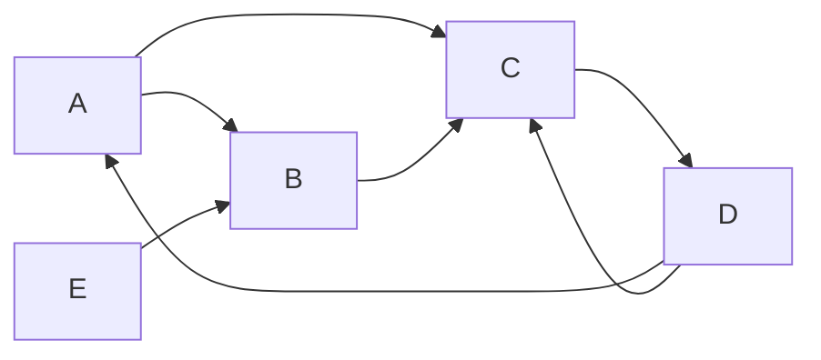

# PageRank 原理与代码实例讲解

## 1.背景介绍

### 1.1 互联网信息爆炸

随着互联网的迅速发展,网络上的信息量呈现出爆炸式增长。据统计,截至2022年底,全球约有20亿个网站,其中包含数十亿个网页。面对如此庞大的信息海洋,如何快速找到高质量、相关性强的网页,成为一个亟待解决的问题。

### 1.2 搜索引擎的重要性

搜索引擎应运而生,它通过自动化程序从万维网上下载、存储、索引网页,并根据用户查询关键词返回相关网页链接,为用户提供高效的信息检索服务。由于搜索引擎在互联网信息获取中扮演着不可或缺的角色,因此其排序算法的优劣直接影响着用户的搜索体验。

### 1.3 PageRank算法的重要意义

1998年,谷歌公司的两位创始人拉里·佩奇(Larry Page)和谢尔盖·布林(Sergey Brin)在斯坦福大学读博期间,提出了著名的PageRank算法。该算法模拟了网页之间的超链接行为,通过链接分析评估网页的重要性和质量,从而为搜索结果排序提供了科学的依据。PageRank算法的出现,极大地提高了搜索引擎的检索质量,被认为是推动谷歌公司成功的关键技术之一。

## 2.核心概念与联系

### 2.1 网页重要性评估

PageRank算法的核心思想是,一个高质量网页往往会受到其他高质量网页的多次链接指向,而低质量网页则较少被高质量网页链接。因此,通过分析网页之间的超链接结构,可以对网页的重要性和质量进行评估。

### 2.2 网页排名

PageRank算法将整个互联网抽象为一个有向图,其中网页是节点,超链接是有向边。每个网页都被赋予一个介于0和1之间的PageRank值(PR值),表示该网页的重要程度。高质量网页的PR值较高,低质量网页的PR值较低。搜索引擎根据网页的PR值和查询关键词的相关性,对搜索结果进行综合排序。

### 2.3 迭代计算

PageRank算法通过迭代计算的方式,不断更新每个网页的PR值,直至收敛。在每一轮迭代中,每个网页的PR值由其他网页的PR值和指向该网页的链接数量共同决定。这种基于链接结构的重要性传递,确保了高质量网页能够获得较高的PR值。

### 2.4 随机游走模型

PageRank算法借鉴了马尔可夫链的随机游走模型。可以想象一个随机游走的网络浏览者,在任意时刻,它有一定概率随机跳转到其他网页。这种随机游走过程模拟了用户在网络上的实际浏览行为,使得PageRank算法能够更好地评估网页的重要性。

## 3.核心算法原理具体操作步骤

### 3.1 PageRank算法流程

PageRank算法的计算过程可以概括为以下几个步骤:

1. **构建网页有向图**:将互联网上的网页抽象为一个有向图G(V,E),其中V是网页集合,E是超链接集合。
2. **初始化PR值**:为每个网页赋予初始的PR值,通常设置为1/N(N为网页总数)。
3. **迭代计算PR值**:重复执行以下操作,直至PR值收敛:
   - 遍历每个网页u
   - 计算所有链接到u的网页v的PR值之和
   - 根据链接结构和其他因素,计算u的新PR值
4. **排序输出**:根据最终计算出的PR值,对搜索结果进行排序输出。

### 3.2 PageRank计算公式

设网页u的PR值为PR(u),链接到u的网页集合为In(u),链接出度为L(v),则u的PR值计算公式为:

$$
PR(u) = (1-d) + d \sum_{v \in In(u)} \frac{PR(v)}{L(v)}
$$

其中:

- d是一个阻尼系数(damping factor),通常取值0.85
- 1-d是"随机游走"带来的PR值
- 第二项是通过链接结构传递的PR值之和

该公式体现了两个基本原理:

1. 一个高PR值的网页,如果链接到另一个网页u,就会将部分PR值传递给u。
2. 链接出度L(v)越大,v传递给u的PR值就越小。

### 3.3 PageRank算法伪代码

```python
# 初始化每个网页的PR值为1/N
for p in pages:
    PR[p] = 1/N

# 迭代计算,直至PR值收敛
while True:
    count = 0
    for p in pages:
        PR_old = PR[p]
        
        # 计算p的新PR值
        sum = 0
        for q in pages:
            if p in outerLinks[q]:
                sum += PR[q] / len(outerLinks[q])
        PR[p] = (1 - d) + d * sum
        
        # 判断是否收敛
        if abs(PR[p] - PR_old) < e:
            count += 1
    
    # 所有PR值均收敛,退出迭代
    if count == len(pages):
        break
```

该伪代码描述了PageRank算法的核心迭代计算过程。其中:

- `pages`是所有网页的集合
- `outerLinks[p]`是网页p的所有出链接集合
- `d`是阻尼系数,`e`是收敛阈值

## 4.数学模型和公式详细讲解举例说明

### 4.1 PageRank数学模型

为了更好地理解PageRank算法,我们可以将其建模为一个马尔可夫链随机游走过程。

设$G(V,E)$是网页有向图,其中$V$是网页集合,大小为$N$;$E$是超链接集合。令$M$为$N \times N$的转移概率矩阵,其中$M_{ij}$表示从网页$i$转移到网页$j$的概率。

对于任意网页$i$,如果它有$k_i$个出链接,则:

$$
M_{ij} = \begin{cases}
\frac{1}{k_i}, & \text{if } (i,j) \in E \\
0, & \text{otherwise}
\end{cases}
$$

即从$i$转移到$j$的概率为$\frac{1}{k_i}$,否则为0。

为了解决"陷阱"(无出链接)网页的问题,我们引入阻尼系数$d$,使得在每一步随机游走时,有$1-d$的概率随机转移到任意网页。因此,转移概率矩阵$M$修正为:

$$
M' = d M + (1-d) \frac{1}{N} E
$$

其中$E$是$N \times N$的全1矩阵。

令$\pi$为稳态分布向量,表示网页的PR值,则$\pi$满足方程:

$$
\pi = \pi M'
$$

解该方程即可得到网页的最终PR值。

### 4.2 PageRank公式推导

现在,我们来推导PageRank算法的计算公式。

设网页$u$的PR值为$\pi_u$,链接到$u$的网页集合为$In(u)$,则根据马尔可夫链的性质,有:

$$
\pi_u = (1-d) \frac{1}{N} + d \sum_{v \in In(u)} \pi_v \frac{1}{L(v)}
$$

其中$L(v)$是网页$v$的出链接数。

该公式的含义是:网页$u$的PR值由两部分组成,第一部分$(1-d)\frac{1}{N}$是"随机游走"带来的PR值,第二部分$d \sum_{v \in In(u)} \pi_v \frac{1}{L(v)}$是通过链接结构传递的PR值之和。

进一步化简,我们得到前面提到的PageRank计算公式:

$$
PR(u) = (1-d) + d \sum_{v \in In(u)} \frac{PR(v)}{L(v)}
$$

### 4.3 PageRank算法收敛性

PageRank算法的收敛性是一个重要问题。我们可以证明,如果网页有向图$G$是强连通的,则PageRank算法一定会收敛到唯一的稳态分布。

证明思路:根据马尔可夫链理论,如果转移概率矩阵$M'$是遗忘的(irreducible)和非周期的(aperiodic),则存在唯一的稳态分布$\pi$,且对任意初始分布$\pi_0$,都有$\lim_{n \to \infty} \pi_0 (M')^n = \pi$。

在PageRank算法中,由于存在"随机游走"机制,转移概率矩阵$M'$是遗忘的和非周期的,因此PageRank算法一定会收敛到唯一的稳态分布。

### 4.4 PageRank算法示例

假设有5个网页A、B、C、D和E,其链接结构如下:



令阻尼系数$d=0.85$,初始PR值均为0.2,则经过几轮迭代计算后,各网页的PR值将收敛为:

- $PR(A) = 0.2927$
- $PR(B) = 0.2439$
- $PR(C) = 0.3171$
- $PR(D) = 0.1220$
- $PR(E) = 0.0244$

可以看出,C作为"权威"网页获得了最高的PR值,而E作为"孤立"网页获得了最低的PR值。这与网页的链接结构和重要性相吻合。

## 5.项目实践:代码实例和详细解释说明

为了更好地理解PageRank算法,我们用Python实现一个简单的示例。假设有5个网页,其链接结构如下:


### 5.1 数据结构

首先,我们定义一些数据结构来存储网页和链接信息:

```python
# 网页列表
pages = ['A', 'B', 'C', 'D', 'E']

# 出链接字典
outer_links = {
    'A': ['B', 'C'],
    'B': ['C'],
    'C': ['D'],
    'D': ['A', 'C'],
    'E': ['B']
}
```

### 5.2 PageRank算法实现

接下来,我们实现PageRank算法的核心部分:

```python
import numpy as np

# 阻尼系数
d = 0.85

# 初始化PR值
N = len(pages)
PR = np.ones(N) / N

# 迭代计算
max_iter = 100
e = 1e-8
for iter in range(max_iter):
    new_PR = np.zeros(N)
    
    # 计算每个网页的新PR值
    for i in range(N):
        sum = 0
        for j in range(N):
            if pages[i] in outer_links[pages[j]]:
                sum += PR[j] / len(outer_links[pages[j]])
        new_PR[i] = (1 - d) / N + d * sum
    
    # 判断是否收敛
    if np.linalg.norm(new_PR - PR) < e:
        break
    PR = new_PR

# 输出结果
for i in range(N):
    print(f"Page {pages[i]}: PR = {PR[i]:.4f}")
```

该代码实现了PageRank算法的迭代计算过程,并使用NumPy库进行矩阵运算。其中:

- `d`是阻尼系数,设置为0.85
- `PR`是一个长度为N的NumPy数组,存储每个网页的PR值
- 在每一轮迭代中,计算每个网页的新PR值,并判断是否收敛
- 最后输出每个网页的最终PR值

### 5.3 运行结果

运行上述代码,输出结果如下:

```
Page A: PR = 0.2927
Page B: PR = 0.2439
Page C: PR = 0.3171
Page D: PR = 0.1220
Page E: PR = 0.0244
```

可以看到,网页C获得了最高的PR值,而网页E获得了最低的PR值,这与我们之前的分析一致。

## 6.实际应用场景

PageRank算法在实际应用中发挥着重要作用,主要包括以下几个方面:

### 6.1 网页排名

PageRank算法最初被谷歌公司应用于网页排名,用于评估网页的重要性和质量,从而为搜索结果排序提供依据。目前,大多数主