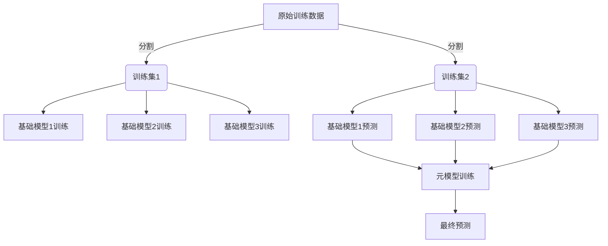

# Python机器学习实战：使用Stacking和Blending集成方法提高模型性能

## 1.背景介绍

在机器学习领域中,单一模型往往难以充分捕捉数据的复杂模式,因此集成学习(Ensemble Learning)应运而生。集成学习通过组合多个基础模型,旨在提高预测性能和泛化能力。其中,Stacking和Blending是两种流行的集成技术,它们通过巧妙地融合多个基础模型的优势,为我们提供了提高模型性能的有力工具。

### 1.1 机器学习中的挑战

机器学习算法在解决实际问题时面临着诸多挑战,例如:

- **数据复杂性**: 真实世界的数据通常具有高维度、噪声、缺失值等特征,增加了建模的难度。
- **模型偏差与方差权衡**: 模型在拟合训练数据和泛化到新数据之间需要平衡偏差(Bias)和方差(Variance)。
- **数据集偏移**: 训练数据和测试数据可能来自不同的分布,导致模型在测试集上表现不佳。

### 1.2 集成学习的优势

集成学习通过组合多个基础模型,可以有效地缓解上述挑战:

- **减小方差**: 由于各个基础模型的差异性,集成可以减小模型的总体方差,提高泛化能力。
- **降低偏差**: 通过组合多个基础模型,集成可以补偿单一模型的偏差,提高模型的准确性。
- **提高鲁棒性**: 集成模型对异常值和噪声数据具有更强的鲁棒性。

### 1.3 Stacking和Blending概述

Stacking和Blending都属于集成学习的一种,但它们在构建集成模型的方式上存在差异:

- **Stacking**: 将多个基础模型的预测结果作为新的特征输入到另一个模型(元模型)中进行训练,元模型的输出即为最终预测结果。
- **Blending**: 直接将多个基础模型的预测结果进行加权平均,得到最终的预测结果。

两种方法都可以有效地融合不同模型的优势,但Stacking通常具有更强的表现力,而Blending则更简单高效。

## 2.核心概念与联系

### 2.1 Stacking

Stacking的核心思想是将多个基础模型的预测结果作为新的特征,输入到另一个模型(元模型)中进行训练。元模型的作用是学习如何最佳地组合基础模型的预测结果,从而获得更准确的最终预测。

Stacking的一般流程如下:

1. 将原始训练数据分割为两部分:训练集1和训练集2。
2. 在训练集1上训练多个基础模型。
3. 使用训练好的基础模型对训练集2进行预测,得到基础模型的预测结果。
4. 将基础模型的预测结果作为新的特征,连同原始特征一起输入到元模型中进行训练。
5. 使用训练好的元模型对测试数据进行预测,得到最终的预测结果。

### 2.2 Blending

Blending的核心思想是将多个基础模型的预测结果进行加权平均,得到最终的预测结果。与Stacking不同,Blending没有引入元模型,而是直接对基础模型的预测结果进行组合。

Blending的一般流程如下:

1. 将原始训练数据分割为训练集和测试集。
2. 在训练集上训练多个基础模型。
3. 使用训练好的基础模型对测试集进行预测,得到基础模型的预测结果。
4. 对基础模型的预测结果进行加权平均,得到最终的预测结果。

Blending的关键在于确定每个基础模型的权重。常见的方法包括:

- **简单平均**: 所有基础模型权重相等。
- **基于验证集的加权**: 根据基础模型在验证集上的表现确定权重。
- **基于元模型的加权**: 使用元模型学习基础模型的权重。

### 2.3 Stacking和Blending的联系

Stacking和Blending都是集成学习的技术,它们的目标是通过组合多个基础模型来提高预测性能。两者的主要区别在于:

- **组合方式**: Stacking使用元模型学习基础模型预测结果的组合方式,而Blending直接对基础模型预测结果进行加权平均。
- **表现力**: 由于引入了元模型,Stacking通常具有更强的表现力,可以学习更复杂的组合方式。但同时,它也需要更多的计算资源和训练时间。
- **简单性**: 相比之下,Blending的实现更加简单高效,但它的表现力受到基础模型权重设置的限制。

在实践中,我们可以根据具体问题的特点和资源约束,选择使用Stacking或Blending。有时也可以将两种方法结合使用,以获得更好的性能。

## 3.核心算法原理具体操作步骤

### 3.1 Stacking算法步骤

Stacking算法的具体步骤如下:

1. **数据分割**: 将原始训练数据分割为两部分:训练集1和训练集2。通常采用K折交叉验证或留一法(Hold-Out)的方式进行分割。

2. **训练基础模型**: 在训练集1上训练多个不同类型的基础模型,例如决策树、支持向量机、神经网络等。

3. **基础模型预测**: 使用训练好的基础模型对训练集2进行预测,得到基础模型的预测结果。对于分类问题,预测结果通常是概率值;对于回归问题,预测结果是实数值。

4. **构建元模型特征**: 将基础模型的预测结果作为新的特征,连同原始特征一起构建元模型的输入特征。

5. **训练元模型**: 使用构建好的特征,在训练集2上训练元模型。元模型可以是任何类型的机器学习模型,如逻辑回归、随机森林或梯度提升树等。

6. **元模型预测**: 使用训练好的元模型对测试数据进行预测,得到最终的预测结果。

需要注意的是,在实际应用中,我们可以尝试不同的基础模型组合和元模型类型,以获得最佳性能。另外,为了避免过拟合,可以在训练元模型时进行正则化或早停等操作。

### 3.2 Blending算法步骤

Blending算法的具体步骤如下:

1. **数据分割**: 将原始训练数据分割为训练集和测试集。通常采用K折交叉验证或留一法(Hold-Out)的方式进行分割。

2. **训练基础模型**: 在训练集上训练多个不同类型的基础模型,例如决策树、支持向量机、神经网络等。

3. **基础模型预测**: 使用训练好的基础模型对测试集进行预测,得到基础模型的预测结果。

4. **确定权重**: 根据预先设定的策略确定每个基础模型的权重。常见的权重确定方法包括:
   - **简单平均**: 所有基础模型权重相等。
   - **基于验证集的加权**: 根据基础模型在验证集上的表现(如准确率、F1分数等)确定权重。
   - **基于元模型的加权**: 使用元模型(如逻辑回归或梯度提升树)学习基础模型的权重。

5. **加权平均**: 对基础模型的预测结果进行加权平均,得到最终的预测结果。

与Stacking相比,Blending算法的步骤更加简单直接。但同时,权重的确定策略也会对最终性能产生较大影响。在实践中,我们可以尝试不同的权重确定方法,并选择表现最佳的方案。

## 4.数学模型和公式详细讲解举例说明

### 4.1 Stacking中的数学模型

在Stacking中,我们可以将元模型视为一个函数 $f$,它将基础模型的预测结果 $\hat{y}_1, \hat{y}_2, \dots, \hat{y}_M$ 和原始特征 $\mathbf{x}$ 映射为最终的预测结果 $\hat{y}$。数学表达式如下:

$$\hat{y} = f(\hat{y}_1, \hat{y}_2, \dots, \hat{y}_M, \mathbf{x})$$

其中, $M$ 是基础模型的数量。

对于分类问题,基础模型的预测结果 $\hat{y}_i$ 通常是一个概率向量,表示样本属于每个类别的概率。而对于回归问题, $\hat{y}_i$ 是一个实数值。

元模型 $f$ 可以是任何机器学习模型,如逻辑回归、决策树或神经网络等。在训练元模型时,我们需要最小化一个损失函数 $L$,例如对于分类问题可以使用交叉熵损失:

$$\min_f \sum_{i=1}^N L(y_i, f(\hat{y}_{i1}, \hat{y}_{i2}, \dots, \hat{y}_{iM}, \mathbf{x}_i))$$

其中, $N$ 是训练样本的数量, $y_i$ 是第 $i$ 个样本的真实标签。

通过优化上述损失函数,我们可以得到一个最优的元模型 $f$,它能够有效地组合基础模型的预测结果,从而提高整体的预测性能。

### 4.2 Blending中的数学模型

在Blending中,我们将基础模型的预测结果 $\hat{y}_1, \hat{y}_2, \dots, \hat{y}_M$ 进行加权平均,得到最终的预测结果 $\hat{y}$。数学表达式如下:

$$\hat{y} = \sum_{i=1}^M w_i \hat{y}_i$$

其中, $w_i$ 是第 $i$ 个基础模型的权重,满足 $\sum_{i=1}^M w_i = 1$。

对于分类问题,我们可以将每个基础模型的预测概率向量进行加权平均,得到最终的预测概率向量。而对于回归问题,我们直接对基础模型的预测实数值进行加权平均。

确定每个基础模型的权重 $w_i$ 是Blending中的关键步骤。常见的权重确定方法包括:

1. **简单平均**: 所有基础模型权重相等,即 $w_i = \frac{1}{M}$。
2. **基于验证集的加权**: 根据基础模型在验证集上的表现(如准确率、F1分数等)确定权重。假设第 $i$ 个基础模型在验证集上的评分为 $s_i$,则权重可以设置为:

$$w_i = \frac{s_i}{\sum_{j=1}^M s_j}$$

3. **基于元模型的加权**: 使用元模型(如逻辑回归或梯度提升树)学习基础模型的权重。假设元模型为 $g$,则权重可以表示为:

$$w_i = g(\hat{y}_{i1}, \hat{y}_{i2}, \dots, \hat{y}_{iM}, \mathbf{x}_i)$$

在训练元模型 $g$ 时,我们需要最小化一个损失函数,例如对于分类问题可以使用交叉熵损失:

$$\min_g \sum_{i=1}^N L\left(y_i, \sum_{j=1}^M g(\hat{y}_{ij}, \hat{y}_{ij2}, \dots, \hat{y}_{ijM},