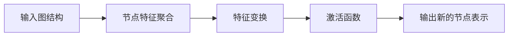
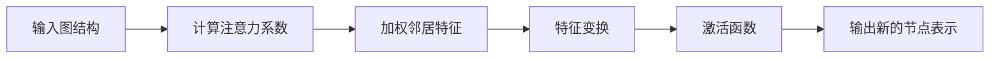

# Python机器学习实战：实战图神经网络(GNN)在社交网络分析中的应用

## 1. 背景介绍
随着社交网络的蓬勃发展，如何从庞大的社交网络数据中提取有价值的信息，成为了数据科学领域的一大挑战。图神经网络（Graph Neural Networks, GNN）作为一种处理图结构数据的强大工具，近年来在社交网络分析中展现出了巨大的潜力。本文将深入探讨GNN在社交网络分析中的应用，从核心概念到实际操作，为读者提供一个全面的视角。

## 2. 核心概念与联系
### 2.1 图神经网络概述
图神经网络是一种专门处理图结构数据的神经网络。与传统的神经网络不同，GNN能够捕捉节点间的复杂关系和依赖性。

### 2.2 社交网络的图表示
社交网络可以被自然地表示为图，其中节点代表个体，边代表个体间的关系，如友谊、关注或者交互。

### 2.3 GNN与社交网络分析的结合
GNN通过更新节点表示来学习社交网络的结构特征，这使得它在社交网络分析中非常有用，例如在社区检测、影响力预测和信息传播等任务中。

## 3. 核心算法原理具体操作步骤
### 3.1 图卷积网络（GCN）
GCN通过将节点的特征和其邻居的特征聚合来更新节点的表示。



### 3.2 图注意力网络（GAT）
GAT引入了注意力机制，允许模型对不同邻居赋予不同的重要性。



## 4. 数学模型和公式详细讲解举例说明
### 4.1 GCN的数学模型
GCN的核心公式可以表示为：
$$ H^{(l+1)} = \sigma(\hat{D}^{-\frac{1}{2}}\hat{A}\hat{D}^{-\frac{1}{2}}H^{(l)}W^{(l)}) $$
其中，$\hat{A} = A + I_N$ 是添加自连接的邻接矩阵，$\hat{D}$ 是$\hat{A}$的度矩阵，$H^{(l)}$ 是第$l$层的节点表示，$W^{(l)}$ 是层的权重矩阵，$\sigma$ 是非线性激活函数。

### 4.2 GAT的数学模型
GAT的注意力机制可以用以下公式表示：
$$ \alpha_{ij} = \frac{\exp(\text{LeakyReLU}(a^T[W h_i || W h_j]))}{\sum_{k \in \mathcal{N}(i)} \exp(\text{LeakyReLU}(a^T[W h_i || W h_k]))} $$
其中，$h_i$ 是节点$i$的特征向量，$W$ 是权重矩阵，$a$ 是注意力机制的权重向量，$||$ 表示拼接操作，$\alpha_{ij}$ 是节点$j$对节点$i$的注意力系数。

## 5. 项目实践：代码实例和详细解释说明
### 5.1 数据准备
首先，我们需要准备社交网络的图数据，包括节点特征和边的信息。

### 5.2 构建GCN模型
使用Python和PyTorch库构建GCN模型，并在社交网络数据上进行训练。

```python
import torch
import torch.nn.functional as F
from torch_geometric.nn import GCNConv

class GCN(torch.nn.Module):
    def __init__(self, num_features, num_classes):
        super(GCN, self).__init__()
        self.conv1 = GCNConv(num_features, 16)
        self.conv2 = GCNConv(16, num_classes)

    def forward(self, data):
        x, edge_index = data.x, data.edge_index

        x = self.conv1(x, edge_index)
        x = F.relu(x)
        x = F.dropout(x, training=self.training)
        x = self.conv2(x, edge_index)

        return F.log_softmax(x, dim=1)
```

### 5.3 训练和评估
训练模型并评估其在社交网络分析任务上的性能。

## 6. 实际应用场景
GNN在社交网络分析中的应用场景包括但不限于：
- 社区检测
- 推荐系统
- 影响力分析
- 信息传播模型

## 7. 工具和资源推荐
- PyTorch Geometric：一个用于图神经网络的PyTorch库。
- DGL：另一个强大的图神经网络框架。
- NetworkX：用于创建、操作复杂网络的Python库。

## 8. 总结：未来发展趋势与挑战
GNN在社交网络分析中展现出巨大潜力，但仍面临着诸如可解释性、扩展性和动态图处理等挑战。未来的研究将致力于解决这些问题，并进一步拓展GNN的应用范围。

## 9. 附录：常见问题与解答
### Q1: GNN如何处理大规模图数据？
### A1: 可以采用图采样、分区技术或者图并行计算框架来处理大规模图数据。

### Q2: GNN的可解释性如何？
### A2: GNN的可解释性是一个活跃的研究领域，目前已有一些方法如GNNExplainer来提高模型的可解释性。

### Q3: 如何选择合适的GNN模型？
### A3: 选择合适的GNN模型需要考虑任务的特点、图的大小和结构等因素。

作者：禅与计算机程序设计艺术 / Zen and the Art of Computer Programming