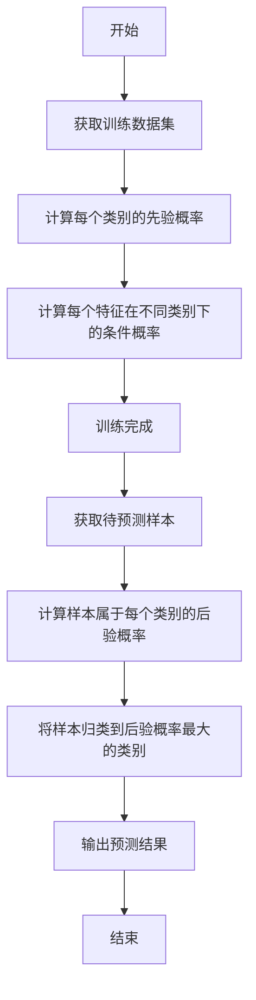

# Python机器学习实战：朴素贝叶斯分类器的原理与实践

## 1.背景介绍

### 1.1 机器学习概述

机器学习是人工智能领域的一个重要分支,旨在使计算机系统能够从数据中自动学习,并对新数据做出预测或决策。随着大数据时代的到来,海量数据的积累为机器学习提供了广阔的应用空间。机器学习已经广泛应用于图像识别、自然语言处理、推荐系统、金融预测等诸多领域。

### 1.2 分类问题与朴素贝叶斯分类器

在机器学习中,分类是一种常见的任务,旨在根据输入数据的特征将其归类到预定义的类别中。分类问题可以分为二分类(binary classification)和多分类(multi-class classification)两种情况。

朴素贝叶斯分类器(Naive Bayes Classifier)是一种基于贝叶斯定理与特征条件独立假设的简单而有效的概率分类算法。尽管其"朴素"的假设在实际情况中难以完全满足,但由于其计算简单、训练快速等优点,朴素贝叶斯分类器在文本分类、垃圾邮件过滤、个人化推荐等领域得到了广泛应用。

## 2.核心概念与联系

### 2.1 贝叶斯定理

贝叶斯定理是朴素贝叶斯分类器的理论基础,用于计算后验概率。贝叶斯定理的数学表达式如下:

$$P(A|B) = \frac{P(B|A)P(A)}{P(B)}$$

其中:
- $P(A|B)$ 表示在已知事件 B 发生的情况下,事件 A 发生的条件概率(后验概率)
- $P(B|A)$ 表示在已知事件 A 发生的情况下,事件 B 发生的条件概率
- $P(A)$ 表示事件 A 的先验概率
- $P(B)$ 表示事件 B 的边缘概率

在分类问题中,我们需要计算某个样本属于每个类别的后验概率,并将其归类到后验概率最大的类别。

### 2.2 特征条件独立性假设

朴素贝叶斯分类器的"朴素"之处在于,它假设每个特征与其他特征都是条件独立的。也就是说,给定类别,每个特征的出现与其他特征无关。这个假设虽然在实际情况中很难完全满足,但它极大地简化了计算,使得朴素贝叶斯分类器具有高效的计算性能。

### 2.3 先验概率与后验概率

在贝叶斯定理中,先验概率 $P(A)$ 表示事件 A 发生的初始概率,而后验概率 $P(A|B)$ 表示在已知事件 B 发生的情况下,事件 A 发生的概率。

在分类问题中,先验概率通常是基于训练数据集中各个类别的比例来估计的。后验概率则是我们需要计算的目标,即某个样本属于每个类别的概率。通过比较各个类别的后验概率,我们可以将样本归类到概率最大的类别中。

## 3.核心算法原理具体操作步骤

朴素贝叶斯分类器的核心算法原理包括两个阶段:训练阶段和预测阶段。

### 3.1 训练阶段

在训练阶段,我们需要从训练数据集中估计出各个类别的先验概率,以及每个特征在不同类别下的条件概率。具体步骤如下:

1. 计算每个类别的先验概率:
   $$P(c_k) = \frac{N_k}{N}$$
   其中 $N_k$ 表示属于类别 $c_k$ 的样本数量, $N$ 表示总样本数量。

2. 计算每个特征在不同类别下的条件概率:
   $$P(x_i|c_k) = \frac{N_{x_i,c_k} + \alpha}{N_k + \alpha n}$$
   其中 $N_{x_i,c_k}$ 表示在类别 $c_k$ 下出现特征 $x_i$ 的样本数量, $\alpha$ 是一个平滑参数(通常取值为1),用于避免概率为0的情况, $n$ 是特征的取值个数。

### 3.2 预测阶段

在预测阶段,我们需要计算给定样本属于每个类别的后验概率,并将其归类到概率最大的类别中。具体步骤如下:

1. 对于每个类别 $c_k$,计算给定样本 $x$ 属于该类别的后验概率:
   $$P(c_k|x) = P(c_k)\prod_{i=1}^{n}P(x_i|c_k)$$
   其中 $P(c_k)$ 是类别 $c_k$ 的先验概率, $P(x_i|c_k)$ 是特征 $x_i$ 在类别 $c_k$ 下的条件概率。

2. 将样本 $x$ 归类到后验概率最大的类别:
   $$\hat{c} = \arg\max_{c_k} P(c_k|x)$$

### 3.3 算法流程图

下面是朴素贝叶斯分类器算法的流程图:



## 4.数学模型和公式详细讲解举例说明

### 4.1 朴素贝叶斯分类器的数学模型

在朴素贝叶斯分类器中,我们需要计算给定样本 $x$ 属于每个类别 $c_k$ 的后验概率 $P(c_k|x)$,并将其归类到概率最大的类别。根据贝叶斯定理,我们有:

$$P(c_k|x) = \frac{P(x|c_k)P(c_k)}{P(x)}$$

由于分母 $P(x)$ 对于所有类别是相同的,因此我们可以忽略它,只需要比较 $P(x|c_k)P(c_k)$ 的值即可。

根据特征条件独立性假设,我们可以将 $P(x|c_k)$ 展开为:

$$P(x|c_k) = \prod_{i=1}^{n}P(x_i|c_k)$$

其中 $x_i$ 表示样本 $x$ 的第 $i$ 个特征,共有 $n$ 个特征。

将上述公式代入,我们得到:

$$P(c_k|x) \propto P(c_k)\prod_{i=1}^{n}P(x_i|c_k)$$

因此,我们只需要计算每个类别的先验概率 $P(c_k)$ 和每个特征在不同类别下的条件概率 $P(x_i|c_k)$,就可以得到后验概率 $P(c_k|x)$。

### 4.2 条件概率估计

在实际应用中,我们需要从训练数据集中估计出每个特征在不同类别下的条件概率 $P(x_i|c_k)$。一种常见的方法是使用加法平滑(Additive Smoothing),也称为拉普拉斯平滑(Laplace Smoothing)。

具体来说,我们使用以下公式估计条件概率:

$$P(x_i|c_k) = \frac{N_{x_i,c_k} + \alpha}{N_k + \alpha n}$$

其中:
- $N_{x_i,c_k}$ 表示在类别 $c_k$ 下出现特征 $x_i$ 的样本数量
- $N_k$ 表示属于类别 $c_k$ 的总样本数量
- $\alpha$ 是一个平滑参数,通常取值为1
- $n$ 是特征的取值个数

加法平滑的目的是避免概率为0的情况,因为在有限的训练数据集中,可能存在某些特征在某个类别下从未出现过。如果将概率直接估计为0,会导致整个后验概率为0,从而无法进行正确分类。

### 4.3 实例说明

假设我们有一个文本分类问题,需要将一封电子邮件分类为"垃圾邮件"或"正常邮件"。我们将电子邮件中的单词作为特征,并使用朴素贝叶斯分类器进行分类。

假设训练数据集中有以下数据:

- 总样本数量: 1000
- 正常邮件数量: 800
- 垃圾邮件数量: 200
- 在正常邮件中,单词"免费"出现的次数: 100
- 在垃圾邮件中,单词"免费"出现的次数: 150
- 特征的取值个数(词典大小): 10000

我们可以计算出:

1. 正常邮件的先验概率:
   $$P(c_1) = \frac{800}{1000} = 0.8$$

2. 垃圾邮件的先验概率:
   $$P(c_2) = \frac{200}{1000} = 0.2$$

3. 在正常邮件中,单词"免费"的条件概率:
   $$P(\text{"免费"}|c_1) = \frac{100 + 1}{800 + 1 \times 10000} \approx 0.0125$$

4. 在垃圾邮件中,单词"免费"的条件概率:
   $$P(\text{"免费"}|c_2) = \frac{150 + 1}{200 + 1 \times 10000} \approx 0.075$$

现在,假设我们有一封新的电子邮件,其中包含单词"免费"。我们可以计算该邮件属于正常邮件和垃圾邮件的后验概率:

$$\begin{aligned}
P(c_1|\text{"免费"}) &\propto P(c_1)P(\text{"免费"}|c_1) \\
                     &= 0.8 \times 0.0125 \\
                     &= 0.01
\end{aligned}$$

$$\begin{aligned}
P(c_2|\text{"免费"}) &\propto P(c_2)P(\text{"免费"}|c_2) \\
                     &= 0.2 \times 0.075 \\
                     &= 0.015
\end{aligned}$$

由于 $P(c_2|\text{"免费"}) > P(c_1|\text{"免费"})$,因此我们将该邮件分类为垃圾邮件。

## 5.项目实践：代码实例和详细解释说明

在Python中,我们可以使用scikit-learn库中的`naive_bayes`模块来实现朴素贝叶斯分类器。下面是一个使用朴素贝叶斯分类器进行文本分类的示例代码:

```python
from sklearn.datasets import fetch_20newsgroups
from sklearn.naive_bayes import MultinomialNB
from sklearn.feature_extraction.text import CountVectorizer
from sklearn.metrics import accuracy_score

# 加载数据集
newsgroups_train = fetch_20newsgroups(subset='train')
newsgroups_test = fetch_20newsgroups(subset='test')

# 特征提取
vectorizer = CountVectorizer()
X_train = vectorizer.fit_transform(newsgroups_train.data)
X_test = vectorizer.transform(newsgroups_test.data)

# 创建朴素贝叶斯分类器
clf = MultinomialNB()

# 训练模型
clf.fit(X_train, newsgroups_train.target)

# 预测
y_pred = clf.predict(X_test)

# 评估模型
accuracy = accuracy_score(newsgroups_test.target, y_pred)
print(f"准确率: {accuracy:.2f}")
```

代码解释:

1. 首先,我们从scikit-learn库中加载了20个新闻组的文本数据集,并将其分为训练集和测试集。

2. 然后,我们使用`CountVectorizer`将文本数据转换为特征向量。`CountVectorizer`会统计每个文本中每个单词的出现次数作为特征。

3. 接下来,我们创建一个`MultinomialNB`对象,它是scikit-learn库中实现的朴素贝叶斯分类器。

4. 我们使用`fit`方法在训练集上训练分类器模型。在训练过程中,模型会估计出每个类别的先验概率和每个特征在不同类别下的条件概率。

5. 训练完成后,我们使用`predict`方法在测试集上进行预测,得到每个样本的预测类别。

6. 最后,我们使用`accuracy_score`函数计算模