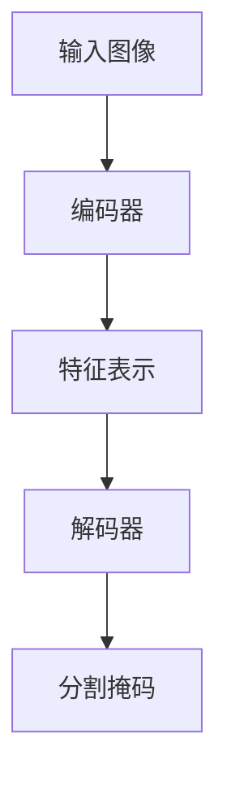

# Python深度学习实践：基于深度学习的语义分割技术

## 1.背景介绍

语义分割是计算机视觉和深度学习领域的一个重要任务,旨在将图像中的每个像素分配到预定义的类别中。与传统的图像分类和目标检测任务不同,语义分割需要对图像进行像素级别的精细分析和预测。它在许多实际应用中发挥着关键作用,例如自动驾驶汽车、医疗影像分析、机器人视觉等。

随着深度学习技术的不断发展,基于深度神经网络的语义分割模型已经取得了令人瞩目的成就。这些模型能够从大量标注数据中自动学习特征表示,并对复杂场景中的对象进行精确分割。与传统的基于手工设计特征的方法相比,深度学习模型展现出更强大的泛化能力和鲁棒性。

本文将深入探讨Python中基于深度学习的语义分割技术,包括核心概念、算法原理、数学模型、代码实现、应用场景等多个方面。我们将介绍目前主流的语义分割模型架构,并通过实例代码展示如何使用Python生态系统中的深度学习框架(如PyTorch、TensorFlow等)来构建和训练这些模型。

## 2.核心概念与联系

在深入探讨语义分割技术之前,我们需要了解一些核心概念及其相互关系:

### 2.1 卷积神经网络(CNN)

卷积神经网络是深度学习中最成功的模型之一,在计算机视觉任务中发挥着关键作用。CNN由多个卷积层、池化层和全连接层组成,能够自动从原始图像数据中学习层次化的特征表示。语义分割模型通常以CNN作为主干网络,利用其强大的特征提取能力。

### 2.2 编码器-解码器架构

编码器-解码器架构是语义分割模型中常见的设计模式。编码器部分类似于普通的CNN分类网络,用于从输入图像中提取特征表示。解码器部分则负责将编码器的特征映射回原始图像分辨率,并为每个像素预测相应的类别。通过这种方式,模型可以生成与输入图像分辨率相同的分割掩码。



### 2.3 上采样和像素分类

在解码器部分,需要将低分辨率的特征图恢复到原始图像分辨率。常见的技术包括上采样(Upsampling)和像素分类(Pixel Classification)。上采样通过插值等方式增加特征图的空间维度,而像素分类则直接对每个像素进行分类预测。两种方式各有优缺点,需要根据具体情况选择合适的策略。

### 2.4 损失函数

语义分割任务通常采用像素级别的损失函数,如交叉熵损失、Dice损失等。这些损失函数能够量化预测结果与真实标签之间的差异,并在训练过程中最小化这种差异。由于语义分割是一个像素级别的密集预测任务,损失函数的选择对模型性能有着重要影响。

## 3.核心算法原理具体操作步骤

语义分割算法的核心原理可以概括为以下几个步骤:

1. **数据预处理**:首先需要对输入图像和ground truth标签进行适当的预处理,如归一化、数据增强等,以提高模型的泛化能力。

2. **特征提取**:将预处理后的图像输入到编码器网络中,通过一系列卷积、池化等操作提取多尺度特征表示。

3. **特征融合**:在某些模型中,会采用特征金字塔网络(FPN)或注意力机制等方式,融合不同尺度的特征信息,以获得更加丰富的特征表示。

4. **上采样/像素分类**:将编码器输出的低分辨率特征图输入到解码器网络中,通过上采样或像素分类操作恢复到原始图像分辨率,并为每个像素预测相应的类别。

5. **损失计算**:将模型预测的分割结果与ground truth标签进行比较,计算像素级别的损失函数值,如交叉熵损失或Dice损失等。

6. **反向传播**:根据损失函数值,利用反向传播算法计算模型参数的梯度,并使用优化器(如SGD、Adam等)更新模型参数。

7. **模型评估**:在验证集或测试集上评估模型的分割性能,通常使用指标如平均IoU(mIoU)、像素准确率(Pixel Accuracy)等。

8. **模型调整**:根据评估结果,可以调整模型架构、超参数、损失函数等,以进一步提高模型性能。

上述步骤通常需要在训练数据集上反复迭代多个epochs,直到模型收敛或达到预期性能。

## 4.数学模型和公式详细讲解举例说明

在语义分割任务中,常见的数学模型和公式包括:

### 4.1 交叉熵损失函数

交叉熵损失函数是语义分割中最常用的损失函数之一,它衡量了预测概率分布与真实标签分布之间的差异。对于二分类问题,交叉熵损失函数可以表示为:

$$
L = -\frac{1}{N}\sum_{i=1}^{N}[y_i\log(p_i) + (1-y_i)\log(1-p_i)]
$$

其中,N是像素数量,$y_i$是第i个像素的真实标签(0或1),$p_i$是模型预测的第i个像素属于正类的概率。

对于多分类问题,交叉熵损失函数可以扩展为:

$$
L = -\frac{1}{N}\sum_{i=1}^{N}\sum_{c=1}^{C}y_{ic}\log(p_{ic})
$$

其中,C是类别数量,$y_{ic}$是第i个像素属于第c类的真实标签(0或1),$p_{ic}$是模型预测的第i个像素属于第c类的概率。

### 4.2 Dice损失函数

Dice损失函数是另一种常用的语义分割损失函数,它基于Dice系数,衡量预测掩码与真实掩码之间的重合程度。对于二分类问题,Dice损失函数可以表示为:

$$
L_{dice} = 1 - \frac{2\sum_{i=1}^{N}p_iy_i}{\sum_{i=1}^{N}p_i + \sum_{i=1}^{N}y_i}
$$

其中,N是像素数量,$p_i$是第i个像素属于正类的预测概率,$y_i$是第i个像素的真实标签(0或1)。

对于多分类问题,Dice损失函数可以扩展为:

$$
L_{dice} = 1 - \frac{2\sum_{c=1}^{C}\sum_{i=1}^{N}p_{ic}y_{ic}}{\sum_{c=1}^{C}\sum_{i=1}^{N}p_{ic} + \sum_{c=1}^{C}\sum_{i=1}^{N}y_{ic}}
$$

其中,C是类别数量,$p_{ic}$是第i个像素属于第c类的预测概率,$y_{ic}$是第i个像素属于第c类的真实标签(0或1)。

### 4.3 IoU(交并比)

IoU(Intersection over Union)是评估语义分割模型性能的常用指标之一,它衡量预测掩码与真实掩码之间的重合程度。对于二分类问题,IoU可以表示为:

$$
IoU = \frac{\sum_{i=1}^{N}p_iy_i}{\sum_{i=1}^{N}p_i + \sum_{i=1}^{N}y_i - \sum_{i=1}^{N}p_iy_i}
$$

其中,N是像素数量,$p_i$是第i个像素属于正类的预测概率,$y_i$是第i个像素的真实标签(0或1)。

对于多分类问题,IoU可以计算为每个类别的IoU的平均值,即mIoU(mean Intersection over Union):

$$
mIoU = \frac{1}{C}\sum_{c=1}^{C}\frac{\sum_{i=1}^{N}p_{ic}y_{ic}}{\sum_{i=1}^{N}p_{ic} + \sum_{i=1}^{N}y_{ic} - \sum_{i=1}^{N}p_{ic}y_{ic}}
$$

其中,C是类别数量,$p_{ic}$是第i个像素属于第c类的预测概率,$y_{ic}$是第i个像素属于第c类的真实标签(0或1)。

## 5.项目实践:代码实例和详细解释说明

在本节中,我们将使用PyTorch框架,构建一个基于U-Net的语义分割模型,并在COCO数据集上进行训练和评估。

### 5.1 数据准备

首先,我们需要准备COCO数据集,并将其划分为训练集、验证集和测试集。COCO数据集包含了丰富的图像和对应的语义分割标签。

```python
import torchvision.transforms as transforms
from torchvision.datasets import CocoDetection

# 定义数据转换
transform = transforms.Compose([
    transforms.ToTensor(),
    transforms.Normalize(mean=[0.485, 0.456, 0.406], std=[0.229, 0.224, 0.225])
])

# 加载COCO数据集
train_dataset = CocoDetection(root='path/to/coco', image_set='train', transform=transform)
val_dataset = CocoDetection(root='path/to/coco', image_set='val', transform=transform)
test_dataset = CocoDetection(root='path/to/coco', image_set='test', transform=transform)
```

### 5.2 U-Net模型架构

U-Net是一种广泛应用于语义分割任务的编码器-解码器架构模型。它利用跳跃连接(Skip Connections)将编码器的特征直接传递到解码器,以保留空间信息和细节特征。

```python
import torch
import torch.nn as nn

class UNet(nn.Module):
    def __init__(self, num_classes):
        super(UNet, self).__init__()
        
        # 编码器部分
        self.encoder = nn.ModuleList([
            DoubleConv(3, 64),
            DoubleConv(64, 128),
            DoubleConv(128, 256),
            DoubleConv(256, 512),
            DoubleConv(512, 1024)
        ])
        
        # 解码器部分
        self.decoder = nn.ModuleList([
            UpConv(1024, 512),
            UpConv(512, 256),
            UpConv(256, 128),
            UpConv(128, 64)
        ])
        
        # 最终输出层
        self.final = nn.Conv2d(64, num_classes, kernel_size=1)
        
    def forward(self, x):
        # 编码器部分
        encoder_outputs = []
        for module in self.encoder:
            x = module(x)
            encoder_outputs.append(x)
        
        # 解码器部分
        for i, module in enumerate(self.decoder):
            x = module(x, encoder_outputs[-i-2])
        
        # 最终输出
        x = self.final(x)
        
        return x
```

在上述代码中,我们定义了U-Net模型的编码器和解码器部分。编码器由多个`DoubleConv`模块组成,每个模块包含两个卷积层和一个最大池化层。解码器由多个`UpConv`模块组成,每个模块包含一个上采样层、一个跳跃连接和两个卷积层。最终输出层使用一个1x1卷积层,将特征图映射到所需的类别数量。

### 5.3 模型训练

接下来,我们定义训练函数,并使用PyTorch的数据加载器和优化器进行模型训练。

```python
import torch.optim as optim
from tqdm import tqdm

def train_model(model, train_loader, val_loader, num_epochs, optimizer, loss_fn, device):
    best_iou = 0
    for epoch in range(num_epochs):
        model.train()
        train_loss = 0
        for images, targets in tqdm(train_loader):
            images = images.to(device)
            targets = targets.to(device)
            
            optimizer.zero_grad()
            outputs = model(images)
            loss = loss_fn(outputs, targets)
            loss.backward()
            optimizer.step()
            
            train_loss += loss.item()
        
        # 在验证集上评估模型
        val_iou = evaluate_model(model, val_loader, device)
        
        # 保存最佳模型
        if val_iou > best_iou:
            best_iou = val_iou
            torch.save(model.state_dict(), 'best_model.pth')
        
        print(f'Epoch [{epoch+1}/{num_epochs}], Train Loss: {train_loss/len(train