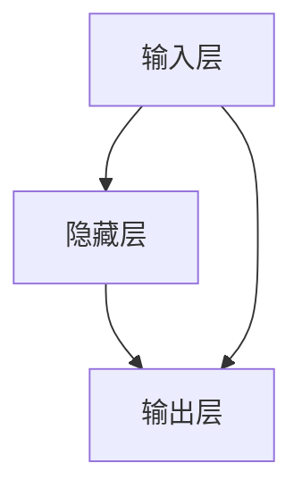
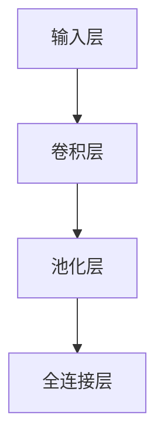
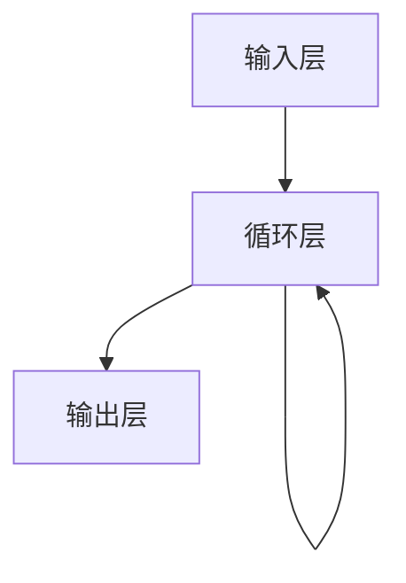

## 1. 背景介绍

社交网络已经成为人们日常生活中不可或缺的一部分，人们在社交网络上分享自己的生活、交流思想、建立社交关系等。社交网络中蕴含着大量的信息，如何从这些信息中挖掘出有价值的知识，对于个人和企业都具有重要的意义。深度学习作为一种强大的机器学习技术，已经在社交网络分析中得到了广泛的应用。本文将介绍深度学习在社交网络分析中的应用，并提供实际的代码实例和详细的解释说明。

## 2. 核心概念与联系

### 2.1 社交网络

社交网络是指由一组个体和它们之间的关系组成的网络结构。在社交网络中，个体可以是人、组织、物品等，它们之间的关系可以是朋友、家庭、工作、兴趣等。社交网络中的个体和关系可以用图来表示，其中个体表示为节点，关系表示为边。

### 2.2 深度学习

深度学习是一种机器学习技术，它模仿人脑神经网络的结构和工作原理，通过多层神经网络来学习数据的特征表示和分类。深度学习在图像识别、语音识别、自然语言处理等领域取得了很大的成功。

### 2.3 社交网络分析

社交网络分析是指对社交网络中的个体和关系进行分析和挖掘，以发现其中的模式和规律。社交网络分析可以用于社交网络推荐、社交网络营销、社交网络安全等领域。

### 2.4 深度学习在社交网络分析中的应用

深度学习在社交网络分析中的应用主要包括社交网络表示学习、社交网络分类、社交网络推荐等方面。其中，社交网络表示学习是指将社交网络中的节点表示为低维向量，以便于后续的分析和挖掘。

## 3. 核心算法原理具体操作步骤

### 3.1 社交网络表示学习

社交网络表示学习是指将社交网络中的节点表示为低维向量，以便于后续的分析和挖掘。社交网络表示学习可以通过深度学习中的自编码器、卷积神经网络、循环神经网络等方法来实现。

#### 3.1.1 自编码器

自编码器是一种无监督学习方法，它可以将高维数据压缩成低维数据，并且能够还原原始数据。在社交网络表示学习中，自编码器可以将社交网络中的节点表示为低维向量。

自编码器的基本结构如下图所示：



其中，输入层和输出层的节点数相同，隐藏层的节点数比输入层和输出层的节点数少。自编码器的训练过程是将输入层的数据通过隐藏层映射到输出层，然后将输出层的数据与输入层的数据进行比较，通过反向传播算法来更新自编码器的参数。

#### 3.1.2 卷积神经网络

卷积神经网络是一种用于图像处理和语音识别等领域的深度学习方法。在社交网络表示学习中，卷积神经网络可以将社交网络中的节点表示为低维向量。

卷积神经网络的基本结构如下图所示：



其中，输入层的数据通过卷积层和池化层进行特征提取，然后通过全连接层将特征映射到低维向量。卷积神经网络的训练过程是通过反向传播算法来更新网络的参数。

#### 3.1.3 循环神经网络

循环神经网络是一种用于序列数据处理的深度学习方法。在社交网络表示学习中，循环神经网络可以将社交网络中的节点表示为低维向量。

循环神经网络的基本结构如下图所示：



其中，输入层的数据通过循环层进行特征提取，然后通过输出层将特征映射到低维向量。循环神经网络的训练过程是通过反向传播算法来更新网络的参数。

### 3.2 社交网络分类

社交网络分类是指将社交网络中的节点进行分类，以便于后续的分析和挖掘。社交网络分类可以通过深度学习中的卷积神经网络、循环神经网络等方法来实现。

#### 3.2.1 卷积神经网络

卷积神经网络可以通过对社交网络中的节点进行特征提取，然后将特征映射到不同的类别中。卷积神经网络的训练过程是通过反向传播算法来更新网络的参数。

#### 3.2.2 循环神经网络

循环神经网络可以通过对社交网络中的节点进行序列建模，然后将序列映射到不同的类别中。循环神经网络的训练过程是通过反向传播算法来更新网络的参数。

### 3.3 社交网络推荐

社交网络推荐是指根据用户的兴趣和行为，向用户推荐感兴趣的内容或者其他用户。社交网络推荐可以通过深度学习中的协同过滤、深度神经网络等方法来实现。

#### 3.3.1 协同过滤

协同过滤是一种基于用户行为的推荐方法，它通过分析用户的历史行为来推荐感兴趣的内容或者其他用户。在社交网络中，协同过滤可以通过分析用户之间的关系来推荐其他用户。

#### 3.3.2 深度神经网络

深度神经网络可以通过对用户的历史行为进行建模，然后将用户的兴趣和行为映射到低维向量中。深度神经网络的训练过程是通过反向传播算法来更新网络的参数。

## 4. 数学模型和公式详细讲解举例说明

### 4.1 自编码器

自编码器的损失函数可以表示为：

$$
L(x, \hat{x}) = \frac{1}{2}||x - \hat{x}||^2
$$

其中，$x$表示输入数据，$\hat{x}$表示自编码器的输出数据。

自编码器的反向传播算法可以表示为：

$$
\frac{\partial L}{\partial w} = \frac{\partial L}{\partial \hat{x}} \frac{\partial \hat{x}}{\partial h} \frac{\partial h}{\partial w}
$$

其中，$w$表示自编码器的参数，$h$表示隐藏层的输出。

### 4.2 卷积神经网络

卷积神经网络的损失函数可以表示为：

$$
L(y, \hat{y}) = -\frac{1}{N}\sum_{i=1}^N\sum_{j=1}^M y_{ij} \log \hat{y}_{ij}
$$

其中，$y$表示真实标签，$\hat{y}$表示卷积神经网络的输出。

卷积神经网络的反向传播算法可以表示为：

$$
\frac{\partial L}{\partial w} = \frac{\partial L}{\partial \hat{y}} \frac{\partial \hat{y}}{\partial z} \frac{\partial z}{\partial w}
$$

其中，$w$表示卷积神经网络的参数，$z$表示卷积神经网络的输入。

### 4.3 循环神经网络

循环神经网络的损失函数可以表示为：

$$
L(y, \hat{y}) = -\frac{1}{N}\sum_{i=1}^N\sum_{j=1}^M y_{ij} \log \hat{y}_{ij}
$$

其中，$y$表示真实标签，$\hat{y}$表示循环神经网络的输出。

循环神经网络的反向传播算法可以表示为：

$$
\frac{\partial L}{\partial w} = \frac{\partial L}{\partial \hat{y}} \frac{\partial \hat{y}}{\partial h} \frac{\partial h}{\partial w}
$$

其中，$w$表示循环神经网络的参数，$h$表示循环神经网络的隐藏状态。

## 5. 项目实践：代码实例和详细解释说明

### 5.1 社交网络表示学习

社交网络表示学习可以通过深度学习中的自编码器、卷积神经网络、循环神经网络等方法来实现。下面以自编码器为例，介绍如何使用深度学习进行社交网络表示学习。

```python
import numpy as np
import tensorflow as tf

class Autoencoder:
    def __init__(self, input_dim, hidden_dim, learning_rate):
        self.input_dim = input_dim
        self.hidden_dim = hidden_dim
        self.learning_rate = learning_rate
        
        self.inputs = tf.placeholder(tf.float32, [None, input_dim])
        self.weights = {
            'encoder': tf.Variable(tf.random_normal([input_dim, hidden_dim])),
            'decoder': tf.Variable(tf.random_normal([hidden_dim, input_dim]))
        }
        self.biases = {
            'encoder': tf.Variable(tf.random_normal([hidden_dim])),
            'decoder': tf.Variable(tf.random_normal([input_dim]))
        }
        
        self.encoder = tf.nn.sigmoid(tf.add(tf.matmul(self.inputs, self.weights['encoder']), self.biases['encoder']))
        self.decoder = tf.nn.sigmoid(tf.add(tf.matmul(self.encoder, self.weights['decoder']), self.biases['decoder']))
        
        self.loss = tf.reduce_mean(tf.pow(self.inputs - self.decoder, 2))
        self.optimizer = tf.train.AdamOptimizer(self.learning_rate).minimize(self.loss)
        
        self.sess = tf.Session()
        self.sess.run(tf.global_variables_initializer())
        
    def fit(self, X, epochs, batch_size):
        for epoch in range(epochs):
            np.random.shuffle(X)
            total_loss = 0
            for i in range(0, len(X), batch_size):
                batch = X[i:i+batch_size]
                _, loss = self.sess.run([self.optimizer, self.loss], feed_dict={self.inputs: batch})
                total_loss += loss
            print('Epoch %d, loss %.4f' % (epoch+1, total_loss/len(X)))
            
    def transform(self, X):
        return self.sess.run(self.encoder, feed_dict={self.inputs: X})
```

上述代码实现了一个自编码器，其中`input_dim`表示输入数据的维度，`hidden_dim`表示隐藏层的维度，`learning_rate`表示学习率。在`fit`方法中，使用随机梯度下降算法来训练自编码器，其中`X`表示输入数据，`epochs`表示训练轮数，`batch_size`表示每个批次的大小。在`transform`方法中，使用训练好的自编码器将输入数据转换为低维向量。

### 5.2 社交网络分类

社交网络分类可以通过深度学习中的卷积神经网络、循环神经网络等方法来实现。下面以卷积神经网络为例，介绍如何使用深度学习进行社交网络分类。

```python
import numpy as np
import tensorflow as tf

class ConvNet:
    def __init__(self, input_shape, num_classes, learning_rate):
        self.input_shape = input_shape
        self.num_classes = num_classes
        self.learning_rate = learning_rate
        
        self.inputs = tf.placeholder(tf.float32, [None] + input_shape)
        self.labels = tf.placeholder(tf.float32, [None, num_classes])
        
        self.conv1 = tf.layers.conv2d(inputs=self.inputs, filters=32, kernel_size=[3, 3], padding='same', activation=tf.nn.relu)
        self.pool1 = tf.layers.max_pooling2d(inputs=self.conv1, pool_size=[2, 2], strides=2)
        self.conv2 = tf.layers.conv2d(inputs=self.pool1, filters=64, kernel_size=[3, 3], padding='same', activation=tf.nn.relu)
        self.pool2 = tf.layers.max_pooling2d(inputs=self.conv2, pool_size=[2, 2], strides=2)
        self.flatten = tf.layers.flatten(inputs=self.pool2)
        self.fc1 = tf.layers.dense(inputs=self.flatten, units=128, activation=tf.nn.relu)
        self.fc2 = tf.layers.dense(inputs=self.fc1, units=num_classes)
        
        self.loss = tf.reduce_mean(tf.nn.softmax_cross_entropy_with_logits_v2(logits=self.fc2, labels=self.labels))
        self.optimizer = tf.train.AdamOptimizer(self.learning_rate).minimize(self.loss)
        
        self.sess = tf.Session()
        self.sess.run(tf.global_variables_initializer())
        
    def fit(self, X, y, epochs, batch_size):
        for epoch in range(epochs):
            indices = np.random.permutation(len(X))
            X = X[indices]
            y = y[indices]
            total_loss = 0
            for i in range(0, len(X), batch_size):
                batch_X = X[i:i+batch_size]
                batch_y = y[i:i+batch_size]
                _, loss = self.sess.run([self.optimizer, self.loss], feed_dict={self.inputs: batch_X, self.labels: batch_y})
                total_loss += loss
            print('Epoch %d, loss %.4f' % (epoch+1, total_loss/len(X)))
            
    def predict(self, X):
        return self.sess.run(tf.argmax(self.fc2, axis=1), feed_dict={self.inputs: X})
```

上述代码实现了一个卷积神经网络，其中`input_shape`表示输入数据的形状，`num_classes`表示类别数，`learning_rate`表示学习率。在`fit`方法中，使用随机梯度下降算法来训练卷积神经网络，其中`X`表示输入数据，`y`表示标签，`epochs`表示训练轮数，`batch_size`表示每个批次的大小。在`predict`方法中，使用训练好的卷积神经网络对输入数据进行分类。

### 5.3 社交网络推荐

社交网络推荐可以通过深度学习中的协同过滤、深度神经网络等方法来实现。下面以协同过滤为例，介绍如何使用深度学习进行社交网络推荐。

```python
import numpy as np
import tensorflow as tf

class CollaborativeFiltering:
    def __init__(self, num_users, num_items, hidden_dim, learning_rate):
        self.num_users = num_users
        self.num_items = num_items
        self.hidden_dim = hidden_dim
        self.learning_rate = learning_rate
        
        self.user_inputs = tf.placeholder(tf.int32, [None])
        self.item_inputs = tf.placeholder(tf.int