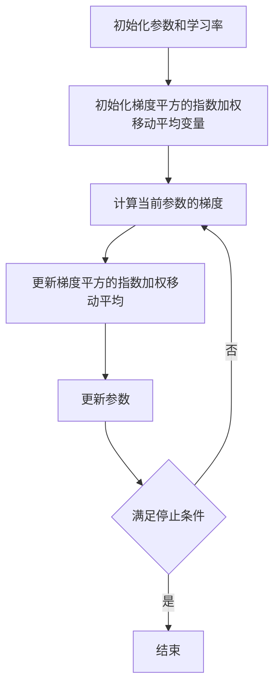

# RMSprop简介:了解RMSprop算法的起源和发展

## 1.背景介绍

在机器学习和深度学习领域，优化算法是训练模型的关键。优化算法的选择直接影响模型的收敛速度和最终性能。传统的梯度下降算法虽然简单易懂，但在实际应用中存在许多问题，如学习率难以调节、容易陷入局部最优等。为了解决这些问题，研究人员提出了多种改进算法，其中RMSprop（Root Mean Square Propagation）是一个非常重要的算法。

RMSprop由Geoffrey Hinton在其Coursera课程中首次提出，旨在解决梯度下降算法在处理非平稳目标函数时的效率问题。RMSprop通过引入指数加权移动平均来调整学习率，从而在训练过程中更好地适应不同的梯度变化。

## 2.核心概念与联系

### 2.1 梯度下降算法

梯度下降算法是优化问题中最基本的方法之一。其核心思想是通过计算损失函数相对于模型参数的梯度，沿着梯度的反方向更新参数，以最小化损失函数。

### 2.2 学习率

学习率是梯度下降算法中的一个重要超参数，决定了每次参数更新的步长。学习率过大可能导致训练过程不稳定，学习率过小则可能导致收敛速度过慢。

### 2.3 自适应学习率

自适应学习率算法通过动态调整学习率，使得在训练过程中能够更好地适应不同的梯度变化。RMSprop就是一种自适应学习率算法。

### 2.4 RMSprop的核心思想

RMSprop的核心思想是通过引入指数加权移动平均来调整每个参数的学习率，从而在训练过程中更好地适应不同的梯度变化。具体来说，RMSprop通过计算梯度平方的指数加权移动平均来调整每个参数的学习率。

## 3.核心算法原理具体操作步骤

RMSprop算法的具体操作步骤如下：

1. 初始化参数 $\theta$ 和学习率 $\alpha$。
2. 初始化梯度平方的指数加权移动平均变量 $E[g^2]$，通常初始值为0。
3. 对于每个迭代步骤：
   1. 计算当前参数的梯度 $g_t$。
   2. 更新梯度平方的指数加权移动平均：
      $$
      E[g^2]_t = \beta E[g^2]_{t-1} + (1 - \beta) g_t^2
      $$
   3. 更新参数：
      $$
      \theta_{t+1} = \theta_t - \frac{\alpha}{\sqrt{E[g^2]_t + \epsilon}} g_t
      $$
   4. 重复步骤3，直到满足停止条件。

以下是RMSprop算法的Mermaid流程图：



## 4.数学模型和公式详细讲解举例说明

### 4.1 梯度平方的指数加权移动平均

RMSprop通过计算梯度平方的指数加权移动平均来调整每个参数的学习率。具体公式如下：

$$
E[g^2]_t = \beta E[g^2]_{t-1} + (1 - \beta) g_t^2
$$

其中，$E[g^2]_t$ 表示第 $t$ 次迭代时梯度平方的指数加权移动平均，$\beta$ 是一个衰减系数，通常取值在0.9左右，$g_t$ 是第 $t$ 次迭代时的梯度。

### 4.2 参数更新公式

在计算出梯度平方的指数加权移动平均后，RMSprop通过以下公式更新参数：

$$
\theta_{t+1} = \theta_t - \frac{\alpha}{\sqrt{E[g^2]_t + \epsilon}} g_t
$$

其中，$\theta_t$ 表示第 $t$ 次迭代时的参数，$\alpha$ 是学习率，$\epsilon$ 是一个小常数，用于防止分母为零，通常取值在 $10^{-8}$ 左右。

### 4.3 举例说明

假设我们有一个简单的二次函数 $f(\theta) = \theta^2$ 作为损失函数，初始参数 $\theta_0 = 1$，学习率 $\alpha = 0.1$，衰减系数 $\beta = 0.9$，$\epsilon = 10^{-8}$。

1. 第一次迭代：
   - 计算梯度：$g_1 = 2\theta_0 = 2$
   - 更新梯度平方的指数加权移动平均：$E[g^2]_1 = 0.9 \cdot 0 + 0.1 \cdot 2^2 = 0.4$
   - 更新参数：$\theta_1 = 1 - \frac{0.1}{\sqrt{0.4 + 10^{-8}}} \cdot 2 \approx 0.683$

2. 第二次迭代：
   - 计算梯度：$g_2 = 2\theta_1 \approx 1.366$
   - 更新梯度平方的指数加权移动平均：$E[g^2]_2 = 0.9 \cdot 0.4 + 0.1 \cdot 1.366^2 \approx 0.496$
   - 更新参数：$\theta_2 \approx 0.683 - \frac{0.1}{\sqrt{0.496 + 10^{-8}}} \cdot 1.366 \approx 0.490$

通过以上步骤，我们可以看到RMSprop算法如何通过调整学习率来更新参数，从而更快地收敛到最优解。

## 5.项目实践：代码实例和详细解释说明

为了更好地理解RMSprop算法，我们可以通过一个简单的Python代码实例来演示其具体实现。以下是一个使用RMSprop优化一个简单二次函数的示例代码：

```python
import numpy as np

# 定义损失函数
def loss_function(theta):
    return theta ** 2

# 定义梯度函数
def gradient(theta):
    return 2 * theta

# 初始化参数
theta = 1.0
learning_rate = 0.1
beta = 0.9
epsilon = 1e-8
E_g2 = 0

# 迭代次数
num_iterations = 100

# 记录参数更新过程
theta_history = []

for i in range(num_iterations):
    # 计算梯度
    g = gradient(theta)
    
    # 更新梯度平方的指数加权移动平均
    E_g2 = beta * E_g2 + (1 - beta) * g ** 2
    
    # 更新参数
    theta = theta - (learning_rate / np.sqrt(E_g2 + epsilon)) * g
    
    # 记录参数
    theta_history.append(theta)
    
    # 打印每次迭代的参数值
    print(f"Iteration {i+1}: theta = {theta}")

# 打印最终参数值
print(f"Final theta: {theta}")
```

在这个示例中，我们定义了一个简单的二次函数作为损失函数，并使用RMSprop算法来优化参数。通过迭代更新参数，我们可以看到参数逐渐收敛到最优解。

## 6.实际应用场景

RMSprop算法在许多实际应用中得到了广泛使用，特别是在深度学习领域。以下是一些典型的应用场景：

### 6.1 图像分类

在图像分类任务中，RMSprop算法常用于训练卷积神经网络（CNN）。由于图像数据通常具有高维度和复杂的特征，RMSprop算法能够通过自适应调整学习率，提高模型的收敛速度和性能。

### 6.2 自然语言处理

在自然语言处理任务中，RMSprop算法常用于训练循环神经网络（RNN）和长短期记忆网络（LSTM）。这些模型通常需要处理序列数据，RMSprop算法能够通过自适应调整学习率，解决梯度消失和梯度爆炸问题。

### 6.3 强化学习

在强化学习任务中，RMSprop算法常用于训练深度Q网络（DQN）和策略梯度算法。由于强化学习任务通常具有高维度的状态空间和动作空间，RMSprop算法能够通过自适应调整学习率，提高模型的收敛速度和性能。

## 7.工具和资源推荐

### 7.1 深度学习框架

以下是一些常用的深度学习框架，这些框架都支持RMSprop算法：

- TensorFlow: 一个开源的深度学习框架，支持多种优化算法，包括RMSprop。
- PyTorch: 一个开源的深度学习框架，支持动态计算图和多种优化算法，包括RMSprop。
- Keras: 一个高层次的神经网络API，能够运行在TensorFlow、Theano和CNTK之上，支持多种优化算法，包括RMSprop。

### 7.2 在线课程和教程

以下是一些推荐的在线课程和教程，帮助读者更好地理解和应用RMSprop算法：

- Coursera: "Neural Networks and Deep Learning" by Andrew Ng
- Udacity: "Deep Learning" by Google
- Fast.ai: "Practical Deep Learning for Coders"

### 7.3 书籍

以下是一些推荐的书籍，帮助读者深入理解RMSprop算法及其应用：

- "Deep Learning" by Ian Goodfellow, Yoshua Bengio, and Aaron Courville
- "Neural Networks and Deep Learning" by Michael Nielsen
- "Hands-On Machine Learning with Scikit-Learn, Keras, and TensorFlow" by Aurélien Géron

## 8.总结：未来发展趋势与挑战

RMSprop算法作为一种自适应学习率算法，在深度学习领域得到了广泛应用。其通过引入指数加权移动平均来调整学习率，从而在训练过程中更好地适应不同的梯度变化，提高了模型的收敛速度和性能。

### 8.1 未来发展趋势

随着深度学习技术的不断发展，优化算法也在不断演进。未来，可能会出现更多基于RMSprop的改进算法，如结合动量的RMSprop算法（RMSprop with Momentum）等。此外，随着硬件技术的发展，优化算法的计算效率也将不断提高，从而进一步加速模型训练过程。

### 8.2 挑战

尽管RMSprop算法在许多应用中表现出色，但仍然存在一些挑战。例如，RMSprop算法在处理高维度数据时，可能会出现过拟合问题。此外，RMSprop算法的超参数（如学习率、衰减系数等）需要根据具体任务进行调节，这增加了算法的复杂性。

## 9.附录：常见问题与解答

### 9.1 RMSprop与其他优化算法的区别是什么？

RMSprop与其他优化算法（如SGD、Adam等）的主要区别在于其通过引入指数加权移动平均来调整学习率，从而在训练过程中更好地适应不同的梯度变化。相比于SGD，RMSprop能够更快地收敛；相比于Adam，RMSprop的计算复杂度更低。

### 9.2 如何选择RMSprop算法的超参数？

RMSprop算法的超参数主要包括学习率、衰减系数和小常数。通常，学习率取值在0.001到0.01之间，衰减系数取值在0.9左右，小常数取值在 $10^{-8}$ 左右。具体取值需要根据具体任务进行调节。

### 9.3 RMSprop算法是否适用于所有类型的神经网络？

RMSprop算法适用于大多数类型的神经网络，包括卷积神经网络（CNN）、循环神经网络（RNN）和长短期记忆网络（LSTM）等。然而，对于某些特定任务，可能需要结合其他优化算法（如Adam、Nesterov等）来提高模型性能。

### 9.4 RMSprop算法在实际应用中有哪些注意事项？

在实际应用中，使用RMSprop算法时需要注意以下几点：
- 合理选择超参数，避免过拟合或欠拟合。
- 结合其他正则化技术（如Dropout、L2正则化等）来提高模型的泛化能力。
- 定期监控模型的训练过程，及时调整超参数和模型结构。

作者：禅与计算机程序设计艺术 / Zen and the Art of Computer Programming