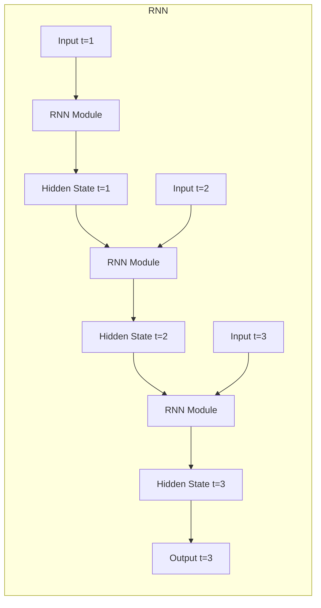

# Recurrent Neural Networks (RNN) 原理与代码实战案例讲解

## 1. 背景介绍

在深度学习领域中,循环神经网络(Recurrent Neural Networks, RNN)是一种强大的神经网络架构,专门用于处理序列数据。与传统的前馈神经网络不同,RNN能够捕捉序列数据中的时间动态行为和长期依赖关系。这使得RNN在自然语言处理、语音识别、时间序列预测等领域有着广泛的应用。

### 1.1 序列数据的挑战

在现实世界中,我们经常会遇到序列数据,例如文本、语音、视频和时间序列数据。传统的机器学习算法通常会将这些序列数据拆分为独立的样本,从而忽视了序列数据内在的时间依赖关系。然而,在许多应用场景中,正是这种时间依赖关系决定了数据的语义含义。

例如,在自然语言处理中,一个句子的意义不仅取决于单个单词,还取决于单词之间的顺序和上下文关系。同样,在时间序列预测中,未来的值往往依赖于过去的观测值。因此,有效地捕捉序列数据中的时间动态行为对于许多应用程序来说至关重要。

### 1.2 RNN的优势

RNN通过引入内部状态(hidden state)来解决序列数据处理的挑战。与传统的前馈神经网络不同,RNN在处理序列数据时会保留一个隐藏状态,该隐藏状态会在每个时间步骤上进行更新,从而捕捉序列数据中的动态行为。

这种内部记忆机制使得RNN能够学习序列数据中的长期依赖关系,从而在许多序列建模任务中取得出色的表现。RNN已经成功应用于自然语言处理、语音识别、机器翻译、时间序列预测等多个领域。

## 2. 核心概念与联系

为了更好地理解RNN的工作原理,我们需要熟悉一些核心概念。

### 2.1 RNN的结构

RNN的基本结构由一系列重复的神经网络模块组成,每个模块对应序列中的一个时间步骤。在每个时间步骤,RNN会接收当前的输入和前一时间步的隐藏状态,然后计算当前时间步的隐藏状态和输出。

这种重复模块结构使得RNN能够以相同的方式处理序列中的每个元素,同时利用隐藏状态来捕捉序列数据的动态行为。

### 2.2 循环计算

RNN的核心思想是通过循环计算来更新隐藏状态。在每个时间步骤,RNN会根据当前输入和前一时间步的隐藏状态来计算当前时间步的隐藏状态。这种循环计算过程可以用以下公式表示:

$$h_t = f_W(x_t, h_{t-1})$$

其中:
- $h_t$ 表示当前时间步的隐藏状态
- $x_t$ 表示当前时间步的输入
- $h_{t-1}$ 表示前一时间步的隐藏状态
- $f_W$ 表示由权重 $W$ 参数化的循环函数,通常是一个非线性函数,如双曲正切函数(tanh)或ReLU函数。

通过这种循环计算,RNN能够捕捉序列数据中的长期依赖关系,因为每个时间步的隐藏状态都包含了之前时间步的信息。

### 2.3 输出计算

除了计算隐藏状态之外,RNN还需要根据隐藏状态计算输出。这通常是通过一个输出层来实现的,输出层将隐藏状态映射到所需的输出空间。

$$y_t = g_V(h_t)$$

其中:
- $y_t$ 表示当前时间步的输出
- $h_t$ 表示当前时间步的隐藏状态
- $g_V$ 表示由权重 $V$ 参数化的输出函数,可以是线性函数或非线性函数,取决于具体任务。

通过训练RNN的权重参数 $W$ 和 $V$,RNN可以学习从输入序列中提取有用的特征,并根据这些特征生成所需的输出序列。

## 3. 核心算法原理具体操作步骤

现在,让我们更深入地探讨RNN的核心算法原理和具体操作步骤。

### 3.1 前向传播

在RNN的前向传播过程中,我们需要逐步计算每个时间步的隐藏状态和输出。具体步骤如下:

1. 初始化隐藏状态 $h_0$ 为全零向量或随机初始化。
2. 对于每个时间步 $t$:
   a. 计算当前时间步的隐藏状态 $h_t$,根据当前输入 $x_t$ 和前一时间步的隐藏状态 $h_{t-1}$:
      $$h_t = f_W(x_t, h_{t-1})$$
   b. 计算当前时间步的输出 $y_t$,根据当前隐藏状态 $h_t$:
      $$y_t = g_V(h_t)$$

这个过程会重复进行,直到处理完整个序列。最终,我们会得到一系列隐藏状态 $\{h_1, h_2, \dots, h_T\}$ 和输出 $\{y_1, y_2, \dots, y_T\}$,其中 $T$ 是序列长度。

### 3.2 反向传播

与传统的前馈神经网络类似,RNN也需要通过反向传播算法来训练权重参数 $W$ 和 $V$。然而,由于RNN具有循环结构,反向传播过程会变得更加复杂。

在反向传播过程中,我们需要计算每个时间步的误差梯度,并将这些梯度沿着时间步骤反向传播。具体步骤如下:

1. 计算最后一个时间步的输出误差梯度 $\frac{\partial L}{\partial y_T}$,其中 $L$ 是损失函数。
2. 对于每个时间步 $t$ (从 $T$ 到 1):
   a. 计算当前时间步的隐藏状态误差梯度 $\frac{\partial L}{\partial h_t}$,根据当前输出误差梯度 $\frac{\partial L}{\partial y_t}$ 和输出函数 $g_V$ 的导数:
      $$\frac{\partial L}{\partial h_t} = \frac{\partial L}{\partial y_t} \cdot \frac{\partial y_t}{\partial h_t}$$
   b. 计算当前时间步的权重梯度 $\frac{\partial L}{\partial W}$ 和 $\frac{\partial L}{\partial V}$,根据当前隐藏状态误差梯度 $\frac{\partial L}{\partial h_t}$、输入 $x_t$ 和前一时间步的隐藏状态 $h_{t-1}$。
   c. 计算前一时间步的隐藏状态误差梯度 $\frac{\partial L}{\partial h_{t-1}}$,根据当前隐藏状态误差梯度 $\frac{\partial L}{\partial h_t}$ 和循环函数 $f_W$ 的导数:
      $$\frac{\partial L}{\partial h_{t-1}} = \frac{\partial L}{\partial h_t} \cdot \frac{\partial h_t}{\partial h_{t-1}}$$
3. 使用计算得到的梯度更新权重参数 $W$ 和 $V$,通常使用优化算法如随机梯度下降(SGD)或Adam优化器。

需要注意的是,由于RNN具有循环结构,误差梯度会在时间步骤之间传播,这可能导致梯度消失或梯度爆炸的问题。为了缓解这个问题,通常会采用一些技术,如梯度剪裁(gradient clipping)或使用更复杂的RNN变体(如长短期记忆网络(LSTM)和门控循环单元(GRU))。

## 4. 数学模型和公式详细讲解举例说明

在上一节中,我们介绍了RNN的核心算法原理和具体操作步骤。现在,让我们更深入地探讨RNN的数学模型和公式,并通过具体示例来加深理解。

### 4.1 RNN的数学模型

RNN的数学模型可以用以下公式表示:

$$\begin{aligned}
h_t &= f_W(x_t, h_{t-1}) \\
     &= \phi(W_{hx} x_t + W_{hh} h_{t-1} + b_h)
\end{aligned}$$

$$y_t = g_V(h_t) = W_{yh} h_t + b_y$$

其中:

- $x_t$ 是时间步 $t$ 的输入向量
- $h_t$ 是时间步 $t$ 的隐藏状态向量
- $y_t$ 是时间步 $t$ 的输出向量
- $W_{hx}$、$W_{hh}$、$W_{yh}$ 是权重矩阵
- $b_h$、$b_y$ 是偏置向量
- $\phi$ 是非线性激活函数,如双曲正切函数(tanh)或ReLU函数

在这个模型中,隐藏状态 $h_t$ 是通过将当前输入 $x_t$ 和前一时间步的隐藏状态 $h_{t-1}$ 线性组合,然后应用非线性激活函数 $\phi$ 得到的。输出 $y_t$ 则是通过将隐藏状态 $h_t$ 线性映射得到的。

权重矩阵 $W_{hx}$、$W_{hh}$ 和 $W_{yh}$ 以及偏置向量 $b_h$ 和 $b_y$ 是需要通过训练数据来学习的参数。在训练过程中,我们会使用反向传播算法来计算这些参数的梯度,并使用优化算法(如SGD或Adam)来更新参数值,从而最小化损失函数。

### 4.2 示例:情感分析

为了更好地理解RNN的数学模型,让我们来看一个具体的示例:情感分析。在这个任务中,我们需要根据一段文本的内容预测其情感极性(正面或负面)。

假设我们有一个包含5个单词的句子:"This movie was really great!"。我们将每个单词表示为一个one-hot编码向量,例如:

- "This" = [1, 0, 0, 0, 0, ...]
- "movie" = [0, 1, 0, 0, 0, ...]
- "was" = [0, 0, 1, 0, 0, ...]
- "really" = [0, 0, 0, 1, 0, ...]
- "great" = [0, 0, 0, 0, 1, ...]

我们将这些one-hot编码向量作为RNN的输入序列 $\{x_1, x_2, x_3, x_4, x_5\}$。

假设我们的RNN有一个隐藏层大小为3,并使用双曲正切函数(tanh)作为激活函数。我们可以初始化权重矩阵和偏置向量为:

$$W_{hx} = \begin{bmatrix}
0.1 & 0.2 & 0.3 \\
0.4 & 0.5 & 0.6 \\
0.7 & 0.8 & 0.9
\end{bmatrix}, \quad
W_{hh} = \begin{bmatrix}
0.1 & 0.2 & 0.3 \\
0.4 & 0.5 & 0.6 \\
0.7 & 0.8 & 0.9
\end{bmatrix}$$

$$b_h = \begin{bmatrix}
0.1 \\
0.2 \\
0.3
\end{bmatrix}, \quad
W_{yh} = \begin{bmatrix}
0.1 & 0.2 & 0.3
\end{bmatrix}, \quad
b_y = 0.1$$

在前向传播过程中,我们将逐步计算每个时间步的隐藏状态和输出:

1. 初始化隐藏状态 $h_0 = \begin{bmatrix}0 \\ 0 \\ 0\end{bmatrix}$
2. 时间步 $t=1$:
   $$h_1 = \tanh(W_{hx} x_1 + W_{hh} h_0 + b_