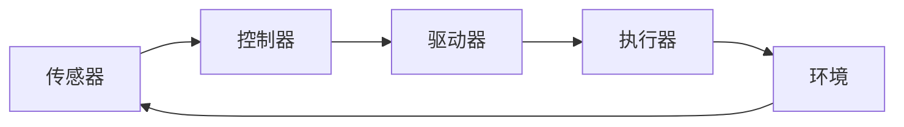

# Robotics 原理与代码实战案例讲解

## 1. 背景介绍

### 1.1 Robotics的定义与发展历程
#### 1.1.1 Robotics的定义
#### 1.1.2 Robotics的发展历程
#### 1.1.3 Robotics的研究意义

### 1.2 Robotics涉及的学科领域  
#### 1.2.1 机械工程
#### 1.2.2 电子工程
#### 1.2.3 计算机科学
#### 1.2.4 人工智能
#### 1.2.5 生物学

### 1.3 Robotics的应用现状与前景
#### 1.3.1 工业领域应用
#### 1.3.2 医疗领域应用 
#### 1.3.3 服务领域应用
#### 1.3.4 军事领域应用
#### 1.3.5 未来发展前景

## 2. 核心概念与联系

### 2.1 机器人学中的核心概念
#### 2.1.1 机器人
#### 2.1.2 驱动器
#### 2.1.3 传感器
#### 2.1.4 控制器
#### 2.1.5 末端执行器

### 2.2 机器人学各概念之间的联系
#### 2.2.1 感知-决策-执行闭环
#### 2.2.2 机器人系统架构
#### 2.2.3 硬件与软件的协同



### 2.3 机器人学的理论基础
#### 2.3.1 运动学与动力学
#### 2.3.2 控制理论
#### 2.3.3 传感器融合
#### 2.3.4 人工智能算法

## 3. 核心算法原理具体操作步骤

### 3.1 机器人运动学算法
#### 3.1.1 正向运动学
#### 3.1.2 逆向运动学
#### 3.1.3 雅可比矩阵

### 3.2 机器人动力学算法
#### 3.2.1 牛顿-欧拉法
#### 3.2.2 拉格朗日方程法
#### 3.2.3 机器人动力学参数辨识

### 3.3 机器人控制算法
#### 3.3.1 PID控制
#### 3.3.2 自适应控制
#### 3.3.3 鲁棒控制
#### 3.3.4 力控制

### 3.4 机器人路径规划算法
#### 3.4.1 图搜索算法
#### 3.4.2 采样式路径规划
#### 3.4.3 势场法
#### 3.4.4 优化型路径规划

## 4. 数学模型和公式详细讲解举例说明

### 4.1 机器人运动学模型
#### 4.1.1 DH参数与坐标变换
$$
^{i-1}T_i = 
\begin{bmatrix}
\cos\theta_i & -\sin\theta_i\cos\alpha_i & \sin\theta_i\sin\alpha_i & a_i\cos\theta_i \\
\sin\theta_i & \cos\theta_i\cos\alpha_i & -\cos\theta_i\sin\alpha_i & a_i\sin\theta_i \\
0 & \sin\alpha_i & \cos\alpha_i & d_i \\
0 & 0 & 0 & 1
\end{bmatrix}
$$

#### 4.1.2 正向运动学求解
#### 4.1.3 逆向运动学求解

### 4.2 机器人动力学模型
#### 4.2.1 刚体动力学基础
#### 4.2.2 牛顿-欧拉法动力学建模
$$
\tau = M(q)\ddot{q} + C(q,\dot{q})\dot{q} + G(q)
$$

#### 4.2.3 拉格朗日方程法动力学建模
$$
L = K - P \\
\frac{d}{dt}\left(\frac{\partial L}{\partial \dot{q}_i}\right) - \frac{\partial L}{\partial q_i} = \tau_i
$$

### 4.3 机器人控制模型
#### 4.3.1 PID控制器设计
$$
u(t) = K_p e(t) + K_i \int_0^t e(\tau) d\tau + K_d \frac{de(t)}{dt}
$$

#### 4.3.2 自适应控制器设计
#### 4.3.3 鲁棒控制器设计

## 5. 项目实践：代码实例和详细解释说明

### 5.1 机器人正逆运动学求解
#### 5.1.1 正向运动学Python代码实现
```python
import numpy as np
from math import sin, cos

def forward_kinematics(dh_params):
    # 提取DH参数
    a, alpha, d, theta = dh_params
    
    # 计算变换矩阵
    T = np.array([
        [cos(theta), -sin(theta)*cos(alpha), sin(theta)*sin(alpha), a*cos(theta)],
        [sin(theta), cos(theta)*cos(alpha), -cos(theta)*sin(alpha), a*sin(theta)],
        [0, sin(alpha), cos(alpha), d],
        [0, 0, 0, 1]
    ])
    
    return T
```

#### 5.1.2 逆向运动学Python代码实现
```python
import numpy as np
from math import atan2, acos, sqrt

def inverse_kinematics(T, dh_params):
    # 提取目标位姿
    nx, ny, nz = T[:3, 0]
    ox, oy, oz = T[:3, 1] 
    ax, ay, az = T[:3, 2]
    px, py, pz = T[:3, 3]
    
    # 提取DH参数
    a1, a2, a3 = dh_params[:3, 0] 
    d1, d4 = dh_params[:, 2]
    
    # 计算逆解
    theta1 = atan2(py, px)
    
    c3 = (px**2 + py**2 + (pz-d1)**2 - a2**2 - a3**2) / (2*a2*a3)
    s3 = sqrt(1 - c3**2)
    theta3 = atan2(s3, c3)
    
    s2 = ((a3*c3 + a2)*(pz-d1) - a3*s3*sqrt(px**2+py**2)) / (a2**2 + a3**2 + 2*a2*a3*c3)
    c2 = (sqrt(px**2+py**2)*(a3*c3 + a2) + (pz-d1)*a3*s3) / (a2**2 + a3**2 + 2*a2*a3*c3)   
    theta2 = atan2(s2, c2)
    
    theta4 = atan2(-ax*sin(theta1) + ay*cos(theta1), 
                   ox*sin(theta1) - oy*cos(theta1))
    
    return np.array([theta1, theta2, theta3, theta4])
```

### 5.2 机器人动力学参数辨识
#### 5.2.1 最小二乘法辨识算法
#### 5.2.2 Python代码实现
```python
import numpy as np

def dynamics_identification(tau, q, qd, qdd):
    # 提取数据维度
    N = len(tau)
    
    # 构造回归矩阵
    W = np.zeros((N, 10))
    for i in range(N):
        W[i] = [
            qdd[i, 0], qdd[i, 1], qdd[i, 2],
            qd[i, 0]**2, qd[i, 1]**2, qd[i, 2]**2,
            np.sin(q[i, 1]), np.sin(q[i, 1]+q[i, 2]), 
            qd[i, 0]*qd[i, 1], qd[i, 0]*qd[i, 2]
        ]
        
    # 最小二乘求解
    theta = np.linalg.pinv(W) @ tau
    
    return theta
```

### 5.3 机器人轨迹规划与控制
#### 5.3.1 轨迹规划算法
#### 5.3.2 控制器设计
#### 5.3.3 Matlab/Simulink仿真

## 6. 实际应用场景

### 6.1 工业机器人应用
#### 6.1.1 焊接机器人
#### 6.1.2 装配机器人
#### 6.1.3 喷涂机器人

### 6.2 服务机器人应用
#### 6.2.1 家用服务机器人
#### 6.2.2 医疗康复机器人
#### 6.2.3 餐饮服务机器人

### 6.3 特种机器人应用
#### 6.3.1 太空探索机器人
#### 6.3.2 深海作业机器人
#### 6.3.3 排爆机器人

## 7. 工具和资源推荐

### 7.1 机器人操作系统ROS
#### 7.1.1 ROS简介
#### 7.1.2 ROS核心概念
#### 7.1.3 ROS学习资源

### 7.2 机器人仿真平台
#### 7.2.1 Gazebo
#### 7.2.2 V-REP
#### 7.2.3 Webots

### 7.3 机器人开发硬件
#### 7.3.1 Arduino
#### 7.3.2 Raspberry Pi
#### 7.3.3 Jetson Nano

### 7.4 其他学习资源
#### 7.4.1 公开课程
#### 7.4.2 书籍推荐
#### 7.4.3 网站与社区

## 8. 总结：未来发展趋势与挑战

### 8.1 机器人技术的发展趋势
#### 8.1.1 人机协作
#### 8.1.2 仿生机器人
#### 8.1.3 云端机器人
#### 8.1.4 模块化设计

### 8.2 机器人面临的挑战
#### 8.2.1 安全性问题
#### 8.2.2 伦理道德问题
#### 8.2.3 法律法规问题
#### 8.2.4 就业冲击问题

### 8.3 机器人未来的研究方向
#### 8.3.1 机器人智能化
#### 8.3.2 机器人网络化
#### 8.3.3 机器人个性化
#### 8.3.4 机器人微型化

## 9. 附录：常见问题与解答

### 9.1 机器人学习路线问题
#### 9.1.1 数学基础
#### 9.1.2 编程语言
#### 9.1.3 机器人专业课程

### 9.2 机器人选型问题
#### 9.2.1 工业机器人选型
#### 9.2.2 服务机器人选型
#### 9.2.3 教育机器人选型

### 9.3 机器人安全问题
#### 9.3.1 本体安全设计
#### 9.3.2 感知避障技术
#### 9.3.3 人机交互安全

### 9.4 机器人维护问题
#### 9.4.1 日常保养事项
#### 9.4.2 常见故障诊断
#### 9.4.3 维修渠道推荐

作者：禅与计算机程序设计艺术 / Zen and the Art of Computer Programming