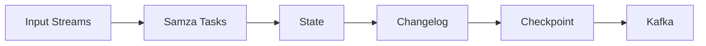

# Samza Checkpoint原理与代码实例讲解

## 1. 背景介绍
### 1.1 分布式流处理系统中的容错机制
在分布式流处理系统中,容错是一个至关重要的问题。由于流处理任务通常需要7x24小时不间断运行,因此必须具备一定的容错能力,以应对各种潜在的故障。常见的容错机制包括 Checkpoint、Acking、Replication等。其中,Checkpoint是一种被广泛采用的容错手段。

### 1.2 Checkpoint的作用
Checkpoint的核心思想是周期性地保存系统的状态快照,当发生故障时,可以从最近的一次 Checkpoint中恢复,避免重新处理所有数据,从而显著减少故障恢复时间。Checkpoint不仅可以用于故障恢复,还可以用于支持 Exactly-once语义的数据处理。

### 1.3 Samza简介
Samza是由LinkedIn开源的分布式流处理框架,它构建在Kafka和YARN之上,提供了一个可伸缩、高性能、高容错的流处理平台。Samza采用了增量Checkpoint的方式来实现容错和状态管理。

## 2. 核心概念与联系
### 2.1 Checkpoint
Checkpoint是指在特定时间点对系统状态做一个快照,通常包括处理进度、内部状态等信息。Checkpoint可以看作是一种容错手段,当发生故障时可以从最近的Checkpoint恢复,减少重新处理的数据量。

### 2.2 State
State是指流处理中的中间状态数据,比如窗口计算的中间结果、KV状态等。State通常需要在Checkpoint过程中持久化,以便在发生故障时能够恢复。

### 2.3 Changelog
Changelog是Samza中的一个核心概念,它记录了每个任务的State变更历史。Changelog本质上是一个Kafka Topic,每个任务的State变更都会以一条记录的形式Append到Changelog中。

### 2.4 Offset
Offset是Kafka中表示消息位置的指针。在Samza中,Offset不仅表示输入流的消费位置,同时也表示每个任务的State在Changelog中的位置。

### 2.5 核心概念关系图
下面是Samza Checkpoint相关核心概念的关系图:


## 3. 核心算法原理具体操作步骤
### 3.1 Checkpoint执行流程
Samza的Checkpoint是以Task为单位,分别独立执行的。Checkpoint分为Sync和Async两个阶段:
1. Sync阶段:暂停处理输入消息,将State flush到Changelog,同时记录当前Offset。
2. Async阶段:后台异步地将Changelog数据Flush到Kafka,保证Changelog的持久性。

### 3.2 Checkpoint触发机制
Samza提供了三种Checkpoint触发机制:
1. 基于时间的定期触发
2. 基于处理消息数的触发  
3. 基于Kafka写入字节数的触发

Samza会综合考虑以上三种机制,当满足任一条件时就会触发Checkpoint。

### 3.3 Checkpoint恢复流程
当发生故障时,Samza会选择最近的一次Checkpoint进行恢复:
1. 从Checkpoint中加载State数据
2. 根据Checkpoint中记录的Offset,从Kafka中恢复未处理的消息
3. 恢复处理进度,继续消费输入流

## 4. 数学模型和公式详细讲解举例说明
### 4.1 Changelogs的数学模型
我们可以将Changelog看作是一个KV存储,其中Key是任务的ID,Value是任务的State变更记录。假设有$n$个任务,第$i$个任务在第$t$次Checkpoint时的State为$S_{i}^{t}$,那么整个系统的状态可以表示为一个矩阵:

$$
\begin{bmatrix}
S_{1}^{1} & S_{1}^{2} & \cdots & S_{1}^{t} \\
S_{2}^{1} & S_{2}^{2} & \cdots & S_{2}^{t} \\
\vdots & \vdots & \ddots & \vdots \\
S_{n}^{1} & S_{n}^{2} & \cdots & S_{n}^{t} \\
\end{bmatrix}
$$

其中,每一行表示一个任务的State变更历史,每一列表示一次Checkpoint的系统状态快照。

### 4.2 State的数学模型
对于每个任务,我们可以将其State看作是一组KV对,即$S_{i}^{t} = \{(k_{1},v_{1}),(k_{2},v_{2}),\cdots,(k_{m},v_{m})\}$。当发生State更新时,相当于对某个KV对进行了修改。我们可以定义State的更新操作为:

$$S_{i}^{t+1} = S_{i}^{t} \oplus \Delta S_{i}^{t+1}$$

其中,$\Delta S_{i}^{t+1}$表示在$t+1$时刻对第$i$个任务的State的修改。State的更新可以看作是一个增量修改的过程。

## 5. 项目实践:代码实例和详细解释说明
下面是一个基于Samza的简单WordCount示例,演示了如何使用Samza的Checkpoint机制:

```java
public class WordCountTask implements StreamTask, InitableTask, WindowableTask {

  private static final Logger LOG = LoggerFactory.getLogger(WordCountTask.class);

  private KeyValueStore<String, Integer> store;
  private int maxWordLength;

  @Override
  public void init(Config config, TaskContext context) {
    this.store = (KeyValueStore<String, Integer>) context.getStore("word-count");
    this.maxWordLength = config.getInt("max.word.length", 10);
  }

  @Override
  public void process(IncomingMessageEnvelope envelope, MessageCollector collector, TaskCoordinator coordinator) {
    String word = (String) envelope.getMessage();
    if (word != null && word.length() <= maxWordLength) {
      Integer count = store.get(word);
      if (count == null) {
        count = 0;
      }
      count++;
      store.put(word, count);
    }
  }

  @Override
  public void window(MessageCollector collector, TaskCoordinator coordinator) {
    KeyValueIterator<String, Integer> iter = store.all();
    while (iter.hasNext()) {
      Entry<String, Integer> entry = iter.next();
      collector.send(new OutgoingMessageEnvelope(new SystemStream("kafka", "word-count-output"), entry.getKey(), entry.getValue()));
    }
    iter.close();
    store.flush();
    coordinator.commit(collector.getTaskName(), collector.getTaskModel().getChangelogPartition());
  }
}
```

在上面的例子中,我们使用了Samza提供的KeyValueStore来维护单词计数的状态。在process()方法中,我们对每个输入的单词进行计数并更新状态;在window()方法中,我们将聚合后的结果输出到Kafka,并调用store.flush()方法将状态变更刷新到Changelog中,最后调用coordinator.commit()方法提交Checkpoint。

这里的关键点是调用store.flush()和coordinator.commit()方法,它们共同完成了一次Checkpoint的过程。store.flush()负责将状态变更同步到Changelog中,coordinator.commit()负责提交Offset、标识Checkpoint完成。

## 6. 实际应用场景
Samza Checkpoint在实际生产环境中有非常广泛的应用,一些典型的应用场景包括:

### 6.1 消息处理的Exactly-Once语义保证
利用Samza的Checkpoint机制,可以实现端到端的Exactly-Once语义。将输入消息的Offset、输出消息的状态以及任务的内部状态统一Checkpoint,可以确保每条消息都被处理且只被处理一次。

### 6.2 大状态的容错和持久化
对于某些需要维护大量状态的流处理作业(如训练机器学习模型),Checkpoint提供了一种有效的状态容错手段。将大状态定期Checkpoint,可以避免故障恢复时重新计算的开销。

### 6.3 流处理作业的暂停和恢复
Checkpoint使得Samza作业能够安全地暂停和恢复。比如在版本升级、配置变更时,可以先停止作业,等变更完成后再从最近的Checkpoint恢复,从而实现平滑的更新。

### 6.4 计算结果的对外提供
Checkpoint后的状态数据可以直接对外提供查询服务,比如在流处理过程中实时统计一些指标,可以将这些指标状态Checkpoint后供前端页面查询展示。

## 7. 工具和资源推荐
### 7.1 Samza官方文档
Samza官网提供了非常详尽的文档,包括架构设计、API使用、配置指南等内容,是学习和使用Samza的权威资料。
网址:http://samza.apache.org/

### 7.2 Kafka官方文档 
Samza依赖于Kafka作为流处理的消息源和Changelog存储,因此有必要对Kafka有所了解。Kafka官网提供了详细的文档说明。
网址:https://kafka.apache.org/

### 7.3 Samza Github代码库
Samza是一个开源项目,其代码托管在Github上。通过阅读源码可以更深入地理解Samza的实现原理。
网址:https://github.com/apache/samza

## 8. 总结:未来发展趋势与挑战
### 8.1 Checkpoint的异步化和增量化  
目前Samza的Checkpoint还是同步进行的,Checkpoint过程会暂停数据处理,在未来版本中会引入异步Checkpoint的机制。此外,目前Samza的Checkpoint是全量的,Checkpoint的开销会随着状态量的增大而增大,未来可以考虑支持增量Checkpoint。

### 8.2 Checkpoint的自适应调优
Checkpoint的频率和执行时机需要在Recovery Time和Checkpoint开销之间进行权衡。目前Samza Checkpoint的调优还需要人工设置参数,未来可以考虑根据系统负载自适应地调整Checkpoint策略。

### 8.3 本地状态的Checkpoint
目前Samza的状态存储在远程的Changelog中,Checkpoint需要经过网络IO。引入本地状态存储可以减少Checkpoint的网络开销,但同时也带来了新的一致性挑战,需要在本地状态和远程Changelog之间进行同步。

### 8.4 跨框架的Checkpoint标准化
当前流处理领域的Checkpoint机制都是框架自己实现的,缺乏统一的标准。未来可以考虑在社区中推动Checkpoint的标准化,以实现不同框架之间的状态互通和任务迁移。

## 9. 附录:常见问题与解答
### Q1:Samza Checkpoint的性能开销如何?
A1:Checkpoint确实会引入一定的性能开销,主要包括:暂停处理的时间开销、状态序列化和持久化的CPU和IO开销。但Samza采用了增量Checkpoint和异步Checkpoint等优化手段,使得Checkpoint开销控制在了一个可接受的范围内。合理设置Checkpoint的时间间隔可以在Checkpoint开销和恢复时间之间取得平衡。

### Q2:Samza Checkpoint能保证Exactly-Once语义吗?
A2:Samza Checkpoint提供了一种实现Exactly-Once语义的基础,但Exactly-Once语义的实现还需要端到端地考虑。除了Checkpoint,还需要考虑输入消息的幂等性处理、输出消息的事务提交等。Samza提供了Transactional State API,可以方便地实现端到端的Exactly-Once语义。

### Q3:Samza Checkpoint的时间间隔该如何设置?
A3:Checkpoint的时间间隔需要根据具体的业务场景和系统负载来设置。时间间隔太短会导致Checkpoint开销过大,影响处理性能;时间间隔太长又会导致故障恢复时间过长,影响系统可用性。一般建议根据恢复时间目标(Recovery Time Objective, RTO)来设置Checkpoint间隔,比如RTO为5分钟,那Checkpoint间隔可以设置为1~2分钟。

### Q4:Samza Checkpoint后的状态数据能否用于分析查询?
A4:理论上Checkpoint后的状态数据是可以用于分析查询的,但直接查询Changelog的性能可能无法满足需求。一种常见的做法是将Checkpoint后的状态数据同步到其他的存储系统中,比如HDFS、Hive、HBase等,然后基于这些存储系统进行分析查询。Samza提供了Changelog Replication的机制,可以将Changelog中的数据实时同步到其他系统。

作者：禅与计算机程序设计艺术 / Zen and the Art of Computer Programming