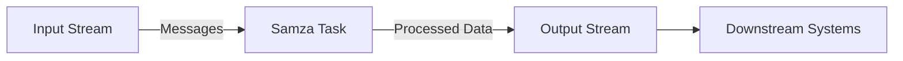

# Samza Task原理与代码实例讲解

## 1. 背景介绍

在大数据处理领域，实时数据流处理是一个不断发展的热点话题。Apache Samza是LinkedIn开源的一个分布式流处理框架，它基于Apache Kafka进行消息传递，提供了一种简单的流处理模型，允许开发者编写能够处理无限数据流的任务。Samza的设计哲学是稳定性、可扩展性和易用性，这使得它在处理大规模数据流时表现出色。

## 2. 核心概念与联系

在深入Samza Task的原理之前，我们需要理解几个核心概念：

- **Stream**：数据流，是一系列不断生成的数据消息。
- **Message**：消息，流中的一个数据单元。
- **Task**：任务，是Samza中的基本处理单元，负责处理流中的消息。
- **Job**：作业，由多个Task组成，是执行流处理的完整逻辑单元。

Samza的架构可以用以下Mermaid流程图表示：



## 3. 核心算法原理具体操作步骤

Samza Task的处理流程遵循以下步骤：

1. **初始化**：启动Task时，首先进行初始化操作，包括状态存储、度量指标等。
2. **消息处理**：Task接收到流中的消息，并进行业务逻辑处理。
3. **状态管理**：Task可以维护状态，对消息进行聚合或者存储中间结果。
4. **输出**：处理完成的消息被发送到输出流，供下游系统使用。

## 4. 数学模型和公式详细讲解举例说明

Samza Task处理消息的吞吐量可以用以下公式表示：

$$
\text{吞吐量} = \frac{\text{处理的消息数量}}{\text{时间单位}}
$$

例如，如果一个Task在1秒内处理了1000条消息，那么它的吞吐量为1000条/秒。

## 5. 项目实践：代码实例和详细解释说明

以下是一个简单的Samza Task代码示例：

```java
public class SimpleTask implements StreamTask {
    @Override
    public void process(IncomingMessageEnvelope envelope, MessageCollector collector, TaskCoordinator coordinator) {
        String message = (String) envelope.getMessage();
        // 业务逻辑处理
        String processedMessage = message.toUpperCase();
        // 发送处理后的消息到输出流
        collector.send(new OutgoingMessageEnvelope(new SystemStream("kafka", "output-topic"), processedMessage));
    }
}
```

在这个例子中，`process`方法是消息处理的核心。它从输入流中接收消息，将其转换为大写，并将处理后的消息发送到输出流。

## 6. 实际应用场景

Samza Task可以应用于多种场景，例如：

- 实时分析：对社交媒体数据流进行实时情感分析。
- 实时监控：监控系统日志，实时发现和报告异常。
- 数据清洗：从原始数据流中过滤和转换数据，以供下游处理。

## 7. 工具和资源推荐

- **Apache Kafka**：Samza的消息传递基础设施。
- **Samza官方文档**：提供详细的Samza使用指南和API文档。
- **Samza Hello Samza**：一个入门项目，帮助开发者快速上手Samza。

## 8. 总结：未来发展趋势与挑战

随着实时数据流处理需求的增长，Samza将继续发展，提供更高效的处理能力和更丰富的功能。未来的挑战包括处理更大规模的数据、降低延迟和提高系统的容错能力。

## 9. 附录：常见问题与解答

- **Q**: Samza与其他流处理框架相比有何优势？
- **A**: Samza提供了与Kafka紧密集成的流处理模型，易于管理状态和容错。

- **Q**: Samza如何保证消息的顺序性？
- **A**: Samza利用Kafka的分区机制，确保同一分区内的消息顺序处理。

作者：禅与计算机程序设计艺术 / Zen and the Art of Computer Programming