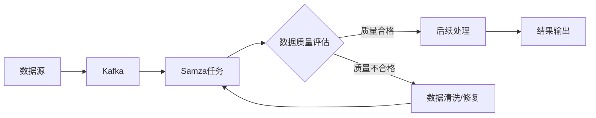

# Samza数据处理与数据质量评估

## 1. 背景介绍

### 1.1 大数据处理的重要性
在当今大数据时代,海量数据的高效处理已成为企业和组织面临的重大挑战。数据量的快速增长和多样化使得传统的数据处理方式难以满足实时性、可扩展性和容错性的要求。因此,开发高性能、可扩展的分布式数据处理框架成为了大数据领域的关键课题。

### 1.2 Samza的诞生
Samza是由LinkedIn开源的一个分布式流处理框架,旨在提供高吞吐量、低延迟的实时数据处理能力。它建立在Apache Kafka和Apache YARN之上,充分利用了Kafka的消息持久化和YARN的资源管理功能,实现了高可靠、可扩展的流式数据处理。

### 1.3 数据质量评估的必要性
在大数据处理过程中,数据质量的高低直接影响了数据分析和决策的准确性。脏数据、不完整数据、不一致数据等质量问题如果得不到及时发现和处理,将会导致错误的分析结果和决策失误。因此,在数据处理的同时引入数据质量评估机制,对数据进行全面、系统的质量检测和监控至关重要。

### 1.4 Samza在数据质量评估中的应用
Samza作为一个高效的流处理引擎,不仅可以用于实时数据处理,还可以方便地集成数据质量评估模块。通过在Samza的数据处理流程中嵌入质量检测规则和算法,可以实现数据质量问题的实时发现和告警,从而及时采取数据清洗和修复措施,保证下游数据分析和应用的数据质量。

## 2. 核心概念与联系

### 2.1 Samza的核心概念

#### 2.1.1 流(Stream)
在Samza中,所有的输入输出数据都被抽象为流。流由一系列连续的数据记录(Record)组成,每个记录包含了键值对形式的数据。

#### 2.1.2 作业(Job)
Samza中的作业是对流数据进行处理的基本单元。一个作业通过从输入流读取记录,经过一系列的转换操作,将结果写入输出流。

#### 2.1.3 任务(Task)
为了实现并行处理,Samza将作业划分为多个任务,每个任务负责处理流数据的一个分区。任务之间相互独立,可以分布在不同的机器上执行。

#### 2.1.4 处理器(Processor)
处理器是Samza作业的核心逻辑所在,它定义了如何处理输入的数据记录,并产生输出结果。用户通过实现StreamTask接口来自定义处理器。

#### 2.1.5 状态(State)
Samza支持每个任务维护本地状态,状态数据可以跨多个输入记录进行访问和更新。任务状态的一致性和持久化由Samza框架自动管理。

### 2.2 数据质量评估的核心概念

#### 2.2.1 数据质量维度  
数据质量评估需要从多个维度对数据进行考量,常见的维度包括:完整性、准确性、一致性、及时性、唯一性等。

#### 2.2.2 数据质量规则
数据质量规则是对数据进行质量判断的标准,它明确定义了数据在各个质量维度上应满足的条件。常见的规则有:非空约束、取值范围约束、格式约束等。

#### 2.2.3 数据质量指标
数据质量指标是衡量数据集整体质量水平的定量标准,通过计算数据集在各个质量维度上的分数,综合评估数据的可用性和可靠性。

### 2.3 Samza与数据质量评估的关系
Samza与数据质量评估可以进行有机结合,发挥各自的优势。

一方面,Samza为数据质量评估提供了高效的执行引擎。利用Samza的分布式处理能力,可以对海量数据进行实时的质量检测和评估,及时发现数据质量问题。

另一方面,数据质量评估为Samza的数据处理提供了质量保障。通过在Samza的处理流程中嵌入数据质量检测和修复逻辑,可以防止脏数据的传播,提高数据处理的准确性和可靠性。

下图展示了Samza与数据质量评估的整合架构:



## 3. 核心算法原理具体操作步骤

### 3.1 Samza的数据处理流程

#### 3.1.1 任务分配
Samza的任务分配由YARN的资源管理器完成。根据作业的并行度配置,YARN将输入流的分区均匀地分配给各个任务容器。

#### 3.1.2 数据读取
每个任务通过订阅分配给它的分区,从Kafka中持续读取数据记录。Samza利用Kafka的Consumer API实现了高效的数据读取。

#### 3.1.3 数据处理
任务将读取到的记录传递给用户定义的处理器进行处理。处理器可以对记录进行转换、过滤、聚合等操作,并产生输出结果。

#### 3.1.4 状态管理
如果任务需要维护状态,处理器可以通过Samza提供的状态API来读写状态数据。Samza会自动将状态数据持久化到可靠的存储中。

#### 3.1.5 数据输出
处理器产生的输出结果会被写入到指定的输出流中。Samza利用Kafka的Producer API实现了高吞吐的数据写入。

#### 3.1.6 容错恢复
当任务失败时,Samza会自动重启任务,并从上次处理的记录开始恢复状态和数据处理,保证了Exactly-Once语义。

### 3.2 数据质量评估的关键步骤

#### 3.2.1 数据质量规则定义
根据业务需求和数据特点,定义一系列数据质量规则。规则应覆盖数据质量的各个关键维度,如完整性、准确性、一致性等。

#### 3.2.2 数据质量检测
对数据进行逐条检测,判断每个数据记录是否满足预定义的质量规则。可以通过编写质量检测函数,对数据的各个字段进行校验。

#### 3.2.3 数据质量评分
根据数据记录满足质量规则的情况,计算每条记录的质量分数。可以设置不同规则的权重,对分数进行加权求和。

#### 3.2.4 数据质量报告生成
汇总所有数据的质量评估结果,生成数据质量报告。报告应包含数据集的整体质量分数、各维度的质量统计、不合格数据的分布等信息。

#### 3.2.5 数据质量问题告警
对于评估结果低于预设阈值的数据,触发质量问题告警。告警信息应及时推送给相关责任人,以便及时采取数据修复措施。

#### 3.2.6 数据质量持续监控
对数据质量评估过程进行持续监控,跟踪数据质量的变化趋势。定期生成质量趋势报告,发现质量恶化的早期信号,实现质量问题的前瞻性预防。

## 4. 数学模型和公式详细讲解举例说明

### 4.1 数据质量评分模型

设有$n$条数据记录,每条记录有$m$个质量规则。定义第$i$条记录第$j$个规则的评估结果为$q_{ij}$:

$$
q_{ij}=\begin{cases}
1, & \text{第$i$条记录满足第$j$个规则} \\
0, & \text{第$i$条记录不满足第$j$个规则}
\end{cases}
$$

定义第$j$个规则的权重为$w_j$,则第$i$条记录的质量分数$Q_i$为:

$$
Q_i=\frac{\sum_{j=1}^{m}q_{ij}w_j}{\sum_{j=1}^{m}w_j}
$$

整个数据集的质量分数$Q$为所有记录质量分数的算术平均值:

$$
Q=\frac{\sum_{i=1}^{n}Q_i}{n}
$$

举例说明:
假设有5条数据记录,每条记录有3个质量规则,规则权重分别为0.5、0.3、0.2。数据记录的质量评估结果如下:

| 记录编号 | 规则1(w=0.5) | 规则2(w=0.3) | 规则3(w=0.2) |
|----------|--------------|--------------|--------------|
| 1        | 1            | 1            | 0            |
| 2        | 0            | 1            | 1            |
| 3        | 1            | 0            | 1            |
| 4        | 1            | 1            | 1            |
| 5        | 0            | 0            | 1            |

根据上述公式,计算每条记录的质量分数:

$$
Q_1=\frac{1\times0.5+1\times0.3+0\times0.2}{0.5+0.3+0.2}=0.8 \\
Q_2=\frac{0\times0.5+1\times0.3+1\times0.2}{0.5+0.3+0.2}=0.5 \\
Q_3=\frac{1\times0.5+0\times0.3+1\times0.2}{0.5+0.3+0.2}=0.7 \\
Q_4=\frac{1\times0.5+1\times0.3+1\times0.2}{0.5+0.3+0.2}=1.0 \\
Q_5=\frac{0\times0.5+0\times0.3+1\times0.2}{0.5+0.3+0.2}=0.2
$$

整个数据集的质量分数为:

$$
Q=\frac{0.8+0.5+0.7+1.0+0.2}{5}=0.64
$$

该数据集的整体质量分数为0.64,说明数据质量有待提高。可以重点关注质量分数较低的记录,对其进行数据清洗和修复。

### 4.2 数据缺失率计算

设数据集中共有$n$条记录,每条记录有$m$个字段。定义第$i$条记录第$j$个字段的值为$x_{ij}$,缺失值用特殊符号(如空字符串)表示。

则第$j$个字段的缺失率$R_j$为:

$$
R_j=\frac{\sum_{i=1}^{n}I(x_{ij}=\text{缺失值})}{n}
$$

其中$I(\cdot)$为指示函数:

$$
I(x_{ij}=\text{缺失值})=\begin{cases}
1, & x_{ij}=\text{缺失值} \\
0, & x_{ij}\neq\text{缺失值}
\end{cases}
$$

举例说明:
假设有4条数据记录,每条记录有3个字段,其中缺失值用空字符串""表示。数据记录如下:

| 记录编号 | 字段1 | 字段2 | 字段3 |
|----------|-------|-------|-------|
| 1        | A     | B     | ""    |
| 2        | ""    | C     | D     |
| 3        | E     | ""    | F     |
| 4        | G     | H     | ""    |

根据上述公式,计算每个字段的缺失率:

$$
R_1=\frac{1}{4}=0.25 \\
R_2=\frac{1}{4}=0.25 \\
R_3=\frac{2}{4}=0.50
$$

字段1和字段2的缺失率为25%,字段3的缺失率为50%。说明字段3的数据完整性最差,需要重点关注其数据补全和修复。

## 5. 项目实践:代码实例和详细解释说明

下面通过一个简单的Samza应用示例,展示如何在Samza中进行数据处理和质量评估。

### 5.1 Samza作业配置

首先定义Samza作业的配置文件`config.properties`:

```properties
# 作业名称
job.name=data-quality-assessment

# 输入流
task.inputs=kafka.input-stream

# 输出流
task.outputs=kafka.output-stream

# 输入流配置
systems.kafka.streams.input-stream.samza.offset.default=oldest
systems.kafka.streams.input-stream.samza.consumer.replication.factor=1

# 输出流配置
systems.kafka.streams.output-stream