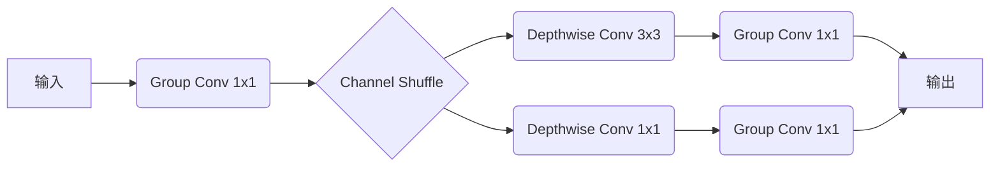
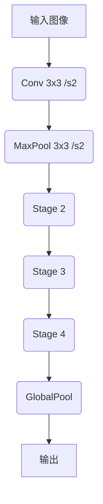

# ShuffleNet原理与代码实例讲解

## 1.背景介绍

### 1.1 深度神经网络的发展历程

随着深度学习技术的不断发展,神经网络模型也在不断演进。早期的神经网络模型如LeNet、AlexNet等,主要由全连接层和卷积层构成,参数量较小。但随着神经网络模型层数的增加,参数量也呈指数级增长,导致模型的计算量和存储开销急剧增加,给移动端等资源受限的设备带来了巨大挑战。

为了在保证模型精度的同时,降低计算量和模型大小,研究人员提出了多种模型压缩和加速技术,例如剪枝、量化、知识蒸馏等。同时,也涌现出一些专门为移动端设计的高效神经网络架构,如MobileNets、ShuffleNets等。这些模型通过特殊的设计,大幅降低了计算量和模型大小,使深度学习能够更好地部署在移动端和嵌入式设备上。

### 1.2 ShuffleNet的背景与意义

ShuffleNet就是这种背景下提出的一种高效的神经网络架构。它由旷视科技的研究人员于2017年在arXiv上发表,并被CVPR 2018收录。ShuffleNet的核心思想是在保持相同的计算量预算下,通过一些特殊的设计,最大程度地提高了模型的准确率。

ShuffleNet主要包含三个创新点:

1. PointWise Group Convolution
2. Channel Shuffle
3. Depthwise Separable Convolution

这三个创新点相互配合,使ShuffleNet在保持较高准确率的同时,大幅降低了计算量和模型大小。ShuffleNet在多个视觉任务的Benchmark上均取得了优异的表现,在ImageNet分类任务上,ShuffleNet的Top-1准确率为70.9%,但计算量只有MobileNet v1的1/13,模型大小只有1/4。

ShuffleNet的提出,为移动端深度学习应用的部署提供了新的可能,也为神经网络模型的高效设计提供了新的思路。

## 2.核心概念与联系

### 2.1 Group Convolution

Group Convolution是ShuffleNet的核心创新点之一。在传统的卷积操作中,输入和卷积核之间是全部连接的。但Group Convolution则将输入通道和卷积核分组,每组内部连接,组与组之间不连接。具体来说,假设输入通道数为c,卷积核数为k,可以将输入通道划分为g组,每组c/g个通道,同时将卷积核也划分为g组,每组k/g个核。这样每组卷积核只与对应的输入通道组连接,从而大幅减少了计算量。

Group Convolution可以表示为:

$$y_k = \sum_{i \in \mathcal{G}_k} x_i * w_{k,i}$$

其中$\mathcal{G}_k$表示与第k组卷积核连接的输入通道集合。

当g=1时,就是标准的全连接卷积;当g=c时,每个卷积核只与一个输入通道连接,这就是Depthwise Convolution。Group Convolution可以看作是两者的一种折中和泛化。

### 2.2 Channel Shuffle

虽然Group Convolution可以减少计算量,但它也存在一个缺陷:每个卷积核组只能看到对应的输入通道组,无法利用全部输入通道的信息。为了解决这个问题,ShuffleNet提出了Channel Shuffle操作。

Channel Shuffle的作用是打乱输入通道的组合方式,使得每个卷积核组在后续层都能够接收到所有通道的信息。具体来说,对于一个有g组的Group Convolution层,Channel Shuffle将其输出重新组合,第一个通道来自第一组,第二个通道来自第二组,...,第g+1个通道再次来自第一组,依此类推。这样一个Shuffle之后,所有通道信息就被重新打散并重组,每个卷积核组都能够接收到所有输入通道的信息。

Channel Shuffle操作可以表示为:

$$\tilde{x}_{(g\lfloor\frac{i}{g}\rfloor+j)\bmod{gc}}=x_i, \quad \forall i\in\{0,1,2,...,c-1\}$$

其中$\tilde{x}$表示Shuffle后的输出,c为输入通道数,g为分组数量。

Channel Shuffle操作非常简单高效,只需按通道重排序,不增加任何计算量。它让ShuffleNet能够在降低计算量的同时,仍然保持较高的准确率。

### 2.3 Depthwise Separable Convolution

Depthwise Separable Convolution是MobileNets中提出的一种高效卷积操作,ShuffleNet也采用了这种操作。它将标准卷积分解为两个更小的卷积核:Depthwise Convolution和Pointwise Convolution。

Depthwise Convolution对每个输入通道分别做卷积,使用的卷积核只有一个通道,大小为$d_k \times d_k$。然后Pointwise Convolution对所有通道的输出做$1\times 1$的标准卷积,来融合通道信息。

Depthwise Separable Convolution可以大幅减少计算量,同时保持较高的精度。它可以表示为:

$$y = \sum_{k=1}^{C_{in}}(x_k*w_{d_k})*w_{p_k}$$

其中$x_k$和$w_{d_k}$分别表示第k个输入通道和对应的Depthwise卷积核,$w_{p_k}$表示第k个Pointwise卷积核。

### 2.4 核心创新点的联系

ShuffleNet的三个核心创新点相互配合,构成了一个高效而精确的网络架构:

1. Group Convolution降低了计算量
2. Channel Shuffle打通了信息通路
3. Depthwise Separable Convolution进一步降低了计算量

Group Convolution将输入通道和卷积核分组,大幅降低了计算量,但也割裂了不同组之间的信息流通。Channel Shuffle操作则重新打乱和重组通道,让每个组都能够接收到所有输入信息。Depthwise Separable Convolution在降低计算量的同时,也保持了较高的精度。

三者的融合使ShuffleNet在降低计算量和模型大小的同时,仍能保持较高的准确率,成为移动端深度学习应用的有力选择。

## 3.核心算法原理具体操作步骤 

### 3.1 ShuffleNet单元

ShuffleNet的基本单元由上述三个核心操作构成,如下图所示:

具体操作步骤如下:

1. 对输入特征图做1x1的Group Convolution,将通道划分为几组
2. 对Group Conv的输出做Channel Shuffle操作,重组通道
3. 分两路:
    - 一路做3x3的Depthwise Convolution捕获特征
    - 另一路做1x1的Depthwise Convolution,作为shortcut连接
4. 两路输出再分别做1x1的Group Convolution,将通道合并
5. 将两路输出在通道维度上拼接

这个基本单元结合了三个创新点,实现了高效的特征提取和信息流动。通过堆叠多个这样的单元,就构成了完整的ShuffleNet网络。

### 3.2 ShuffleNet架构

ShuffleNet的整体架构由多个上述基本单元堆叠而成,并加入了一些辅助设计,如下图所示:

具体架构细节:

1. 开头使用标准卷积层提取初始特征
2. 使用最大池化层进行下采样
3. Stage 2-4为堆叠的ShuffleNet基本单元,每个Stage内部单元结构相同
    - Stage 2使用步长2的3x3 Depthwise Conv进行下采样
    - Stage 3使用步长2的3x3 Depthwise Conv进行下采样 
    - Stage 4不做下采样
4. 最后使用全局池化层将特征融合
5. 全连接层和Softmax输出分类结果

除了基本单元外,ShuffleNet还引入了一些优化策略:

- 线性瓶颈: 为了进一步降低计算量,ShuffleNet在Group Conv之前,先使用1x1的Group Conv将通道数降低,之后再恢复,形成"瓶颈"结构。
- 通道分组切换: 不同Stage之间,通道分组方式发生改变,增加了模型的非线性和表达能力。

这些设计使得ShuffleNet在ImageNet上取得了优异的表现,Top-1准确率达到70.9%,但计算量只有MobileNet v1的1/13,模型大小只有1/4。

## 4.数学模型和公式详细讲解举例说明

### 4.1 Group Convolution公式推导

Group Convolution是将输入通道和卷积核分组,组内全连接,组间不连接。设输入特征图$X$有$C_{in}$个通道,卷积核$W$有$C_{out}$个,将输入通道划分为$g$组,每组$\frac{C_{in}}{g}$个通道,同时将卷积核也划分为$g$组,每组$\frac{C_{out}}{g}$个核。

对于第$k$组输入$X_k$和第$k$组卷积核$W_k$,它们的卷积可以表示为:

$$Y_k = X_k * W_k$$

其中$*$表示标准卷积操作。

对所有$g$组输出$Y_k$在通道维度上拼接,就得到了Group Convolution的输出$Y$:

$$Y = \bigoplus_{k=1}^g Y_k = \bigoplus_{k=1}^g (X_k * W_k)$$

其中$\bigoplus$表示通道拼接操作。

将Group Convolution的计算量与标准卷积相比,可以看到计算量减少了$\frac{1}{g}$倍。当$g=1$时,就等于标准卷积;当$g=C_{in}$时,每个卷积核只与一个输入通道连接,这就是Depthwise Convolution。

### 4.2 Channel Shuffle公式推导

Channel Shuffle操作的目的是重新打乱和重组输入通道,使得每个卷积核组在后续层都能够接收到所有通道的信息。

设输入特征图$X$有$C$个通道,将其划分为$g$组,每组$\frac{C}{g}$个通道。Channel Shuffle将重新排列通道顺序,生成新的输出特征图$\tilde{X}$。具体来说,第$i$个输出通道$\tilde{x}_i$来自于第$\lfloor\frac{i}{g}\rfloor$组的第$(i\bmod g)$个通道,即:

$$\tilde{x}_i = x_{g\lfloor\frac{i}{g}\rfloor+(i\bmod g)}$$

其中$\lfloor\cdot\rfloor$表示向下取整操作。

将这个公式推广到所有通道,可以得到Channel Shuffle的完整公式:

$$\tilde{x}_{(g\lfloor\frac{i}{g}\rfloor+j)\bmod{C}}=x_i, \quad \forall i\in\{0,1,2,...,C-1\}$$

可以看出,Channel Shuffle操作非常简单高效,只需要对通道重新排序,不增加任何计算量,但能够有效打通信息流动,提高模型的表达能力。

### 4.3 Depthwise Separable Convolution公式推导

Depthwise Separable Convolution将标准卷积分解为两个更小的卷积核:Depthwise Convolution和Pointwise Convolution。

对于输入特征图$X$,它有$C_{in}$个通道。Depthwise Convolution对每个输入通道$x_k$分别做卷积,使用的卷积核$w_{d_k}$只有一个通道,大小为$d_k \times d_k$:

$$y_k = x_k * w_{d_k}$$

然后Pointwise Convolution对所有通道的输出$y_k$做$1\times 1$的标准卷积,来融合通道信息:

$$z_l = \sum_{k=1}^{C_{in}} y_k * w_{p_{k,l}}$$

其中$w_{p_{k,l}}$表示第$l$个输出通道与