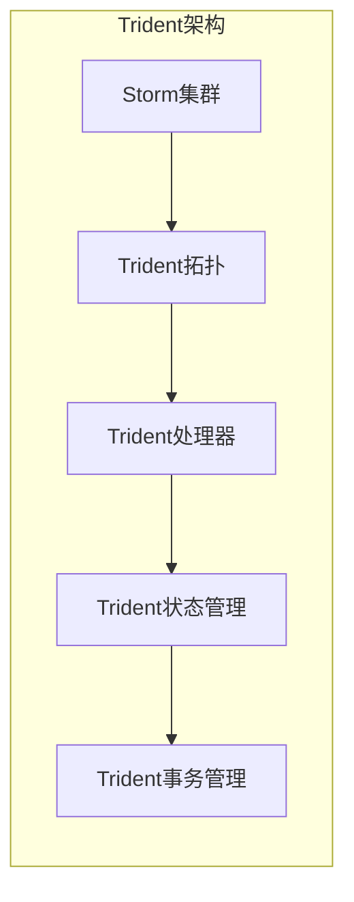

# Storm Trident原理与代码实例讲解

## 1.背景介绍

在当今大数据时代，实时流式计算已经成为了一种越来越重要的数据处理范式。Apache Storm是一个分布式的实时计算系统,它能够可靠地处理高吞吐量的数据流。Storm Trident是Storm的一个高级抽象,它提供了一种更加简单和高效的方式来执行流式计算任务。

Trident的设计目标是为了简化有状态流处理的开发过程,同时提供一次性精确处理语义、事务性重播和增量处理等高级功能。它基于微批次(micro-batching)的概念,将流数据切分为一个个小批次,并以批处理的方式进行处理。这种设计使得Trident能够更好地利用批处理优化技术,从而提高计算效率。

## 2.核心概念与联系

### 2.1 Spout(数据源)

Spout是Storm流式计算拓扑中的数据源,它从外部数据源(如Kafka、HDFS等)读取数据,并将其注入到Storm拓扑中。在Trident中,Spout需要实现`IBatchSpout`接口,该接口定义了如何从外部源读取数据并将其打包成批次。

### 2.2 Stream(数据流)

Stream代表了一个无边界的数据流,它由无限个Tuple(Storm中的数据单元)组成。在Trident中,Stream可以通过对Spout的输出进行变换(Transformation)而产生,也可以通过多个Stream之间的操作(如联合、合并等)而产生。

### 2.3 Operation(操作)

Operation是Trident中的核心概念之一,它定义了对Stream进行的各种变换和操作。Trident提供了丰富的操作集,包括过滤(Filter)、投影(Project)、聚合(Aggregate)、Join、函数(Function)等。这些操作可以组合在一起,构建出复杂的实时计算流程。

### 2.4 State(状态)

在实时流式计算中,维护状态信息是一个常见的需求。Trident提供了一种优雅的方式来管理和更新状态,它将状态抽象为一个查询函数(Query Function)和一个状态更新器(State Updater)。这种设计使得状态管理变得简单和高效。

### 2.5 Topology(拓扑)

Topology是Storm和Trident中的核心概念,它定义了整个实时计算流程。在Trident中,Topology由Spout、Stream、Operation和State等组件组成,这些组件通过有向无环图(DAG)的形式连接在一起。

### 2.6 Trident核心架构

Trident的核心架构由以下几个关键组件组成:

- `Storm`集群: Trident构建在Storm之上,利用Storm的分布式流式计算能力。
- `Trident`拓扑: 定义了整个实时计算流程,包括Spout、Stream、Operation和State等组件。
- `Trident`处理器: 执行实际的计算任务,如聚合、函数应用等。
- `Trident`状态管理: 管理和更新计算过程中的状态信息。
- `Trident`事务管理: 确保数据处理的一次性精确语义和事务性重播。

这些组件协同工作,为开发人员提供了一种简单而强大的实时计算框架。



## 3.核心算法原理具体操作步骤

### 3.1 Trident的工作原理

Trident的工作原理可以概括为以下几个步骤:

1. **数据注入**: Spout从外部数据源读取数据,并将其注入到Trident拓扑中。

2. **微批处理**: Trident将流数据切分为一个个小批次(micro-batches),每个批次包含一定数量的Tuple。

3. **有向无环图(DAG)执行**: Trident根据定义的拓扑结构,按照DAG的顺序执行各种Operation。

4. **状态管理**: 在计算过程中,Trident根据需要查询和更新相关的状态信息。

5. **事务性重播**: 如果在计算过程中出现故障,Trident会自动重播相关的批次,确保数据处理的一次性精确语义。

6. **增量处理**: Trident支持增量处理,只对发生变化的数据进行计算,提高了计算效率。

7. **结果输出**: 最终计算结果可以输出到外部系统(如HDFS、HBase等)进行持久化存储。

这种基于微批处理的设计,使得Trident能够在保证低延迟的同时,利用批处理优化技术提高计算效率。同时,Trident还提供了一次性精确处理语义、事务性重播和增量处理等高级功能,简化了有状态流处理的开发过程。

### 3.2 Trident核心算法流程

Trident的核心算法流程可以用以下伪代码表示:

```
function TridentProcessing(stream, topology):
    batches = partition(stream, batchSize)
    for batch in batches:
        txid = beginTransaction()
        try:
            processedBatch = executeDag(batch, topology)
            updateState(processedBatch, txid)
            commitTransaction(txid)
        except Exception as e:
            rollbackTransaction(txid)
            replayBatch(batch)
    return processedStream
```

这个算法的主要步骤如下:

1. 将输入流`stream`按照指定的`batchSize`切分为一个个小批次`batches`。

2. 对每个批次`batch`执行以下操作:
   - 开启一个新的事务`txid`。
   - 尝试执行拓扑`topology`中定义的有向无环图(DAG),对`batch`进行处理,得到处理后的批次`processedBatch`。
   - 使用`txid`更新相关的状态信息。
   - 提交事务`txid`。
   - 如果在执行过程中发生异常,则回滚事务`txid`,并重播该批次`batch`。

3. 最终返回处理后的流`processedStream`。

这个算法体现了Trident的几个核心特性:

- 微批处理: 将流数据切分为小批次进行处理。
- 有向无环图(DAG)执行: 按照拓扑定义的DAG顺序执行各种Operation。
- 状态管理: 使用事务`txid`来更新相关的状态信息。
- 事务性重播: 如果发生异常,回滚事务并重播相关批次,确保一次性精确处理语义。

通过这种算法,Trident能够高效地执行实时流式计算任务,同时提供了强大的容错能力和状态管理功能。

## 4.数学模型和公式详细讲解举例说明

在Trident中,一些常见的操作(如聚合、Join等)涉及到了数学模型和公式的应用。下面我们将详细讲解其中的一些重要概念和公式。

### 4.1 聚合操作

聚合操作是Trident中一种非常重要的操作,它用于对Stream中的数据进行汇总和统计。常见的聚合操作包括计数(Count)、求和(Sum)、最大/最小值(Max/Min)等。

聚合操作的数学模型可以用以下公式表示:

$$
\begin{align*}
\text{Aggregate}(S) &= \bigoplus_{x \in S} x \\
\text{Count}(S) &= \sum_{x \in S} 1 \\
\text{Sum}(S) &= \sum_{x \in S} x \\
\text{Max}(S) &= \max_{x \in S} x \\
\text{Min}(S) &= \min_{x \in S} x
\end{align*}
$$

其中:

- $S$ 表示输入的Stream或批次。
- $\bigoplus$ 表示聚合操作的二元运算符,如加法、取最大值等。
- $\text{Aggregate}(S)$ 表示对Stream $S$ 执行通用的聚合操作。
- $\text{Count}(S)$ 表示对Stream $S$ 执行计数操作。
- $\text{Sum}(S)$ 表示对Stream $S$ 执行求和操作。
- $\text{Max}(S)$ 表示对Stream $S$ 求最大值。
- $\text{Min}(S)$ 表示对Stream $S$ 求最小值。

例如,对于一个包含整数的Stream $S = \{1, 3, 5, 7\}$,我们可以计算:

- $\text{Count}(S) = 4$
- $\text{Sum}(S) = 1 + 3 + 5 + 7 = 16$
- $\text{Max}(S) = 7$
- $\text{Min}(S) = 1$

### 4.2 Join操作

Join操作用于将两个或多个Stream合并为一个Stream,它是实现数据集成和关联分析的关键操作。Trident支持多种Join策略,包括内连接(Inner Join)、左外连接(Left Outer Join)、右外连接(Right Outer Join)和全外连接(Full Outer Join)等。

Join操作的数学模型可以用集合论的概念来表示。假设有两个Stream $S_1$ 和 $S_2$,它们的Join操作可以用以下公式表示:

$$
\begin{align*}
\text{InnerJoin}(S_1, S_2) &= \{(x, y) | x \in S_1, y \in S_2, \text{condition}(x, y)\} \\
\text{LeftOuterJoin}(S_1, S_2) &= \text{InnerJoin}(S_1, S_2) \cup \{(x, \text{null}) | x \in S_1, \nexists y \in S_2, \text{condition}(x, y)\} \\
\text{RightOuterJoin}(S_1, S_2) &= \text{InnerJoin}(S_1, S_2) \cup \{(\text{null}, y) | y \in S_2, \nexists x \in S_1, \text{condition}(x, y)\} \\
\text{FullOuterJoin}(S_1, S_2) &= \text{LeftOuterJoin}(S_1, S_2) \cup \text{RightOuterJoin}(S_1, S_2)
\end{align*}
$$

其中:

- $\text{condition}(x, y)$ 表示Join操作的条件函数,用于判断元素 $x$ 和 $y$ 是否满足Join条件。
- $\text{InnerJoin}(S_1, S_2)$ 表示对 $S_1$ 和 $S_2$ 执行内连接操作,只保留满足条件的元素对。
- $\text{LeftOuterJoin}(S_1, S_2)$ 表示对 $S_1$ 和 $S_2$ 执行左外连接操作,保留 $S_1$ 中所有元素,对于不满足条件的元素,将 $S_2$ 中的元素设为 `null`。
- $\text{RightOuterJoin}(S_1, S_2)$ 表示对 $S_1$ 和 $S_2$ 执行右外连接操作,保留 $S_2$ 中所有元素,对于不满足条件的元素,将 $S_1$ 中的元素设为 `null`。
- $\text{FullOuterJoin}(S_1, S_2)$ 表示对 $S_1$ 和 $S_2$ 执行全外连接操作,保留两个Stream中所有元素,对于不满足条件的元素,将另一个Stream中的元素设为 `null`。

例如,假设有两个Stream $S_1 = \{1, 2, 3\}$ 和 $S_2 = \{2, 3, 4\}$,并定义条件函数为 $\text{condition}(x, y) = (x = y)$,则:

- $\text{InnerJoin}(S_1, S_2) = \{(2, 2), (3, 3)\}$
- $\text{LeftOuterJoin}(S_1, S_2) = \{(1, \text{null}), (2, 2), (3, 3)\}$
- $\text{RightOuterJoin}(S_1, S_2) = \{(2, 2), (3, 3), (\text{null}, 4)\}$
- $\text{FullOuterJoin}(S_1, S_2) = \{(1, \text{null}), (2, 2), (3, 3), (\text{null}, 4)\}$

通过这些数学模型和公式,我们可以更好地理解Trident中聚合和Join等操作的本质,并为实现更加复杂的实时计算逻辑提供理论基础。

## 5.项目实践：代码实例和详细解释说明

为了更好地理解Trident的使用方式,我们将通过一个实际的项目实践来演示如何使用Trident进行实时流式计算。

### 5.1 项目背景

假设我们需要实时统计一个电