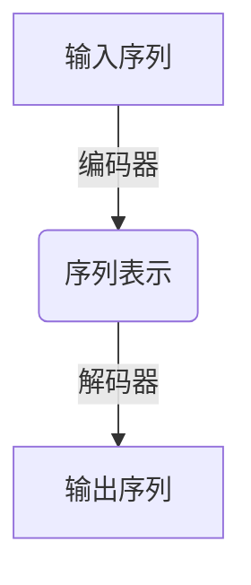
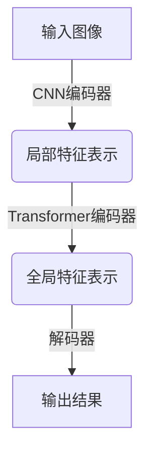
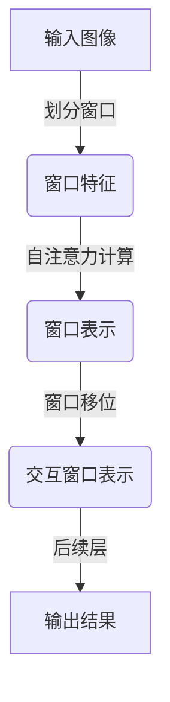

# SwinTransformer的卷积偏置调整

## 1.背景介绍

### 1.1 卷积神经网络的发展历程

卷积神经网络(Convolutional Neural Networks, CNN)是深度学习领域中一种非常成功和广泛应用的网络模型。自从AlexNet在2012年ImageNet大赛上取得巨大成功后,CNN在计算机视觉任务中展现出了强大的能力,并逐渐成为主流模型。随后,VGGNet、GoogLeNet、ResNet等网络架构不断被提出,进一步提升了CNN在图像分类、目标检测、语义分割等视觉任务上的性能表现。

### 1.2 视觉transformer模型的兴起

尽管CNN在处理网格结构数据(如图像)方面表现出色,但对于处理非规则数据(如点云、图像等)就显得力不从心。与此同时,Transformer模型凭借自注意力机制在自然语言处理领域取得了巨大成功,激发了研究者将Transformer应用于计算机视觉任务的想法。2020年,Vision Transformer(ViT)被提出,首次将Transformer直接应用于图像数据,并在ImageNet分类任务上取得了可观的性能。这为视觉Transformer模型在计算机视觉领域的应用奠定了基础。

### 1.3 SwinTransformer的提出

尽管ViT取得了一定成功,但它存在一些缺陷,如对图像的局部特征建模能力较差、计算量大等。为了解决这些问题,2021年,微软亚洲研究院的研究人员提出了SwinTransformer。SwinTransformer融合了CNN和Transformer的优点,通过引入移位窗口机制,实现了高效的自注意力计算,同时保留了CNN对局部特征的建模能力。该模型在多个视觉任务上均取得了优异的性能表现,成为视觉Transformer模型的一个重要里程碑。

## 2.核心概念与联系

### 2.1 Transformer模型

Transformer是一种基于自注意力机制的序列到序列模型,最初被成功应用于自然语言处理任务。它主要由编码器(Encoder)和解码器(Decoder)两个部分组成。编码器负责将输入序列映射为高维向量表示,解码器则根据编码器的输出和输入序列生成目标序列。

Transformer的核心是多头自注意力机制(Multi-Head Attention),它允许模型捕捉输入序列中任意两个元素之间的关系,从而更好地建模长距离依赖关系。与RNN等序列模型相比,Transformer具有并行计算的优势,可以更高效地利用GPU资源进行训练。

### 2.2 CNN与Transformer的融合

CNN擅长捕捉局部特征,但难以有效建模长距离依赖关系。而Transformer则具有全局感受野,能够很好地捕捉长距离依赖,但对局部特征的建模能力较差。因此,将两者的优点结合,有望获得更加强大的视觉模型。

早期的一些工作尝试将Transformer直接应用于图像数据,但由于计算量过大、缺乏感受野归纳偏置等问题,性能并不理想。SwinTransformer通过移位窗口机制,实现了高效的自注意力计算,同时保留了CNN对局部特征的建模能力,从而获得了卓越的性能表现。

### 2.3 移位窗口机制

移位窗口机制是SwinTransformer的核心创新点。它将输入图像分割为若干个非重叠窗口,在每个窗口内计算自注意力,从而大大降低了计算复杂度。同时,为了保证模型能够捕捉到跨窗口的长距离依赖关系,SwinTransformer引入了窗口移位操作,使得不同窗口之间的特征能够在后续层进行交互。

## 3.核心算法原理具体操作步骤

SwinTransformer的核心算法原理可以概括为以下几个主要步骤:

1. **图像分块**: 将输入图像分割为多个非重叠的窗口块,每个窗口块内的像素被视为一个向量序列。

2. **窗口内自注意力计算**: 在每个窗口块内,应用标准的多头自注意力机制,捕捉窗口内像素之间的长距离依赖关系。

3. **移位窗口**: 对窗口进行移位操作,使得不同窗口之间的特征能够在后续层进行交互,从而建模跨窗口的长距离依赖。

4. **层范围内特征交互**: 通过层归一化(Layer Normalization)和残差连接,实现同一层内不同窗口之间的特征交互。

5. **层间特征交互**: 通过多层堆叠,实现不同层之间的特征交互,捕捉不同尺度的特征表示。

6. **上采样和特征融合**: 在解码器阶段,对低分辨率特征图进行上采样,并与浅层特征图进行融合,以获得高分辨率的输出。

下面将详细介绍这些步骤的具体实现细节。

### 3.1 图像分块

SwinTransformer将输入图像$I\in\mathbb{R}^{H\times W\times C}$分割为$M\times N$个非重叠的窗口块,每个窗口块大小为$h\times w$。具体来说,对于图像中的任意位置$(x,y)$,它所属的窗口块索引$(m,n)$可以通过以下公式计算:

$$
\begin{aligned}
m &= \lfloor x/h \rfloor \\
n &= \lfloor y/w \rfloor
\end{aligned}
$$

其中,$\lfloor\cdot\rfloor$表示向下取整操作。

在每个窗口块内,像素被视为一个长度为$hw$的向量序列,即$\mathbf{x}_{m,n}\in\mathbb{R}^{hw\times C}$。这样一来,原始的二维图像就被重排为一个三维张量$\mathbf{X}\in\mathbb{R}^{M\times N\times hw\times C}$,其中每个$(m,n)$位置对应一个窗口块向量序列。

### 3.2 窗口内自注意力计算

在每个窗口块内,SwinTransformer应用标准的多头自注意力机制,捕捉窗口内像素之间的长距离依赖关系。具体来说,对于第$l$层的输入$\mathbf{X}^l\in\mathbb{R}^{M\times N\times hw\times C}$,自注意力计算过程如下:

1. 线性投影:将输入$\mathbf{X}^l$分别投影到查询(Query)、键(Key)和值(Value)空间,得到$\mathbf{Q}^l$、$\mathbf{K}^l$和$\mathbf{V}^l$。

2. 自注意力计算:对于每个窗口块$(m,n)$,计算其内部像素之间的自注意力权重:

$$
\mathbf{A}_{m,n}^l = \mathrm{Attention}(\mathbf{Q}_{m,n}^l, \mathbf{K}_{m,n}^l, \mathbf{V}_{m,n}^l)
$$

其中,Attention函数表示标准的缩放点积自注意力计算。

3. 多头融合:将多个注意力头的结果进行拼接和线性投影,得到该层的输出$\mathbf{Z}^l$。

通过这一步骤,SwinTransformer在每个窗口块内捕捉了像素之间的长距离依赖关系,但不同窗口之间的特征还未能交互。

### 3.3 移位窗口

为了使不同窗口之间的特征能够在后续层进行交互,SwinTransformer引入了移位窗口(Shift Window)操作。具体来说,在奇数层,窗口按照如下方式移位:

$$
\begin{aligned}
m' &= m \\
n' &= (n + \lfloor M/2 \rfloor) \bmod N
\end{aligned}
$$

而在偶数层,窗口按照如下方式移位:

$$
\begin{aligned}
m' &= (m + \lfloor N/2 \rfloor) \bmod M \\
n' &= n
\end{aligned}
$$

其中,mod表示取模运算。通过这种移位策略,不同窗口之间的特征在连续的两层之间就能够进行交互,从而捕捉到跨窗口的长距离依赖关系。

### 3.4 层范围内特征交互

在同一层内,SwinTransformer通过层归一化(Layer Normalization)和残差连接,实现了不同窗口之间的特征交互。具体来说,对于第$l$层的输出$\mathbf{Z}^l$,有:

$$
\mathbf{X}^{l+1} = \mathbf{X}^l + \mathrm{LN}(\mathbf{Z}^l)
$$

其中,LN表示层归一化操作。由于移位窗口操作的存在,不同窗口的特征在该层内就能够相互影响和交互。

### 3.5 层间特征交互

通过多层堆叠,SwinTransformer实现了不同层之间的特征交互,从而捕捉不同尺度的特征表示。具体来说,对于第$l$层的输出$\mathbf{X}^{l+1}$,它将作为下一层$(l+1)$的输入,重复执行窗口内自注意力计算、移位窗口和层范围内特征交互等步骤。

通过这种层与层之间的特征交互,SwinTransformer能够有效地融合不同尺度的信息,提高模型的表现能力。

### 3.6 上采样和特征融合

在解码器阶段,SwinTransformer需要将低分辨率的特征图上采样到高分辨率,并与浅层特征图进行融合,以获得高质量的输出。这一步骤对于像素级密集预测任务(如语义分割)尤为重要。

SwinTransformer采用了一种简单而有效的上采样和特征融合策略。具体来说,对于解码器的第$l$层输出$\mathbf{X}^l_\text{dec}$,它首先被双线性上采样到目标分辨率,得到$\hat{\mathbf{X}}^l_\text{dec}$。然后,将其与相应尺度的浅层特征图$\mathbf{X}^l_\text{enc}$进行元素级相加,得到融合后的特征图:

$$
\mathbf{F}^l = \hat{\mathbf{X}}^l_\text{dec} + \mathbf{X}^l_\text{enc}
$$

这种简单的特征融合策略能够有效地整合来自编码器和解码器的不同尺度特征,提高模型的表现。

通过上述步骤,SwinTransformer成功地将CNN和Transformer的优点结合起来,实现了高效的自注意力计算和对局部特征的建模,从而在多个视觉任务上取得了卓越的性能表现。

## 4.数学模型和公式详细讲解举例说明

在上一节中,我们介绍了SwinTransformer的核心算法原理和具体操作步骤。现在,让我们深入探讨一下其中涉及的数学模型和公式,并通过具体的例子加深理解。

### 4.1 自注意力机制

自注意力机制是Transformer模型的核心,也是SwinTransformer中的关键组成部分。它能够捕捉输入序列中任意两个元素之间的关系,从而更好地建模长距离依赖关系。

在SwinTransformer中,自注意力计算过程如下:

1. 线性投影:将输入$\mathbf{X}\in\mathbb{R}^{N\times d}$分别投影到查询(Query)、键(Key)和值(Value)空间,得到$\mathbf{Q}$、$\mathbf{K}$和$\mathbf{V}$,其中:

$$
\begin{aligned}
\mathbf{Q} &= \mathbf{X}\mathbf{W}^Q \\
\mathbf{K} &= \mathbf{X}\mathbf{W}^K \\
\mathbf{V} &= \mathbf{X}\mathbf{W}^V
\