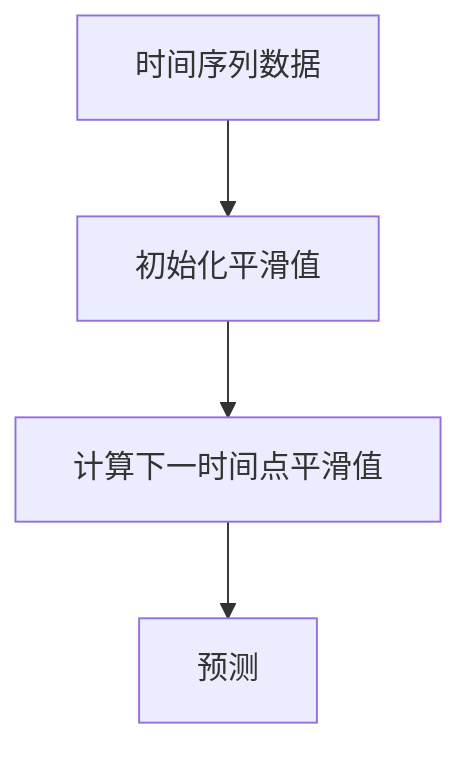
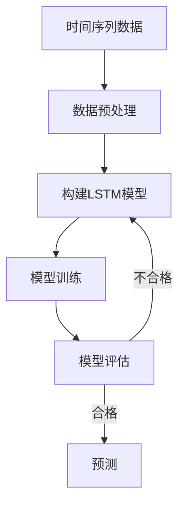

# Time Series Forecasting原理与代码实例讲解

## 1.背景介绍

时间序列预测是数据科学和机器学习领域的一个重要课题,广泛应用于金融、气象、能源、零售等诸多行业。随着大数据时代的到来,海量时间序列数据的采集和存储变得前所未有的便利,如何从这些数据中提取有价值的信息并进行准确预测,成为了当前研究的热点。

时间序列数据是按照时间顺序排列的一系列观测值,反映了研究对象在不同时间点的状态。与其他数据不同,时间序列数据具有时间相关性和趋势性等特点,因此需要特定的建模和预测方法。

时间序列预测旨在根据历史数据,捕捉数据中的模式和规律,构建数学模型,从而对未来的数据进行预测。准确的时间序列预测不仅可以帮助企业制定战略决策,优化资源配置,还可以为个人生活提供便利,如天气预报等。

## 2.核心概念与联系

时间序列预测涉及以下几个核心概念:

### 2.1 平稳性(Stationarity)

平稳性是指时间序列的统计属性(如均值、方差、自相关等)在时间上保持不变。平稳序列更容易建模和预测。非平稳序列需要进行差分或其他转换以达到平稳。

### 2.2 自相关(Autocorrelation)

自相关描述了时间序列在不同时间点之间的相关性。它反映了序列的内在结构,是构建时间序列模型的基础。自相关函数(ACF)和偏自相关函数(PACF)是常用的自相关分析工具。

### 2.3 白噪声(White Noise)

白噪声是指具有零均值、常数方差且不存在自相关的随机过程。它是构建时间序列模型的基础,也是检验模型残差的重要标准。

### 2.4 模型选择

根据数据的特征,选择合适的时间序列模型是预测的关键。常用模型包括自回归移动平均模型(ARIMA)、指数平滑模型、季节分解模型等。近年来,基于深度学习的序列模型(如RNN、LSTM等)也被广泛应用。

### 2.5 模型评估

通过评估指标(如均方根误差RMSE、平均绝对百分比误差MAPE等)来衡量模型的预测性能,从而选择最优模型。交叉验证等技术可用于防止过拟合。

## 3.核心算法原理具体操作步骤

### 3.1 ARIMA模型

ARIMA(AutoRegressive Integrated Moving Average)模型是时间序列分析中最经典和最常用的模型之一。它包含三个部分:自回归(AR)部分、积分(I)部分和移动平均(MA)部分。

1. 自回归(AR)部分描述了时间序列与其过去值之间的线性关系。
2. 积分(I)部分通过差分运算来消除非平稳性。
3. 移动平均(MA)部分描述了残差项之间的关系。

ARIMA模型的具体操作步骤如下:

```mermaid
graph TD
    A[时间序列数据] --> B[检查平稳性]
    B -->|非平稳| C[差分运算]
    C --> D[确定模型阶数p,d,q]
    D --> E[构建ARIMA(p,d,q)模型]
    E --> F[模型诊断]
    F -->|不合格| D
    F -->|合格| G[预测]
```

1. **检查平稳性**: 通过可视化、单位根检验等方法检查时间序列的平稳性。
2. **差分运算**: 对非平稳序列进行一阶或季节差分,使其达到平稳。
3. **确定模型阶数**: 通过自相关函数(ACF)和偏自相关函数(PACF)图,确定ARIMA模型的阶数p(AR阶数)、d(差分阶数)和q(MA阶数)。
4. **构建ARIMA模型**: 使用确定的阶数构建ARIMA(p,d,q)模型,并估计模型参数。
5. **模型诊断**: 检查模型残差是否为白噪声,判断模型是否合格。如果不合格,需要重新确定模型阶数。
6. **预测**: 使用合格的ARIMA模型对未来时间点进行预测。

### 3.2 指数平滑模型

指数平滑模型是一种基于加权移动平均的预测方法,它赋予最新观测值更大的权重。常用的指数平滑模型包括简单指数平滑、双重指数平滑(Holt模型)和三重指数平滑(Holt-Winters模型)。

以简单指数平滑为例,其操作步骤如下:



1. **初始化平滑值**: 将第一个观测值作为初始平滑值。
2. **计算下一时间点平滑值**: 根据当前观测值和上一时间点平滑值计算下一时间点的平滑值,公式为:$S_t = \alpha Y_t + (1 - \alpha)S_{t-1}$,其中$\alpha$为平滑系数,取值范围为0到1。
3. **预测**: 将最新的平滑值作为下一时间点的预测值。

指数平滑模型简单易用,适用于无明显趋势和季节性的时间序列。对于有趋势和季节性的序列,可以使用Holt模型和Holt-Winters模型。

### 3.3 深度学习模型

近年来,基于深度学习的序列模型在时间序列预测领域取得了卓越的成绩。常用的模型包括循环神经网络(RNN)、长短期记忆网络(LSTM)和门控循环单元(GRU)等。

以LSTM为例,其操作步骤如下:



1. **数据预处理**: 对时间序列数据进行标准化、缩放等预处理,以满足模型输入要求。
2. **构建LSTM模型**: 根据问题的特点,设计LSTM网络的层数、神经元数量等超参数,构建模型结构。
3. **模型训练**: 将预处理后的数据输入LSTM模型,通过反向传播算法优化模型参数,使模型在训练集上达到最佳性能。
4. **模型评估**: 在验证集或测试集上评估模型的预测性能,如果不合格,需要调整模型结构或超参数。
5. **预测**: 使用训练好的LSTM模型对未来时间点进行预测。

深度学习模型能够自动提取时间序列数据中的复杂模式,在处理非线性、非平稳序列时表现优异。但是,它们通常需要大量的训练数据,并且模型的可解释性较差。

## 4.数学模型和公式详细讲解举例说明

### 4.1 ARIMA模型

ARIMA(p,d,q)模型由自回归(AR)部分、积分(I)部分和移动平均(MA)部分组成,其数学表达式为:

$$
\begin{aligned}
y_t' &= c + \phi_1 y_{t-1}' + \phi_2 y_{t-2}' + \cdots + \phi_p y_{t-p}' \\
     &\quad + \theta_1 \epsilon_{t-1} + \theta_2 \epsilon_{t-2} + \cdots + \theta_q \epsilon_{t-q} + \epsilon_t
\end{aligned}
$$

其中:

- $y_t'$是经过d阶差分后的时间序列值
- $\phi_1, \phi_2, \cdots, \phi_p$是自回归系数
- $\theta_1, \theta_2, \cdots, \theta_q$是移动平均系数
- $\epsilon_t$是白噪声项,服从均值为0、方差为$\sigma^2$的正态分布

让我们以一个简单的ARIMA(1,1,1)模型为例,其表达式为:

$$y_t' = c + \phi_1 y_{t-1}' + \theta_1 \epsilon_{t-1} + \epsilon_t$$

假设我们有一个季节性时间序列数据,经过一阶差分后得到$y_t'$序列。我们可以使用ACF和PACF图来确定模型阶数为(1,1,1)。接下来,我们可以使用最小二乘法或最大似然估计法来估计模型参数$c$、$\phi_1$和$\theta_1$。

一旦模型参数估计完成,我们就可以使用该ARIMA(1,1,1)模型对未来时间点进行预测。例如,要预测时间点t+1的值$y_{t+1}$,我们可以使用以下公式:

$$\hat{y}_{t+1} = c + \phi_1 y_t' + \theta_1 \epsilon_t$$

其中,$\hat{y}_{t+1}$是时间点t+1的预测值,$y_t'$是时间点t的实际观测值(经过一阶差分),而$\epsilon_t$是时间点t的残差项。

通过上述示例,我们可以看到ARIMA模型是如何捕捉时间序列的自回归和移动平均结构,并基于这些结构对未来进行预测。

### 4.2 指数平滑模型

指数平滑模型的核心思想是对观测值进行加权移动平均,赋予最新观测值更大的权重。简单指数平滑模型的数学表达式为:

$$S_t = \alpha Y_t + (1 - \alpha)S_{t-1}$$

其中:

- $S_t$是时间点t的平滑值
- $Y_t$是时间点t的实际观测值
- $\alpha$是平滑系数,取值范围为0到1

平滑系数$\alpha$决定了对最新观测值和历史数据的权重分配。$\alpha$越大,模型对最新观测值的响应越敏感;$\alpha$越小,模型对历史数据的依赖越大。

让我们以一个具体的例子来说明简单指数平滑模型的工作原理。假设我们有一个时间序列数据$\{10, 12, 15, 9, 18\}$,我们希望使用简单指数平滑模型对第6个时间点进行预测。我们设置平滑系数$\alpha=0.3$,初始平滑值$S_0=10$。

1. 时间点1:$S_1 = 0.3 \times 12 + 0.7 \times 10 = 10.6$
2. 时间点2:$S_2 = 0.3 \times 15 + 0.7 \times 10.6 = 12.12$
3. 时间点3:$S_3 = 0.3 \times 9 + 0.7 \times 12.12 = 11.088$
4. 时间点4:$S_4 = 0.3 \times 18 + 0.7 \times 11.088 = 13.1616$
5. 时间点5:预测值为$\hat{Y}_6 = S_4 = 13.1616$

通过上述计算过程,我们可以看到指数平滑模型如何利用加权移动平均的方式,结合最新观测值和历史数据,对未来时间点进行预测。

## 5.项目实践:代码实例和详细解释说明

在这一部分,我们将使用Python中的时间序列分析库statsmodels和pmdarima,通过实际代码示例来演示ARIMA模型的构建和预测过程。

### 5.1 数据准备

我们将使用著名的航空公司乘客人数月度数据集作为示例。该数据集记录了1949年1月至1960年12月期间的国际航空公司每月总乘客人数(单位:千人次)。

```python
import pandas as pd

# 加载数据
air_passengers = pd.read_csv('AirPassengers.csv', parse_dates=['Month'], index_col='Month')
air_passengers.head()
```

```
            Passengers
Month                 
1949-01-01    112.0
1949-02-01    118.0
1949-03-01    132.0
1949-04-01    129.0
1949-05-01    121.0
```

### 5.2 数据可视化和平稳性检查

我们首先对数据进行可视化,并检查其平稳性。

```python
import matplotlib.pyplot as plt
from statsmodels.tsa.stattools import adfuller

# 绘制时间序列图
air_passengers.plot(figsize=(12, 6))
plt.title('Air Passengers')
plt.show()

# 平稳性检查