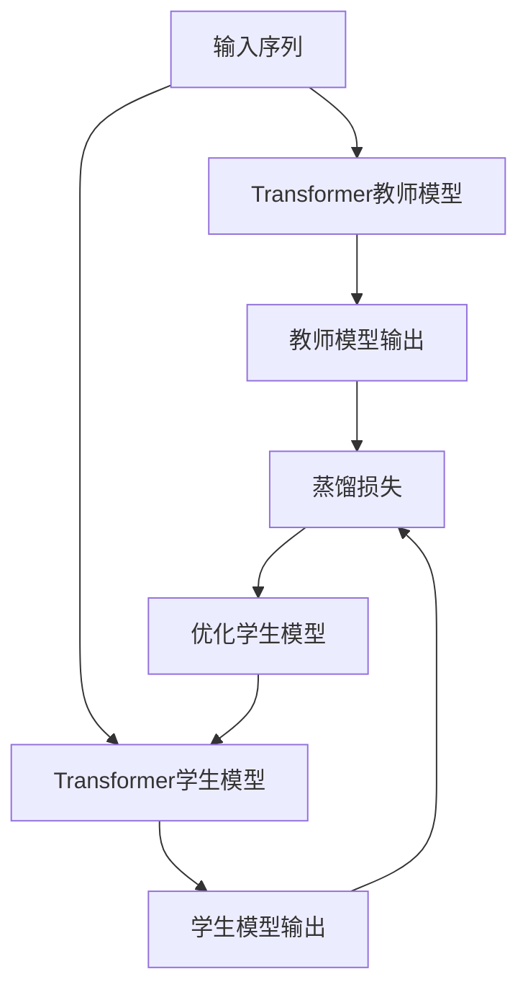

# Transformer大模型实战 教师/学生架构

## 1. 背景介绍
### 1.1 大模型的发展历程
#### 1.1.1 早期的神经网络模型
#### 1.1.2 Transformer的诞生
#### 1.1.3 预训练语言模型的兴起
### 1.2 教师/学生架构的提出
#### 1.2.1 知识蒸馏的概念
#### 1.2.2 教师/学生架构的优势
### 1.3 Transformer与教师/学生架构的结合
#### 1.3.1 Transformer在NLP领域的成功应用
#### 1.3.2 教师/学生架构在模型压缩中的应用

## 2. 核心概念与联系
### 2.1 Transformer的核心概念
#### 2.1.1 自注意力机制
#### 2.1.2 位置编码
#### 2.1.3 残差连接与层归一化
### 2.2 教师/学生架构的核心概念  
#### 2.2.1 知识蒸馏
#### 2.2.2 软目标与硬目标
#### 2.2.3 蒸馏损失函数
### 2.3 Transformer与教师/学生架构的联系
#### 2.3.1 Transformer作为教师模型
#### 2.3.2 轻量化的Transformer作为学生模型

## 3. 核心算法原理具体操作步骤
### 3.1 Transformer的训练过程
#### 3.1.1 数据预处理
#### 3.1.2 模型构建
#### 3.1.3 训练与优化
### 3.2 教师/学生架构的训练过程
#### 3.2.1 教师模型的训练
#### 3.2.2 学生模型的训练
#### 3.2.3 蒸馏损失的计算
### 3.3 推理与部署
#### 3.3.1 模型的保存与加载
#### 3.3.2 模型的推理与预测
#### 3.3.3 模型的部署与优化

## 4. 数学模型和公式详细讲解举例说明
### 4.1 Transformer的数学模型
#### 4.1.1 自注意力机制的数学表示
#### 4.1.2 位置编码的数学表示
#### 4.1.3 残差连接与层归一化的数学表示
### 4.2 教师/学生架构的数学模型
#### 4.2.1 知识蒸馏的数学表示
#### 4.2.2 软目标与硬目标的数学表示
#### 4.2.3 蒸馏损失函数的数学表示
### 4.3 数学模型的具体应用
#### 4.3.1 Transformer在机器翻译中的应用
#### 4.3.2 教师/学生架构在模型压缩中的应用

## 5. 项目实践：代码实例和详细解释说明
### 5.1 Transformer的代码实现
#### 5.1.1 数据预处理的代码实现
#### 5.1.2 模型构建的代码实现
#### 5.1.3 训练与优化的代码实现
### 5.2 教师/学生架构的代码实现
#### 5.2.1 教师模型的代码实现
#### 5.2.2 学生模型的代码实现
#### 5.2.3 蒸馏损失的代码实现
### 5.3 推理与部署的代码实现
#### 5.3.1 模型保存与加载的代码实现
#### 5.3.2 模型推理与预测的代码实现
#### 5.3.3 模型部署与优化的代码实现

## 6. 实际应用场景
### 6.1 机器翻译
#### 6.1.1 Transformer在机器翻译中的应用
#### 6.1.2 教师/学生架构在机器翻译模型压缩中的应用
### 6.2 文本分类
#### 6.2.1 Transformer在文本分类中的应用
#### 6.2.2 教师/学生架构在文本分类模型压缩中的应用
### 6.3 问答系统
#### 6.3.1 Transformer在问答系统中的应用
#### 6.3.2 教师/学生架构在问答系统模型压缩中的应用

## 7. 工具和资源推荐
### 7.1 开源框架
#### 7.1.1 TensorFlow
#### 7.1.2 PyTorch
#### 7.1.3 Hugging Face Transformers
### 7.2 预训练模型
#### 7.2.1 BERT
#### 7.2.2 RoBERTa
#### 7.2.3 DistilBERT
### 7.3 数据集
#### 7.3.1 WMT机器翻译数据集
#### 7.3.2 GLUE基准测试数据集
#### 7.3.3 SQuAD问答数据集

## 8. 总结：未来发展趋势与挑战
### 8.1 Transformer的发展趋势
#### 8.1.1 更大规模的预训练模型
#### 8.1.2 更高效的训练方法
#### 8.1.3 跨领域的应用拓展
### 8.2 教师/学生架构的发展趋势
#### 8.2.1 更高效的知识蒸馏方法
#### 8.2.2 更灵活的学生模型设计
#### 8.2.3 更广泛的应用场景
### 8.3 面临的挑战
#### 8.3.1 计算资源的限制
#### 8.3.2 模型解释性的问题
#### 8.3.3 数据隐私与安全的考量

## 9. 附录：常见问题与解答
### 9.1 Transformer与RNN的区别是什么？
### 9.2 教师/学生架构与直接训练小模型有什么区别？
### 9.3 知识蒸馏的过程中需要注意哪些问题？
### 9.4 如何选择合适的教师模型和学生模型？
### 9.5 教师/学生架构在实际应用中需要考虑哪些因素？

以上是一个使用Transformer作为教师模型和学生模型的知识蒸馏过程的示意图。输入序列首先经过预训练的Transformer教师模型，得到教师模型的输出。然后，同样的输入序列也经过Transformer学生模型，得到学生模型的输出。教师模型的输出和学生模型的输出之间的差异通过蒸馏损失函数来度量，并用于优化学生模型的参数。这个过程不断迭代，直到学生模型能够尽可能地逼近教师模型的性能。

Transformer作为一种强大的序列建模架构，在自然语言处理的各个任务中都取得了显著的成果。而教师/学生架构则提供了一种有效的方法，可以将大型Transformer模型的知识压缩到更小、更轻量化的模型中，在保持较高性能的同时大大降低了模型的计算开销和存储需求。

在实践中，Transformer教师模型通常是一个大规模的预训练语言模型，如BERT、GPT等。这些模型在大规模语料库上进行预训练，学习到了丰富的语言知识和上下文表征能力。而学生模型则可以是一个轻量化的Transformer变体，如DistilBERT、TinyBERT等。通过知识蒸馏，学生模型可以从教师模型中学习到关键的语言知识和推理能力，同时也大大减小了模型的尺寸和计算量。

在具体的训练过程中，教师模型和学生模型通常采用相同的输入数据。教师模型的输出作为软目标，指导学生模型的学习。同时，原始的标签信息也作为硬目标，与学生模型的输出进行比较。通过优化软目标和硬目标的加权组合，学生模型可以在保持较高准确率的同时，最大限度地吸收教师模型的知识。

数学模型方面，Transformer的核心是自注意力机制和位置编码。自注意力机制允许模型在处理每个位置的信息时，都能够考虑到序列中其他位置的信息。而位置编码则为模型引入了位置信息，使其能够捕捉到序列中的顺序关系。在教师/学生架构中，知识蒸馏的过程可以用交叉熵损失函数来表示，即最小化教师模型输出的软目标与学生模型输出的软目标之间的差异。

在实际应用中，Transformer教师/学生架构已经在机器翻译、文本分类、问答系统等任务中取得了广泛的成功。通过知识蒸馏，可以将大型Transformer模型的性能优势转移到更轻量化的模型中，从而在边缘设备、在线服务等资源受限的场景下实现高效的部署和推理。

展望未来，Transformer和教师/学生架构还有着广阔的发展空间。随着计算能力的不断提升，更大规模的预训练模型和更高效的训练方法将不断涌现。同时，知识蒸馏技术也在不断发展，提出了更为高效和灵活的蒸馏方法。未来，Transformer教师/学生架构有望在更多领域得到应用，如语音识别、图像处理等。但同时也面临着计算资源、模型解释性、数据隐私等方面的挑战，需要研究者们持续探索和攻克。

总之，Transformer教师/学生架构为大模型的应用部署提供了一种有效的解决方案。通过知识蒸馏，我们可以在保持模型性能的同时，大幅降低模型的计算开销和存储需求。这一架构的发展和应用，将为自然语言处理乃至整个人工智能领域带来深远的影响和变革。

作者：禅与计算机程序设计艺术 / Zen and the Art of Computer Programming