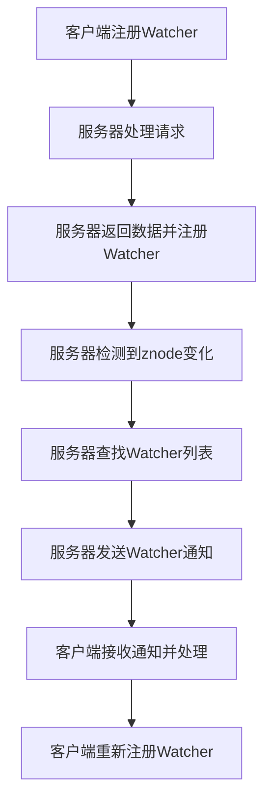

# Zookeeper Watcher机制原理与代码实例讲解

## 1.背景介绍

Zookeeper是一个分布式协调服务，广泛应用于分布式系统中，用于实现数据的同步、配置管理和命名服务等功能。Zookeeper的核心机制之一是Watcher机制，它允许客户端在Zookeeper节点上注册监听器，以便在节点数据或状态发生变化时接收通知。Watcher机制在分布式系统中具有重要意义，因为它提供了一种高效的方式来监控和响应数据变化。

## 2.核心概念与联系

### 2.1 Zookeeper节点

Zookeeper中的数据结构是一个树形结构，每个节点称为znode。znode可以存储数据，并且可以有子节点。znode有两种类型：持久节点和临时节点。持久节点在客户端断开连接后仍然存在，而临时节点在客户端断开连接后会被删除。

### 2.2 Watcher机制

Watcher机制是Zookeeper的一个重要特性，它允许客户端在znode上注册监听器。当znode的数据或状态发生变化时，Zookeeper会通知相应的客户端。Watcher是一次性的，即一旦触发，客户端需要重新注册Watcher以继续接收通知。

### 2.3 事件类型

Watcher机制支持多种事件类型，包括节点创建、节点删除、节点数据变化和子节点变化等。每种事件类型对应不同的Watcher通知。

### 2.4 客户端与服务器的交互

客户端通过Zookeeper API与服务器交互，注册Watcher并接收通知。服务器在检测到znode变化时，会将事件通知发送给相应的客户端。

## 3.核心算法原理具体操作步骤

### 3.1 Watcher注册

客户端通过调用Zookeeper API在znode上注册Watcher。注册Watcher的操作包括读取节点数据、获取子节点列表等。以下是Watcher注册的基本步骤：

1. 客户端向Zookeeper服务器发送读取节点数据或获取子节点列表的请求。
2. 服务器处理请求，并将节点数据或子节点列表返回给客户端。
3. 服务器在返回数据的同时，注册Watcher，以便在节点变化时通知客户端。

### 3.2 事件触发

当znode的数据或状态发生变化时，服务器会触发相应的Watcher事件。以下是事件触发的基本步骤：

1. 服务器检测到znode的数据或状态发生变化。
2. 服务器查找注册在该znode上的Watcher列表。
3. 服务器向注册的客户端发送Watcher通知。

### 3.3 Watcher通知

客户端接收到Watcher通知后，可以执行相应的处理逻辑。以下是Watcher通知的基本步骤：

1. 客户端接收到Watcher通知。
2. 客户端根据通知的事件类型，执行相应的处理逻辑。
3. 如果需要继续监控znode，客户端需要重新注册Watcher。

以下是Watcher机制的Mermaid流程图：



## 4.数学模型和公式详细讲解举例说明

Watcher机制可以用数学模型来描述。假设有一个znode $Z$，客户端 $C$ 在 $Z$ 上注册了一个Watcher $W$。当 $Z$ 的数据或状态发生变化时，Watcher $W$ 会被触发，通知客户端 $C$。

设 $Z$ 的初始状态为 $S_0$，变化后的状态为 $S_1$。Watcher $W$ 的触发条件可以表示为：

$$
W(Z) = \begin{cases} 
1 & \text{if } S_0 \neq S_1 \\
0 & \text{if } S_0 = S_1 
\end{cases}
$$

其中，$W(Z) = 1$ 表示Watcher被触发，$W(Z) = 0$ 表示Watcher未被触发。

举例说明：

假设有一个znode $Z$，其初始数据为 "data1"。客户端 $C$ 在 $Z$ 上注册了一个Watcher $W$。当 $Z$ 的数据变为 "data2" 时，Watcher $W$ 被触发，通知客户端 $C$。

初始状态 $S_0 = "data1"$，变化后的状态 $S_1 = "data2"$。根据Watcher触发条件：

$$
W(Z) = \begin{cases} 
1 & \text{if } "data1" \neq "data2" \\
0 & \text{if } "data1" = "data2" 
\end{cases}
$$

显然，$"data1" \neq "data2"$，因此 $W(Z) = 1$，Watcher被触发。

## 5.项目实践：代码实例和详细解释说明

### 5.1 环境准备

在开始代码实例之前，需要准备Zookeeper环境。可以通过以下步骤安装和启动Zookeeper：

1. 下载Zookeeper安装包：https://zookeeper.apache.org/releases.html
2. 解压安装包，并进入解压目录。
3. 配置Zookeeper：编辑 `conf/zoo.cfg` 文件，设置 `dataDir` 和 `clientPort`。
4. 启动Zookeeper：运行 `bin/zkServer.sh start`。

### 5.2 Java代码实例

以下是一个Java代码实例，演示如何在Zookeeper中注册Watcher并接收通知：

```java
import org.apache.zookeeper.*;
import org.apache.zookeeper.data.Stat;

import java.io.IOException;

public class ZookeeperWatcherExample {

    private static ZooKeeper zooKeeper;

    public static void main(String[] args) throws IOException, KeeperException, InterruptedException {
        // 连接Zookeeper服务器
        zooKeeper = new ZooKeeper("localhost:2181", 3000, new Watcher() {
            @Override
            public void process(WatchedEvent event) {
                System.out.println("Default Watcher: " + event);
            }
        });

        // 创建znode
        String path = "/example";
        if (zooKeeper.exists(path, false) == null) {
            zooKeeper.create(path, "data1".getBytes(), ZooDefs.Ids.OPEN_ACL_UNSAFE, CreateMode.PERSISTENT);
        }

        // 注册Watcher
        Stat stat = zooKeeper.exists(path, new Watcher() {
            @Override
            public void process(WatchedEvent event) {
                System.out.println("Watcher triggered: " + event);
                if (event.getType() == Event.EventType.NodeDataChanged) {
                    try {
                        byte[] data = zooKeeper.getData(path, false, null);
                        System.out.println("Data changed: " + new String(data));
                    } catch (Exception e) {
                        e.printStackTrace();
                    }
                }
            }
        });

        // 修改znode数据，触发Watcher
        zooKeeper.setData(path, "data2".getBytes(), stat.getVersion());

        // 保持程序运行
        Thread.sleep(5000);
        zooKeeper.close();
    }
}
```

### 5.3 代码解释

1. 连接Zookeeper服务器：通过 `new ZooKeeper("localhost:2181", 3000, new Watcher())` 连接Zookeeper服务器，并设置默认Watcher。
2. 创建znode：通过 `zooKeeper.create(path, "data1".getBytes(), ZooDefs.Ids.OPEN_ACL_UNSAFE, CreateMode.PERSISTENT)` 创建一个持久节点。
3. 注册Watcher：通过 `zooKeeper.exists(path, new Watcher())` 在znode上注册Watcher。
4. 修改znode数据：通过 `zooKeeper.setData(path, "data2".getBytes(), stat.getVersion())` 修改znode数据，触发Watcher。
5. 保持程序运行：通过 `Thread.sleep(5000)` 保持程序运行，以便接收Watcher通知。

## 6.实际应用场景

Watcher机制在分布式系统中有广泛的应用，以下是一些典型的应用场景：

### 6.1 配置管理

在分布式系统中，配置管理是一个重要的任务。通过Watcher机制，可以实现配置的动态更新。当配置文件发生变化时，Zookeeper会通知所有注册了Watcher的客户端，客户端可以及时更新配置。

### 6.2 服务发现

服务发现是分布式系统中的一个常见问题。通过Watcher机制，可以实现服务的动态注册和发现。当服务上线或下线时，Zookeeper会通知所有注册了Watcher的客户端，客户端可以及时更新服务列表。

### 6.3 分布式锁

分布式锁是分布式系统中常用的同步机制。通过Watcher机制，可以实现分布式锁的高效管理。当锁状态发生变化时，Zookeeper会通知所有注册了Watcher的客户端，客户端可以及时获取锁。

## 7.工具和资源推荐

### 7.1 Zookeeper官方文档

Zookeeper官方文档是学习和使用Zookeeper的最佳资源，提供了详细的API文档和使用指南。访问地址：https://zookeeper.apache.org/documentation.html

### 7.2 Zookeeper客户端工具

Zookeeper客户端工具可以帮助开发者方便地管理和调试Zookeeper集群。推荐使用Zookeeper命令行客户端和Zookeeper可视化管理工具（如ZKUI）。

### 7.3 开源项目

学习和参考开源项目是提高技术水平的有效途径。推荐一些使用Zookeeper的开源项目，如Apache Kafka、Apache HBase等。

## 8.总结：未来发展趋势与挑战

Zookeeper作为分布式协调服务，在分布式系统中发挥了重要作用。Watcher机制是Zookeeper的核心特性之一，提供了一种高效的方式来监控和响应数据变化。未来，随着分布式系统的不断发展，Zookeeper面临着更高的性能和可扩展性要求。如何在保证一致性的前提下，提高系统的吞吐量和响应速度，是Zookeeper未来发展的重要方向。同时，随着云计算和容器化技术的普及，Zookeeper在云原生环境中的应用也将面临新的挑战。

## 9.附录：常见问题与解答

### 9.1 Watcher是一次性的吗？

是的，Watcher是一次性的。一旦Watcher被触发，客户端需要重新注册Watcher以继续接收通知。

### 9.2 如何处理Watcher通知的延迟？

Watcher通知的延迟可能由网络延迟或服务器负载引起。可以通过优化网络环境和提高服务器性能来减少延迟。

### 9.3 Watcher机制是否支持批量操作？

Watcher机制不支持批量操作。每个Watcher只能监控一个znode的变化。如果需要监控多个znode，需要为每个znode注册Watcher。

### 9.4 如何处理Watcher通知的丢失？

Watcher通知的丢失可能由网络故障或客户端断开连接引起。可以通过重试机制和故障恢复策略来处理通知的丢失。

### 9.5 Watcher机制的性能如何？

Watcher机制的性能取决于Zookeeper集群的配置和负载。在高并发场景下，Watcher机制可能会对系统性能产生影响。可以通过优化Zookeeper集群配置和合理分配负载来提高性能。

---

作者：禅与计算机程序设计艺术 / Zen and the Art of Computer Programming