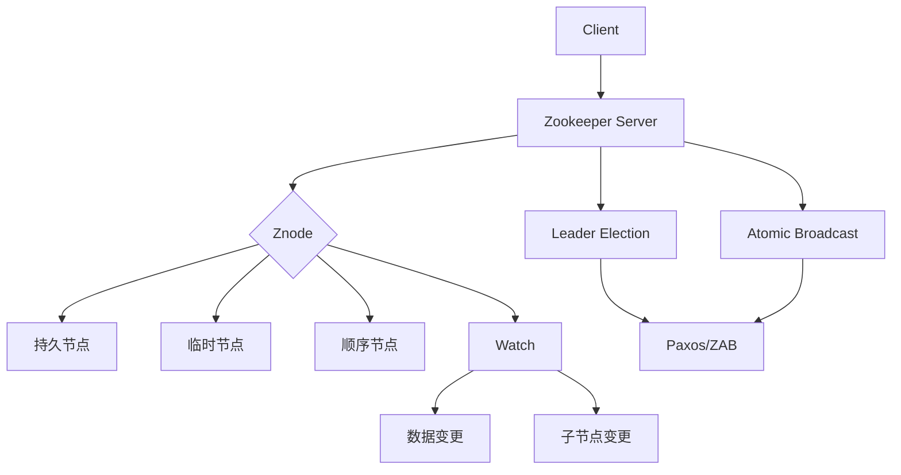

# Zookeeper原理与代码实例讲解

## 1. 背景介绍
### 1.1 Zookeeper的由来
### 1.2 Zookeeper在分布式系统中的地位
### 1.3 Zookeeper的主要应用场景

## 2. 核心概念与联系
### 2.1 数据模型
#### 2.1.1 Znode
#### 2.1.2 数据节点
#### 2.1.3 顺序节点
#### 2.1.4 临时节点
### 2.2 节点特性
#### 2.2.1 数据读写
#### 2.2.2 Watcher机制
#### 2.2.3 ACL权限控制
### 2.3 会话机制
### 2.4 Zookeeper集群
#### 2.4.1 Zookeeper集群角色
#### 2.4.2 ZAB协议
#### 2.4.3 Leader选举

## 3. 核心算法原理具体操作步骤
### 3.1 Paxos算法
#### 3.1.1 Paxos算法的提出背景
#### 3.1.2 Paxos算法的过程
#### 3.1.3 Paxos算法的优缺点
### 3.2 ZAB协议
#### 3.2.1 ZAB协议的产生背景
#### 3.2.2 ZAB协议的内容
#### 3.2.3 消息广播
#### 3.2.4 崩溃恢复
### 3.3 ZAB协议与Paxos算法的异同

## 4. 数学模型和公式详细讲解举例说明
### 4.1 Paxos算法的数学模型
### 4.2 ZAB协议的数学模型
### 4.3 Leader选举的数学模型

## 5. 项目实践：代码实例和详细解释说明 
### 5.1 搭建Zookeeper集群
#### 5.1.1 单机模式
#### 5.1.2 集群模式
#### 5.1.3 伪集群模式
### 5.2 使用Zookeeper实现分布式锁
#### 5.2.1 分布式锁的原理
#### 5.2.2 分布式锁的代码实现
#### 5.2.3 分布式锁的优化
### 5.3 使用Zookeeper实现服务注册与发现
#### 5.3.1 服务注册与发现原理
#### 5.3.2 服务注册与发现的代码实现
### 5.4 使用Zookeeper实现分布式队列
#### 5.4.1 分布式队列的原理
#### 5.4.2 分布式队列的代码实现

## 6. 实际应用场景
### 6.1 分布式协调
### 6.2 分布式锁
### 6.3 命名服务
### 6.4 配置管理
### 6.5 集群管理
### 6.6 分布式队列
### 6.7 分布式通知/协调

## 7. 工具和资源推荐
### 7.1 Zookeeper常用工具
#### 7.1.1 zkCli
#### 7.1.2 Curator
### 7.2 Zookeeper可视化工具
#### 7.2.1 ZooInspector
#### 7.2.2 PrettyZoo
### 7.3 Zookeeper的替代品
#### 7.3.1 etcd
#### 7.3.2 Consul

## 8. 总结：未来发展趋势与挑战
### 8.1 Zookeeper的发展历程
### 8.2 Zookeeper面临的挑战
### 8.3 Zookeeper的未来趋势

## 9. 附录：常见问题与解答
### 9.1 Zookeeper的常见问题
### 9.2 Zookeeper的最佳实践
### 9.3 Zookeeper的注意事项



Zookeeper是一个开源的分布式协调服务，由雅虎创建，是Google Chubby的开源实现。Zookeeper的主要功能包括配置维护、域名服务、分布式同步、组服务等。Zookeeper的目标就是封装好复杂易出错的关键服务，将简单易用的接口和性能高效、功能稳定的系统提供给用户。

Zookeeper具有以下特点：

1. 简单：Zookeeper的核心是一个精简的文件系统，提供一些简单的操作和抽象，易于使用和维护。

2. 丰富：Zookeeper提供了一些简单的数据结构，如点对点信息队列、分布式锁、统一命名服务等，满足大多数分布式系统场景的需求。

3. 高可靠：Zookeeper支持热备份，能够自动进行主备切换，保证系统的可靠性。

4. 易扩展：Zookeeper的客户端和服务端可以分别独立扩展，客户端只需要使用服务端暴露的简单接口，而不需要关心服务端的具体实现。

Zookeeper的数据模型是一棵树，与文件系统类似，每个节点称为一个Znode。Znode是Zookeeper中数据的最小单元，每个Znode都可以保存数据，同时还是可以有子节点。不同于文件系统，Znode没有目录的概念，但是路径表示Znode之间的父子关系。

Znode有四种类型：

1. PERSISTENT：持久节点，除非主动删除，否则一直存在。 

2. EPHEMERAL：临时节点，临时节点的生命周期与客户端会话绑定，一旦客户端会话失效（客户端与Zookeeper连接断开不一定会话失效），那么这个客户端创建的所有临时节点都会被移除。

3. PERSISTENT_SEQUENTIAL：持久顺序节点，基本特性同持久节点，额外特性是Zookeeper给该节点名称进行顺序编号。

4. EPHEMERAL_SEQUENTIAL：临时顺序节点，基本特性同临时节点，额外特性是Zookeeper给该节点名称进行顺序编号。

Zookeeper采用ZAB协议（Zookeeper Atomic Broadcast）来保证分布式事务的最终一致性。ZAB协议是一种基于主备模式的原子广播协议，核心思想与Paxos类似，但是更加简单高效。

ZAB协议定义了三种节点状态：Looking、Leading、Following，以及两种模式：崩溃恢复、消息广播。

当Zookeeper集群刚启动时，所有节点都处于Looking状态，通过Leader选举算法选举出一个Leader，其他节点成为Follower。当Leader节点宕机时，剩下的Follower节点会重新进入Looking状态，选举出新的Leader。

为了保证事务的顺序一致性，Leader服务器决定着整个Zookeeper集群的事务执行顺序。具体过程如下：

1. Leader接收到消息请求后，将消息赋予一个全局唯一的64位自增id，叫做：zxid，通过zxid的大小比较既可实现因果有序。

2. Leader通过先进先出队列（TCP）将带有zxid的消息作为提案（proposal）分发给所有Follower。

3. 当Follower接收到提案，先将提案写到本地事务日志，成功后返回ACK给Leader。

4. 当Leader得到半数以上Follower的ACK，Leader会发送Commit给所有的Follower通知其提交该消息。

5. Follower收到Commit后，会提交自己的事务日志中的对应事务。

通过以上过程，ZAB协议既可以保证消息的顺序性，也能够保证集群的数据一致性。

下面是一个使用Zookeeper实现分布式锁的代码示例：

```java
public class ZooKeeperLock implements Lock {
    
    private ZooKeeper zk;
    private String lockPath;
    private String currentPath;

    public ZooKeeperLock(String lockPath) throws IOException, InterruptedException {
        this.zk = new ZooKeeper("localhost:2181", 5000, null);
        this.lockPath = lockPath;
    }

    @Override
    public void lock() {
        try {
            currentPath = zk.create(lockPath + "/lock_", null, ZooDefs.Ids.OPEN_ACL_UNSAFE, CreateMode.EPHEMERAL_SEQUENTIAL);
            List<String> children = zk.getChildren(lockPath, false);
            Collections.sort(children);
            if (currentPath.equals(lockPath + "/" + children.get(0))) {
                return;
            } else {
                String prevPath = lockPath + "/" + children.get(Collections.binarySearch(children, currentPath.substring(lockPath.length() + 1)) - 1);
                zk.exists(prevPath, event -> {
                    try {
                        lock();
                    } catch (Exception e) {
                        e.printStackTrace();
                    }
                });
            }
        } catch (KeeperException | InterruptedException e) {
            e.printStackTrace();
        }
    }

    @Override
    public void unlock() {
        try {
            zk.delete(currentPath, -1);
        } catch (InterruptedException | KeeperException e) {
            e.printStackTrace();
        }
    }
}
```

这段代码的核心思想是：在Zookeeper中创建一个持久节点作为锁的根节点，每个客户端在该节点下创建一个临时顺序节点，序号最小的节点获得锁，其他节点监听自己前一个节点的删除事件。当获得锁的客户端释放锁时，会删除自己创建的临时节点，此时序号仅次于它的节点会收到通知，从而获得锁。

除了分布式锁，Zookeeper还可以用于实现配置管理、服务注册与发现、分布式队列等功能，在分布式系统中有着广泛的应用。

随着分布式系统规模的不断扩大，Zookeeper面临着一些新的挑战，比如性能瓶颈、运维成本等。为了应对这些挑战，一些新的分布式协调服务如etcd、Consul等开始崭露头角。

未来，Zookeeper在保持自身优势的同时，还需要在性能、易用性、可运维性等方面不断改进，以更好地满足分布式系统的需求。同时，Zookeeper与其他分布式协调服务的融合发展也是一个值得关注的方向。

作者：禅与计算机程序设计艺术 / Zen and the Art of Computer Programming