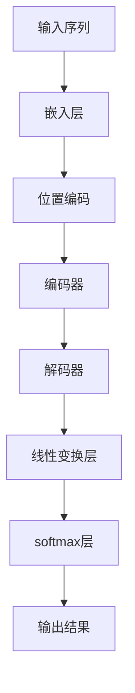

# transformer 原理与代码实例讲解

## 1.背景介绍

在自然语言处理（NLP）领域，Transformer模型自2017年由Vaswani等人提出以来，迅速成为了主流。与传统的循环神经网络（RNN）和长短期记忆网络（LSTM）相比，Transformer模型在处理长距离依赖关系和并行计算方面表现出色。其核心思想是基于注意力机制（Attention Mechanism），能够更好地捕捉句子中的语义关系。

## 2.核心概念与联系

### 2.1 注意力机制

注意力机制是Transformer的核心。它通过计算输入序列中每个元素与其他元素的相关性，来决定每个元素的重要性。注意力机制可以分为自注意力（Self-Attention）和多头注意力（Multi-Head Attention）。

### 2.2 自注意力机制

自注意力机制通过计算输入序列中每个元素与其他元素的点积，来获得每个元素的注意力权重。具体公式如下：

$$
\text{Attention}(Q, K, V) = \text{softmax}\left(\frac{QK^T}{\sqrt{d_k}}\right)V
$$

其中，$Q$、$K$、$V$分别表示查询（Query）、键（Key）和值（Value）矩阵，$d_k$是键的维度。

### 2.3 多头注意力机制

多头注意力机制通过并行计算多个自注意力机制，并将结果拼接起来。公式如下：

$$
\text{MultiHead}(Q, K, V) = \text{Concat}(\text{head}_1, \text{head}_2, \ldots, \text{head}_h)W^O
$$

其中，$\text{head}_i = \text{Attention}(QW_i^Q, KW_i^K, VW_i^V)$，$W_i^Q$、$W_i^K$、$W_i^V$和$W^O$是可训练的权重矩阵。

### 2.4 位置编码

由于Transformer模型不具备处理序列信息的能力，因此需要引入位置编码（Positional Encoding）来表示输入序列中每个元素的位置。位置编码的公式如下：

$$
PE_{(pos, 2i)} = \sin\left(\frac{pos}{10000^{2i/d_{model}}}\right)
$$

$$
PE_{(pos, 2i+1)} = \cos\left(\frac{pos}{10000^{2i/d_{model}}}\right)
$$

其中，$pos$表示位置，$i$表示维度索引，$d_{model}$是模型的维度。

## 3.核心算法原理具体操作步骤

### 3.1 输入嵌入

首先，将输入序列通过嵌入层（Embedding Layer）转换为固定维度的向量表示。然后，将位置编码加到嵌入向量上，以保留序列信息。

### 3.2 编码器

编码器由多个相同的编码器层（Encoder Layer）堆叠而成。每个编码器层包括一个多头自注意力机制和一个前馈神经网络（Feed-Forward Neural Network）。具体步骤如下：

1. 输入序列通过多头自注意力机制，计算每个元素的注意力权重。
2. 将注意力权重与输入序列相乘，得到加权后的序列表示。
3. 加权后的序列通过前馈神经网络，进行非线性变换。
4. 使用残差连接（Residual Connection）和层归一化（Layer Normalization）来稳定训练过程。

### 3.3 解码器

解码器的结构与编码器类似，但在每个解码器层中增加了一个编码器-解码器注意力机制（Encoder-Decoder Attention）。具体步骤如下：

1. 输入序列通过多头自注意力机制，计算每个元素的注意力权重。
2. 将注意力权重与输入序列相乘，得到加权后的序列表示。
3. 加权后的序列通过编码器-解码器注意力机制，计算与编码器输出的注意力权重。
4. 将注意力权重与编码器输出相乘，得到加权后的序列表示。
5. 加权后的序列通过前馈神经网络，进行非线性变换。
6. 使用残差连接和层归一化来稳定训练过程。

### 3.4 输出层

解码器的输出通过一个线性变换层和一个softmax层，得到最终的预测结果。

以下是Transformer模型的整体架构图：



## 4.数学模型和公式详细讲解举例说明

### 4.1 自注意力机制

自注意力机制的核心是计算查询、键和值之间的点积。假设输入序列为 $X = [x_1, x_2, \ldots, x_n]$，其中 $x_i$ 是第 $i$ 个元素的向量表示。首先，将输入序列通过线性变换，得到查询、键和值矩阵：

$$
Q = XW^Q, \quad K = XW^K, \quad V = XW^V
$$

其中，$W^Q$、$W^K$ 和 $W^V$ 是可训练的权重矩阵。然后，计算查询和键之间的点积，并除以 $\sqrt{d_k}$ 进行缩放：

$$
\text{Attention}(Q, K, V) = \text{softmax}\left(\frac{QK^T}{\sqrt{d_k}}\right)V
$$

### 4.2 多头注意力机制

多头注意力机制通过并行计算多个自注意力机制，并将结果拼接起来。假设有 $h$ 个头，每个头的维度为 $d_k$，则多头注意力机制的公式如下：

$$
\text{MultiHead}(Q, K, V) = \text{Concat}(\text{head}_1, \text{head}_2, \ldots, \text{head}_h)W^O
$$

其中，$\text{head}_i = \text{Attention}(QW_i^Q, KW_i^K, VW_i^V)$，$W_i^Q$、$W_i^K$、$W_i^V$ 和 $W^O$ 是可训练的权重矩阵。

### 4.3 前馈神经网络

前馈神经网络由两个线性变换层和一个ReLU激活函数组成。假设输入为 $x$，则前馈神经网络的公式如下：

$$
\text{FFN}(x) = \text{ReLU}(xW_1 + b_1)W_2 + b_2
$$

其中，$W_1$、$W_2$、$b_1$ 和 $b_2$ 是可训练的权重和偏置。

### 4.4 残差连接和层归一化

残差连接和层归一化用于稳定训练过程。假设输入为 $x$，则残差连接和层归一化的公式如下：

$$
\text{LayerNorm}(x + \text{Sublayer}(x))
$$

其中，$\text{Sublayer}(x)$ 表示子层的输出。

## 5.项目实践：代码实例和详细解释说明

以下是一个简单的Transformer模型的实现代码示例，使用了PyTorch框架：

```python
import torch
import torch.nn as nn
import torch.nn.functional as F

class MultiHeadAttention(nn.Module):
    def __init__(self, d_model, num_heads):
        super(MultiHeadAttention, self).__init__()
        self.num_heads = num_heads
        self.d_model = d_model

        assert d_model % num_heads == 0

        self.depth = d_model // num_heads

        self.wq = nn.Linear(d_model, d_model)
        self.wk = nn.Linear(d_model, d_model)
        self.wv = nn.Linear(d_model, d_model)

        self.dense = nn.Linear(d_model, d_model)

    def split_heads(self, x, batch_size):
        x = x.view(batch_size, -1, self.num_heads, self.depth)
        return x.permute(0, 2, 1, 3)

    def forward(self, q, k, v, mask):
        batch_size = q.size(0)

        q = self.wq(q)
        k = self.wk(k)
        v = self.wv(v)

        q = self.split_heads(q, batch_size)
        k = self.split_heads(k, batch_size)
        v = self.split_heads(v, batch_size)

        scaled_attention, attention_weights = self.scaled_dot_product_attention(q, k, v, mask)

        scaled_attention = scaled_attention.permute(0, 2, 1, 3).contiguous()
        original_size_attention = scaled_attention.view(batch_size, -1, self.d_model)

        output = self.dense(original_size_attention)

        return output, attention_weights

    def scaled_dot_product_attention(self, q, k, v, mask):
        matmul_qk = torch.matmul(q, k.permute(0, 1, 3, 2))

        dk = k.size(-1)
        scaled_attention_logits = matmul_qk / torch.sqrt(torch.tensor(dk, dtype=torch.float32))

        if mask is not None:
            scaled_attention_logits += (mask * -1e9)

        attention_weights = F.softmax(scaled_attention_logits, dim=-1)

        output = torch.matmul(attention_weights, v)

        return output, attention_weights

class Transformer(nn.Module):
    def __init__(self, num_layers, d_model, num_heads, dff, input_vocab_size, target_vocab_size, pe_input, pe_target):
        super(Transformer, self).__init__()

        self.encoder = Encoder(num_layers, d_model, num_heads, dff, input_vocab_size, pe_input)
        self.decoder = Decoder(num_layers, d_model, num_heads, dff, target_vocab_size, pe_target)
        self.final_layer = nn.Linear(d_model, target_vocab_size)

    def forward(self, inp, tar, enc_padding_mask, look_ahead_mask, dec_padding_mask):
        enc_output = self.encoder(inp, enc_padding_mask)

        dec_output, attention_weights = self.decoder(tar, enc_output, look_ahead_mask, dec_padding_mask)

        final_output = self.final_layer(dec_output)

        return final_output, attention_weights

class Encoder(nn.Module):
    def __init__(self, num_layers, d_model, num_heads, dff, input_vocab_size, maximum_position_encoding):
        super(Encoder, self).__init__()

        self.d_model = d_model
        self.num_layers = num_layers

        self.embedding = nn.Embedding(input_vocab_size, d_model)
        self.pos_encoding = positional_encoding(maximum_position_encoding, d_model)

        self.enc_layers = nn.ModuleList([EncoderLayer(d_model, num_heads, dff) for _ in range(num_layers)])
        self.dropout = nn.Dropout(0.1)

    def forward(self, x, mask):
        seq_len = x.size(1)

        x = self.embedding(x)
        x *= torch.sqrt(torch.tensor(self.d_model, dtype=torch.float32))
        x += self.pos_encoding[:, :seq_len, :]

        x = self.dropout(x)

        for i in range(self.num_layers):
            x = self.enc_layers[i](x, mask)

        return x

class Decoder(nn.Module):
    def __init__(self, num_layers, d_model, num_heads, dff, target_vocab_size, maximum_position_encoding):
        super(Decoder, self).__init__()

        self.d_model = d_model
        self.num_layers = num_layers

        self.embedding = nn.Embedding(target_vocab_size, d_model)
        self.pos_encoding = positional_encoding(maximum_position_encoding, d_model)

        self.dec_layers = nn.ModuleList([DecoderLayer(d_model, num_heads, dff) for _ in range(num_layers)])
        self.dropout = nn.Dropout(0.1)

    def forward(self, x, enc_output, look_ahead_mask, padding_mask):
        seq_len = x.size(1)
        attention_weights = {}

        x = self.embedding(x)
        x *= torch.sqrt(torch.tensor(self.d_model, dtype=torch.float32))
        x += self.pos_encoding[:, :seq_len, :]

        x = self.dropout(x)

        for i in range(self.num_layers):
            x, block1, block2 = self.dec_layers[i](x, enc_output, look_ahead_mask, padding_mask)

            attention_weights['decoder_layer{}_block1'.format(i+1)] = block1
            attention_weights['decoder_layer{}_block2'.format(i+1)] = block2

        return x, attention_weights

class EncoderLayer(nn.Module):
    def __init__(self, d_model, num_heads, dff):
        super(EncoderLayer, self).__init__()

        self.mha = MultiHeadAttention(d_model, num_heads)
        self.ffn = point_wise_feed_forward_network(d_model, dff)

        self.layernorm1 = nn.LayerNorm(d_model)
        self.layernorm2 = nn.LayerNorm(d_model)

        self.dropout1 = nn.Dropout(0.1)
        self.dropout2 = nn.Dropout(0.1)

    def forward(self, x, mask):
        attn_output, _ = self.mha(x, x, x, mask)
        attn_output = self.dropout1(attn_output)
        out1 = self.layernorm1(x + attn_output)

        ffn_output = self.ffn(out1)
        ffn_output = self.dropout2(ffn_output)
        out2 = self.layernorm2(out1 + ffn_output)

        return out2

class DecoderLayer(nn.Module):
    def __init__(self, d_model, num_heads, dff):
        super(DecoderLayer, self).__init__()

        self.mha1 = MultiHeadAttention(d_model, num_heads)
        self.mha2 = MultiHeadAttention(d_model, num_heads)

        self.ffn = point_wise_feed_forward_network(d_model, dff)

        self.layernorm1 = nn.LayerNorm(d_model)
        self.layernorm2 = nn.LayerNorm(d_model)
        self.layernorm3 = nn.LayerNorm(d_model)

        self.dropout1 = nn.Dropout(0.1)
        self.dropout2 = nn.Dropout(0.1)
        self.dropout3 = nn.Dropout(0.1)

    def forward(self, x, enc_output, look_ahead_mask, padding_mask):
        attn1, attn_weights_block1 = self.mha1(x, x, x, look_ahead_mask)
        attn1 = self.dropout1(attn1)
        out1 = self.layernorm1(attn1 + x)

        attn2, attn_weights_block2 = self.mha2(out1, enc_output, enc_output, padding_mask)
        attn2 = self.dropout2(attn2)
        out2 = self.layernorm2(attn2 + out1)

        ffn_output = self.ffn(out2)
        ffn_output = self.dropout3(ffn_output)
        out3 = self.layernorm3(ffn_output + out2)

        return out3, attn_weights_block1, attn_weights_block2

def point_wise_feed_forward_network(d_model, dff):
    return nn.Sequential(
        nn.Linear(d_model, dff),
        nn.ReLU(),
        nn.Linear(dff, d_model)
    )

def positional_encoding(position, d_model):
    angle_rads = get_angles(torch.arange(position).unsqueeze(1), torch.arange(d_model).unsqueeze(0), d_model)

    sines = torch.sin(angle_rads[:, 0::2])
    cosines = torch.cos(angle_rads[:, 1::2])

    pos_encoding = torch.cat([sines, cosines], dim=-1)
    pos_encoding = pos_encoding.unsqueeze(0)

    return pos_encoding

def get_angles(pos, i, d_model):
    angle_rates = 1 / torch.pow(10000, (2 * (i // 2)) / torch.tensor(d_model, dtype=torch.float32))
    return pos * angle_rates
```

## 6.实际应用场景

Transformer模型在多个NLP任务中表现出色，包括但不限于：

- 机器翻译：如Google的翻译系统。
- 文本生成：如OpenAI的GPT系列模型。
- 文本分类：如BERT模型在情感分析、新闻分类等任务中的应用。
- 问答系统：如BERT和GPT在问答系统中的应用。

## 7.工具和资源推荐

### 7.1 工具

- **PyTorch**：一个流行的深度学习框架，适用于研究和生产。
- **TensorFlow**：另一个流行的深度学习框架，广泛应用于工业界。
- **Hugging Face Transformers**：一个开源库，提供了多种预训练的Transformer模型，方便快速应用。

### 7.2 资源

- **论文**：Attention is All You Need（Vaswani et al., 2017）
- **书籍**：Deep Learning（Ian Goodfellow, Yoshua Bengio, Aaron Courville）
- **在线课程**：Coursera、edX等平台上的深度学习和NLP课程。

## 8.总结：未来发展趋势与挑战

Transformer模型在NLP领域取得了显著的成功，但仍面临一些挑战和发展方向：

- **计算资源**：Transformer模型的训练和推理需要大量的计算资源，如何优化计算效率是一个重要问题。
- **模型压缩**：如何在保证性能的前提下，压缩模型大小，以便在移动设备等资源受限的环境中应用。
- **多模态学习**：将Transformer模型应用于图像、音频等多模态数据的处理，是一个重要的发展方向。
- **解释性**：提高模型的可解释性，使其在实际应用中更加可信和透明。

## 9.附录：常见问题与解答

### 