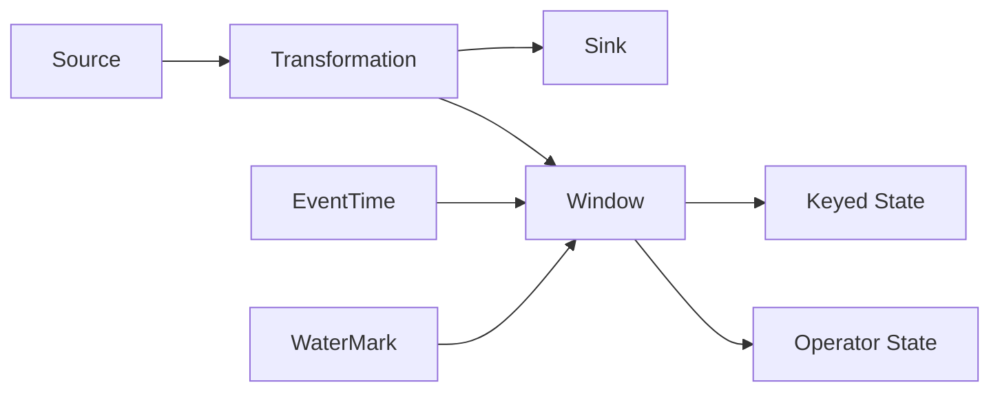

# 【AI大数据计算原理与代码实例讲解】Flink

## 1. 背景介绍

在当今大数据时代,数据的实时处理和分析变得越来越重要。Apache Flink作为一个开源的分布式流处理和批处理框架,为大数据实时计算提供了强大的支持。Flink以其低延迟、高吞吐、exactly-once语义保证等特性,在实时数据处理领域占据了重要地位。

### 1.1 Flink的起源与发展
#### 1.1.1 Flink的诞生
#### 1.1.2 Flink的发展历程
#### 1.1.3 Flink的现状与生态

### 1.2 Flink的主要特性
#### 1.2.1 事件驱动(Event-driven)
#### 1.2.2 流与批的统一 
#### 1.2.3 低延迟、高吞吐
#### 1.2.4 exactly-once语义保证
#### 1.2.5 支持多种语言API

### 1.3 Flink的应用场景
#### 1.3.1 实时数据处理 
#### 1.3.2 数据分析
#### 1.3.3 机器学习
#### 1.3.4 事件驱动应用

## 2. 核心概念与联系

要深入理解Flink,需要先了解其核心概念以及它们之间的关系。

### 2.1 数据流(Dataflow)
#### 2.1.1 Source
#### 2.1.2 Transformation
#### 2.1.3 Sink

### 2.2 时间语义
#### 2.2.1 事件时间(Event Time)
#### 2.2.2 处理时间(Processing Time)  
#### 2.2.3 摄取时间(Ingestion Time)

### 2.3 状态管理
#### 2.3.1 Keyed State
#### 2.3.2 Operator State
#### 2.3.3 状态后端(State Backends) 

### 2.4 窗口(Window)
#### 2.4.1 时间窗口(Time Window)
#### 2.4.2 计数窗口(Count Window)  
#### 2.4.3 会话窗口(Session Window)

### 2.5 时间戳和水印(Watermark)
#### 2.5.1 时间戳(Timestamp)
#### 2.5.2 水印(Watermark)
#### 2.5.3 水印的传播与处理

下面是Flink核心概念之间的关系图:



## 3. 核心算法原理具体操作步骤

Flink中有几个核心算法,如窗口算法、状态管理算法等,下面以窗口算法为例进行讲解。

### 3.1 窗口算法
#### 3.1.1 滚动窗口(Tumbling Windows)算法
##### 3.1.1.1 将数据流按照固定的窗口大小进行切分
##### 3.1.1.2 每个窗口的数据单独处理,窗口之间没有重叠
##### 3.1.1.3 适用于BI统计等固定时间间隔的场景

#### 3.1.2 滑动窗口(Sliding Windows)算法 
##### 3.1.2.1 有固定的窗口大小和滑动间隔
##### 3.1.2.2 可以有重叠的窗口,每次滑动间隔触发一次计算
##### 3.1.2.3 适用于固定时间内最新一段时间的统计分析

#### 3.1.3 会话窗口(Session Windows)算法
##### 3.1.3.1 通过session gap来划分窗口
##### 3.1.3.2 时间间隔超过session gap则认为是不同的窗口 
##### 3.1.3.3 常用于分析用户会话,如30分钟无访问视为会话结束

### 3.2 状态管理
#### 3.2.1 算子状态(Operator State)
##### 3.2.1.1 与算子任务实例绑定
##### 3.2.1.2 一般用于Source或Sink等特殊算子的状态维护
##### 3.2.1.3 任务失败重启时可以自动恢复

#### 3.2.2 键控状态(Keyed State) 
##### 3.2.2.1 与key绑定,根据key来区分和管理状态
##### 3.2.2.2 只能用于KeyedStream
##### 3.2.2.3 支持更细粒度的状态管理

## 4. 数学模型和公式详细讲解举例说明

Flink中也涉及一些数学模型和公式,如水印的计算、窗口的触发等。

### 4.1 水印的计算
水印用于表示数据流中的时间进度,Flink根据数据的时间戳来生成水印。一般采用如下公式:

$watermark = max(eventTime) - maxOutOfOrderness$

其中,`eventTime`表示事件的时间戳,`maxOutOfOrderness`表示最大允许的乱序时间。例如,当前最大的事件时间为`12:10`,最大乱序时间为`5`分钟,则水印为`12:05`。

### 4.2 窗口的触发
对于时间窗口,Flink根据水印来触发窗口的计算和清理。以滚动窗口为例,假设窗口大小为`10`分钟,那么当水印到达如下时间点时,会触发对应窗口的计算:

$$
watermark \in [00:10, 00:20) \Rightarrow window[00:00, 00:10)\\
watermark \in [00:20, 00:30) \Rightarrow window[00:10, 00:20)\\
...
$$

当水印越过窗口结束时间后,该窗口将被清理,释放状态空间。

## 5. 项目实践：代码实例和详细解释说明

下面通过一个简单的WordCount例子,来演示Flink的代码编写。

### 5.1 环境准备
首先需要引入Flink相关的依赖,可以使用Maven进行管理:

```xml
<dependency>
  <groupId>org.apache.flink</groupId>
  <artifactId>flink-java</artifactId>
  <version>1.12.0</version>
</dependency>
<dependency>
  <groupId>org.apache.flink</groupId>
  <artifactId>flink-streaming-java_2.12</artifactId>
  <version>1.12.0</version>
</dependency>
```

### 5.2 代码实现

```java
public class WordCount {
    public static void main(String[] args) throws Exception {
        // 创建执行环境
        StreamExecutionEnvironment env = StreamExecutionEnvironment.getExecutionEnvironment();
        
        // 从socket读取数据
        DataStream<String> text = env.socketTextStream("localhost", 9999);
        
        // 对数据进行处理
        DataStream<Tuple2<String, Integer>> counts = text
            .flatMap(new FlatMapFunction<String, Tuple2<String, Integer>>() {
                @Override
                public void flatMap(String value, Collector<Tuple2<String, Integer>> out) {
                    String[] words = value.split("\\s+");
                    for (String word : words) {
                        out.collect(new Tuple2<>(word, 1));
                    }
                }
            })
            .keyBy(0)
            .sum(1);
        
        // 打印结果
        counts.print();
        
        // 执行任务
        env.execute("WordCount");
    }
}
```

代码解释:
1. 首先创建Flink的执行环境`StreamExecutionEnvironment`。
2. 使用`socketTextStream`从socket读取文本流数据。
3. 对数据流进行`flatMap`操作,将每行文本按空格切分为单词,并转换为`(word, 1)`的形式。
4. 使用`keyBy(0)`对数据流按照第一个元素(即单词)进行分区。
5. 在每个单词分区上进行`sum(1)`操作,即对第二个元素(计数)求和。
6. 使用`print()`将结果打印输出。
7. 最后调用`env.execute`触发任务执行。

### 5.3 运行结果

启动程序后,在本地开启一个socket服务,然后输入一些单词,观察程序的输出:

```
nc -lk 9999
hello world
hello flink
```

程序输出:
```
(hello,1)
(world,1)  
(hello,2)
(flink,1)
```

可以看到,程序正确地统计出了每个单词的出现次数。

## 6. 实际应用场景

Flink在实际生产中有非常广泛的应用,下面列举几个典型场景。

### 6.1 实时数据处理
Flink可以对实时产生的海量数据进行处理,如日志分析、监控告警、欺诈检测等。相比Spark Streaming的微批处理,Flink是真正的流处理,可以做到毫秒级的延迟。

### 6.2 实时数仓
将Flink与Hive、HBase等存储系统结合,可以实现实时数据入库,构建实时数仓。相比离线数仓,实时数仓可以提供更实时的数据服务,支撑实时报表、实时数据分析等业务。

### 6.3 实时机器学习
Flink提供了机器学习库FlinkML,可以与实时数据流结合,实现实时机器学习,如实时推荐、异常检测等。与离线训练相比,实时机器学习可以提供更实时、更个性化的服务。

### 6.4 云原生数据处理
Flink提供了良好的云原生支持,可以方便地部署在Kubernetes等云平台上。基于Flink构建统一的流批一体数据处理平台,可以大大简化云上数据处理架构,提高资源利用率。

## 7. 工具和资源推荐

### 7.1 书籍
- 《Stream Processing with Apache Flink》by Fabian Hueske, Vasiliki Kalavri
- 《Streaming Systems》 by Tyler Akidau, Slava Chernyak, Reuven Lax
- 《Flink原理、实战与性能优化》 by 鸣人

### 7.2 教程
- Ververica的 Flink Training (https://training.ververica.com/)
- Flink官方文档 (https://ci.apache.org/projects/flink/flink-docs-stable/)

### 7.3 工具
- Flink SQL Client
- Flink Web UI  
- Ververica Platform

### 7.4 社区
- Flink官方邮件列表(http://apache-flink.147419.n8.nabble.com/)
- Flink Meetup

## 8. 总结：未来发展趋势与挑战

Flink已经成为流处理领域的领军产品,但仍有较大的发展空间,也面临不少机遇和挑战。

### 8.1 流批一体成为大势所趋
流处理和批处理的界限正变得越来越模糊,未来将走向流批一体化。Flink在流批统一方面有先天的优势,Flink社区也在不断完善流批一体的功能。

### 8.2 SQL成为流处理的关键 
SQL是数据处理领域的通用语言,Flink提供了强大的SQL支持。未来SQL将成为流处理的关键,Flink SQL的易用性和功能将进一步增强。

### 8.3 云原生成为新的战场
云计算已成为大数据处理的主流平台,云原生成为新的技术趋势。Flink需要更好地拥抱云原生,增强云上部署、运维、自动伸缩等能力,同时也要适应Serverless等新的计算模式。

### 8.4 实时机器学习迎来新的发展
实时数据与机器学习的结合有望产生大量创新应用。但当前Flink在机器学习领域还不够成熟,与Tensorflow、PyTorch等主流框架的集成有待加强。Flink需要在实时机器学习领域加大投入。

## 9. 附录：常见问题与解答

### 9.1 Flink与Spark Streaming的区别？
Flink是真正的流处理,而Spark Streaming是微批处理,Flink可以实现更低的延迟。此外,Flink支持更丰富的时间语义和窗口操作。

### 9.2 Flink支持exactly-once吗？
支持。Flink提供了端到端的exactly-once语义保证,通过checkpoint和WAL实现。

### 9.3 Flink的背压机制是什么？
Flink通过异步的barrier快照实现回压,动态调整产生数据的速率。当JobManager检测到背压时,会将背压传导到Source,从而调整数据摄取速率。

### 9.4 Flink状态存储在哪里？如何保证状态一致性？
Flink支持多种状态后端,包括MemoryStateBackend、FsStateBackend、RocksDBStateBackend。通过周期性的CheckPoint机制,可以将状态持久化,保证一致性。

### 9.5 Flink是否支持迭代计算？     
Flink支持