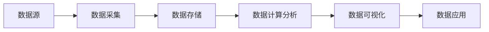
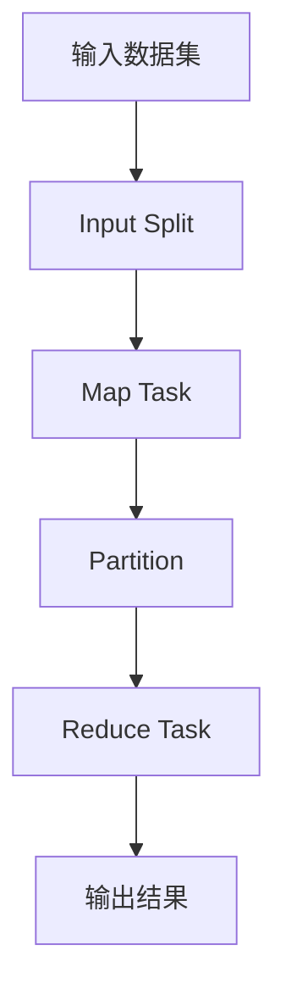

# 【AI大数据计算原理与代码实例讲解】大数据

## 1. 背景介绍

### 1.1 大数据时代的到来

随着互联网、物联网、移动互联网等技术的飞速发展,数据呈现出爆炸式增长的趋势。据统计,全球数据量每两年就会增长一倍,预计到2025年,全球数据总量将达到163ZB。面对如此海量的数据,传统的数据处理和分析方法已经无法满足需求,大数据技术应运而生。

### 1.2 大数据的定义与特征

大数据(Big Data)是指无法在一定时间范围内用常规软件工具进行捕捉、管理和处理的数据集合,是需要新处理模式才能具有更强的决策力、洞察发现力和流程优化能力的海量、高增长率和多样化的信息资产。大数据具有4V特征:

- Volume(大量):数据量巨大,通常在PB、EB甚至ZB级别
- Velocity(高速):数据增长速度快,需要快速处理
- Variety(多样):数据类型多样化,包括结构化、半结构化和非结构化数据
- Value(低价值密度):数据价值密度相对较低,需要从海量数据中挖掘有价值信息

### 1.3 大数据的应用领域

大数据技术在各行各业得到广泛应用,典型的应用领域包括:

- 互联网:搜索引擎、推荐系统、社交网络等
- 金融:风险控制、反欺诈、客户画像等  
- 电商:精准营销、供应链优化等
- 制造业:设备故障预测、质量管理等
- 医疗健康:辅助诊断、药物研发等
- 交通运输:智慧交通、物流优化等
- 公共服务:智慧城市、社会治理等

## 2. 核心概念与联系

### 2.1 大数据处理流程

大数据处理通常包括数据采集、存储、计算分析、可视化等环节,形成一个完整的数据处理流程。下面是一个典型的大数据处理流程示意图:



### 2.2 分布式存储

海量数据需要分布式存储系统来支撑。常见的分布式存储系统包括:

- HDFS:Hadoop分布式文件系统,提供高吞吐量的数据访问
- HBase:基于HDFS的分布式列存数据库
- Cassandra:分布式NoSQL数据库
- MongoDB:文档型NoSQL数据库

### 2.3 分布式计算

大数据计算需要借助分布式计算框架来实现。主流的分布式计算框架有:

- MapReduce:基于Hadoop的分布式计算编程模型
- Spark:基于内存的快速通用计算引擎
- Flink:支持流式和批式计算的分布式计算框架
- Storm:分布式实时计算系统

### 2.4 机器学习与数据挖掘

从海量数据中挖掘价值是大数据分析的核心目标。机器学习和数据挖掘是实现这一目标的关键技术。

- 机器学习:通过算法从数据中自动学习获得知识,代表算法有决策树、SVM、神经网络等
- 数据挖掘:从大量数据中发现模式和知识的计算过程,主要任务包括分类、聚类、关联、异常检测等

## 3. 核心算法原理具体操作步骤

### 3.1 MapReduce编程模型

MapReduce是一种分布式计算编程模型,用于大规模数据集的并行处理。其基本思想是"分而治之",把大任务分解成许多小任务来并行处理。

一个完整的MapReduce过程分为Map和Reduce两个阶段:

1. Map阶段:将输入数据集分割成多个Split,由MapTask并行处理,将数据转化为<key,value>键值对,输出中间结果
2. Reduce阶段:对Map阶段的中间结果按照key进行分组,由ReduceTask进行归约处理,输出最终结果

MapReduce编程模型结构如下图:



### 3.2 PageRank算法

PageRank是Google用于网页排名的经典算法,也是MapReduce的一个典型应用。PageRank基于以下假设:

- 如果一个网页被很多其他网页链接到的话说明这个网页比较重要
- 指向一个网页的链接质量不同,来自重要网页的链接比来自一般网页的链接更重要

PageRank计算步骤如下:

1. 初始化每个网页的PR值为1/N(N为网页总数)
2. 对每个网页,将其PR值平均分配到它指向的网页中
3. 所有网页的新PR值为其所有入链的PR值之和
4. 重复步骤2和3直到PR值收敛

PageRank可以很好地用MapReduce实现:

- Map阶段:对每个网页,输出<目标网页,PR贡献值>
- Reduce阶段:对于每个目标网页,将其所有PR贡献值求和得到新PR值

### 3.3 协同过滤推荐算法

协同过滤是常用的推荐算法,基于用户或物品的相似性进行推荐。其基本假设是:

- 用户-用户协同过滤:兴趣相似的用户可能喜欢相似的物品
- 物品-物品协同过滤:用户喜欢过的相似物品,他可能也喜欢

用户-用户协同过滤步骤:

1. 计算用户相似度矩阵
2. 找到与目标用户最相似的K个用户 
3. 计算这K个用户对物品的评分加权平均值作为推荐

物品-物品协同过滤步骤:

1. 计算物品相似度矩阵
2. 找到用户喜欢过的物品
3. 根据相似度推荐与这些物品最相似的其他物品

协同过滤可以用MapReduce框架实现以提高计算效率。

## 4. 数学模型和公式详细讲解举例说明

### 4.1 TF-IDF文本表示模型

在文本挖掘和信息检索领域,需要将文本数学化表示。TF-IDF是一种常用的文本向量化方法。

TF-IDF的基本思想是,一个词对文档的重要性与其在该文档中出现的频率成正比(TF),与它在整个语料库出现的文档频率成反比(IDF)。

- 词频TF(Term Frequency):
$$
TF(t,d) = \frac{f_{t,d}}{\sum_{t' \in d} f_{t',d}}
$$
其中$f_{t,d}$表示词t在文档d中出现的次数。

- 逆文档频率IDF(Inverse Document Frequency):
$$
IDF(t,D) = \log \frac{|D|}{|\{d \in D: t \in d\}|}
$$
其中$|D|$表示语料库中文档总数,$|\{d \in D: t \in d\}|$表示包含词t的文档数。

- TF-IDF:
$$
TFIDF(t,d,D) = TF(t,d) \times IDF(t,D)
$$

TF-IDF值越大,说明词t对文档d的重要性越高。通过计算文档中每个词的TF-IDF值,可以得到文档的向量表示。

### 4.2 余弦相似度

在得到文档或用户的向量表示后,常常需要计算它们之间的相似度。余弦相似度是一种常用的相似度度量方法。

两个向量A和B的余弦相似度定义为:

$$
\cos(A,B) = \frac{A \cdot B}{||A|| \times ||B||} = \frac{\sum_{i=1}^n A_i \times B_i}{\sqrt{\sum_{i=1}^n A_i^2} \times \sqrt{\sum_{i=1}^n B_i^2}}
$$

余弦相似度的取值范围为[-1,1],值越大表示两个向量方向越接近,即它们越相似。

举例来说,有用户向量A(1,2,1),B(2,1,1),C(1,1,0),则:

$$
\cos(A,B) = \frac{1 \times 2 + 2 \times 1 + 1 \times 1}{\sqrt{1^2+2^2+1^2} \times \sqrt{2^2+1^2+1^2}} = 0.87
$$
$$
\cos(A,C) = \frac{1 \times 1 + 2 \times 1 + 1 \times 0}{\sqrt{1^2+2^2+1^2} \times \sqrt{1^2+1^2+0^2}} = 0.71
$$

可见用户A与B的相似度高于A与C,在协同过滤中更应该根据B的兴趣给A推荐。

## 5. 项目实践:代码实例和详细解释说明

下面以Spark平台为例,给出几个大数据处理的代码实例。

### 5.1 Spark WordCount实例

WordCount是大数据处理的"Hello World"。以下是用Spark实现WordCount的Python代码:

```python
from pyspark import SparkContext

sc = SparkContext("local", "WordCount")
text = sc.textFile("input.txt")

counts = text.flatMap(lambda line: line.split(" ")) \
             .map(lambda word: (word, 1)) \
             .reduceByKey(lambda a, b: a + b)

output = counts.collect()
for (word, count) in output:
    print("%s: %i" % (word, count))

sc.stop()
```

代码解释:

1. 创建SparkContext对象,设置运行模式和任务名
2. 读取输入文件input.txt
3. 对每一行文本进行分词,转换成(word,1)的键值对
4. 按照单词进行分组,对每个单词的计数求和
5. 将结果收集到Driver节点并打印输出
6. 关闭SparkContext

### 5.2 Spark 协同过滤推荐实例

以下是用Spark MLlib库实现协同过滤的Python代码:

```python
from pyspark.sql import SparkSession
from pyspark.ml.evaluation import RegressionEvaluator
from pyspark.ml.recommendation import ALS

spark = SparkSession.builder.appName("CollaborativeFiltering").getOrCreate()

data = spark.read.csv("ratings.csv", header=True, inferSchema=True)

(training, test) = data.randomSplit([0.8, 0.2])

als = ALS(maxIter=5, regParam=0.01, userCol="userId", itemCol="movieId", ratingCol="rating")
model = als.fit(training)

predictions = model.transform(test)

evaluator = RegressionEvaluator(metricName="rmse", labelCol="rating", predictionCol="prediction")
rmse = evaluator.evaluate(predictions)
print("Root-mean-square error = " + str(rmse))

userRecs = model.recommendForAllUsers(10)
userRecs.show()

spark.stop()
```

代码解释:

1. 创建SparkSession对象
2. 读取评分数据ratings.csv
3. 将数据随机划分为训练集和测试集
4. 建立ALS推荐模型,设置最大迭代次数、正则化参数等
5. 用训练集训练模型
6. 用训练好的模型对测试集进行预测
7. 评估模型的均方根误差(RMSE)
8. 为每个用户推荐10个电影
9. 关闭SparkSession

## 6. 实际应用场景

大数据技术在各行各业得到广泛应用,以下是几个典型的应用场景:

### 6.1 电商推荐系统

电商网站利用用户的历史浏览、购买、评价等行为数据,通过协同过滤等算法给用户做个性化商品推荐,提高转化率和客单价。典型案例如亚马逊、淘宝等。

### 6.2 金融风控

银行、保险、互联网金融等公司利用用户的多维数据,如个人信息、信用记录、行为数据等,建立机器学习模型进行风险评估,防范信用欺诈等风险。

### 6.3 工业预测性维护

制造业利用设备运行参数、环境因素、历史故障数据等,通过大数据分析预测设备的健康状态和剩余寿命,指导预防性维护,减少非计划停机时间,提高生产效率。

### 6.4 智慧交通

交通部门利用车辆GPS数据、路况监控视频等,通过大数据分析实现实时路况预测、交通流量调控、智能信号灯配时等,缓解交通拥堵,提高出行效率。

### 6