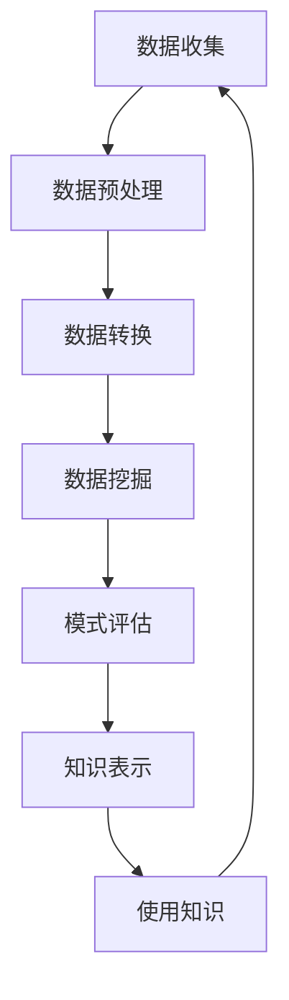

# 【AI大数据计算原理与代码实例讲解】数据挖掘

## 1. 背景介绍

### 1.1 数据爆炸时代

在当今时代，数据正以前所未有的速度呈爆炸式增长。无论是个人、企业还是政府机构,都在产生大量的数据。这些数据来源广泛,包括社交媒体、物联网设备、金融交易、医疗记录等等。然而,简单地积累数据是远远不够的,关键在于如何从这些海量数据中提取有价值的信息和知识。

### 1.2 数据挖掘的重要性

数据挖掘(Data Mining)作为一门新兴的跨学科技术,正在帮助我们从复杂的数据集中发现隐藏的模式和关系。它融合了多个领域的理论和技术,包括统计学、机器学习、数据库技术、人工智能等。数据挖掘在各个领域都有广泛的应用,例如:

- 金融领域:识别欺诈行为、风险评估、客户细分等
- 零售业:发现销售模式、个性化推荐、供应链优化等
- 医疗保健:疾病预测、药物开发、医疗资源管理等
- 社交网络:社区发现、影响力分析、个性化推荐等
- 安全领域:网络入侵检测、犯罪预测、反恐监控等

通过数据挖掘,我们可以从海量数据中发现隐藏的知识,从而为决策提供有力支持,优化业务流程,提高运营效率,创造新的商业价值。

## 2. 核心概念与联系

### 2.1 数据挖掘过程

数据挖掘是一个循环的过程,主要包括以下几个步骤:



1. **数据收集**: 从各种来源收集相关数据,包括数据库、文件、网络等。
2. **数据预处理**: 清理原始数据,处理缺失值、噪声数据等,将数据转换为适合分析的格式。
3. **数据转换**: 根据挖掘任务的需求,对数据进行转换和整理,例如数据规范化、降维等。
4. **数据挖掘**: 应用各种算法和技术,从数据中发现有趣的模式和知识。
5. **模式评估**: 评估挖掘出的模式,确保其有效性和可靠性。
6. **知识表示**: 将挖掘出的知识用可视化的方式呈现,方便理解和应用。
7. **使用知识**: 将发现的知识应用于实际问题,支持决策和优化业务流程。

### 2.2 数据挖掘任务

数据挖掘主要涉及以下几种任务:

1. **关联规则挖掘**(Association Rule Mining): 发现数据集中项目之间的关联关系,常用于购物篮分析、网页关联等。
2. **分类**(Classification): 根据已知样本,构建分类模型,对新数据进行分类。广泛应用于信用评估、疾病诊断等领域。
3. **聚类**(Clustering): 根据数据的相似性,将数据划分为多个簇或组。可用于客户细分、图像分割等。
4. **异常检测**(Anomaly Detection): 识别数据集中的异常值或异常模式,如欺诈检测、网络入侵检测等。
5. **回归**(Regression): 建立数据之间的函数关系模型,用于预测连续值,如销售预测、趋势分析等。

### 2.3 数据挖掘技术

数据挖掘技术主要包括以下几类:

1. **统计技术**: 如回归分析、方差分析、贝叶斯理论等。
2. **机器学习算法**: 如决策树、支持向量机、神经网络、聚类算法等。
3. **数据库技术**: 如SQL、数据仓库、OLAP等。
4. **可视化技术**: 用于数据和模式的可视化表示。
5. **模式评估技术**: 用于评估挖掘出的模式的有效性和可靠性。

## 3. 核心算法原理具体操作步骤

数据挖掘涉及多种算法和技术,这里我们重点介绍两种核心算法:决策树和关联规则挖掘。

### 3.1 决策树算法

决策树是一种常用的分类和回归算法,它通过构建决策树模型来对数据进行预测和分类。决策树算法的基本思想是:根据训练数据集,递归地构建一棵决策树,每个内部节点代表一个特征,每个分支代表该特征的一个取值,而叶节点则代表一个分类或回归值。

决策树算法的具体步骤如下:

1. **选择最优特征**: 根据某种准则(如信息增益、信息增益率等),选择最优特征作为当前节点。
2. **生成子节点**: 根据所选特征的不同取值,生成子节点。
3. **终止条件检查**: 如果当前节点满足终止条件(如所有样本属于同一类别、没有剩余特征等),则将当前节点标记为叶节点。
4. **递归构建子树**: 对于每个非叶节点,重复上述步骤,构建子树。

构建完成后,对于新的数据样本,只需从根节点开始,根据特征值遍历决策树,直到到达叶节点,即可得到分类或回归结果。

决策树算法的优点是模型易于理解和解释,缺点是容易过拟合。常用的决策树算法包括ID3、C4.5、CART等。

### 3.2 关联规则挖掘

关联规则挖掘旨在发现数据集中项目之间的关联关系,常用于购物篮分析、网页关联等场景。关联规则采用"如果...那么..."的形式,例如"如果购买面包,那么也可能购买牛奶"。

关联规则挖掘算法的核心是发现频繁项集,然后根据频繁项集生成关联规则。具体步骤如下:

1. **发现频繁项集**:
   - 设置最小支持度阈值min_sup
   - 扫描数据集,统计每个项集的支持度
   - 保留支持度不小于min_sup的项集,作为频繁项集
2. **生成关联规则**:
   - 对于每个频繁项集l,枚举它的所有非空子集
   - 对于每个非空子集s,计算规则"s=>l-s"的置信度
   - 如果置信度不小于最小置信度阈值min_conf,则输出该规则

其中,支持度表示项集在数据集中出现的频率,置信度表示条件规则的可信程度。

常用的关联规则挖掘算法包括Apriori算法、FP-Growth算法等。Apriori算法是一种经典的关联规则挖掘算法,它采用迭代方式逐层扫描数据集,生成候选项集,并剪枝去除非频繁项集。FP-Growth算法则利用FP-Tree数据结构,只需扫描数据集两次,效率更高。

## 4. 数学模型和公式详细讲解举例说明

数据挖掘中涉及多种数学模型和公式,这里我们重点介绍两个常用的指标:信息增益和支持度。

### 4.1 信息增益

信息增益(Information Gain)是决策树算法中常用的特征选择标准之一。它基于信息论中的信息熵(Entropy)概念,用于衡量特征对数据集的"纯度"的影响程度。

对于一个数据集D,设有K个类别,第k个类别的概率为$p_k$,则数据集D的信息熵定义为:

$$
Ent(D) = -\sum_{k=1}^{K}p_k\log_2p_k
$$

信息熵越小,数据集的"纯度"越高。

现在,假设我们根据特征A将数据集D划分为多个子集$D_1,D_2,...,D_n$,则在特征A的条件下,数据集D的信息熵为:

$$
Ent(D|A) = \sum_{i=1}^{n}\frac{|D_i|}{|D|}Ent(D_i)
$$

信息增益就是原始信息熵与条件信息熵之差,即:

$$
Gain(A) = Ent(D) - Ent(D|A)
$$

信息增益越大,说明特征A对数据集D的"纯度"影响越大,因此在构建决策树时,我们会选择信息增益最大的特征作为当前节点。

### 4.2 支持度

支持度(Support)是关联规则挖掘中的一个重要指标,用于衡量项集在数据集中出现的频率。

设D为数据集,包含N条记录。对于一个项集X,它在数据集D中出现的次数为count(X),则项集X的支持度定义为:

$$
support(X) = \frac{count(X)}{N}
$$

支持度实际上反映了项集X在数据集D中的概率。

在关联规则挖掘算法中,我们需要设置一个最小支持度阈值min_sup,只有支持度不小于min_sup的项集才被视为频繁项集,用于生成关联规则。通过设置合适的min_sup,我们可以控制生成的规则数量和质量。

例如,在一个购物篮数据集中,如果项集{面包,牛奶}的支持度为0.2,表示20%的交易中同时包含面包和牛奶。如果我们设置min_sup=0.1,那么{面包,牛奶}就是一个频繁项集,可以用于生成关联规则。

## 5. 项目实践:代码实例和详细解释说明

为了帮助读者更好地理解数据挖掘算法,我们提供了两个Python代码示例,分别实现了决策树和关联规则挖掘算法。

### 5.1 决策树算法实现

我们使用Python的scikit-learn库中的DecisionTreeClassifier来实现决策树算法。下面是一个示例代码:

```python
from sklearn import datasets
from sklearn.tree import DecisionTreeClassifier
from sklearn.model_selection import train_test_split
from sklearn.metrics import accuracy_score

# 加载鸢尾花数据集
iris = datasets.load_iris()
X = iris.data
y = iris.target

# 划分训练集和测试集
X_train, X_test, y_train, y_test = train_test_split(X, y, test_size=0.2, random_state=42)

# 创建决策树分类器
clf = DecisionTreeClassifier(criterion='gini', max_depth=3)

# 训练模型
clf.fit(X_train, y_train)

# 预测测试集
y_pred = clf.predict(X_test)

# 计算准确率
accuracy = accuracy_score(y_test, y_pred)
print(f"Accuracy: {accuracy}")
```

代码解释:

1. 首先,我们从scikit-learn库中加载鸢尾花数据集。
2. 将数据集划分为训练集和测试集,测试集占20%。
3. 创建一个决策树分类器对象,设置基尼系数(gini)为特征选择标准,最大树深为3。
4. 使用训练集训练决策树模型。
5. 在测试集上进行预测,并计算预测准确率。

运行结果显示,在鸢尾花数据集上,决策树算法的准确率约为0.93。

### 5.2 关联规则挖掘算法实现

我们使用Python的mlxtend库中的apriori函数来实现Apriori关联规则挖掘算法。下面是一个示例代码:

```python
from mlxtend.frequent_patterns import apriori
from mlxtend.frequent_patterns import association_rules

# 示例数据集
dataset = [['牛奶', '面包', '薯片'],
           ['牛奶', '面包', '啤酒', '鸡蛋'],
           ['牛奶', '面包', '薯片', '鸡蛋'],
           ['牛奶', '面包', '啤酒', '薯片'],
           ['牛奶', '面包']]

# 发现频繁项集
frequent_itemsets = apriori(dataset, min_support=0.4, use_colnames=True)
print("Frequent Itemsets:")
print(frequent_itemsets)

# 生成关联规则
rules = association_rules(frequent_itemsets, metric="confidence", min_threshold=0.6)
print("\nRules:")
print(rules)
```

代码解释:

1. 首先,我们定义一个示例数据集,每条记录表示一个购物篮。
2. 使用apri