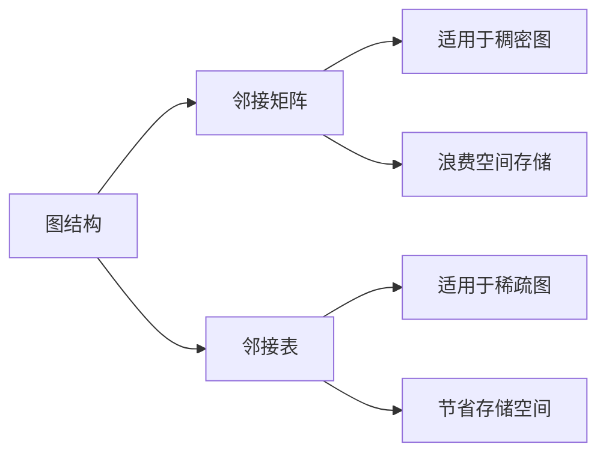
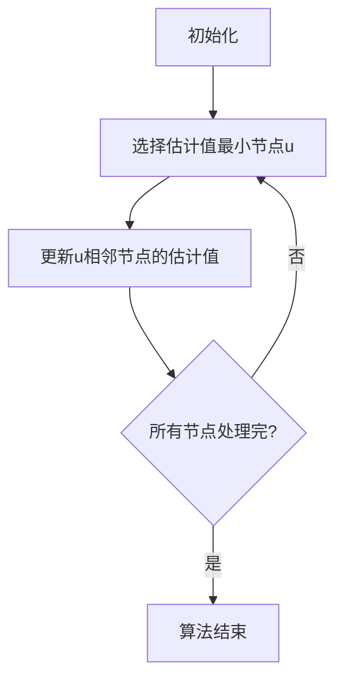
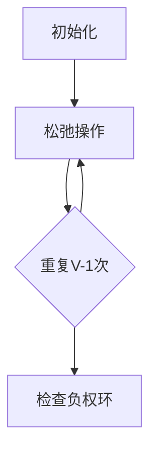

# 【AI大数据计算原理与代码实例讲解】最短路径

## 1.背景介绍

在现代计算机科学和人工智能领域中,寻找最短路径是一个非常重要和基础的问题。无论是在网络路由、交通规划、机器人路径规划,还是在一些复杂的组合优化问题中,最短路径算法都扮演着关键角色。

最短路径问题可以形式化描述为:给定一个加权图G=(V,E),其中V是节点集合,E是边集合,每条边(u,v)都有一个与之相关的非负权重w(u,v)。对于给定的两个节点s(源点)和t(终点),需要找到从s到t的最短路径,即边的权重之和最小的路径。

### 1.1 最短路径问题的重要性

最短路径问题在现实世界中有着广泛的应用,例如:

- 网络路由:在计算机网络中,路由器需要为数据包选择最佳的传输路径,以最小化时延、拥塞和其他开销。
- 导航系统:导航应用程序需要为用户计算出从起点到目的地的最佳路线,以节省时间和燃料。
- 交通规划:城市规划者需要优化交通网络,以减少拥堵和提高效率。
- 机器人路径规划:在工业自动化和服务机器人领域,机器人需要计算出最佳路径来完成任务。

除了上述应用领域外,最短路径算法还广泛应用于组合优化、网络分析、生物信息学等诸多领域。因此,研究高效、准确的最短路径算法对于现代计算机科学和人工智能技术具有重要意义。

## 2.核心概念与联系

### 2.1 图的表示

在讨论最短路径算法之前,我们需要先了解如何在计算机中表示图结构。常见的图表示方法有两种:邻接矩阵和邻接表。

#### 2.1.1 邻接矩阵

邻接矩阵是一种使用二维数组来表示图的方法。对于一个有n个节点的图G,我们使用一个n×n的矩阵A来表示,其中A[i][j]表示节点i和节点j之间的边的权重。如果两个节点之间没有边相连,则对应的权重为无穷大(∞)或者一个非常大的值。

邻接矩阵的优点是简单直观,容易实现。但是对于稀疏图(边的数量远小于n^2)来说,邻接矩阵会浪费大量存储空间。

#### 2.1.2 邻接表

邻接表是一种使用链表或者数组来表示图的方法。对于每个节点,我们使用一个链表或者数组来存储与该节点相邻的节点及其对应的边权重。

邻接表的优点是对于稀疏图,可以节省大量存储空间。但是查找两个给定节点之间是否有边相连的操作会比邻接矩阵慢一些。

在实现最短路径算法时,我们通常会选择更加高效的邻接表来表示图结构。



### 2.2 最短路径算法分类

根据图的特点和应用场景的不同,最短路径算法可以分为以下几类:

1. **单源最短路径**:从一个给定的源点出发,找到到其他所有节点的最短路径。常见算法有Dijkstra算法和Bellman-Ford算法。

2. **多源最短路径**:从多个源点出发,找到到所有其他节点的最短路径。可以通过多次运行单源最短路径算法来实现。

3. **单源单目标最短路径**:从一个给定的源点出发,找到到一个给定目标节点的最短路径。可以通过单源最短路径算法来实现。

4. **全源最短路径**:计算出图中任意两个节点之间的最短路径。常见算法有Floyd-Warshall算法和Johnson算法。

5. **受限最短路径**:在寻找最短路径时,需要考虑一些额外的约束条件,如时间窗口、资源限制等。

不同的最短路径算法适用于不同的场景,在实际应用中需要根据具体问题选择合适的算法。接下来,我们将重点介绍两种经典的单源最短路径算法:Dijkstra算法和Bellman-Ford算法。

## 3.核心算法原理具体操作步骤

### 3.1 Dijkstra算法

Dijkstra算法是解决单源最短路径问题的一种贪心算法,它的基本思想是从源点开始,逐步扩展到其他节点,并维护一个集合,记录从源点到每个节点的最短路径估计值。

#### 3.1.1 算法原理

Dijkstra算法的工作过程如下:

1. 初始化:将源点加入集合,并将源点到其他所有节点的最短路径估计值初始化为无穷大。
2. 选择估计值最小的节点:从集合中选择一个最短路径估计值最小的节点u。
3. 更新估计值:对于u的每个相邻节点v,检查从源点经过u到达v的路径长度是否比v的当前最短路径估计值更小,如果更小,就更新v的最短路径估计值。
4. 重复步骤2和3,直到所有节点都被处理完毕。

Dijkstra算法的关键在于每次选择最短路径估计值最小的节点,这样可以保证算法在处理完所有节点之后,得到的就是从源点到其他所有节点的最短路径。



#### 3.1.2 算法实现

下面是Dijkstra算法的Python实现,使用了最小堆来高效地选择最短路径估计值最小的节点。

```python
import heapq

def dijkstra(graph, source):
    # 初始化距离字典
    distances = {node: float('inf') for node in graph}
    distances[source] = 0
    
    # 创建最小堆
    pq = [(0, source)]
    
    while pq:
        # 选择估计值最小的节点
        current_dist, current_node = heapq.heappop(pq)
        
        # 如果当前节点已经处理过,则跳过
        if current_dist > distances[current_node]:
            continue
        
        # 更新相邻节点的估计值
        for neighbor, weight in graph[current_node].items():
            distance = current_dist + weight
            if distance < distances[neighbor]:
                distances[neighbor] = distance
                heapq.heappush(pq, (distance, neighbor))
    
    return distances
```

在这个实现中,我们使用一个字典`distances`来存储从源点到每个节点的最短路径估计值。初始时,除了源点外,其他节点的估计值都被设置为无穷大。

我们使用一个最小堆`pq`来存储所有待处理的节点及其估计值。每次从堆中取出估计值最小的节点,并更新其相邻节点的估计值。

这个实现的时间复杂度为O((V+E)logV),其中V是节点数,E是边数。对于稠密图来说,时间复杂度为O(V^2logV)。

### 3.2 Bellman-Ford算法

Bellman-Ford算法是另一种解决单源最短路径问题的经典算法,它可以处理有负权边的图,而Dijkstra算法则不能。

#### 3.2.1 算法原理

Bellman-Ford算法的基本思想是通过多次松弛操作,逐步更新从源点到每个节点的最短路径估计值,直到所有估计值都收敛为最终的最短路径长度。

算法的工作过程如下:

1. 初始化:将源点到自身的最短路径估计值设为0,其他节点的估计值设为无穷大。
2. 松弛操作:对所有边进行一次松弛操作,更新每个节点的最短路径估计值。
3. 重复步骤2,共进行V-1次(V是节点数)。
4. 检查是否存在负权环:再次对所有边进行一次松弛操作,如果任何节点的估计值发生变化,则图中存在负权环。

所谓松弛操作,就是对于每条边(u,v),检查从源点经过u到达v的路径长度是否比v的当前最短路径估计值更小,如果更小,就更新v的估计值。



#### 3.2.2 算法实现

下面是Bellman-Ford算法的Python实现:

```python
def bellman_ford(graph, source):
    # 初始化距离字典
    distances = {node: float('inf') for node in graph}
    distances[source] = 0
    
    # 进行V-1次松弛操作
    for _ in range(len(graph) - 1):
        for u in graph:
            for v, weight in graph[u].items():
                if distances[u] != float('inf') and distances[u] + weight < distances[v]:
                    distances[v] = distances[u] + weight
    
    # 检查是否存在负权环
    for u in graph:
        for v, weight in graph[u].items():
            if distances[u] != float('inf') and distances[u] + weight < distances[v]:
                raise ValueError("Negative cycle detected")
    
    return distances
```

在这个实现中,我们首先初始化一个字典`distances`来存储从源点到每个节点的最短路径估计值。然后进行V-1次松弛操作,更新每个节点的估计值。

最后,我们再次对所有边进行一次松弛操作,如果任何节点的估计值发生变化,则说明图中存在负权环,我们抛出一个异常。

这个实现的时间复杂度为O(VE),其中V是节点数,E是边数。对于稠密图来说,时间复杂度为O(V^3)。

## 4.数学模型和公式详细讲解举例说明

在最短路径问题中,我们通常使用加权图G=(V,E,W)来表示问题,其中:

- V是节点集合,表示图中的所有节点。
- E是边集合,表示图中的所有边。
- W是边权重函数,对于每条边(u,v)∈E,W(u,v)表示该边的权重。

我们定义从节点u到节点v的路径长度为该路径上所有边权重之和:

$$
L(u\xrightarrow{P}v) = \sum_{(x,y)\in P}W(x,y)
$$

其中,P表示从u到v的一条路径,即一个节点序列(u=x_0,x_1,x_2,...,x_k=v)。

我们的目标是找到从源点s到目标节点t的最短路径,即路径长度最小的那条路径:

$$
\delta(s,t) = \min_{P\in\mathcal{P}_{s\rightarrow t}}L(s\xrightarrow{P}t)
$$

其中,𝒫_{s→t}表示从s到t的所有可能路径的集合。

### 4.1 Dijkstra算法的数学模型

Dijkstra算法的核心思想是维护一个距离估计值数组dist,其中dist[v]表示从源点s到节点v的当前最短路径估计值。算法的目标是使dist[v]收敛到δ(s,v),即从s到v的最短路径长度。

算法的工作过程可以用下面的公式描述:

$$
\begin{align*}
\text{dist}[s] &= 0 \\
\text{dist}[v] &= \infty, \forall v \neq s \\
\text{dist}[v] &= \min(\text{dist}[v], \text{dist}[u] + W(u,v)), \forall (u,v) \in E
\end{align*}
$$

其中,第一行表示源点s到自身的距离为0,第二行表示其他节点的初始距离估计值为无穷大,第三行表示松弛操作,即更新每个节点的距离估计值。

Dijkstra算法的正确性可以通过数学归纳法来证明。

### 4.2 Bellman-Ford算法的数学模型

Bellman-Ford算法的核心思想是通过多次松弛操作,逐步更新每个节点的距离估计值,直到所有估计值都收敛