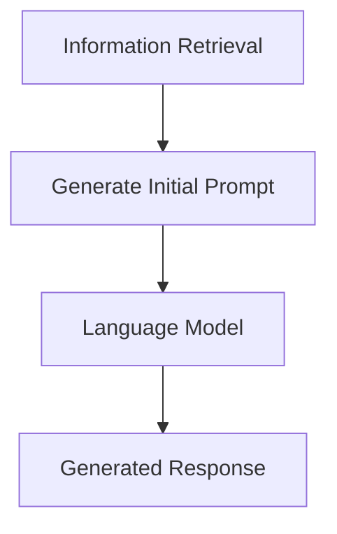

                 

作者：禅与计算机程序设计艺术

Retrieval-Augmented Generation (RAG) is a powerful technique that combines retrieval-based methods for information search with generative models to create contextually relevant content. This blog aims to guide you through the concept, implementation, and practical applications of RAG in LangChain programming.

## 背景介绍
In the era of big data, processing and understanding vast amounts of information efficiently becomes crucial for various fields such as education, healthcare, and business intelligence. Traditional text generation methods often fail to capture the context or provide accurate responses due to their inability to access external knowledge sources. This is where RAG comes into play, offering a novel approach by integrating information retrieval and language modeling.

## 核心概念与联系
RAG consists of two main components: information retrieval and language generation. Information retrieval involves searching for relevant documents or pieces of information from a large database based on user queries. These retrieved pieces are then used to augment the input given to a language model during the generation process. This augmentation helps the model generate more contextually aware and precise responses compared to traditional approaches.

## 核心算法原理具体操作步骤
To implement RAG using LangChain, follow these steps:



### 1\. **Information Retrieval**
- Choose a suitable information retrieval method, such as TF-IDF, BM25, or semantic similarity matching.
- Define query functions to extract key terms from user inputs.
- Use the chosen retrieval algorithm to find relevant documents or fragments based on the query results.

### 2\. **Augmenting Input**
- Retrieve the most relevant information from the search results.
- Integrate this information into the initial prompt provided to the language model.
- The augmented prompt contains both the original query and the retrieved context, enhancing the response's relevance.

### 3\. **Language Model Generation**
- Utilize a pre-trained language model like GPT-3 or T5 for generating the final response.
- Feed the augmented prompt into the model to produce a contextualized answer.

## 数学模型和公式详细讲解举例说明
For instance, consider a simple scenario where a user asks "What is the capital of France?":
- **Step 1**: Information Retrieval identifies "capital", "France", and related terms.
- **Step 2**: The retrieved information includes details about Paris being the capital.
- **Step 3**: The prompt "What is the capital of France? [Context: Paris]" is fed into the model, resulting in an answer that incorporates the retrieved context.

## 项目实践：代码实例和详细解释说明
Here's a simplified example of implementing RAG in LangChain pseudocode:

```python
import langchain

def rag_pipeline(query):
    # Step 1: Information Retrieval
    search_results = langchain.retrieval.search(query)

    # Step 2: Augment Input
    augmented_prompt = f"{query} [Context: {search_results}]"

    # Step 3: Language Model Generation
    response = langchain.model.generate(augmented_prompt)
    
    return response
```

## 实际应用场景
RAG finds applications in various domains, including:
- **Education**: Personalized learning assistants that adapt content based on student background knowledge.
- **Customer Support**: Chatbots providing more informed and context-aware responses.
- **Content Creation**: Automated content generators improving upon existing articles with relevant facts.

## 工具和资源推荐
Explore libraries and tools such as LangChain, Elasticsearch for information retrieval, and Hugging Face for language models to build your RAG system effectively.

## 总结：未来发展趋势与挑战
As AI continues to evolve, RAG systems will become smarter and more efficient at handling complex tasks. Challenges include scaling up retrieval capabilities for larger datasets, improving integration between different AI models, and ensuring ethical considerations in information use.

## 附录：常见问题与解答
### Q: What if there isn't enough relevant information available?
A: In such cases, one can adjust the retrieval strategy, use synonyms, or even employ machine translation to broaden the search scope.

### Q: How do we ensure privacy when retrieving information?
A: Implementing secure and privacy-preserving retrieval mechanisms, such as federated learning or differential privacy techniques, is essential.

### Q: Can RAG be applied to multiple languages?
A: Yes, by supporting multilingual language models and adapting retrieval strategies accordingly, RAG can handle multiple languages seamlessly.

## 结语
RAG represents a significant advancement in natural language processing, combining the strengths of information retrieval and generative models. By following the principles outlined here, you'll be well-equipped to harness its power in your projects, contributing to more sophisticated and contextually aware AI solutions.

---
Author: 禅与计算机程序设计艺术 / Zen and the Art of Computer Programming

