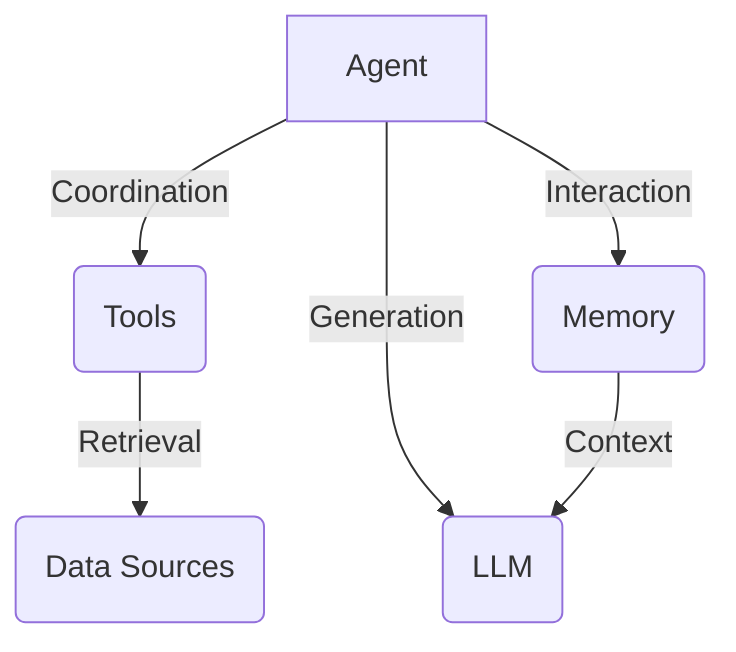

# 【LangChain编程：从入门到实践】基于文档问答场景

## 1.背景介绍

### 1.1 文档问答系统的重要性

在当今信息时代,文档资料数量呈指数级增长,但有效利用这些信息资源仍然是一个巨大的挑战。传统的搜索引擎虽然可以快速检索相关文档,但用户仍需耗费大量时间和精力从海量文档中获取所需信息。因此,构建高效的文档问答系统以帮助用户快速获取所需知识,已成为人工智能领域的一个重要研究方向。

### 1.2 文档问答系统面临的挑战

构建文档问答系统面临诸多挑战,包括:

- 文档理解:需要深入理解文档内容,捕捉关键信息和上下文语义。
- 问题理解:正确理解自然语言问题的意图和要求。
- 知识推理:结合已有知识,进行复杂的推理和关联,得出准确答案。
- 答案生成:生成符合问题要求、语义连贯、易于理解的自然语言答案。

### 1.3 LangChain的优势

LangChain是一个强大的框架,专注于构建可扩展的应用程序,将大型语言模型(LLM)与其他模块无缝集成。它提供了一系列工具和组件,简化了文档问答系统的开发过程,使得研究人员和开发人员能够更加专注于核心算法和业务逻辑。

LangChain的主要优势包括:

- 模块化设计:支持灵活组合各种数据源、LLM和其他组件。
- 可扩展性:易于集成新的数据源、LLM和自定义组件。
- 高效开发:提供了大量开箱即用的工具和示例,加速开发过程。
- 活跃社区:拥有活跃的开源社区,持续更新和改进。

## 2.核心概念与联系

### 2.1 LangChain核心概念

LangChain的核心概念包括:

- **Agent**:代理,负责协调各个组件的工作,实现特定任务。
- **Tool**:工具,封装了特定的功能,如数据检索、计算等。
- **Memory**:记忆模块,用于存储和管理会话信息、上下文等数据。
- **LLM**:大型语言模型(Large Language Model),如GPT-3等,用于自然语言理解和生成。

这些概念相互关联,共同构建了LangChain的应用程序框架。



### 2.2 文档问答场景中的核心概念

在文档问答场景中,涉及以下核心概念:

- **文档加载器(Document Loaders)**: 用于从各种数据源(如PDF、网页、数据库等)加载文档数据。
- **文本拆分器(Text Splitters)**: 将长文档拆分为多个较小的文档块,以便LLM高效处理。
- **向量存储(Vector Stores)**: 将文档块嵌入到向量空间,以支持语义相似性搜索。
- **检索器(Retrievers)**: 基于用户查询从向量存储中检索相关文档块。
- **Prompt构建器(Prompt Templates)**: 将用户查询和相关文档块构建成LLM可理解的Prompt。

这些概念共同构建了文档问答系统的数据处理和查询流程。

## 3.核心算法原理具体操作步骤

### 3.1 文档加载和预处理

1. **加载文档**:使用适当的文档加载器从数据源加载文档数据。

```python
from langchain.document_loaders import UnstructuredPDFLoader

loader = UnstructuredPDFLoader("example.pdf")
data = loader.load()
```

2. **文本拆分**:使用文本拆分器将长文档拆分为多个文档块,以适应LLM的输入限制。

```python
from langchain.text_splitter import CharacterTextSplitter

text_splitter = CharacterTextSplitter(chunk_size=1000, chunk_overlap=200)
texts = text_splitter.split_documents(data)
```

3. **创建文档对象**:将拆分后的文档块转换为LangChain可识别的`Document`对象。

```python
from langchain.docstore.document import Document

docs = [Document(page_content=t.page_content, metadata=t.metadata) for t in texts]
```

### 3.2 向量化和索引

1. **嵌入向量化**:使用LLM将文档块嵌入到向量空间中,以捕获语义信息。

```python
from langchain.embeddings import OpenAIEmbeddings

embeddings = OpenAIEmbeddings()
vecs = embeddings.embed_documents(docs)
```

2. **创建向量存储**:将嵌入向量存储到适当的向量存储中,以支持高效检索。

```python
from langchain.vectorstores import Chroma

vec_store = Chroma.from_documents(docs, embeddings, persist_directory="chroma_store")
```

### 3.3 查询和答案生成

1. **构建检索器**:创建一个检索器,用于从向量存储中检索与查询相关的文档块。

```python
from langchain.vectorstores import VectorStoreRetriever

retriever = VectorStoreRetriever(vec_store=vec_store, search_type="similarity", search_quality_reflection=True)
```

2. **构建Prompt模板**:定义一个Prompt模板,将用户查询和检索到的文档块组合成LLM可理解的Prompt。

```python
from langchain.prompts import PromptTemplate

prompt_template = """
Use the following context to answer the question:

Context: {context}

Question: {question}

Answer:
"""
prompt = PromptTemplate(template=prompt_template, input_variables=["context", "question"])
```

3. **查询和答案生成**:使用LLM和构建好的Prompt生成答案。

```python
from langchain.llms import OpenAI

llm = OpenAI(temperature=0)
query = "What is the capital of France?"
docs = retriever.get_relevant_documents(query)
context = "\n".join([d.page_content for d in docs])
answer = llm(prompt.format(context=context, question=query))
print(answer)
```

上述步骤展示了LangChain如何将各个组件组合在一起,构建出高效的文档问答系统。通过模块化设计,开发人员可以灵活地替换或扩展各个组件,以满足不同的需求和场景。

## 4.数学模型和公式详细讲解举例说明

在文档问答系统中,向量化和相似性检索是核心环节之一。LangChain支持多种向量化方法,包括基于transformer的嵌入和传统的TF-IDF等。本节将重点介绍基于transformer的嵌入方法。

### 4.1 Transformer嵌入原理

Transformer模型是一种基于自注意力机制的神经网络架构,广泛应用于自然语言处理任务中。它能够有效捕捉输入序列中的长程依赖关系,并生成高质量的语义嵌入向量。

对于给定的文本序列$X = (x_1, x_2, \dots, x_n)$,Transformer模型将其映射为一系列嵌入向量$H = (h_1, h_2, \dots, h_n)$,其中每个$h_i \in \mathbb{R}^d$是一个d维向量,编码了对应位置的上下文语义信息。

Transformer的核心是多头自注意力机制,其数学表示如下:

$$
\begin{aligned}
\text{MultiHead}(Q, K, V) &= \text{Concat}(\text{head}_1, \dots, \text{head}_h)W^O\\
\text{where } \text{head}_i &= \text{Attention}(QW_i^Q, KW_i^K, VW_i^V)
\end{aligned}
$$

其中$Q$、$K$、$V$分别表示查询(Query)、键(Key)和值(Value)矩阵,通过线性变换$W_i^Q$、$W_i^K$、$W_i^V$得到对应的投影。$\text{Attention}$函数计算查询与所有键的相关性分数,并根据这些分数对值进行加权求和,得到当前位置的注意力表示。

$$
\text{Attention}(Q, K, V) = \text{softmax}(\frac{QK^T}{\sqrt{d_k}})V
$$

其中$d_k$是缩放因子,用于防止内积值过大导致梯度消失。多头注意力机制通过并行计算多个注意力头,能够从不同的子空间捕捉不同的相关性模式,提高模型的表现力。

最终,Transformer将输出的注意力表示$H$作为文本的语义嵌入向量,用于下游的自然语言处理任务,如文本相似性计算、问答系统等。

### 4.2 相似性计算

在文档问答系统中,我们需要根据用户查询从向量存储中检索相关文档块。这个过程依赖于向量之间的相似性计算。

假设用户查询$q$的嵌入向量为$\vec{q}$,文档块$d_i$的嵌入向量为$\vec{d_i}$,我们可以使用余弦相似度来衡量它们之间的语义相似性:

$$
\text{sim}(\vec{q}, \vec{d_i}) = \frac{\vec{q} \cdot \vec{d_i}}{||\vec{q}|| \cdot ||\vec{d_i}||}
$$

余弦相似度的取值范围为$[-1, 1]$,值越接近1,表示两个向量越相似。

在实际应用中,我们通常设置一个相似度阈值$\theta$,只有当$\text{sim}(\vec{q}, \vec{d_i}) > \theta$时,才将文档块$d_i$视为与查询相关,并返回给用户。

### 4.3 示例:使用SentenceTransformer进行嵌入

LangChain支持多种嵌入方法,包括基于OpenAI、HuggingFace等的Transformer模型。以下是一个使用SentenceTransformer进行嵌入的示例:

```python
from langchain.embeddings import HuggingFaceEmbeddings

# 加载SentenceTransformer模型
embeddings = HuggingFaceEmbeddings(model_name="sentence-transformers/all-MiniLM-L6-v2")

# 对文本进行嵌入
text = "This is an example sentence."
query_embedding = embeddings.embed_query(text)

# 对文档进行嵌入
docs = [
    "This is another example sentence.",
    "This sentence is not related to the query.",
    "An unrelated sentence."
]
doc_embeddings = embeddings.embed_documents(docs)

# 计算相似度并排序
scores = [embeddings.similarity(query_embedding, doc_embedding) for doc_embedding in doc_embeddings]
sorted_docs = sorted(zip(docs, scores), key=lambda x: x[1], reverse=True)

# 打印排序后的文档及相似度分数
for doc, score in sorted_docs:
    print(f"{doc} (score: {score:.2f})")
```

输出:

```
This is another example sentence. (score: 0.85)
This sentence is not related to the query. (score: 0.42)
An unrelated sentence. (score: 0.31)
```

可以看到,与查询最相关的文档被正确地排在了首位。通过调整相似度阈值,我们可以控制返回的文档数量和相关性。

## 5.项目实践:代码实例和详细解释说明

本节将通过一个完整的示例项目,展示如何使用LangChain构建一个基于PDF文档的问答系统。我们将涵盖从加载文档到查询和答案生成的全过程。

### 5.1 准备工作

1. 安装LangChain和相关依赖库:

```bash
pip install langchain openai chromadb tiktoken
```

2. 准备PDF文档文件,本例使用一份关于Python编程的教程文档`python_tutorial.pdf`。

### 5.2 加载和预处理文档

```python
from langchain.document_loaders import UnstructuredPDFLoader
from langchain.text_splitter import CharacterTextSplitter

# 加载PDF文档
loader = UnstructuredPDFLoader("python_tutorial.pdf")
data = loader.load()

# 文本拆分
text_splitter = CharacterTextSplitter(chunk_size=1000, chunk_overlap=200)
texts = text_splitter.split_documents(data)

# 创建文档对象
from langchain.docstore.document import Document
docs = [Document(page_content=t.page_content, metadata=t.metadata) for t in texts]
```

### 5.3 向量化和索引

```python
from langchain.embeddings import OpenAIEmbeddings
from langchain.vectorstores import Chroma

# 嵌入向量化
embeddings = OpenAIEmbeddings()
vecs = embeddings.embed_documents(docs)

# 创建向量存储
vec_store = Chroma.from_documents(docs, embeddings, persist_directory="chroma_store")
```

### 5.4 查询和答案生成

```python
from