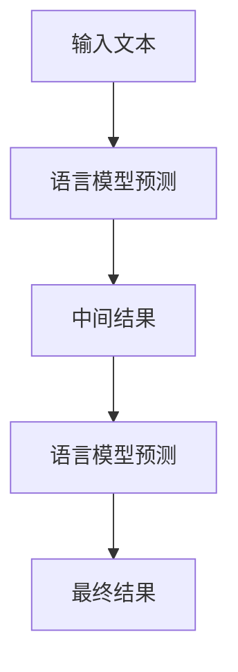

# 【LangChain编程：从入门到实践】社区和资源

## 1.背景介绍

在人工智能和自然语言处理（NLP）领域，语言模型的应用越来越广泛。LangChain作为一种新兴的编程范式，结合了语言模型和链式思维，提供了一种强大的工具来处理复杂的语言任务。本文将深入探讨LangChain编程的核心概念、算法原理、数学模型、实际应用场景以及相关工具和资源，帮助读者从入门到实践，全面掌握这一技术。

## 2.核心概念与联系

### 2.1 LangChain的定义

LangChain是一种编程范式，旨在通过链式思维和语言模型的结合，解决复杂的语言处理任务。它的核心思想是将语言模型的输出作为输入，逐步构建复杂的解决方案。

### 2.2 语言模型

语言模型是NLP中的核心组件，用于预测文本中的下一个单词或生成连贯的句子。常见的语言模型包括GPT-3、BERT等。

### 2.3 链式思维

链式思维是一种解决问题的方法，通过将复杂问题分解为一系列简单的步骤，每一步都依赖于前一步的结果。这种方法在编程中非常有效，特别是在处理复杂的语言任务时。

### 2.4 LangChain与传统编程的区别

传统编程通常依赖于明确的逻辑和规则，而LangChain则更多地依赖于语言模型的预测能力和链式思维的灵活性。这使得LangChain在处理模糊和不确定性较高的任务时具有独特的优势。

## 3.核心算法原理具体操作步骤

### 3.1 LangChain的基本结构

LangChain的基本结构可以用以下Mermaid流程图表示：



### 3.2 操作步骤

1. **输入文本**：用户提供初始的输入文本。
2. **语言模型预测**：使用语言模型对输入文本进行预测，生成中间结果。
3. **中间结果处理**：对中间结果进行处理，作为下一步的输入。
4. **重复预测**：重复使用语言模型进行预测，直到得到最终结果。

### 3.3 示例操作

假设我们要生成一个故事，初始输入是“从前有一个小女孩”。通过LangChain的操作步骤，我们可以逐步生成完整的故事。

## 4.数学模型和公式详细讲解举例说明

### 4.1 语言模型的数学基础

语言模型的核心是概率论，特别是条件概率。给定一个词序列 $w_1, w_2, ..., w_n$，语言模型的目标是计算下一个词 $w_{n+1}$ 的条件概率：

$$
P(w_{n+1} | w_1, w_2, ..., w_n)
$$

### 4.2 链式思维的数学表示

链式思维可以用递归函数来表示。假设 $f$ 是我们的语言模型函数，$x$ 是输入文本，$y$ 是输出文本，则有：

$$
y = f(x)
$$

对于链式思维，我们可以将其表示为：

$$
y_{i+1} = f(y_i)
$$

### 4.3 示例计算

假设我们有一个简单的语言模型，预测下一个词的概率如下：

$$
P(w_{n+1} | w_n) = 0.5
$$

如果初始输入是“从前有一个小女孩”，我们可以计算下一个词的概率，并逐步生成完整的句子。

## 5.项目实践：代码实例和详细解释说明

### 5.1 环境配置

首先，我们需要配置开发环境。推荐使用Python和相关的NLP库，如Transformers。

```python
pip install transformers
```

### 5.2 代码实例

以下是一个简单的LangChain代码实例，使用GPT-3生成文本。

```python
from transformers import GPT2LMHeadModel, GPT2Tokenizer

# 加载模型和分词器
model_name = 'gpt2'
model = GPT2LMHeadModel.from_pretrained(model_name)
tokenizer = GPT2Tokenizer.from_pretrained(model_name)

# 初始输入
input_text = "从前有一个小女孩"

# 编码输入
input_ids = tokenizer.encode(input_text, return_tensors='pt')

# 生成文本
output = model.generate(input_ids, max_length=50, num_return_sequences=1)

# 解码输出
output_text = tokenizer.decode(output[0], skip_special_tokens=True)
print(output_text)
```

### 5.3 详细解释

1. **加载模型和分词器**：我们使用GPT-2模型和对应的分词器。
2. **编码输入**：将初始输入文本编码为模型可以处理的格式。
3. **生成文本**：使用模型生成文本，设置最大长度和返回序列数。
4. **解码输出**：将生成的文本解码为可读格式。

## 6.实际应用场景

### 6.1 文本生成

LangChain可以用于生成连贯的文本，如故事、文章等。这在内容创作和自动化写作中具有广泛的应用。

### 6.2 对话系统

通过LangChain，可以构建智能对话系统，实现自然语言的交互。这在客服、智能助手等领域具有重要意义。

### 6.3 数据增强

在数据科学和机器学习中，LangChain可以用于生成新的数据样本，增强数据集的多样性和丰富性。

### 6.4 代码生成

LangChain还可以用于生成代码片段，辅助程序员进行开发，提高开发效率。

## 7.工具和资源推荐

### 7.1 开发工具

- **Jupyter Notebook**：用于交互式编程和数据分析。
- **PyCharm**：强大的Python集成开发环境。
- **VS Code**：轻量级的代码编辑器，支持多种编程语言。

### 7.2 资源推荐

- **Transformers库**：提供多种预训练的语言模型，方便进行NLP任务。
- **Hugging Face社区**：活跃的NLP社区，提供丰富的资源和支持。
- **Kaggle**：数据科学竞赛平台，提供大量的数据集和代码示例。

## 8.总结：未来发展趋势与挑战

### 8.1 发展趋势

LangChain作为一种新兴的编程范式，具有广阔的发展前景。随着语言模型的不断进步和链式思维的深入研究，LangChain在各个领域的应用将越来越广泛。

### 8.2 挑战

尽管LangChain具有许多优势，但也面临一些挑战，如模型的计算复杂度、数据的质量和多样性等。未来的研究需要在这些方面取得突破，以进一步提升LangChain的性能和应用范围。

## 9.附录：常见问题与解答

### 9.1 LangChain适合哪些任务？

LangChain适合处理复杂的语言任务，如文本生成、对话系统、数据增强等。

### 9.2 如何选择合适的语言模型？

选择语言模型时，需要考虑任务的具体需求、模型的性能和计算资源等因素。常见的语言模型有GPT-3、BERT等。

### 9.3 LangChain的性能如何优化？

可以通过优化模型参数、改进链式思维的策略、使用高质量的数据等方法来提升LangChain的性能。

### 9.4 LangChain的未来发展方向是什么？

未来，LangChain将朝着更高效、更智能、更广泛应用的方向发展，特别是在跨领域应用和多模态融合方面。

---

作者：禅与计算机程序设计艺术 / Zen and the Art of Computer Programming