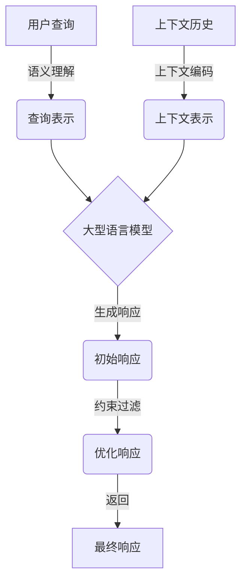

# 【大模型应用开发 动手做AI Agent】Assistants API的简单示例

## 1. 背景介绍

在当前的人工智能浪潮中,大型语言模型已经成为了炙手可热的技术。这些模型通过学习海量的文本数据,能够生成看似人类水平的自然语言输出。随着计算能力的不断提升和训练数据的日益丰富,大型语言模型正在为各种应用场景带来革命性的变化。

其中,一个备受关注的应用领域就是智能助手(AI Assistant)。传统的基于规则的对话系统已经无法满足日益复杂的需求,而大型语言模型则能够通过上下文理解和生成自然的对话响应,为用户提供更加人性化和智能化的交互体验。

OpenAI 推出的 Assistants API 就是一个基于大型语言模型的智能助手服务,它利用了 GPT 系列模型的强大能力,可以根据用户的查询和指令生成相关的自然语言响应。本文将介绍如何使用 Assistants API 构建一个简单的智能助手应用程序。

## 2. 核心概念与联系

在深入探讨 Assistants API 之前,我们需要先了解一些核心概念:

### 2.1 大型语言模型 (Large Language Model, LLM)

大型语言模型是一种基于深度学习的自然语言处理模型,通过在海量文本数据上进行预训练,学习到了丰富的语言知识和上下文理解能力。这些模型可以生成看似人类水平的自然语言输出,在机器翻译、文本生成、问答系统等领域表现出色。

著名的大型语言模型包括 GPT-3、BERT、XLNet 等。其中,GPT-3 凭借其惊人的规模(1750 亿个参数)和强大的生成能力,在 2020 年引起了广泛关注。

### 2.2 Assistants API

Assistants API 是 OpenAI 基于其大型语言模型 GPT-3 推出的一项智能助手服务。它允许开发者通过简单的 API 调用,就能够获取模型生成的自然语言响应。

Assistants API 的核心是一个对话模型,它能够根据用户的查询和上下文信息生成相关的响应。与传统的基于规则的对话系统不同,这种基于大型语言模型的方法可以更好地理解上下文,生成更加自然流畅的对话。

### 2.3 Anthropic 的 Constitutional AI

Assistants API 的背后,还融入了 Anthropic 公司的 Constitutional AI 理念。Constitutional AI 旨在通过训练和约束,使人工智能系统能够遵循某些原则和价值观,从而更加可靠和值得信赖。

在 Assistants API 中,这种理念体现在模型会自动过滤一些不当的、有害的或不合法的输出内容,并且会尽量保持客观、中立的态度,避免传播虚假信息或有偏见的观点。这使得 Assistants API 生成的响应更加可靠和负责任。

## 3. 核心算法原理具体操作步骤  

虽然 Assistants API 对外提供了简单的 API 接口,但其背后涉及了复杂的自然语言处理算法和大型语言模型。我们来简单了解一下其核心的工作原理和流程:

1. **语义理解**:当用户输入一个查询时,API 首先需要对查询的语义进行理解和表示。这通常涉及词法分析、句法分析、命名实体识别等自然语言处理任务。

2. **上下文编码**:除了当前的查询,API 还需要考虑之前的对话上下文。因此,它会将当前查询和之前的对话历史进行编码,形成一个上下文表示。

3. **生成响应**:有了查询和上下文的表示,API 就可以将它们输入到大型语言模型中,模型会基于学习到的语言知识生成一个自然语言的响应。

4. **约束和过滤**:生成的初始响应还需要进行约束和过滤,以确保其符合 Constitutional AI 的原则。API 会检测并过滤掉一些不当的、有害的或不合法的内容。

5. **响应优化**:最后,API 可能会对生成的响应进行一些优化,如修改语气、增加礼貌性等,以提供更好的用户体验。

这个过程可以用下面的 Mermaid 流程图来概括:



需要注意的是,这只是一个简化的流程,实际上还涉及到诸如注意力机制、transformer 架构、微调技术等复杂的模型细节,这里就不一一展开了。

## 4. 数学模型和公式详细讲解举例说明

虽然 Assistants API 对外提供了简单的接口,但其背后依赖于复杂的大型语言模型。这些模型通常基于 transformer 架构,使用了自注意力机制等技术来捕获长距离依赖关系。我们来简单介绍一下其中的数学原理。

### 4.1 Transformer 模型

Transformer 是一种全新的序列到序列(Sequence-to-Sequence)模型架构,它完全基于注意力机制,不再使用循环神经网络(RNN)或卷积神经网络(CNN)。Transformer 的核心组件是编码器(Encoder)和解码器(Decoder),两者都由多个相同的层组成。

在每一层中,首先是多头自注意力(Multi-Head Attention)机制,它能够捕获输入序列中不同位置之间的依赖关系。然后是前馈神经网络(Feed-Forward Network),它对每个位置的表示进行非线性转换。

多头自注意力机制的数学表达式如下:

$$\begin{aligned}
\text{MultiHead}(Q, K, V) &= \text{Concat}(\text{head}_1, \ldots, \text{head}_h)W^O\\
\text{where\ head}_i &= \text{Attention}(QW_i^Q, KW_i^K, VW_i^V)
\end{aligned}$$

其中 $Q$、$K$、$V$ 分别表示查询(Query)、键(Key)和值(Value)。$W_i^Q$、$W_i^K$、$W_i^V$ 是可训练的投影矩阵,用于将输入映射到不同的表示空间。$\text{Attention}$ 函数计算查询和所有键之间的相关性分数,然后使用这些分数对值进行加权求和。

$\text{Attention}$ 函数的具体定义为:

$$\text{Attention}(Q, K, V) = \text{softmax}(\frac{QK^T}{\sqrt{d_k}})V$$

其中 $d_k$ 是缩放因子,用于避免较大的点积导致的梯度饱和问题。

通过堆叠多个这样的编码器层和解码器层,Transformer 就能够有效地建模长距离依赖关系,生成高质量的序列输出。

### 4.2 GPT 语言模型

GPT(Generative Pre-trained Transformer)是一种基于 Transformer 解码器的大型语言模型,它在海量文本数据上进行了预训练,学习到了丰富的语言知识。GPT 模型可以用于生成任务,如机器翻译、文本续写、对话生成等。

GPT 模型的训练目标是最大化下一个词的条件概率:

$$\begin{aligned}
\mathcal{L}_1(\mathcal{U}) &= \sum_{t=1}^T \log P(u_t | u_{<t}; \Theta)\\
&= \sum_{t=1}^T \log \frac{e^{h_\Theta(u_{<t})^\top e(u_t)}}{\sum_{u' \in \mathcal{V}} e^{h_\Theta(u_{<t})^\top e(u')}}
\end{aligned}$$

其中 $\mathcal{U} = (u_1, \ldots, u_T)$ 是训练语料库中的一个序列, $\Theta$ 表示模型参数, $h_\Theta$ 是 Transformer 解码器, $e$ 是词嵌入函数, $\mathcal{V}$ 是词汇表。

通过最大化上式,GPT 模型就能够学习到生成自然语言的能力。在 Assistants API 中,OpenAI 使用了 GPT-3 等大型语言模型,并针对对话场景进行了进一步的微调,从而获得了强大的对话生成能力。

## 5. 项目实践:代码实例和详细解释说明

现在,我们来看一个使用 Python 调用 Assistants API 的简单示例。首先,你需要从 OpenAI 获取一个 API 密钥,并安装 `openai` 库:

```python
import openai
openai.api_key = "YOUR_API_KEY"
```

接下来,我们定义一个简单的函数来与 Assistants API 进行交互:

```python
def get_assistant_response(prompt):
    response = openai.Completion.create(
        engine="claude-v1",
        prompt=prompt,
        max_tokens=1024,
        n=1,
        stop=None,
        temperature=0.5,
    )

    message = response.choices[0].text.strip()
    return message
```

这个函数使用 `openai.Completion.create` 方法向 API 发送一个提示(`prompt`)。`engine` 参数指定使用 `claude-v1` 模型,这是 OpenAI 专门为对话场景优化的大型语言模型。`max_tokens` 参数限制了生成响应的最大长度,`temperature` 参数控制了输出的随机性和多样性。

现在,我们可以调用这个函数来与助手进行交互:

```python
prompt = "你好,请介绍一下什么是大型语言模型?"
response = get_assistant_response(prompt)
print(response)
```

输出结果可能是这样:

```
大型语言模型(Large Language Model, LLM)是一种基于深度学习的自然语言处理模型,通过在海量文本数据上进行预训练,学习到了丰富的语言知识和上下文理解能力。这些模型可以生成看似人类水平的自然语言输出,在机器翻译、文本生成、问答系统等领域表现出色。

著名的大型语言模型包括GPT-3、BERT、XLNet等。其中,GPT-3凭借其惊人的规模(1750亿个参数)和强大的生成能力,在2020年引起了广泛关注。这些模型的出现,为人工智能系统与人类进行自然交互提供了新的可能性。
```

你可以继续输入新的提示,与助手进行对话交互。当你想结束对话时,只需按 Ctrl+C 即可退出程序。

需要注意的是,这只是一个最基本的示例,在实际应用中你可能需要添加更多的功能和逻辑,如上下文管理、多轮对话处理等。但这个例子足以让你了解如何使用 Assistants API 构建一个简单的智能助手应用程序。

## 6. 实际应用场景

Assistants API 的应用场景是非常广泛的,无论是企业还是个人开发者,都可以基于这项技术构建各种智能助手应用。下面是一些典型的应用场景:

### 6.1 客户服务助手

在客户服务领域,智能助手可以提供7x24小时的在线支持,快速响应客户的各种查询和需求。相比于传统的知识库系统,基于大型语言模型的助手能够更好地理解上下文,提供更加自然和人性化的服务体验。

### 6.2 个人助理

智能助手也可以作为个人助理,帮助用户完成各种日常任务,如安排日程、查找信息、撰写文档等。由于大型语言模型具有广博的知识,助手可以回答各种领域的问题,为用户提供全方位的支持。

### 6.3 教育辅助

在教育领域,智能助手可以作为学生的学习伙伴,解答他们的疑问,提供个性化的学习建议和练习。教师也可以利用助手生成测试题目、评分作业等,减轻工作负担。

### 6.4 创作辅助

对于作家、内容创作者等,智能助手可以提供灵感和创意,协助撰写故事情节、对白、文案等。大型语言模型的出色生成能力,可以极大地提高创作效率。

### 6.5 其他场景

除了上述场景,智能助手还可