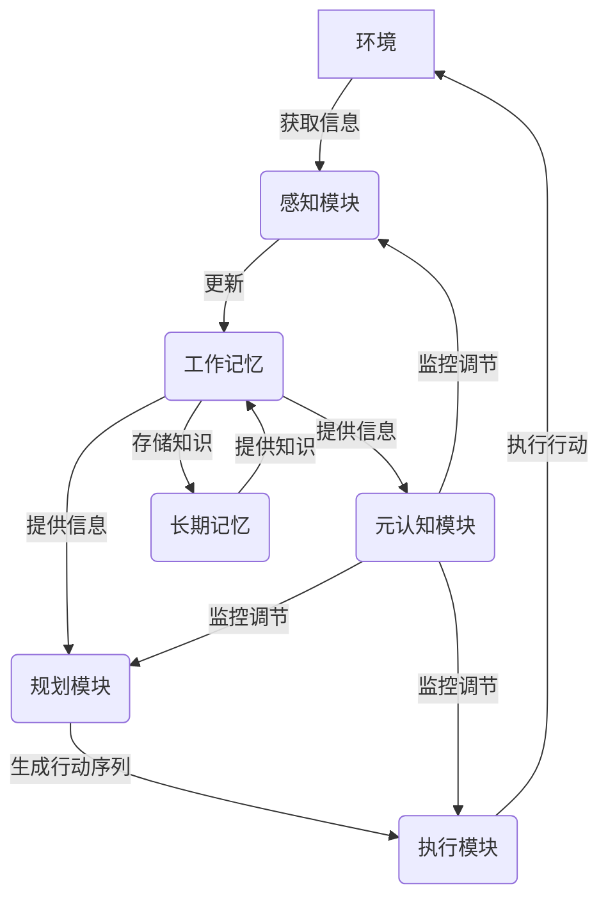

# 【大模型应用开发 动手做AI Agent】BabyAGI实战

## 1.背景介绍

### 1.1 人工智能的发展历程

人工智能(Artificial Intelligence, AI)是当代科技发展的前沿领域,自20世纪50年代诞生以来,经历了几个重要的发展阶段。早期的人工智能系统主要基于规则和逻辑推理,如专家系统、规则引擎等。随着计算能力和数据量的不断增长,机器学习(Machine Learning)技术开始崛起,使人工智能系统能够从数据中自动学习模式和规律。

近年来,深度学习(Deep Learning)技术的兴起,推动了人工智能的飞速发展。深度神经网络能够从大量数据中自动提取特征,在计算机视觉、自然语言处理、语音识别等领域取得了突破性进展。随着算力和数据的持续增长,大规模预训练语言模型(Large Language Model, LLM)成为人工智能发展的新热点。

### 1.2 大模型的兴起

大模型(Large Model)是指具有数十亿甚至上万亿参数的巨大神经网络模型。这些模型通过在海量数据上进行预训练,学习到了丰富的知识和语义表示能力。代表性的大模型包括GPT-3、PaLM、ChatGPT等,它们展现出了惊人的自然语言理解和生成能力,在多个领域取得了人类水平的表现。

大模型的出现,为人工智能系统带来了质的飞跃,但也面临着诸多挑战,如模型的可解释性、安全性、效率等问题亟待解决。此外,如何将大模型应用于实际场景,并充分发挥其潜力,是当前研究的重点课题之一。

### 1.3 BabyAGI:构建通用人工智能Agent

BabyAGI是一个旨在探索通用人工智能(Artificial General Intelligence, AGI)的开源项目。它基于大模型的强大能力,尝试构建一个具有自主学习、推理和规划能力的智能Agent。BabyAGI的核心思想是,通过赋予大语言模型一定的认知架构和元认知能力,使其能够自主地分解任务、获取知识、规划行动,并持续优化自身。

虽然BabyAGI距离真正的AGI还有很长的路要走,但它为探索人工智能系统的自主性和通用性提供了有价值的实践和思路。本文将详细介绍BabyAGI的核心概念、算法原理和实现细节,并探讨其在实际应用中的潜力和挑战。

## 2.核心概念与联系

### 2.1 认知架构

认知架构(Cognitive Architecture)是指用于描述智能系统信息处理过程的理论框架。它定义了系统的基本组成部分、数据表示形式、信息流程等,为构建具有自主性和通用性的智能Agent奠定了基础。

BabyAGI采用了一种基于大语言模型的认知架构,其核心组成部分包括:

- **工作记忆(Working Memory)**: 用于存储当前任务的相关信息、知识和中间结果。
- **长期记忆(Long-Term Memory)**: 存储持久化的知识库,用于支持推理和决策。
- **感知模块(Perception Module)**: 负责从外部环境获取信息,并将其转换为内部表示。
- **规划模块(Planning Module)**: 根据当前状态和目标,生成行动序列。
- **执行模块(Execution Module)**: 执行规划好的行动,并将结果反馈到工作记忆中。
- **元认知模块(Metacognitive Module)**: 监控和调节整个认知过程,确保Agent能够自主学习和优化。

这些模块通过大语言模型的强大生成和理解能力相互协作,形成一个闭环的认知系统。

### 2.2 自主学习

自主学习(Autonomous Learning)是指智能系统能够主动获取新知识、优化自身模型,并将学习到的内容应用于解决新问题的过程。这是实现通用人工智能的关键能力之一。

在BabyAGI中,自主学习主要体现在以下几个方面:

1. **知识获取**: Agent可以通过与外部数据源(如网络、知识库等)交互,主动获取与当前任务相关的新知识。
2. **模型微调**: Agent能够基于新获取的知识,对内部的大语言模型进行持续微调,不断优化和扩展自身的能力。
3. **元认知调节**: Agent通过监控和评估自身的认知过程,识别薄弱环节,并相应地调整策略和参数,以提高整体效率和性能。
4. **迁移学习**: Agent可以将之前学习到的知识和经验迁移到新的任务中,加速学习过程。

自主学习赋予了BabyAGI持续进化的能力,使其能够逐步扩展知识范围,提高任务解决能力。

### 2.3 人机协作

虽然BabyAGI旨在探索自主智能系统,但在现阶段,人机协作仍然是不可或缺的一环。人类可以为Agent提供指导和反馈,而Agent则为人类提供智力支持和辅助决策。

在BabyAGI中,人机协作主要体现在以下几个方面:

1. **任务分配**: 人类可以为Agent指定需要解决的任务目标和约束条件。
2. **知识补充**: 人类可以向Agent提供额外的领域知识,弥补其知识库的不足。
3. **结果评估**: 人类可以评估Agent生成的解决方案的质量和合理性,并提供反馈。
4. **过程监控**: 人类可以监控Agent的运行过程,必要时进行干预和调整。

通过合理的人机分工和协作,可以发挥人类的经验判断和Agent的计算能力,提高整体的问题解决效率。

## 3.核心算法原理具体操作步骤

### 3.1 任务分解

任务分解(Task Decomposition)是BabyAGI的核心算法之一。它的目标是将一个复杂的任务分解为多个可管理的子任务,并确定它们之间的依赖关系和执行顺序。

任务分解的具体步骤如下:

1. **任务表示**: 将原始任务目标和约束条件表示为一个结构化的输入,输入给大语言模型。
2. **子任务生成**: 大语言模型根据输入,生成一系列可能的子任务及其描述。
3. **子任务过滤**: 过滤掉不相关或重复的子任务,保留高质量的子任务集合。
4. **依赖分析**: 分析子任务之间的逻辑依赖关系,构建有向无环图(DAG)。
5. **执行顺序规划**: 根据DAG,规划子任务的执行顺序,确保先决条件得到满足。

通过任务分解,BabyAGI能够将复杂的问题分解为多个相对简单的子问题,从而降低了解决难度,提高了效率。

### 3.2 知识获取

知识获取(Knowledge Acquisition)是BabyAGI自主学习的关键环节。它允许Agent从外部数据源(如网络、知识库等)获取与当前任务相关的新知识,丰富自身的知识库。

知识获取的具体步骤如下:

1. **知识需求分析**: 根据当前任务目标和子任务,分析所需的知识类型和范围。
2. **数据源选择**: 选择合适的外部数据源,如网页、文档、API等。
3. **查询构建**: 基于知识需求,构建针对性的查询,发送给数据源。
4. **结果处理**: 对从数据源获取的原始数据进行清洗、过滤和结构化,提取出有用的知识。
5. **知识存储**: 将提取的知识以结构化的形式存储在Agent的长期记忆中。
6. **模型微调(可选)**: 基于新获取的知识,对Agent内部的大语言模型进行微调,以提高其在相关领域的性能。

通过知识获取,BabyAGI可以主动扩展自身的知识范围,为解决更复杂的任务做好准备。

### 3.3 规划与执行

规划(Planning)和执行(Execution)是BabyAGI实现自主行为的核心环节。规划模块根据当前状态和目标,生成一系列行动序列;执行模块则负责执行这些行动,并将结果反馈到工作记忆中。

规划的具体步骤如下:

1. **状态表示**: 将当前的工作记忆状态(包括任务目标、子任务、已获取知识等)编码为结构化的输入,输入给大语言模型。
2. **行动生成**: 大语言模型根据输入,生成一系列可能的行动及其描述。
3. **行动过滤**: 过滤掉不合理或重复的行动,保留高质量的行动集合。
4. **行动排序**: 根据行动之间的逻辑关系和优先级,对行动进行排序,形成行动序列。

执行的具体步骤如下:

1. **行动解析**: 将行动序列中的每个行动解析为具体的操作指令。
2. **操作执行**: 执行相应的操作,如调用API、发送查询、运行脚本等。
3. **结果收集**: 收集操作的输出结果,并将其存储在工作记忆中。
4. **状态更新**: 根据操作结果,更新工作记忆的当前状态。

通过规划和执行的交互过程,BabyAGI可以自主地完成复杂任务,并根据反馈持续优化自身的行为策略。

### 3.4 元认知调节

元认知(Metacognition)是指对自身认知过程的监控、评估和调节。在BabyAGI中,元认知模块扮演着关键的角色,确保整个认知系统能够高效、稳健地运行。

元认知调节的具体步骤如下:

1. **过程监控**: 持续监控任务分解、知识获取、规划和执行等各个环节的运行状态,收集相关的指标和数据。
2. **性能评估**: 根据预定义的目标函数和评估标准,评估当前系统的整体性能表现。
3. **瓶颈识别**: 分析各个环节的运行数据,识别出效率低下或出现异常的环节。
4. **策略优化**: 根据识别出的瓶颈,调整相应环节的策略和参数,如改变查询方式、调整模型超参数等。
5. **长期学习**: 将优化后的策略和参数持久化存储,用于指导后续的任务执行。

通过元认知调节,BabyAGI能够不断优化自身的运行效率,适应不同的任务场景,展现出较强的自适应能力。

## 4.数学模型和公式详细讲解举例说明

在BabyAGI的实现中,涉及到了多种数学模型和算法,以下是一些核心模型和公式的详细讲解。

### 4.1 大语言模型

大语言模型(Large Language Model, LLM)是BabyAGI的核心组件,负责自然语言的理解和生成。常见的大语言模型包括GPT、BERT、T5等,它们都采用了Transformer的编码器-解码器架构。

Transformer的核心是自注意力(Self-Attention)机制,它能够捕捉输入序列中任意两个位置之间的依赖关系。给定一个输入序列 $X = (x_1, x_2, \dots, x_n)$,自注意力机制计算每个位置的表示 $h_i$ 如下:

$$h_i = \sum_{j=1}^n \alpha_{ij}(x_jW^V)$$

其中,$ \alpha_{ij} $ 是注意力权重,表示位置 $i$ 对位置 $j$ 的关注程度,通过以下公式计算:

$$\alpha_{ij} = \frac{e^{(x_iW^Q)(x_jW^K)^T}}{\sum_{k=1}^n e^{(x_iW^Q)(x_kW^K)^T}}$$

$W^Q$、$W