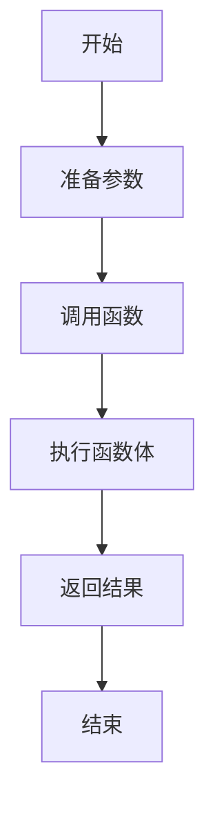
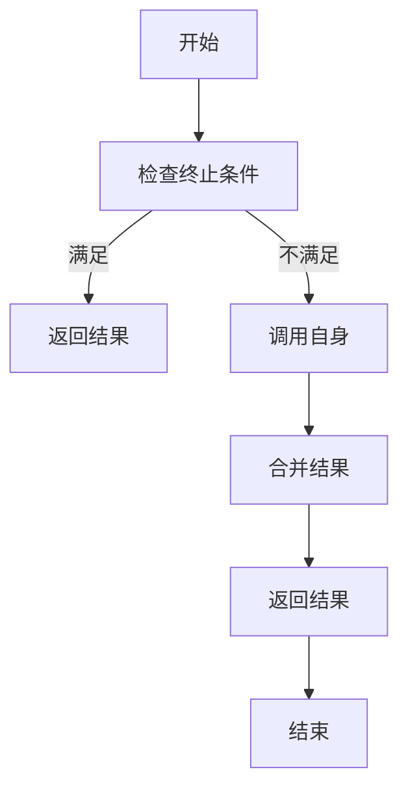

# 【大模型应用开发 动手做AI Agent】什么是Function Calling

## 1.背景介绍

在人工智能和机器学习领域，特别是大模型应用开发中，Function Calling（函数调用）是一个至关重要的概念。它不仅是编程语言的基础，也是构建复杂系统和实现高效算法的关键。随着AI Agent（人工智能代理）的广泛应用，理解和掌握Function Calling的原理和实践变得尤为重要。

Function Calling在计算机科学中有着悠久的历史，从早期的过程式编程到现代的面向对象编程，再到函数式编程，每一种编程范式都离不开函数调用。特别是在大模型应用开发中，函数调用不仅用于实现基本的算法逻辑，还用于模块化设计、代码复用和性能优化。

## 2.核心概念与联系

### 2.1 函数的定义

函数是程序中的一个独立模块，它接受输入参数，执行特定的操作，并返回结果。函数的定义通常包括函数名、参数列表和函数体。

### 2.2 函数调用的基本流程

函数调用的基本流程包括以下几个步骤：
1. 准备参数：将实际参数传递给函数。
2. 执行函数体：根据参数执行函数内部的逻辑。
3. 返回结果：将结果返回给调用者。

### 2.3 函数调用与大模型的关系

在大模型应用开发中，函数调用用于实现模型的训练、推理和评估等各个环节。例如，在深度学习模型中，前向传播和反向传播都是通过函数调用来实现的。

### 2.4 函数调用与模块化设计

函数调用是模块化设计的基础，通过将复杂的任务分解为多个函数，可以提高代码的可读性和可维护性。同时，函数调用还支持代码复用，减少重复代码的编写。

## 3.核心算法原理具体操作步骤

### 3.1 函数调用的基本原理

函数调用的基本原理可以用以下Mermaid流程图表示：



### 3.2 函数调用的具体操作步骤

1. **准备参数**：将实际参数传递给函数。参数可以是基本数据类型、对象或其他函数。
2. **调用函数**：通过函数名和参数列表调用函数。
3. **执行函数体**：根据参数执行函数内部的逻辑。函数体可以包含条件判断、循环、递归等复杂操作。
4. **返回结果**：将结果返回给调用者。返回值可以是单个值、多个值或对象。
5. **结束**：函数调用结束，返回到调用点继续执行。

### 3.3 递归函数调用

递归函数是指在函数内部调用自身的函数。递归函数通常用于解决分治问题，如快速排序、斐波那契数列等。



## 4.数学模型和公式详细讲解举例说明

### 4.1 函数的数学定义

在数学中，函数是指从一个集合到另一个集合的映射。设 $X$ 和 $Y$ 是两个集合，函数 $f$ 是一个规则，使得对于每个 $x \in X$，都有唯一的 $y \in Y$ 与之对应，记作 $y = f(x)$。

### 4.2 递归函数的数学模型

递归函数的数学模型通常用递归关系式表示。例如，斐波那契数列可以用以下递归关系式表示：

$$
F(n) = 
\begin{cases} 
0 & \text{if } n = 0 \\
1 & \text{if } n = 1 \\
F(n-1) + F(n-2) & \text{if } n > 1 
\end{cases}
$$

### 4.3 递归函数的时间复杂度分析

递归函数的时间复杂度分析通常使用递归树或主定理。例如，斐波那契数列的递归实现的时间复杂度为 $O(2^n)$，因为每次递归调用都会生成两个子问题。

## 5.项目实践：代码实例和详细解释说明

### 5.1 基本函数调用示例

以下是一个基本的Python函数调用示例：

```python
def add(a, b):
    return a + b

result = add(3, 5)
print(result)  # 输出: 8
```

### 5.2 递归函数调用示例

以下是一个计算斐波那契数列的递归函数示例：

```python
def fibonacci(n):
    if n <= 0:
        return 0
    elif n == 1:
        return 1
    else:
        return fibonacci(n-1) + fibonacci(n-2)

result = fibonacci(10)
print(result)  # 输出: 55
```

### 5.3 大模型应用中的函数调用示例

以下是一个在深度学习模型中使用函数调用的示例：

```python
import torch
import torch.nn as nn
import torch.optim as optim

class SimpleModel(nn.Module):
    def __init__(self):
        super(SimpleModel, self).__init__()
        self.fc = nn.Linear(10, 1)

    def forward(self, x):
        return self.fc(x)

model = SimpleModel()
criterion = nn.MSELoss()
optimizer = optim.SGD(model.parameters(), lr=0.01)

# 训练过程
for epoch in range(100):
    inputs = torch.randn(10)
    targets = torch.randn(1)
    outputs = model(inputs)
    loss = criterion(outputs, targets)
    optimizer.zero_grad()
    loss.backward()
    optimizer.step()
```

## 6.实际应用场景

### 6.1 数据处理

函数调用在数据处理中的应用非常广泛。例如，数据清洗、特征工程和数据转换等操作都可以通过函数调用来实现。

### 6.2 模型训练

在机器学习和深度学习中，模型的训练过程通常通过一系列函数调用来实现。包括数据加载、前向传播、损失计算、反向传播和参数更新等步骤。

### 6.3 系统设计

在系统设计中，函数调用用于实现模块化设计和代码复用。通过将复杂的系统分解为多个函数，可以提高系统的可维护性和可扩展性。

### 6.4 自动化任务

函数调用在自动化任务中也有广泛应用。例如，自动化测试、任务调度和脚本编写等操作都可以通过函数调用来实现。

## 7.工具和资源推荐

### 7.1 编程语言

- **Python**：Python是大模型应用开发中最常用的编程语言之一，具有丰富的库和框架支持。
- **C++**：C++在高性能计算和系统编程中有广泛应用，适合实现高效的函数调用。
- **JavaScript**：JavaScript在前端开发和Node.js中有广泛应用，适合实现Web应用中的函数调用。

### 7.2 开发工具

- **PyCharm**：PyCharm是Python开发的集成开发环境，支持代码补全、调试和测试等功能。
- **Visual Studio Code**：Visual Studio Code是一个轻量级的代码编辑器，支持多种编程语言和插件。
- **Jupyter Notebook**：Jupyter Notebook是一个交互式的开发环境，适合进行数据分析和机器学习实验。

### 7.3 资源推荐

- **《Python编程：从入门到实践》**：一本适合初学者的Python编程书籍，涵盖了函数调用的基本概念和实践。
- **《深度学习》**：一本经典的深度学习书籍，详细介绍了深度学习模型的训练和优化过程。
- **Coursera和Udacity**：在线学习平台，提供丰富的编程和机器学习课程。

## 8.总结：未来发展趋势与挑战

### 8.1 未来发展趋势

随着人工智能和大数据技术的不断发展，函数调用在大模型应用开发中的重要性将进一步提升。未来，函数调用将更加注重性能优化和并行计算，以应对大规模数据处理和复杂模型训练的需求。

### 8.2 挑战

尽管函数调用在大模型应用开发中有广泛应用，但也面临一些挑战。例如，递归函数的性能问题、函数调用的栈溢出风险以及函数调用的调试和测试难度等。

## 9.附录：常见问题与解答

### 9.1 什么是函数调用？

函数调用是指在程序中通过函数名和参数列表调用函数，执行函数体并返回结果的过程。

### 9.2 函数调用的基本流程是什么？

函数调用的基本流程包括准备参数、调用函数、执行函数体、返回结果和结束。

### 9.3 递归函数调用的应用场景有哪些？

递归函数调用通常用于解决分治问题，如快速排序、斐波那契数列和二叉树遍历等。

### 9.4 如何优化递归函数的性能？

可以通过记忆化递归（Memoization）和动态规划（Dynamic Programming）等技术优化递归函数的性能。

### 9.5 函数调用在大模型应用开发中的作用是什么？

函数调用在大模型应用开发中用于实现模型的训练、推理和评估等各个环节，提高代码的可读性和可维护性。

---

作者：禅与计算机程序设计艺术 / Zen and the Art of Computer Programming